:nosearch:

گروه گیت وی
============

گیت وی زمانی استفاده میشود که دستگاه شما به طور مستقیم قابل کدنویسی و برنامه نویسی نباشد. 

در واقع اگر شما میخواهید دستگاهی را اضافه کنید که دارنده برند آن نیستید و توانایی کدنویسی و برنامه نویسی روی دستگاه را ندارید از گروه گیت وی استفاده میکنید.

پس از تعریف گیت وی گزینه دریافت اعتبار را بزنید و با اعتبار دریافتی سایر تنظیمات گیت وی را انجام دهید.

