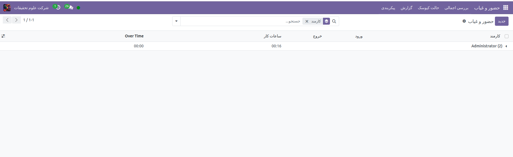

ماژول حضور وغیاب  
=============

برنامه حضور و غیاب Odoo به عنوان یک ساعت زمان عمل می کند. کارمندان می‌توانند با استفاده از یک دستگاه اختصاصی در حالت کیوسک، ورود و خروج از محل کار خود را بررسی کنند، در حالی که کاربران همچنین می‌توانند مستقیماً از پایگاه داده ورود و خروج از محل کار را بررسی کنند. مدیران می‌توانند به سرعت ببینند چه کسانی در هر زمان معین در دسترس هستند، گزارش‌هایی ایجاد کنند تا ساعات کاری همه را ببینند، و اطلاعاتی در مورد اینکه کارمندان اضافه‌کاری می‌کنند یا زودتر از زمان انتظار از کار خارج می‌شوند، به دست آورند.

.. toctree::

    attendance/Access_rights.rst
    attendance/Configuration.rst
    attendance/checkin_out.rst
    attendance/reporting.rst
