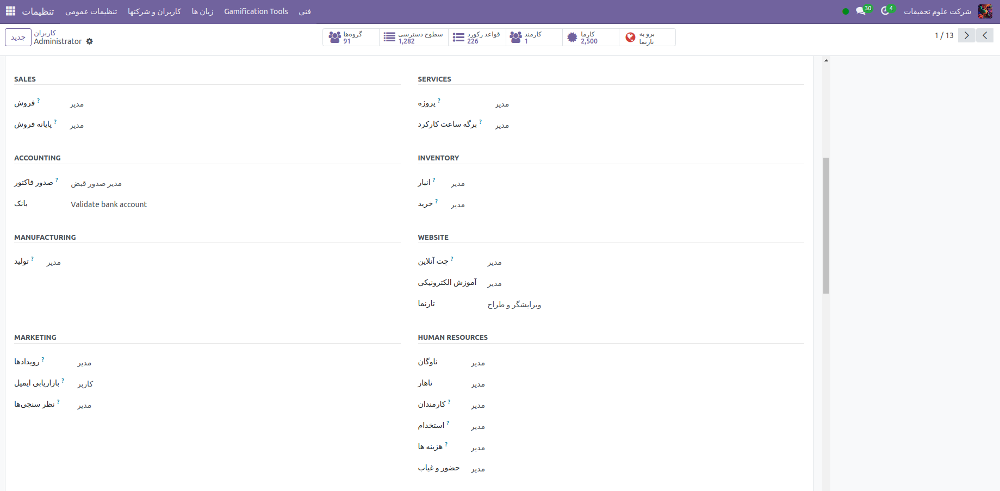

حق دسترسی های کاربران دراین برنامه
=============

درک اینکه چگونه حقوق دسترسی مختلف بر مواردی که کاربران می توانند در برنامه حضور و غیاب دسترسی داشته باشند تأثیر می گذارد، مهم است.

هر کاربر در پایگاه داده همیشه می تواند به اطلاعات خود در داشبورد دسترسی داشته باشد و می تواند مستقیماً از پایگاه داده وارد و خارج شود. دسترسی به تمام ویژگی های دیگر توسط حقوق دسترسی تعیین می شود.

برای مشاهده حقوق دسترسی یک کاربر، به Settings application ‣ Users & Companies: Users بروید و روی یک کاربر جداگانه کلیک کنید. تب Access Rights به طور پیش فرض قابل مشاهده است. برای مشاهده تنظیمات، به بخش Human Resources  بروید. برای فیلد Attendances، گزینه ها عبارتند از خالی گذاشتن فیلد یا انتخاب Administrator.

در صورت انتخاب گزینه Administrator، کاربر بدون محدودیت به کل اپلیکیشن Attendances دسترسی کامل دارد. آنها می توانند تمام سوابق حضور و غیاب کارمندان را مشاهده کنند، از برنامه وارد حالت کیوسک شوند، به تمام معیارهای گزارش دسترسی داشته باشند و تنظیمات را اصلاح کنند.

اگر خالی بماند، کاربر فقط می‌تواند اطلاعات خود را در داشبورد برنامه حضور و غیاب مشاهده کند و می‌تواند سوابق حضور شخصی خود را تحت ویژگی گزارش‌دهی مشاهده کند. تمام سوابق حضور و غیاب دیگر در گزارش از دیدگان پنهان است. هیچ دسترسی به حالت کیوسک یا منوی پیکربندی وجود ندارد.

تنها سناریوی دیگری که در آن ممکن است اطلاعات مختلف در برنامه حضور و غیاب در دسترس باشد، برای تایید کنندگان است. اگر کاربری برای برنامه حضور و غیاب حقوق مدیریتی نداشته باشد، اما به‌عنوان تأییدکننده یک کارمند برای برنامه حضور و غیاب تنظیم شده باشد، آن کاربر می‌تواند سوابق حضور و غیاب آن کارمند خاص را مشاهده کند و همچنین تغییراتی در سوابق حضور و غیاب آن کارمند ایجاد کند. ، در صورت لزوم این امر در مورد همه کارمندانی که کاربر برای آنها به عنوان تأیید کننده برنامه حضور و غیاب فهرست شده است اعمال می شود. تأییدکنندگان معمولاً مدیران هستند، اگرچه این امر الزامی نیست.

برای دیدن اینکه تایید کننده حضور و غیاب برای یک کارمند چه کسی است، به برنامه Employees بروید و روی کارمند خاص کلیک کنید. روی برگه Work Information کلیک کنید، به بخش Approvers بروید و قسمت Attendance را علامت بزنید. فرد انتخاب شده می تواند سوابق حضور و غیاب کارکنان را هم در داشبورد برنامه حضور و غیاب و هم در گزارش های حضور و غیاب مشاهده کند و در سوابق آنها تغییراتی ایجاد کند.

تایید کنندگان
-------

تنها سناریوی دیگری که در آن ممکن است اطلاعات مختلف در برنامه حضور و غیاب در دسترس باشد، برای تایید کنندگان است. اگر کاربری برای برنامه حضور و غیاب حقوق مدیریتی نداشته باشد، اما به‌عنوان تأییدکننده یک کارمند برای برنامه حضور و غیاب تنظیم شده باشد، آن کاربر می‌تواند سوابق حضور و غیاب آن کارمند خاص را مشاهده کند و همچنین تغییراتی در سوابق حضور و غیاب آن کارمند ایجاد کند. ، در صورت لزوم این امر در مورد همه کارمندانی که کاربر برای آنها به عنوان تأیید کننده برنامه حضور و غیاب فهرست شده است اعمال می شود. تأییدکنندگان معمولاً مدیران هستند، اگرچه این امر الزامی نیست.

برای دیدن اینکه تایید کننده حضور و غیاب برای یک کارمند چه کسی است، به برنامه Employees بروید و روی کارمند خاص کلیک کنید. روی برگه Work Information کلیک کنید، به بخش Approvers بروید و قسمت Attendance را علامت بزنید. فرد انتخاب شده می تواند سوابق حضور و غیاب کارکنان را هم در داشبورد برنامه حضور و غیاب و هم در گزارش های حضور و غیاب مشاهده کند و در سوابق آنها تغییراتی ایجاد کند.

