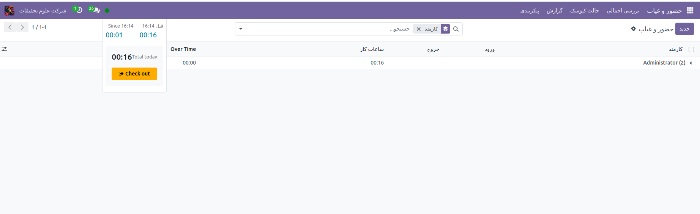

ورود و خروج بصورت دستی
=============

برنامه حضور و غیاب Odoo به کاربرانی که به پایگاه داده وارد شده‌اند اجازه می‌دهد بدون نیاز به رفتن به برنامه Attendances یا استفاده از کیوسک، ورود و خروج را بررسی کنند. برای برخی از شرکت های کوچکتر، که در آن هر کارمند نیز یک کاربر است، این ویژگی ممکن است مفید باشد.

کاربر می‌تواند در داشبورد پایگاه داده اصلی و همچنین در هر برنامه‌ای وارد و خارج شود. در گوشه سمت راست بالای منوی اصلی بالا که همیشه صرف نظر از اینکه کاربر در چه برنامه‌ای قرار دارد قابل مشاهده است، یک 🔴 (دایره قرمز) یا🟢 (دایره سبز) قابل مشاهده است. روی دایره رنگی کلیک کنید تا ویجت حضور و غیاب نمایان شود و کاربر را قادر می سازد تا وارد و/یا خارج شود.

ورود
-------

اگر دایره ویجت حضور و غیاب قرمز باشد، این نشان می‌دهد که کاربر در حال حاضر اعلام حضور نکرده است. روی 🔴 (دایره قرمز) کلیک کنید و ویجت حضور و غیاب ظاهر می‌شود و دکمه سبز رنگ Check in ➡️ نمایش داده می‌شود.

هنگامی که کاربر از پایگاه داده چک می کند، برنامه Attendances جزئیات مکان کاربر، از جمله آدرس IP و مختصات GPS را ثبت می کند.

اگر کاربر قبلاً در طول روز کاری فعلی وارد و خارج نشده باشد، این دکمه تنها مورد قابل مشاهده در ویجت است. اگر کاربر قبلاً وارد و خارج شده باشد، فیلد Total Today در بالای دکمه ظاهر می‌شود و کل مدت زمانی که برای آن روز ثبت شده است، در قالب HH:MM (ساعت: دقیقه) در زیر آن فیلد ظاهر می‌شود.

روی دکمه Check in ➡️ کلیک کنید تا وارد شوید. 🔴 (دایره قرمز) در منوی بالا به سبز تغییر می کند و ظاهر ویجت نیز تغییر می کند. ویجت به‌روزرسانی می‌شود تا نشان دهد کاربر اعلام حضور کرده است، با تغییر دکمه سبز ورود ➡️ به دکمه زرد ➡️ Check out.

برای بستن ویجت حضور و غیاب روی هر نقطه از صفحه کلیک کنید.

خروج
-------

اگر کاربر برای اولین بار است که چک می‌کند، از آنجایی که HH:MM (AM/PM) در بالای ویجت ظاهر می‌شود و زمانی که کاربر علامت زده است، فیلد زمان را پر می‌کند.در زیر آن خط، HH:MM نمایش داده می‌شود که نشان‌دهنده ساعت‌ها و دقیقه‌هایی است که از ورود کاربر گذشته است.

اگر کاربر قبلاً وارد و خارج شده باشد، فیلدهای اضافی ارائه می شود. فیلد قبل از HH:MM (AM/PM) علاوه بر فیلد Since HH:MM (AM/PM) ظاهر می شود.فیلد قبل از HH:MM (AM/PM) علاوه بر فیلد Since HH:MM (AM/PM) ظاهر می شود. زمان نمایش داده شده در هر دو این فیلدها با آخرین زمان بررسی پر شده است و مطابقت دارد. در زیر فیلد قبل از HH:MM (AM/PM)، ساعت‌های ثبت‌شده قبلی در قالب HH:MM (ساعت: دقیقه) نمایش داده می‌شوند.

علاوه بر این، در زیر هر دو این فیلدها، یک فیلد Total Today ظاهر می شود. این فیلد مجموع هر دو فیلد قبل از HH:MM (AM/PM) و از آنجا که HH:MM (AM/PM) است، و کل زمانی است که برای کاربر ثبت می‌شود، اگر در آن  لحظه زمان از سیستم خارج شود.

با گذشت زمان، هر دو قسمت Since HH:MM (AM/PM) و Total Today به صورت زنده به روز می شوند. برای بررسی، روی دکمه زرد Check out ➡️ کلیک کنید. ویجت حضور و غیاب دوباره به‌روزرسانی می‌شود، فیلد مجموع امروز را با زمان ثبت‌نام نشان می‌دهد و دکمه زرد ➡️ Check out به دکمه سبز ورود ➡️ تغییر می‌کند.

هنگامی که کاربر از پایگاه داده چک می کند، برنامه Attendances جزئیات مکان را برای کاربر ثبت می کند. این اطلاعات تنها در صورتی ثبت می شود که کاربر به رایانه خود اجازه دسترسی به این اطلاعات را بدهد.