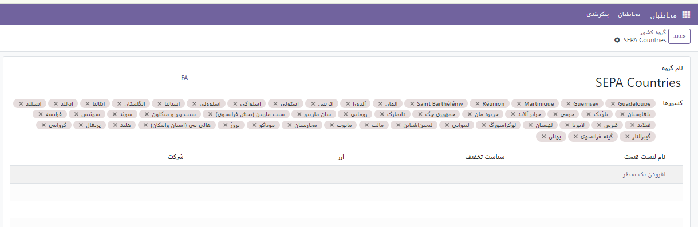
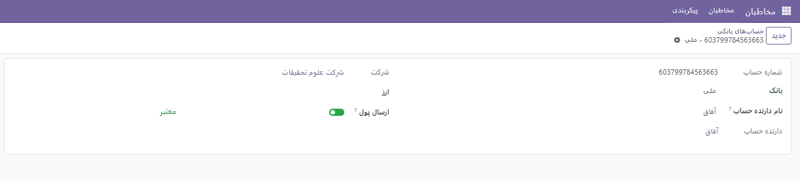

:nosearch:
:show-content:
:hide-page-toc:
:show-toc:

پیکربندی
========================
از منو مخاطبین وارد پیکربندی شوید. 

برچسب های مخاطبین
-----------------------------
از این قسمت می توانید برچسب هایی با رنگ های متفاوت ساخته و هنگام افزودن مخاطب یا شرکت به هر کدام از آنها این برچسب ها را الحاق کنید.

.. image:: ./img/cont7.png
    :alt:  ماژول ناهار
    :align: center

عناوین مخاطبین
---------------------

گاهی اوقات لازم است عنوان های آماده و از قبل تعریف شده برای یک مخاطب اضافه شود. از این قسمت می توانید این عناوین را تعریف کنید.

.. note:: 
    **نکته: تعریف عنوان برای صنایع دقیقا مانند مخاطبین است.**

.. image:: ./img/cont8.png
    :alt:  ماژول ناهار
    :align: center

بومی سازی
--------------------------

در این بخش می توانید کشورها ،استان ها و گروه های کشورهای خاصی را تعریف کنید.

توچه داشته باشید که گروه کشورها شامل چندین کشور است و قبل از تعریف یک گروه اول باید کشورها را تعریف کرده باشید.

حساب های بانکی
--------------------------

در این قسمت می توانید بانک و حساب بانکی جدیدی تعریف کنید.

برای تعریف حساب بانکی جدید گزینه ایی به نام ارسال پول وجود دارد. که در صورت فعال بودن مب توان به این معنی باشد که این حساب موجودی لازم را دارد و می تووان ازر آن برای پرداخت استفاده کرد.

ورود مخاطبین
----------------------
مطابق عکس زیر شما میتوانید با کلیک چرخدنده کلیک کرده تا فرمی را دریافت کنید. اطلاعات را از طریق گزینه *ورود رکورد * که در غالب اکسل است وارد ماژول کنید.
