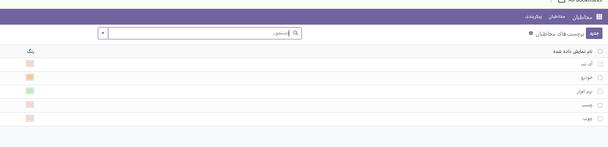
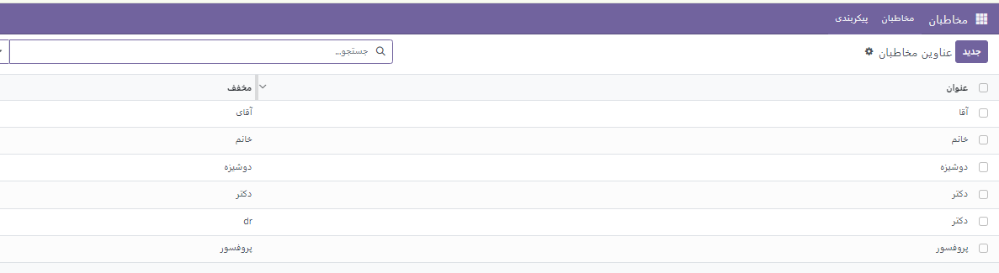
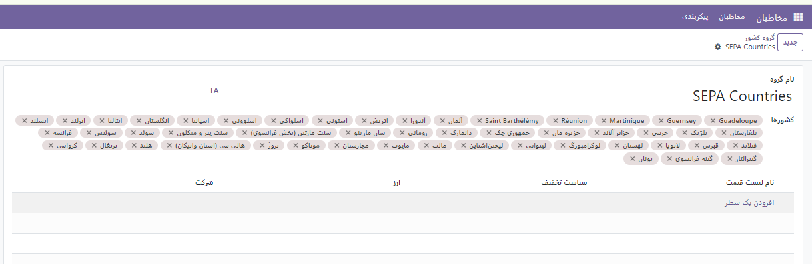
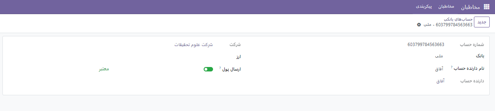

:nosearch:
:show-content:
:hide-page-toc:
:show-toc:

==============================
نصب ماژول مخاطبین
==========================

با نصب ماژول مخاطبین وارد فضای زیر خواهید شد. برای دیدن مخاطبین می توانید بنا به نیاز خود  از نوع لیست یا کانبان استفاده کنید

همچنین در صورت لزوم می توانید از کادر سرچ بر اساس شرایط فیلترهای خاصی برای مخاطبین انتخاب کرده و آن ها را بر اساس نام یا شرکت جستجو کنید. در این ماژول شم می توانید تمام افراد و شرکای خود را ذخیره کنید.
.. image:: ./img/cont1.png
    :alt:  ماژول ناهار
    :align: center

افزودن مخاطب جدید
------------------------------------
برای این کار با فشردن گزینه جدید صفحه ایی باز شده که به شما امکان می دهد اطلاعات فرد/شرکت را ذخیره کنید. 
نکته: دقت کنید که با انتخاب هر کدام فیلدهای مخصوص هر مخاطب (فرد/شرکت) کمی متفاوت است.

.. image:: ./img/cont2.png
    :alt:  ماژول ناهار
    :align: center

همانطور که مشاهده می کنید در کادر پایین علاوه بر اطلاعات فردی مخاطب تب های دیگری مانند تماس ها و نشانی، خرید و فروش . صدور فاکتور و در نهایت یادداشت های داخلی ملاحظه میکنید.

با انتخاب گزینه افزودن شما می توانید اطلاعات دیگری درباره ادرس تحویل ادرس و ... وارد کنید.

.. image:: ./img/cont3.png
    :alt:  ماژول ناهار
    :align: center

.. note::
    در تب **خرید و فروش** شما می توانید اطلاعات فروشندهو تاریخ سر رسید برای یاد آوری ، شرایط پرداخت و سایت شرکت و .... درج نمایید.

.. image:: ./img/cont4.png
    :alt:  ماژول ناهار
    :align: center

تب **صدور فاکتور** به شما این امکان را م یدهد تا صورت حساب بانکی افراد را ثبت کنید.

.. image:: ./img/cont5.png
    :alt:  ماژول ناهار
    :align: center

در تب **یادداشت های داخلی**  می توانید هر جزئیات دیگری را برای مخاطب خود نوشته. 

.. image:: ./img/cont6.png
    :alt:  ماژول ناهار
    :align: center

پیکربندی
========================
از منو مخاطبین وارد پیکربندی شوید. 

برچسب های مخاطبین
-----------------------------
از این قسمت می توانید برچسب هایی با رنگ های متفاوت ساخته و هنگام افزودن مخاطب یا شرکت به هر کدام از آنها این برچسب ها را الحاق کنید.

عناوین مخاطبین
---------------------

گاهی اوقات لازم است عنوان های آماده و از قبل تعریف شده برای یک مخاطب اضافه شود. از این قسمت می توانید این عناوین را تعریف کنید.

.. note:: 
    **نکته: تعریف عنوان برای صنایع دقیقا مانند مخاطبین است.**

بومی سازی
--------------------------

در این بخش می توانید کشورها ،استان ها و گروه های کشورهای خاصی را تعریف کنید.

توچه داشته باشید که گروه کشورها شامل چندین کشور است و قبل از تعریف یک گروه اول باید کشورها را تعریف کرده باشید.

حساب های بانکی
--------------------------

در این قسمت می توانید بانک و حساب بانکی جدیدی تعریف کنید.

برای تعریف حساب بانکی جدید گزینه ایی به نام ارسال پول وجود دارد. که در صورت فعال بودن مب توان به این معنی باشد که این حساب موجودی لازم را دارد و می تووان ازر آن برای پرداخت استفاده کرد.

.. toctree::
    :titlesonly:

   ./contacts
  