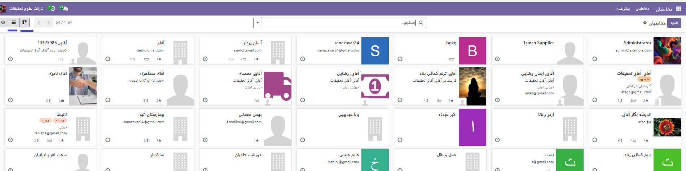
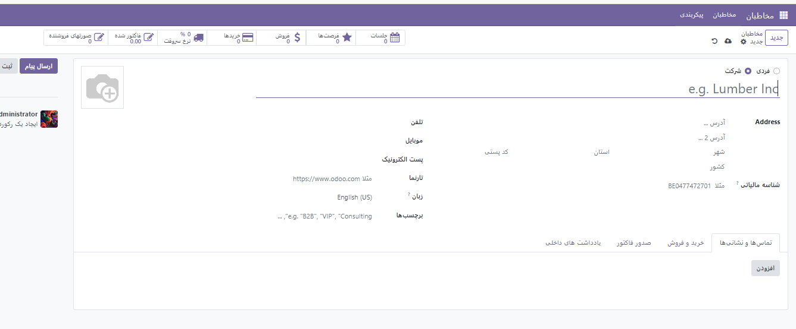
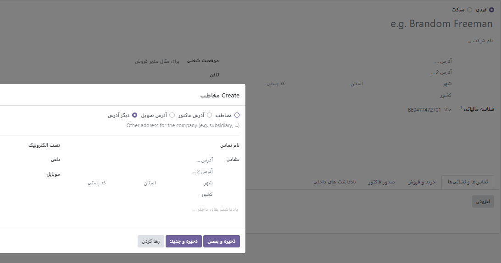
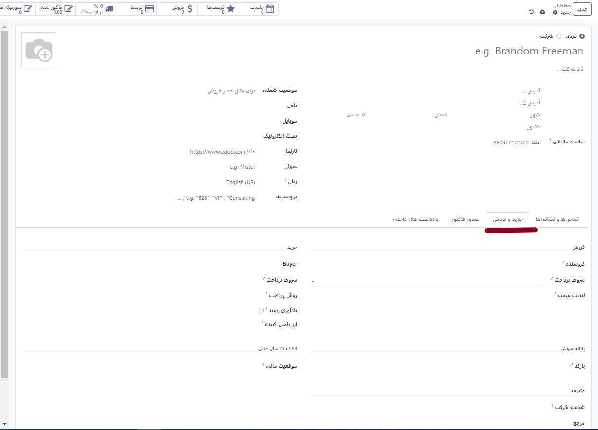
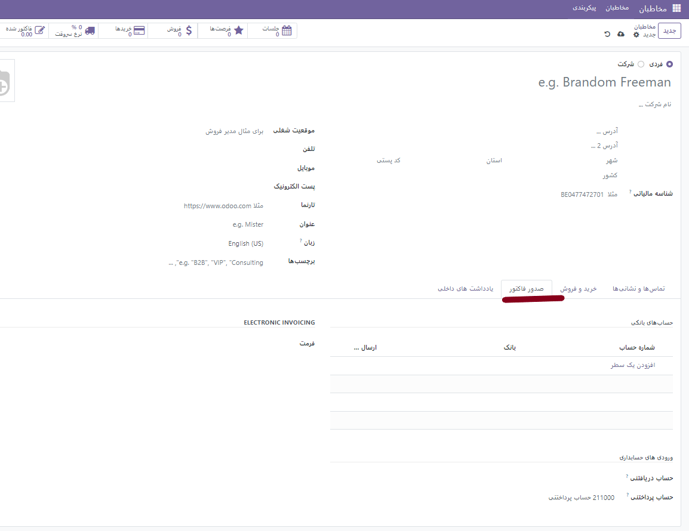
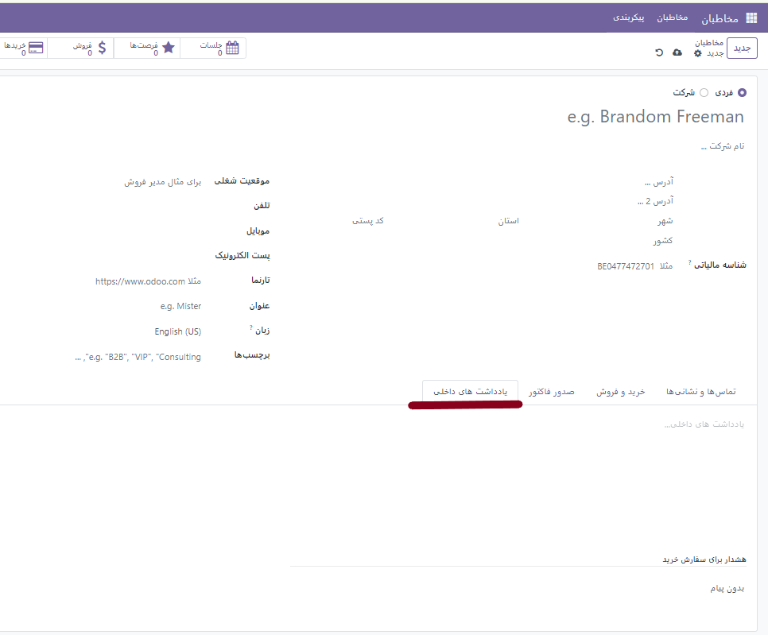

:nosearch:
:show-content:
:hide-page-toc:
:show-toc:

==========================
مخاطبین
==========================

با نصب ماژول مخاطبین وارد فضای زیر خواهید شد. برای دیدن مخاطبین می توانید بنا به نیاز خود  از نوع لیست یا کانبان استفاده کنید

همچنین در صورت لزوم می توانید از کادر سرچ بر اساس شرایط فیلترهای خاصی برای مخاطبین انتخاب کرده و آن ها را بر اساس نام یا شرکت جستجو کنید. در این ماژول شم می توانید تمام افراد و شرکای خود را ذخیره کنید.

افزودن مخاطب جدید
------------------------------------
برای این کار با فشردن گزینه جدید صفحه ایی باز شده که به شما امکان می دهد اطلاعات فرد/شرکت را ذخیره کنید. 
نکته: دقت کنید که با انتخاب هر کدام فیلدهای مخصوص هر مخاطب (فرد/شرکت) کمی متفاوت است.

همانطور که مشاهده می کنید در کادر پایین علاوه بر اطلاعات فردی مخاطب تب های دیگری مانند تماس ها و نشانی، خرید و فروش . صدور فاکتور و در نهایت یادداشت های داخلی ملاحظه میکنید.

با انتخاب گزینه افزودن شما می توانید اطلاعات دیگری درباره ادرس تحویل ادرس و ... وارد کنید.

.. note::
    در تب **خرید و فروش** شما می توانید اطلاعات فروشندهو تاریخ سر رسید برای یاد آوری ، شرایط پرداخت و سایت شرکت و .... درج نمایید.

تب **صدور فاکتور** به شما این امکان را م یدهد تا صورت حساب بانکی افراد را ثبت کنید.

در تب **یادداشت های داخلی**  می توانید هر جزئیات دیگری را برای مخاطب خود نوشته. 

.. tip::
    در عکس زیر همانطور که مشاهده می کنید می توانید از این مسیرها به ماژول های دیگر وصل شوید. 

    به عنوان مثال جلسات به گاه شمار، و یا از سرنخ ها به فروش و ... همچنین در قسمت **تارنما ** با فعال کردن گزینه *انتشار * می توانیم این مخاطب را به اعضای سایت خود انتقال دهیم و به عنوان مشتریان نمایش داده شود.
    
    .. image:: ./img/cont13.png
        :alt:  ماژول مخاطبین
        :align: center

.. toctree::
        ./config

لینک های مرتبط:

1. https://www.cybrosys.com/odoo/odoo-books/v17-ce/contacts/
2. https://oxydoo.com/blog/odoo17-28/contacts-211

تگ های مرتبط:

1.  :guilabel:`#Audience`
2.  :guilabel:`#TargetAudience`
3.  :guilabel:`#AudienceEngagement`
4.  :guilabel:`#AudienceAnalysis`
5.  :guilabel:`#AudienceSegmentation`
6.  :guilabel:`#CustomerSegmentation`
7.  :guilabel:`#AudienceInsights`
8.  :guilabel:`#AudienceStrategy`
9. :guilabel:`#AudienceNeeds`
10. :guilabel:`#AudienceFeedback`
11. :guilabel:`#CustomerFeedback`
12. :guilabel:`#AudienceDevelopment`
13. :guilabel:`#AudienceReach`
14. :guilabel:`#AudienceExperience`
15. :guilabel:`#AudienceBehavior`
16. :guilabel:`#مخاطبین`
17. :guilabel:`#هدفمندسازی_مخاطب`
18. :guilabel:`#ارتباط_با_مخاطب`
19. :guilabel:`#تعامل_مخاطب`
20. :guilabel:`#نیازهای_مخاطب`
21. :guilabel:`#رضایت_مخاطب`
22. :guilabel:`#بازاریابی_مخاطب‌مدار`
23. :guilabel:`#استراتژی_مخاطبین`
24. :guilabel:`#تفاوت_مخاطبین`
25. :guilabel:`#تعاملات_مخاطبانه`
26. :guilabel:`#پیشنهادات_مخاطبین`
27. :guilabel:`#تحقیقات_مخاطبین`
28. :guilabel:`#گسترش_مخاطبین`
29. :guilabel:`#تجربه_مخاطبین`

