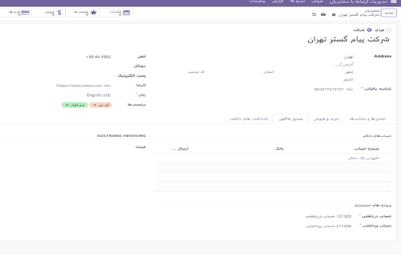
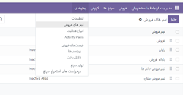
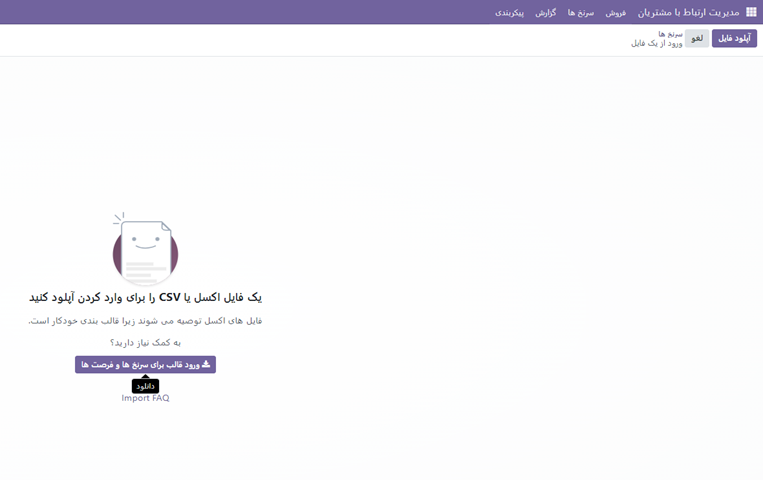
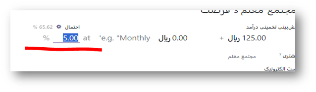

:show-content:
:show-content:
=========================
مدیریت ارتباط با مشتریان
=========================

مهمترین هدف ماژول مدیریت مشتری اودوو ارج نهادن احترام به مشتری احترام و مسئولیت هایی فروشنده  است.

قبل از شروع و معرفی اودوو کمی درباره ی اهداف و روش های فروش توضیح دهیم.
منظور از سرنخ چیست؟
اصطلاح Lead یا سرنخ در مورد افراد یا سازمان‌هایی به کار می‌رود که به هر روش، با محصولات ما آشنا شده‌اند و برای نخستین کسب اطلاع (و شاید در نهایت خرید) به ما مراجعه می‌کنند.
بنابراین، وقتی کسی برای نخستین بار هر نوع پرسشی در مورد محصولات ما یا کسب و کارمان می‌پرسد و به نظر می‌آید که ممکن است قصد داشته باشد به مشتری ما تبدیل شود، او را Lead یا سرنخ یا مشتری راغب می‌نامیم.
معمولاً کسانی که در حوزه فروش و فروشندگی فعالیت می‌کنند، اصطلاح سرنخ را ترجیح می‌دهند.
چون در باور ذهنی یک فروشنده، همین که مشتری یک بار به تو مراجعه کرد یا به سایت سر زد یا حاضر شد شماره تماس یا ایمیل خود را در اختیار تو قرار دهد، یک سرنخ برای فروش ایجاد شده و از این به بعد، این تو هستی که باید سرِ این نخ را بگیری و آن‌قدر پیگیرش باشی تا به فروش محصول منتهی شود.

فرصت فروش چیست؟
به مجموعه‌ای از مشتریان بالقوه که واجد شرایط خرید از شما هستند، فرصت فروش گفته می‌شود. در واقع، این گروه از مشتریان بالقوه شما چالش یا مشکلی دارند که راه حل آن استفاده از محصول یا خدمت شماست. باید به این نکته توجه داشته باشید که فرصت‌های فروش شما مشتریانی هستند که به کسب‌وکار یا محصول شما بسیار علاقمند هستند. بنابراین، احتمال خرید در این گروه نسبت به سایر مشتریان بالاتر است.
آیا فرصت فروش و سرنخ با هم تفاوت دارند؟
سرنخ‌ها (Leads)، مشتریانی هستند که در راس قیف فروش قرار گرفته‌اند. این گروه، هنوز صلاحیت‌سنجی نشده‌اند. به عنوان مثال، این گروه ممکن است بخشی از یک مقاله یا قسمت‌هایی از کتاب الکترونیکی شما را خوانده‌ و نسبت به کسب‌وکار شما کنجکاو شده‌ باشند. اما این کنجکاوی به این معنا نیست که مشتریانِ واجد شرایط شما هستند. پس باید در نظر داشته باشید که احتمال خرید آن‌ها نسبت به مشتریان واجد شرایط پایین‌تر است.
چگونه می‌توان سرنخ را به فرصت فروش تبدیل کرد؟
برای اینکه تیم فروشندگان بتوانند عملکرد بهتری داشته باشند، باید ابتدا تمامی سرنخ‌هاشان را واجد شرایط کنند. این کار باعث می‌شود که زمان آن‌ها صرف مشتریانی شود که فرصت فروش آن‌ها محسوب می‌شوند. نتیجه این امر، عملکرد بهتر تیم فروش در یک سازمان، افزایش فروش و به دنبال آن درآمدزایی بیشتر است.
چگونه می‌توان یک فرصت را به خریدار قطعی تبدیل کرد؟
مشتریان خود را بشناسید: بعضی از فروشندگان فکر می‌کنند همه مشتریان آن‌ها، خریدار محصول‌شان هستند. اما این‌طور نیست
مشتریان خود را منتظر نگذارید: پاسخ‌دهی سریع به مشتریان بسیار مهم است. هرچه زودتر به مشتریان خود پاسخ بگویید، تاثیری که روی آن‌ها می‌گذارید بیشتر می‌شود. 
مشتریان خود را پیگیری کنید: بعد از اینکه مشتریان خود را صلاحیت‌سنجی کردید، حتما آن‌ها را پیگیری کنید. برای پیگیری از روش‌های مختلفی استفاده کنید. برای آن‌ها پیام یا ایمیل ارسال کنید، به آن‌ها زنگ بزنید. . 
با مشتریان به روش‌های مختلفی صحبت کنید گر می‌خواهید مشتری را به خریداری واقعی تبدیل کنید، باید حداقل سه تا پنج استراتژی مختلف را برای مذاکره با او آماده کنید. همیشه برای صحبت حضوری، صحبت تلفنی یا ارتباط مجازی‌ (چت کردن، ارسال ایمیل و غیره) آماده باشید.

نصب ماژول
=========================

.. image:: ./crm/src/img/1.png
    :alt: باشگاه ویراوب123 
    :align: center

با نصب این ماژول منوهایی مطابق عکس زیر نمایش داده می شود.

ایجاد سرنخ/فرصت 
---------------

  
ههانطور که می دانید برای فروش محصول باید مراحل زیادی تا سفارش و پرداخت انجام شود. اولین مرحله  ایجاد سرنخ است. این سرنخ حا می تواند هر چیز کوچک و به نظر کم اهمیتی باشد. اما به یاد داشته باشید که در نهایت از چنین سرنخ می توان مشتری های بالقوه را پیدا و به مشتری بالفعل تبدیل کرد.

برای ایجاد یک سرنخ روی دکمه جدید  کلیلک کنید تا یک کارت برای شما ظاهر شود. کارت باز شده شامل اطلاعات درخواستی سرنخ می باشد که می توانید مطابق عکس زبر آن را پر کنید.

.. image:: ./crm/src/img/2.png
    :align: center
    :alt: photo2

برای پر کردن فیلد اول شما می توانید از سازمان یا مخاطبین موجود خوند استفاده کنید و یا در صورت جدید بودن به محض وارد کردن نام آن مخاطب یا سازمان برای شما ساخته می شود. بعد از پر کردن فیلد اول فیلد فرصت به طور اتوماتیک پر خواهد شد که در صورت نیاز می توانید نام این فرصت را تغییر دهید.

.. image:: ./crm/src/img/3.jpg
    :align: center
    :alt: photo3

در قسمت پیش بینی تخمین درآمد می توانید درآمدی که از این سرنخ ممکن است بدست آورده شود را وارد نموده و بر اساس اولویت به این سر نخ ستاره بدهید.
 در پایان  گزینه افزودن را فشار دهید تا سرنخ ثبت شود.

بعد از ایجاد سرنخ مسیر فروش آغاز خواهد شد. ممکن است شما قبل از فروش پیشهاد یا سند و یا ... قبل از ارتباط با مشتری در یک تایم و بازه زمانی خاصی بخواهید انجام داده و چک کنید. برای این منظور می توانید تنها با درگ و دارپ کردن کارت را در مرحله های مختلفتی قرا بدهید. 
اگر سرنخ مورد نظر به فروش رسید می توانید آن را در مرحله برد و یا در صورت عدم فروش باخت قرار داده. لازم به ذکر است مراحل تنها به این گزینه ها محدود نشده و کاربر می تواند با کیک روی گزینه مثبت + طبق مراحل فروش خود مرحله ایی را حذف/اضافه و یا ویرایش کند.

در طوب مسیر ی که یک سر نخ طی می کند ممکن است با چلش ها و یا درخواست هایی مواجه شوید که لازم باشد آن را برای آن فرصت ثبت کنید. برای این منظور کافیست روی کارت مورد نظر رفته تا علامت سه نقطه8 سمت راست بالای کارت ظاهر شود. با فشردن آن وارد صفحه ی جدیدی خواهید شد که امکانات بسیاری را در دسترس شما قرا رمی دهد.

.. image:: ./crm/src/img/4.png
    :align: center
    :alt: photo3

به عکس زیر توجه فرمایید:

.. figure:: ./crm/src/img/4.png
    :align: center
    :alt: photo4

    

    در  این صفحه جدید شما قادر خواهید بود در تب اطلاعات اضافی نام فروشنده، زمان انعقاد قرار داد و دیگر اطلاعات مانند بازاریابی و تیم فروش خود ار برای این سرنخ مشخص نمایید.

نکته:
     با خاطر داشته باشید بعد از هر تغیییر از آیکون ذخیره دستی برای ذخیره شدن فیلدهای مربوطه استفاده کنید. همچنین می توانبد این فرصت فروش را به مرحله برد و یا باخت تبدیل کرده

.. image:: ./crm/src/img/5.png
    :align: center

در صورتیکه در این مرحله مشتری از شما در خواست پیش فاکتور کرده باشد لازم به صورت سریع می توانید از گزینه پیش فاکتور جدید استفاده کرده و یک نسخه از آن را برای مشتری ارسال کنید.

عکس زیر مثالی از ایجاد یک پیش فاکتور جدید می باشد. حتی اگر محصول مورد نظر در انبار و یا فروشگاهی موجود نباشد می تواند در همان لحظه نسبت به تعریف و درج اطلاعات محصول مورد نظر اقدام کرده و رسید را به مشتری ارسال کنید.

تست بین عکس

تولید سرنخ
---------------
 در این گزینه می توانید سرنخ های جدیدی تولید کنید که معیارهای مختلفی را دارا باشند. از جمله کشور،صنایع و ....
در واقع این گزینه همان گزیه جدید است اما با کمی پیچدگی. پیشنهاد می شود از گزینه جدید و یا منوی سرنخ ها ، سرنخ های جدی خود را ایجاد کنید.

.. image:: ./crm/src/img/6.png
    :align: center
    :alt: photo6

با باز شدن پنجره فوق می توان سرنخ های جدیدی ایجاد کرد. می‌توانید یکی از دو گزینه را در کادر بازشوی کنار این فیلد انتخاب کنید: «شرکت‌ها» یا «شرکت‌ها و مخاطبین آنها». اطلاعات مورد نیاز را در زمینه هایی مانند کشورها، ایالات، تیم فروش، فروشنده، و برچسب های پیش فرض پر کنید. برای سفارشی کردن محدوده تعداد کارکنان، «فیلتر در اندازه» را روشن کنید. پس از وارد کردن تمام اطلاعات، روی "ایجاد سرنخ ها" کلیک کنید. 

فروش
-----------------

در این منو زیر منوهای متعدی وجود دارد. که با انتخاب هر کدام می توانید به امکانات متعددی دسترسی داشته باشید.

    همانطور که در منوی کشوی باز شونده مشاهده میکنید در اولین زیر منو شما می توانید از فرصت های فروش من  فرصت ها ی فروش ،فعالیت های ثبت شده خود و تمام تیم ها و حتش مشتریان را را دیده و یا مجددتولید سرنخ کنید.

    ایجاد مشتری جدید:
    از منو فروش وارد مشتریان شده و از قسمت گوشه بالا سمت راست گزینه جدید را انتخاب کنید. بدین شکل اطلاعات مربوط به یک مشتری جدید را بنا به نیاز خود درج نمایید.

    همانطور که مشاهده می کنید درج اطلاعات مشتریان در اودوو صرفا به اطلاعات اولیه محدود نمی شود و شما میتوانید فاکتورها و خرید و فروش های مرتبط با این مشتری را در تب های پایین صفحه مشاهده کنید.

تیم های فروش متعدد
------------------
برای ایجاد یک تیم فروش جدید به پیکربندی>>تنظیمات>> تیم فروش
در صفحه باز شده اطلاعات را تکمیل کرده و مشخص کنید که آیا صرفا فرصت های فروش و یا سرنخ ها به اعضای تیم ارسال شود. همچنین می توان مبلغی را به عنوان تارگت این تیم مشخص کردو و باز فشردن کزینه افزودن اعضای تیم را مشخص کرد.

.. image:: ./crm/src/img/10.png
    :align: center
    :alt: photo10

    می توان تمام تبم های فروش را در یک داشبورد مشاهده کرد.برای این کار از منوی فروش>>تیم ها  

در صفحه باز شده اطلاعات را تکمیل کرده و مشخص کنید که آیا صرفا فرصت های فروش و یا سرنخ ها به اعضای تیم ارسال شود. همچنین می توان مبلغی را به عنوان تارگت این تیم مشخص کردو و باز فشردن کزینه افزودن اعضای تیم را مشخص کرد.

    با انتخاب 3 نقطه بالای هر کارتیم فروش می توان فرصت های فروش،سرنخ ها، برد ها و ... مشاهده کرد.

سرنخ ها و فرصت های مشابه را ادغام کنید
------------------------
گاهی ممکن است سرنخ های ایجاد شده توسط چند فروشنده در زمان های مختلف ایجاد شود. برای اینکه از تماس های مکرر فروشنده ها به یک سرنخ جلوگیری کرد بهتر است تمام سرنخ های مشابه را با هم ادغام کنیم .
سرنخ ها و فرصت های مشابه با مقایسه شماره تماس و ایمیل مخاطب مرتبط شناسایی می شوند. اگر سرنخ/فرصت مشابهی پیدا شود، یک دکمه هوشمند سرنخ های مشابه  در بالای رکورد سرنخ (یا فرصت) ظاهر می شود. Similar lead

    پس از انتخاب گزینه فوق حالت نمایش را روی لیست قرار داده و لیستی از سرنخ های مشابه را به شما نشان می دهد. بعد از انتخایب تمام سرنخ های مشابه روی گزینه واکنش (علامت چرخ دنده) در بالای صفحه ظاهر میشود، کلیک کرده و گزینه ادغام را فشار داده تا تمام سرنخ ها یکی شوند.

پس از ادغام سرنخ ها صفحه ایی باز شده که مشخص می کند این سرنخ خای ادغام شده به کدام فرشنده و تیم ارجاع داده شود.
.. image:: ./crm/src/img/15.png
    :align: center

نکته:دقت داشته باشید هنگام باز شدن این پجره باید در قسمت انتخاب فرصت ها بیش از یک سرنخ را انتخاب کرده باشید.

سرنخ ها را به فرصت تبدیل کنید
---------------------

سرنخ قبل از ایجاد فرصت به عنوان یک مرحله واجد شرایط عمل می کنند. این امر زمان بیشتری را برای بررسی پتانسیل آن و سنجش قابلیت آن، قبل از اینکه فرصت به فروشنده اختصاص داده شود، فراهم می کند.

با فعال کردن گزنه سرنخ ها برای تمام تیم ها اراسل می شود.برای این کار وارد ماژول ارتباط با مدیریت مشتربان می شویم. بخش پیکربندی >> تنظیمات>>تیک فعال سرنخ را می زنیم

.. image:: ./crm/src/img/16.png
    :align: center

شاید بخواهیم سرنخ ها یا فرصت های فروش به یک تیم خاص نمایش داده نشود. برای این کار از منوی پیکربندی>>تیم های فروش
وارد تیم فروش مورد نظر شده و تیک گزینه سرنخ ها را برمی داریم.

.. image:: ./crm/src/img/17-2.png
    :align: center

توضیحات تکمیلی سرنخ
---------------------------
زمانیکه یک سرنخ تولید می شود مسیرهای مختلفی را باید طی کند تا به یکه فرصت فروش یا در نهایت به برد یا باخت تبدیل شود. 
طی شدن این مراحل را می توان به صورت پشت سر هم (breadcrum)  دید و بین وضعیت های یک سرنخ جا به جا شد.
همینطور که مشاهده میکنید می توانیم برای پیش برد اهداف برای یک سرنخ یا فرصت فروش از گزینه جلسه استفاده کنیم و اعضایی که باید در جلسه حضور داشته باشند را به جلسه در تاریخ و روز ساعت معیین دعوت کنیم.
نکته:لازم به ذکر است درصد احتمال به صورت دستی قابل تغییر است و یا بنا به فروش های قبلی  و تغییر هر فرصت با ورود به مرحله بعد و نزدیک شدن به فروش به صورت اتوماتیک توسط اودوو تعیین می شود.

سرنخ ها
--------------------

در این منو علاوه بر ایجاد یک سر نخ میتوانیم از تمام سرنخ ها یک خروجی در قالب اکسل گرفته و یا سرنخ ههای وارد شده در اکسل را به ماژول اضافه کرد. برای اینکار از منوی سرنخ ها ابتدا روی علامت چرخ دنده کلیک کرده و قالب آماده که می توان در آن سرنخ ها را وارد کرد دانلود میکنیم. سپس بعد از ورود اطلاعات در قالب فایل  آن را در اودوو با گزینه آپلود فایل اضافه میکنیم میکنیم. 
برای راهنمای بیشتر می توانید از لینک زیر استفاده کنید:

https://oxydoo.com/blog/guide-28/import-267

پیکربندی 
----------------

در قسمت پیکربندی وارد بخش تنظیمات می شویم. همانور که مشاهاده میکنید دو بخش جداگانه مربوط به مدیریت ارتباط با مشتریان و
 تولید سرنخ  وجود دارد.
مدیریت ارتباط با مشتریان:

.. image:: ./crm/src/img/20.png
    :align: center

(امتیاز دهی پیشگویانه) Predictive Lead Scoring
با انتخاب  گزینه  به روزرسانی احتمالات می توانید مشخص کنیددرصد احتمال بر چه اساس و از چه تاریخی اعمال شود.

.. image:: ./crm/src/img/21.png
    :align: center

    هر تعداد از متغیرهای زیر را می توان فعال کرد:

دولت : وضعیت جغرافیایی که فرصت از آن سرچشمه می گیرد
کشور : کشور جغرافیایی که فرصت از آن نشات می گیرد
کیفیت تلفن : آیا شماره تلفنی برای فرصت ذکر شده است یا خیر
کیفیت ایمیل : آیا یک آدرس ایمیل برای فرصت ذکر شده است یا خیر
منبع : منبع یک فرصت (به عنوان مثال موتور جستجو، رسانه های اجتماعی)
زبان : زبان گفتاری که در فرصت مشخص شده است
برچسب‌ها : برچسب‌هایی که روی فرصت قرار می‌گیرند
چنانچه در یک سرنخ احتمال را به صورت دستی وارد کرده باشیم بعد از تنتظیمات مطابق شکل زیر با کلیلک روی چرخ دنده عدد احتمال با عدد اتوماتیک پر خواهد شد. 

همچنین می توانید برای تعیین سرنخ ها از قوانین تکرار شونده ایی تعیین کرد. که با فعال کردن واگذاری مبتنی بر قانون
این کار صورت می گیرد. در واقع این گزینه تولید لیدها برای سفارشاتی هست که به صورت دوره ای  در زمان مشخصی تکرار میشه . این گزینه می تواند با فعال بودن به دو روش دستی (تولید سرنخ ها به صورت دستی ) و یا اوتوماتیک انجام شود.

مثال
برای پیکربندی یک قانون تخصیص به گونه‌ای که یک تیم فروش سرنخ‌هایی دریافت کند که احتمال موفقیت آن‌ها 20 درصد یا بیشتر است، یک خط دامنه ایجاد کنید که می‌خواند :Probability >= 20

.. image:: ./crm/src/img/23.png
    :align: center

.. image:: ./crm/src/img/24.png
    :align: center

تبدیل بازدید به سرنخ
--------------------------
می توانید با فعال کردن /غیر فعال کردن گزینه ها، مدیریت سرنخ ها را به صورت پیشرفته انجام دهید.به طور مثال با فعال کردن گزینه بازدید از سرنخ ها تمامی افرادی که از سایت شما بزدید می کنند به عنوان یک سرنخ حساب شده و شما را به فرصت های فروش بیشتری هدایت می کند.

.. image:: ./crm/src/img/25.png
    :align: center
.. toctree::

پیکربندی>انواع فعالیت
-----------------------

.. image:: ./crm/src/img/26.png
    :align: center

با انتخاب گزینه جدید صفحه ایی باز شده که می توان یک فعالیت جدید و یک یادآور در تقویم برای یادآوری آن فعالیت ایجاد کرد.

.. image:: ./crm/src/img/27.png
    :align: center

    به خاطر داشته باشید. بعد از انجام هر فعالیتی آن را ذخیره کنید.به طور مثال مشما یک فعالیت مثل ارسال ایمیل تعریف میکنید و می خواهید این ارسال ایمیل میخواید دو روز یک بار انجام بشه .برای تنظیمش میشه 2 روز بعد از موعد نهایی فعالیت قبلی .

پیکربندی> برنامه فعالیت ها(Activity plans)
------------------------

    در این بخش می توانید یک برنامه فعالیت جدید تعریف کرده و آن را به شخص مورد نظر به صورت پیش فرض یا دستی واگذار کنید. (توجه شود نوع فعالیت بایداز قبل تعریف شده باشد)

گزارش
-------------------
در این بخش میتوان گزارش های مختلف از فعالیت ها و سرنخ ها را براساس گزینه های موجود و یا سفارشی سازی بررسی کرد. برای اینکاز از منوی سرچ بر اساس فیلترهای موجود یا دلخواه سرنخ یا فرصت دلخواه را جستجو کنید.

  از قسمت گزارش ها می توانم فعالیت های جدیدی ایجاد کرد. همچنین می توان خط فروش رو سرنخ ها را با توجه به فیلتر های خاص زمانی تجزیه و تحلیل کرد.

 معنی رنگ ها در اودوو
اگر برای سرنخ یا فرصتی یاد آور یا فعالیتی طبق تقویم تنظیم کرده باشیم اگر یادآور آن به رنگ قرمز باشد یعنی تاریخ آن گذشته.رنگ زرد به معنی آن است که امروز روز سررسید انجام آن کار در تقویم است و در نهایت رنگ سبز به معنی انجام شدن در تاریخ مقرر آن می باشد.
افزودن ایمیل مستعار برای تیم های فروش
ابرای این که ایمیل های مشتریان باز هر تیم به ایمیل مخصوص یا مستعار خو آن تیم فرستاده شود. می توان برای همه یتیم های فروش یک ایمل مستعار تعریف کرد.
اما قبل از این کار باید یک دامنه اصلی تعریف کنیم.برای این کار وارد پیکربندی>تننظیمات>تنظیمات عمومی > شرکت ها>مدیریت شرکت ها  در صفحه باز شده گزینه جدید را انتخاب کرده یک شرکت جدید ایجاد کنید. 

بعد از ثبت شرکت و تثب دامنه تغییرات را ذخیره کنید. 

.. image:: ./crm/src/img/30.png
    :align: center

بعد از مشخص کردن دامنه به تیم فروش مورد نظر رفته و ایمیل مستعار را به آن اختصاص دهید.

.. image:: ./crm/src/img/31.png
    :align: center

    گزارش درآمد مورد انتظار
--------------------------------
درآمد مورد انتظار کل ارزش نقدی سرنخ هایی است که انتظار می رود در یک تاریخ معین، معمولاً پایان ماه جاری بسته شوند.
گزارش درآمد مورد انتظار، تمام سرنخ‌های فعال در خط لوله فروش را که دارای تاریخ بسته شدن مورد انتظار هستند، جمع‌آوری می‌کند و نحوه عملکرد تیم‌های فروش را در یک بازه زمانی معین مقایسه می‌کند.

.. image:: ./crm/src/img/32.png
    :align: center

با تهیه گزارش درآمد مورد انتظار ماهانه، مدیران فروش می توانند ببینند کدام اعضای تیم به اهداف خود می رسند و چه کسانی ممکن است برای بستن معاملات ارزشمند به کمک بیشتری نیاز داشته باشند.

چند تیم
-------------
.. image:: ./crm/src/img/33.png
    :align: center

    با فعال بودن این گزینه می توانید فروشندگان را به تیم های فروشمختلف اختصاص دهیم.
برای مثال یک تیم فروش میسازیم و دو فروشنده را به آن واگذار میکنیم.

.. image:: ./crm/src/img/35.png
    :align: center

همانطور که مشاهده میکنید دو تیم فروشنده متفاوت اما فروشنده های یکسانی برای تیم ها تعریف شده است.

تبدیل بازدید کنندگان به سرنخ
---------------------------
.. image:: ./crm/src/img/36.png
    :align: center

    هنگام فعال کردن این گزینه در منوی پیکربندی گزینه visti to leads rules (دیدن قوانین سرنخ ها) ظاهر می شود که قبل از فعال کردن این گزینه قابل دیدن نبود. بعد از وارد شدن به این منو میتوانید قوانینی برای پیدا کردن سر نخ هایی که از طریق سایت شما را بازدیبد میکنند تعریف کنید.

.. image:: ./crm/src/img/37.png
    :align: center

ابت ابتدا نام قانون خود را در قسمت "نام قانون" وارد کنید. شما می توانید انتخاب کنید که آیا "شرکت ها" یا "شرکت ها و مخاطبین آنها" را با استفاده از ویژگی ردیابی داده ها ردیابی کنید.و به ترتیب شرایط ترافیک وب سایت را تکمیل کنید.می توانید مشخص کنید که بازدیدکنندگان کام کشورها را به سر نخ یا url مربوط تبدیل کنید.
اطلاعات لازم در انتهای فرم کامل کرده و به همین ترتیب، فیلدهای نوع، پسوند، تیم فروش، فروشنده، برچسب‌ها و اولویت را با اطلاعات مربوطه تکمیل کنید و در نهایت اطلاعات را ذخیره کنید.

در منوی پیکربندی > فرصت های فروش
دو زیر منو وجود دارد که شما می توانید برچسب و یا دلایل باخت یک فرصت فروش را برای سهولت و راحی از پیش تعربف کرده و از آن استفاده کنید.

تگ های مربوطه:

1.	#سئو_و_CRM
2.	#بهینه_سازی_برای_مشتریان
3.	#تجربه_کاربری_سئویی
4.	#رتبه_بندی_و_ارتباط_مشتری
5.	#سئو_و_تجربه_مشتری
6.	#بهبود_رتبه_با_ارتباط_موثر
7.	#کسب_و_کار_دوستانه_با_مشتری
8.	#بهینه_سازی_برای_تجربه_مشتری
9.	#ارتباط_موثر_و_سئو
10.	#بازخورد_مشتری_و_سئو
11.	#CRM
12.	#CustomerRelations
13.	#CustomerExperience
14.	#CustomerSupport
15.	#CustomerFeedback
16.	#MarketingStrategy
17.	#CustomerDataAnalysis
18.	#EmailMarketing
19.	#CustomerTouchpoints
20.	#CustomerExperienceManagement

لینک های مرتبط:

https://www.tashilgostar.com/documentation/16.0/applications/sales/crm.html

https://www.odoo.com/documentation/17.0/applications/sales/crm.html
https://oxydoo.com/blog/guide-

https://www.cybrosys.com/odoo/odoo-books/v17-ce/crm/28/import-267

.. toctree::

    crm/index
    crm/how_to_start
