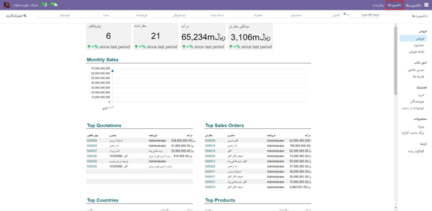
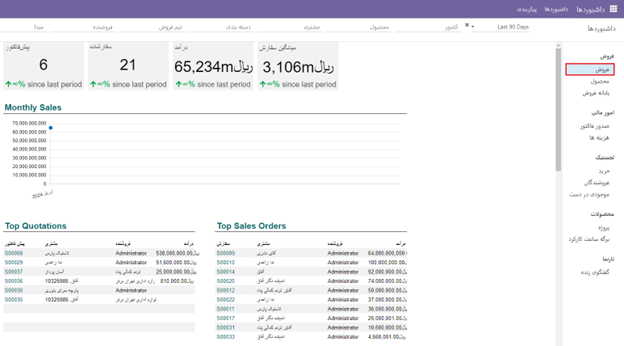
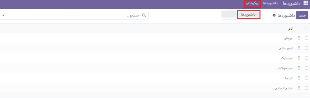
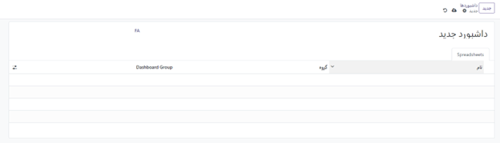
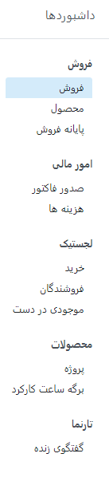
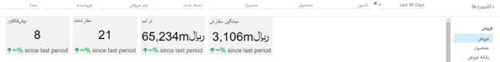
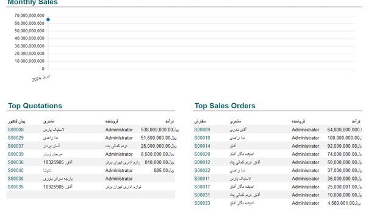
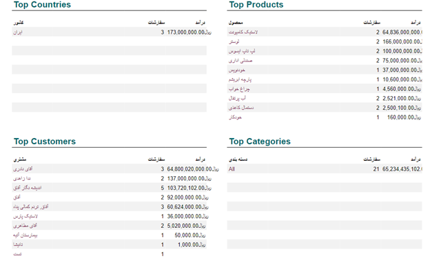
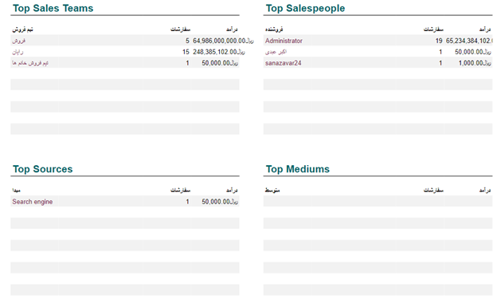
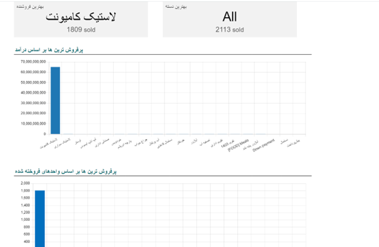

:nosearch:
:show-content:
:hide-page-toc:
:show-toc:

================
داشبورد
================

ماژول داشبورد پلتفرم Odoo برای ارائه یک محیط کاربری اطلاعاتی و کارآمد برای کاربران استفاده می‌شود. در این داشبورد، تمام اطلاعات مربوط به عملکرد عملیات شرکت با Odoo که نیازمندی‌های مختلفی را پوشش می‌دهد، در یک صفحه گردآوری شده و نمایش داده می‌شود. با افزودن منوهای سفارشی از ماژول‌های مختلف، می‌توانید به طور سریع و آسان به اطلاعات مورد نیاز دسترسی پیدا کنید و با نگاه کردن به این منوها، یک نگاه کامل به عملیات شرکت داشته باشید. همچنین، امکان پیکربندی نمای قابل تنظیم، به شما کمک می‌کند تا عملیات را با دسترسی آسان‌تر و بهتری اجرا کنید.

با نصب ماژول داشبورد، شما می‌توانید به سرعت و آسانی آن را باز کنید و دستورالعمل‌های مربوط به افزودن منوهای مختلف به داشبورد را دنبال کنید، همانطور که در تصویر نشان داده شده است.

پس از باز کردن داشبورد، شما می‌توانید به داشبوردهای مختلفی که اطلاعات بیشتری را ارائه می‌دهند دسترسی پیدا کنید. در سمت راست، داشبوردهایی وجود دارند که اطلاعات مربوط به فروش، محصولات، امور مالی، محل فروش، بازاریابی و موارد مشابه را نمایش می‌دهند. هر کاربر می‌تواند بر اساس نیاز و نوع اطلاعات مورد نیاز، داشبورد مورد نظر خود را ایجاد کند. همچنین، در بالای داشبورد، فیلترهایی برای فیلتر کردن داده‌های نمایش داده شده وجود دارد. این فیلترها امکان انتخاب و اعمال فیلترهای سفارشی را نیز فراهم می‌کنند.

در داشبورد، هر زمان که داده‌ها دارای فیلتری باشند و اگر هر یک از اسناد از آن فیلتر خارج شوند، به طور خودکار از داشبورد حذف می‌شوند. به عنوان مثال، اگر سفارشات شخصی فروش با وضعیت صورتحساب "برای فاکتور" به داشبورد اضافه شوند، هر زمان که فاکتور برای هر یک از این سفارشات ایجاد شود و وضعیت صورت‌حساب آن به "کاملاً فاکتور شده" تغییر کند، آن سفارش فروش به طور خودکار از داشبورد حذف می‌شود. به همین ترتیب، زمانی که یک سفارش فروش جدید با وضعیت صورتحساب "به صورت فاکتور" ایجاد می‌شود، به طور خودکار به داشبورد اضافه می‌شود تا اطلاعات به‌روز شده و نمایش داده شود. 

برای ایجاد داشبوردهای سفارشی، از ماژول "داشبورد"، به بخش "پیکربندی" رفته و سپس به قسمت "داشبورد" بروید. در این قسمت، شما می‌توانید تمام داشبوردهای موجود را مشاهده کرده و یک داشبورد سفارشی جدید ایجاد کنید. این به شما این امکان را می‌دهد که داشبوردهایی با اطلاعات دلخواه خود را ایجاد و پیکربندی کنید تا به نیازهای خاص شرکتتان بپردازد.

 با زدن دکمه جدید سمت راست بالا میتوان یک داشبورد جدید ایجاد کرد.

  ماژول داشبورد در اودو دارای چند بخش است:

فروش
--------

در بخش فروش میتوانید میانگین سفارش، درآمد، سفارشات و پیش فاکتور را در بخش بالا رویت کنید

همچنین در بخش فروش میتوانید به موارد زیر که در تصویر هم مشاهده میکنید دسترسی داشته باشید و با کلیک بر روی بخش موردنظر این بخش هارا مدیریت کنید.

- Monthly sales
- Top quotations 
- Top sales orders
- Top countries
- Top products
- Top customers
- Top categories
- Top sales teams
- Top sales people
- Top sources
- Top mediums

با کلیک روی گزینه "محصول" در ماژول داشبورد در قسمت فروش، می‌توان به جزئیات فروش هر محصول، شامل تعداد واحدهای فروخته شده، میزان درآمد، و میانگین قیمت فروش، دسترسی پیدا کرد.

با کلیک روی گزینه "پایانه فروش" در ماژول داشبورد در قسمت فروش، می‌توان به اطلاعات مربوط به پایانه‌های فروش، شامل تعداد فروشندگان و وضعیت هر پایانه فروش، دسترسی پیدا کرد.

در ماژول امور مالی، با کلیک روی گزینه "صدور فاکتور"، می‌توان به صفحه صدور فاکتور دسترسی پیدا کرد و فاکتورهای جدید صادر کرد.

با کلیک روی گزینه "هزینه‌ها"، می‌توان به جزئیات هزینه‌های مختلف مرتبط با فروش و تجارت دسترسی پیدا کرد و آن‌ها را مدیریت کرد.

در ماژول لجستیک، با کلیک روی گزینه "خرید"، می‌توان به اطلاعات مربوط به خریدهای انجام شده برای محصولات و لوازم مورد نیاز دسترسی پیدا کرد.

با کلیک روی گزینه "فروشندگان"، می‌توان به اطلاعات مربوط به فروشندگان مختلف و شرایط قراردادهایشان دسترسی پیدا کرد.

با کلیک روی گزینه "موجودی در دست"، می‌توان به اطلاعات مربوط به موجودی کالاها در دسترس در انبار و مکان‌های مختلف دسترسی پیدا کرد.

در ماژول محصولات، با کلیک روی گزینه "پروژه"، می‌توان به جزئیات مربوط به پروژه‌های مختلف و وضعیت آن‌ها دسترسی پیدا کرد.

با کلیک روی گزینه "برگه ساعت کارکرد"، می‌توان به اطلاعات مربوط به ساعت کارکرد و فعالیت‌های انجام شده در پروژه‌ها دسترسی پیدا کرد.

در ماژول تارنما، با کلیک روی گزینه "گفتگوی زنده"، می‌توان به ابزارها و امکانات مربوط به برقراری ارتباط زنده با مشتریان و کاربران دسترسی پیدا کرد.

تگ ها
--------- 

:guilabel:`#Dashboard Module`
:guilabel:`#Custom Menus`
:guilabel:`#Dashboard Installation`
:guilabel:`#Custom Dashboards`
:guilabel:`#Odoo Platform`
:guilabel:`#ماژول داشبورد`
:guilabel:`#پلتفرم Odoo`
:guilabel:`#نصب داشبورد`
:guilabel:`#افزودن منوها`
:guilabel:`#داشبوردهای سفارشی`

رفرنس ها
--------------------

1. https://www.cybrosys.com/odoo/odoo#books/v17
2. https://www.tashilgostar.com/documentation/16.0/applications
3. https://www.odoo.com/documentation/17.0/applications

