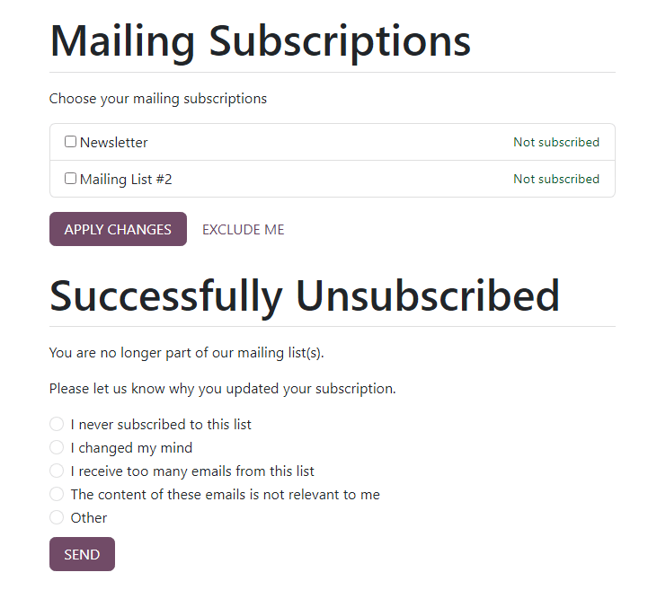
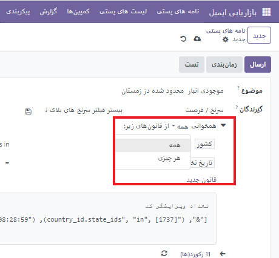

:nosearch:
:show-content:
:hide-page-toc:
:show-toc:

====================
پیکربندی
====================

مخاطبین را به لیست پستی اضافه کنید
---------------------------------------------

برای ایجاد مخاطبین پستی میتوانید مطابق عکس زیر عمل کنید.

.. image:: ./img/email6.png
    :alt: ایمیل
    :align: center

بعد از زدین گزینه **جدید** صفحه ی زیر باشده که شما می توانید لیستی از ایمیل ها را برای یک نفر ساخته و یا ویرایش کنید.برای این کار از *افزودن سطر* استفاده کنید.تا پنجره ایی باز شود و در نهایت *ذخیره و بستن* را فشار دهید.

.. image:: ./img/email7.png
    :alt: ایمیل
    :align: center

در صورت ورود مخاطبین به صورت انبوه به لیست ارسال ایمیلی مطابق عکس زیر روی چرخ دنده کلیک کنید،

ورود رکورد > دریافت نمونه فایل اکسل به صورت پیش فرض و سپس آن فایل را در سایت بارگذاری کنید.

بعد از تکمیل فرم اکسل و آپلود فایل به ترتیب با صفحات زیر روبه رو می شود. 

ابتدا روی گزینه **تست** تا مطمعن شویم همه چیز درست عمل میکند. سپس پس از آن **ورود** را انتخاب میکنیم تا فرم به سایت بارگذاری شود. در نهایت باید اطلاعات ایمیل افراد به صورت زیر نمایش داده شود. (علاوه بر درج ایمیل در فایل اکسل باید بگوییم در کدام عنوان وارد شوند، مثلا خبرنامه)

.. image:: ./img/email11.png
    :alt: ایمیل
    :align: center

تنظیمات
--------------------------

در صفحه تنظیمات ، چهار ویژگی در دسترس است.                              

ویژگی ها عبارتند از:
- کمپین های پستی : گزینه مدیریت کمپین های پستی انبوه را فعال می کند.
- 
- گزینه لیست سیاه هنگام لغو اشتراک : به گیرندگان این امکان را می دهد که در طول فرآیند لغو اشتراک، خود را از پست های بعدی در لیست سیاه قرار دهند.
- 
- سرور اختصاصی : گزینه ای را برای استفاده از یک سرور اختصاصی جداگانه برای ارسال پستی فراهم می کند. هنگامی که فعال می شود، Odoo یک فیلد (و پیوند) جدید را نشان می دهد، که در آن تنظیمات سرور خاص باید وارد شود تا به درستی به Odoo متصل شود.
- 
- گزارش های پستی آمار 24 ساعته : به کاربران این امکان را می دهد تا بررسی کنند که نامه ها یک روز پس از ارسال چقدر خوب عمل کرده اند.

پیوند لیست پستی به وب سایت
------------------------------------

هنگامی که یک لیست پستی در پایگاه داده ایجاد می شود، Odoo گزینه ای را برای پیوند مستقیم لیست پستی به وب سایت ساخته شده Odoo (ایجاد شده از طریق برنامه وب سایت Odoo ) ارائه می دهد.

برای پیوند دادن یک لیست پستی به یک وب سایت، به قسمت جلویی وب سایت بروید، که می تواند به روش های مختلفی در سرتاسر پایگاه داده انجام شود. مستقیم ترین راه برای دسترسی به بخش جلویی وب سایت این است که به سادگی برنامه وب سایت را از داشبورد اصلی Odoo باز کنید.
با انجام این کار، صفحه اصلی تعیین شده وب سایت ساخته شده توسط Odoo برای پایگاه داده آشکار می شود.

از قسمت جلویی وب سایت، روی دکمه ویرایش در گوشه سمت راست بالا کلیک کنید. وقتی روی آن کلیک می‌کنید، Odoo یک نوار کناری سمت راست را نشان می‌دهد، پر از بلوک‌های ساختمانی با کشیدن و رها کردن ، مملو از ویژگی‌ها، گزینه‌ها و عناصر طراحی مختلف.

سپس، در نوار جستجوی نوار کناری سمت راست، عبارت را جستجو کنید Newsletter. انتخاب بلوک های ساختمان خبرنامه برای افزودن فیلدهای اشتراک برای هر لیست پستی در وب سایت استفاده می شود .

مدیریت لغو اشتراک (لیست سیاه)
--------------------------------

ارائه قدرت به گیرندگان برای لغو اشتراک از لیست های پستی نه تنها یک روش تجاری هوشمندانه است، بلکه اغلب یک الزام قانونی است. اجازه دادن به گیرندگان برای لغو اشتراک از لیست پستی باعث ایجاد حس اعتماد و کنترل در بین مخاطبان می شود. همچنین به شرکت‌ها کمک می‌کند که واقعی‌تر و کمتر هرزنامه‌ای ظاهر شوند .

لغو اشتراک و لیست سیاه	
-----------------------

علاوه بر داشتن گزینه لغو اشتراک از لیست های پستی خاص، گیرنده همچنین می تواند خود را در طول فرآیند لغو اشتراک در لیست سیاه قرار دهد ، به این معنی که دیگر ایمیل های بازاریابی از پایگاه داده Odoo دریافت نخواهد کرد .
برای اینکه گیرندگان بتوانند خود را در لیست سیاه قرار دهند، باید یک ویژگی خاص در برنامه بازاریابی ایمیلی فعال شود .
ابتدا، ویژگی لیست سیاه باید فعال شود. برای این کار، وارد منوی بازاریابی با ایمیل ◄ پیکربندی ◄ تنظیمات شوید، و گزینه امکان انتخاب گزینه لیست سیاه به هنگام لغو اشتراک را فعال کرده و ذخیره کنید.
با فعال بودن این ویژگی، لینک لغو اشتراک در ارسال‌ها اضافه می‌‎شود. اگر گیرنده بر روی این لینک کلیک کند، اوکسیدو صفحه لغو اشتراک را باز می‌کند، و کاربر می‌تواند وضعیت اشتراک خود را در این صفحه مدیریت کند.

لغو اشتراک
-----------------------
به طور پیش فرض، یک پیوند لغو اشتراک در پایین همه الگوهای پستی ظاهر می شود.
اگر گیرنده‌ای روی پیوند لغو اشتراک در یک نامه پستی کلیک کند، Odoo فوراً اشتراک او را از لیست پستی لغو می‌کند، صفحه اشتراک‌های پستی را به آنها ارائه می‌دهد که در آن می‌توانند مستقیماً اشتراک‌های خود را مدیریت کنند و به آنها اطلاع می‌دهند که با موفقیت لغو اشتراک کرده‌اند .

در زیر آن، Odoo از مشترک سابق می‌خواهد که لطفاً به ما اطلاع دهید که چرا اشتراک خود را به‌روزرسانی کرده‌اید ، و کاربر می‌تواند دلیل انصراف مناسب را از میان مجموعه‌ای از گزینه‌های ارائه شده انتخاب کند.

 توجه داشته باشید
گزینه های پاسخ انصراف را می توان با پیمایش به برنامه بازاریابی ایمیلی ‣ پیکربندی ‣ دلایل انصراف ایجاد و اصلاح کرد .

هنگامی که آنها دلیل انصراف مناسب را از بین گزینه های ارائه شده به آنها انتخاب کردند، می توانند روی دکمه ارسال کلیک کنند . سپس Odoo دلایل خود را برای لغو اشتراک در برنامه بازاریابی ایمیلی برای تجزیه و تحلیل آینده ثبت می کند.

آدرس های ایمیل در لیست سیاه
برای مشاهده لیست کامل همه آدرس‌های ایمیل در لیست سیاه، به برنامه بازاریابی ایمیلی ◄ پیکربندی ◄ آدرس‌های ایمیل در لیست سیاه بروید .

هنگامی که یک رکورد در لیست سیاه از این لیست انتخاب می شود، Odoo یک صفحه جداگانه با اطلاعات تماس گیرنده، همراه با دلیل ارائه شده برای انتخاب خود در لیست سیاه نشان می دهد.

 **توجه داشته باشید**

**ایمیل‌های لیست سیاه از همه پست‌های بازاریابی مستثنی هستند، با این حال، این ایمیل‌ها همچنان می‌توانند ایمیل‌های تراکنشی مانند تأیید سفارش، اعلان‌های حمل و نقل و غیره را دریافت کنند**.

.. example:: 
     یک انبار کالاهای باقیمانده از تعداد محدودی از اقلام سال گذشته دارد. برای کمک به پاک کردن موجودی اضافی، مدیر انبار یک ایمیل سرنخ‌های گمشده ایجاد می‌کند تا به فرصت‌های قدیمی از دست رفته دسترسی پیدا کند و به آنها اطلاع دهد که کالای محدود موجود است.
    مدیر انبار از فیلترهای زیر برای ایمیل سرنخ های گم شده استفاده می کند:

    .. image:: ./img/email15.png

        
**نکته**
همانطور که فیلترها اضافه و حذف می شوند، به مقدار رکورد(های) # در زیر بخش فیلترینگ توجه کنید . این مقدار تعداد کل رکوردهایی را نشان می دهد که با معیارهای فعلی مطابقت دارند.
برای مشاهده لیستی از تمام رکوردهای منطبق، روی متن # رکورد(ها) کلیک کنید .

فیلترهای لازم را اضافه کنید
-------------------------------------

شما می توانید از طریق ماژول بازاریابی به سرنخ خای موجود و یا فرصت های فروشی که دارید با استفاده از قوانینی که خودتان تعریف میکنید ایمیل پستی ارسال کنید.

نتایج را تجزیه و تحلیل کنید

پس از ارسال ایمیل فعال سازی مجدد سرنخ های گمشده، تیم های بازاریابی می توانند از دکمه های هوشمند در بالای ایمیل برای تجزیه و تحلیل نتایج و تعیین اقدامات بعدی استفاده کنند.
با کلیک بر روی هر یک از دکمه‌های هوشمند، فهرستی از رکوردهای مطابق با معیارهای خاص آن دکمه باز می‌شود.

- ارسال شده : تعداد کل ایمیل های ارسال شده.
  
- Opened : درصدی از گیرندگانی که ایمیل را باز کردند.
  
- پاسخ داده شده : درصدی از گیرندگانی که به ایمیل پاسخ دادند.
  
- کلیک شده : نرخ کلیک (%) گیرندگانی که روی پیوندی در ایمیل کلیک کردند.
  
- سرنخ‌ها/فرصت‌ها : تعداد سرنخ‌ها (یا فرصت‌هایی) که در خط لوله CRM در نتیجه کمپین ایمیل ایجاد شده‌اند 
  
- نقل قول ها : تعداد نقل قول هایی که در برنامه فروش در نتیجه ایمیل ایجاد شده است.

- صورتحساب : کل درآمدهای ایجاد شده، در نتیجه کمپین ایمیل، از طریق فاکتورهای ارسال شده و پرداخت شده توسط مشتریان. بسته به اینکه کدام برنامه در پایگاه داده نصب شده باشد، این مقادیر در برنامه صورتحساب یا حسابداری ثبت می شوند.
  
- دریافت شده : درصدی از گیرندگانی که ایمیل را دریافت کرده اند.
  
- Bounced : درصد ایمیل‌هایی که برگشت کرده‌اند( تحویل نشده‌اند ).
  
- نادیده گرفته شده : تعداد گیرندگانی که ایمیل را دریافت کرده‌اند، اما به شیوه‌ای معنی‌دار با آن ارتباط برقرار نکرده‌اند (یعنی باز شده، کلیک کرده‌اند، و غیره).

**پرورش ایمیل
**
پرورش ایمیل (گاهی اوقات به عنوان پرورش سرنخ نیز شناخته می شود ) فرآیند ارسال یک سری ایمیل های به موقع و مرتبط برای ارتباط با یک سرنخ، ایجاد یک رابطه عمیق تر و در نهایت تبدیل سرنخ به فروش است.
هدف پرورش این است که کمپین ایمیل را "مشاهده" یا در بالای صندوق ورودی یک سرنخ نگه دارید، تا زمانی که آنها برای خرید آماده شوند.
رویکردهای زیادی برای پرورش موثر سرب وجود دارد، اما اغلب شامل موارد زیر است:
- ارسال یک ایمیل اولیه (مانند ایمیل فعال سازی مجدد سرنخ های گم شده).
- ارسال یک ایمیل بعدی هر هفته (یا بر اساس محرک های خاص) برای مدت زمان کمپین.
- تجزیه و تحلیل مداوم نتایج برای یادگیری اینکه چه رویکردهایی منجر به فروش شده است.
- به طور مداوم رویکرد را تنظیم کنید تا در بالای صندوق ورودی سرنخ "مشاهده" بماند و امیدواریم پاسخ معناداری از سرنخ دریافت کنید.
با پیشرفت کمپین، یک تیم بازاریابی ممکن است بسته به نحوه پاسخگویی یک سرنخ در هفته قبل، ایمیل‌های بعدی مختلفی ارسال کند.

**مثال**
یک تیم بازاریابی می‌خواهد با دلیل از دست دادن موجودی کافی، ذخیره‌سازی مجدد کالاهای محدود را برای همه مشتریان تبلیغ کند . آن‌ها کمپین سه هفته‌ای زیر را توسعه می‌دهند.

- هفته 1: تیم بازاریابی یک ایمیل اولیه با موضوع ارسال می کند: «کالاهای محدود موجود است! همین الان عمل کن!"
- هفته 2: تیم بازاریابی بسته به نحوه پاسخگویی یک سرنخ، دو ایمیل مختلف ارسال می کند.
  
o	اگر یک سرنخ ایمیل هفته اول را نادیده گرفت: «ذخایر تقریبا تمام شده است، آیا شما مال خود را دریافت کردید؟»

o	اگر سرنخ روی ایمیل هفته اول کلیک کرد: «هنوز وقت دارید که این را به مجموعه خود اضافه کنید»

- هفته 3: تیم بازاریابی یک ایمیل نهایی را برای همه مشتریانی که تبدیل نشده اند ارسال می کند و می گوید: "20٪ تخفیف، آخرین فرصت خود را برای دریافت این موارد قبل از اینکه از بین بروند از دست ندهید!"
در طول کمپین، تیم بازاریابی به طور مداوم به دکمه‌های هوشمند در بالای صفحه پستی اشاره می‌کند تا ببیند چند درصد از سرنخ‌ها باز می‌شوند، روی ایمیل‌ها کلیک می‌کنند یا نادیده می‌گیرند. آنها همچنین به طور منظم گزارش هایی را در مورد تعداد فرصت ها، نقل قول ها و فاکتورهایی که توسط کمپین ایجاد شده است، تجزیه و تحلیل می کنند.

لینک ها:

1.	https://www.odoo.com/documentation/17.0/applications/marketing/email_marketing/lost_leads_email.html#email-marketing-recipients-field

2.	https://oxydoo.com/blog/guide-28/email-marketing-270

تگ ها:

1.  :guilabel:`#بازاریابی_ایمیلی`
   
2.  :guilabel:`#محتوا_بازاریابی`
   
3.  :guilabel:`#تبلیغات_ایمیلی`
   
4.  :guilabel:`#طراحی_ایمیل`
   
5.  :guilabel:`#سیستم_مدیریت_ایمیل`
    
6.  :guilabel:`#فروش_ایمیلی`
    
7.  :guilabel:`#EmailMarketing`
    
8.  :guilabel:`#ContentMarketing`
    
9.  :guilabel:`#EmailStrategy`
    
10. :guilabel:`#EmailDesign`
    
11. :guilabel:`#A/BTesting`

