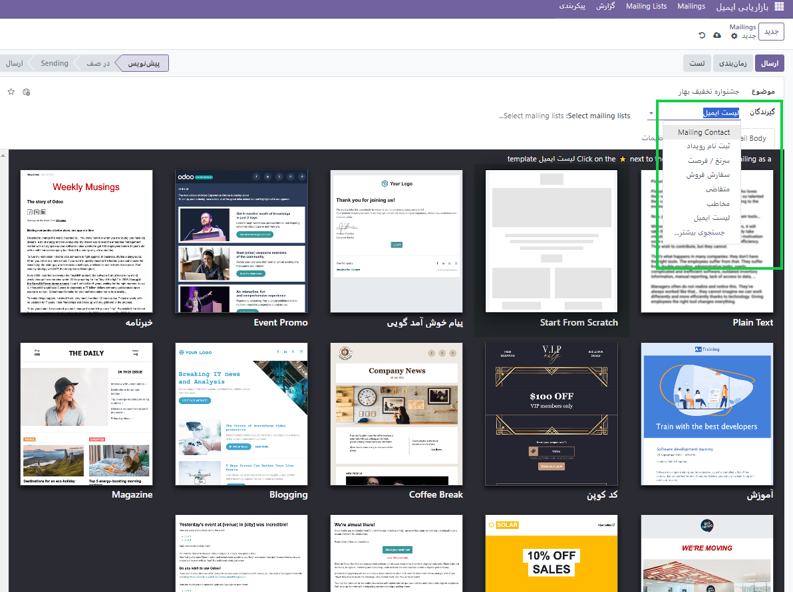

:nosearch:
:show-content:
:hide-page-toc:
:show-toc:

====================
ایمیل های پستی
====================

برای ارتباطات قبل و بعد از فروش از  ماژول ** بازاریابی ایمیلی** استفاده می شود.

نمای فهرستی

نمای فهرست، که با نماد ☰ (خطوط افقی) در گوشه سمت راست بالا نمایش داده می شود، نمای پیش فرض داشبورد Mailings در برنامه بازاریابی ایمیلی است .
در نمای لیست، ستون هایی به جنبه های مختلف اطلاعات مربوط به ایمیل های فهرست شده اختصاص داده شده است. آن ستون ها به شرح زیر است:

- تاریخ : تاریخی که ایمیل ارسال شد.
- موضوع : موضوع ایمیل.
- مسئول : کاربری که ایمیل را ایجاد کرده یا کاربری که به ایمیل اختصاص داده شده است.
- ارسال شده : چند بار ایمیل ارسال شده است.
- تحویل (%) : درصد ایمیل های ارسالی که با موفقیت تحویل داده شده اند.
- باز شده (%) : درصد ایمیل های ارسالی که توسط گیرندگان باز شده است.
- کلیک شده (%) : درصد ایمیل های ارسال شده که توسط گیرندگان کلیک شده است.
- پاسخ داده شده (%) : درصد ایمیل های ارسال شده که توسط گیرندگان به آنها پاسخ داده شده است.
- وضعیت : وضعیت ایمیل ( پیش نویس ، در صف ، یا ارسال شده ).

.. image:: ./img/email0.png
    :alt: ایمیل
    :align: center

نمای کانبان

در نمای کانبان(حالت های نمایش)، اطلاعات ایمیل در مراحل مختلف نمایش داده می شود.
مراحل عبارتند از: پیش نویس ، در صف ، ارسال و ارسال شده .
- پیش نویس : ایمیل هنوز در حال نوشتن/ایجاد است.
- در صف : ایمیل قرار است در تاریخ دیگری ارسال شود.
- ارسال : ایمیل در حال حاضر برای گیرندگان ارسال می شود.
- ارسال شده : ایمیل قبلاً برای گیرندگان ارسال شده است.

یک ایمیل بسازید
---------------------------
برای ایجاد یک لیست پستی در برنامه بازاریابی ایمیلی ، به برنامه بازاریابی ایمیلی ◄ لیست های پستی ◄ لیست های پستی ◄   جدید بروید .
در فرم ایمیل، فیلدهایی برای موضوع و گیرندگان ایمیل وجود دارد.
در زیر آن، سه برگه وجود دارد: بدنه ایمل ، A/B Tests و تنظیمات .
موضوع
ابتدا یک موضوع برای ایمیل وارد کنید. موضوع در صندوق ورودی گیرندگان قابل مشاهده است و به آنها این امکان را می دهد که به سرعت ببینند پیام در مورد چیست .

.. important:: توجه داشته باشید
    فیلد موضوع اجباری است. ایمیل بدون موضوع ارسال نمی شود .

*گیرندگان*

در زیر فیلد موضوع در فرم ایمیل، فیلد گیرندگان قرار دارد . در این قسمت گیرندگان ایمیل را انتخاب کنید. به طور پیش فرض، گزینه  لیست ایمیل  انتخاب شده است، اما با کلیک بر روی فیلد، منوی کشویی سایر گزینه های گیرنده نمایش داده می شود.
با انتخاب گزینه پیش‌فرض فهرست پستی ، یک لیست پستی خاص باید از منوی کشویی فیلد انتخاب فهرست‌های پستی مجاور انتخاب شود .

.. note:: نکته
    بیش از یک لیست پستی را می توان از قسمت انتخاب لیست های پستی انتخاب کرد .

گزینه نمایش در تنظیمات به گیرندگان اجازه می‌دهد در صفحه لغو اشتراک به این لیست دسترسی داشته باشند و گزینه‌های مختلف اشتراک خود را تغییر دهند.
بعد از پیکربندی، لیست ایمیل ایجاد شده را ذخیره کنید؛ با این کار اکسیدو لیست ایجاد شده را به صورت خودکار به صفحه لیست‌های ارسال اضافه می‌کند.

در عکس فوق از منوی کشویی می توانیم انتخاب کنیم که این ایمیل به دسته ی چه افرادی ارسال شود.

**بدنه ایمیل**

در این قسمت می توانید به صورت پیش فرض یک ایمیل آماده انتخاب کنید و آن را به صورت شخصی سفارشی سازی کنید. 

    :align: center

