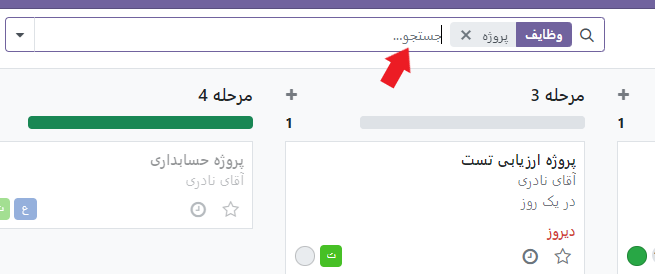

:nosearch:
:show-content:
:hide-page-toc:
:show-toc:

====================
جستجو و فیلتر رکوردها
====================

با توجه به نمایی که از آن استفاده می‌کنید، ادو با اعمال فیلترها، به شما کمک می‌کند تا رکوردهای مرتبط‌تر را پیدا کنید و نمایش دهید. اگر می‌خواهید فیلتر پیش‌فرض را ویرایش کنید یا به دنبال مقادیر خاصی بگردید، این امکان برای شما فراهم است.

فیلترهای پیش‌ساخته
-------------------------

 در صورت لزوم، با کلیک بر روی فیلترها و انتخاب یک یا چند فیلتر پیش‌ساخته، می‌توانید مجموعه رکوردهایی که به طور پیش‌فرض نمایش داده می‌شوند را ویرایش کنید.

.. tip::
    اگر فیلترهای پیش‌ساخته دیگری را انتخاب کنید که از همان گروه هستند (یعنی با خط افقی جدا نشده‌اند)، رکوردهایی که با هر شرطی مطابقت داشته باشند نمایش داده می‌شوند. اما اگر از گروه‌های مختلف فیلترها انتخاب کنید، رکوردها باید با همه شرایط مطابقت داشته باشند.

فیلترهای سفارشی
------------------------------

می‌توانید با افزودن فیلترهای سفارشی با استفاده از فیلدها، عملگرها، و مقادیر مورد نظر خود، فیلترهای دلخواه خود را ایجاد کنید. 

.. image:: ./img/filter1.png
    :alt: فیلتر
    :align: center

.. example::
    فرض کنید بخواهیم تعداد تسک هایی که از موعد زمانش آن گذشته باشد را نمایش دهیم مانند تصویر زیر باید شرط آن را بنویسیم

    .. image:: ./img/filter2.png
    :alt: فیلتر
    :align: center

.. note::
    اگر رکوردها باید با یک یا چند شرط مطابقت داشته باشند، قبل از اعمال فیلترهای سفارشی، افزودن شرط را کلیک کنید. اما اگر رکوردها باید با همه شرایط مطابقت داشته باشند، فیلترهای سفارشی را تک به تک اعمال کنید.

جستجوی مقادی
------------------------

شما می‌توانید سریعاً مقادیر مورد نظر خود را جستجو و اعمال کنید، سپس آن‌ها را به عنوان فیلترها انتخاب کنید

