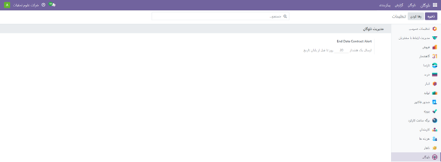

شروع کار با ماژول ناوگان
-------

منوی پیکربندی
--------------
این بخش شامل تمام پیکربندی‌ها و تنظیمات برنامه ناوگان را فراهم می‌کند، از جمله تنظیمات، سازندگان، مدل‌های خودرو و دسته‌بندی مدل‌ها.

 تنظیمات
----------
برای دسترسی به منوی تنظیمات، ابتدا به برنامه ناوگان رفته و سپس از قسمت پیکربندی، وارد صفحه تنظیمات می‌شویم.
یکی از تنظیمات مهم که نیاز به پیکربندی دارد، هشدار تاریخ پایان قرارداد خودرو است. مانند شکل زیر، می‌توانید برای خود یک هشدار برای تاریخ پایان قرارداد خود تنظیم کنید. این فیلد، زمانی را مشخص می‌کند که یک هشدار برای افراد مسئول قراردادهای خودرو ارسال می‌شود. افراد مسئول ایمیلی دریافت می‌کنند که به آنها اطلاع می‌دهد که قرارداد خودرو در حال اتمام است. زمانی که ایمیل ارسال می‌شود نیز در این قسمت تعیین می‌شود، به عنوان مثال در تصویر زیر نشان داده شده است که ۲۰ روز قبل از تاریخ پایان، هشدار ارسال شود.
 

    نکته: برای تعیین اینکه چه کسی مسئول یک قرارداد است، باید یک قرارداد فردی باز کنید. شخصی که در بخش اطلاعات قرارداد به عنوان مسئول ذکر شده است، کسی است که هشدار را دریافت می‌کند.
برای دسترسی به قراردادها، به برنامه ناوگان بروید و از قسمت "ناوگان قراردادها" را انتخاب کنید. سپس برای مشاهده قرارداد، روی آن کلیک کنید.
مدل‌ها

سازنده‌ها
------------
در ناوگان اودو، شصت و شش سازنده خودروهای رایج در پایگاه داده به همراه آرم‌های آنها از پیش پیکربندی شده است. برای مشاهده سازنده‌های پیش بارگذاری شده، به برنامه ناوگان رفته و سپس از قسمت "پیکربندی سازنده‌ها" را انتخاب می‌کنیم.
سازنده‌ها در یک لیست به ترتیب حروف الفبا ظاهر می‌شوند. کارت هر سازنده لیست می‌کند که چند مدل خاص برای هر سازنده خاص پیکربندی شده است. به عنوان مثال، در تصویر زیر، سازنده BMW دارای ۱۱ مدل است.
 
برای افزودن یک سازنده جدید به پایگاه داده، ابتدا روی دکمه "جدید" کلیک کنید تا یک فرم سازنده خالی باز شود.
سپس، نام سازنده را در قسمت "نام" وارد کنید. این تنها فیلد الزامی است.
در مرحله بعد، اگر عکسی در دسترس است، نشانگر را روی کادر تصویر نگه دارید و روی نماد مداد (✏️) که در گوشه پایین سمت راست ظاهر می‌شود کلیک کنید. این کار باز یک پنجره جستجوی فایل را فراهم می‌کند.
نکته: با وارد کردن داده‌ها، فرم سازنده به طور خودکار ذخیره می‌شود. با این حال، فرم را می‌توان به صورت دستی در هر زمان با کلیک بر روی گزینه "Save manually" ذخیره کرد که با نماد ابر با فلش رو به بالا نمایش داده می‌شود.
 
.. image:: ./src/img/analysis_device.jpg
    :alt: دستگاه آنالیز بدن ویراوب123 
    :align: center

 مدل‌ها
--------------
بسیاری از تولید کنندگان مدل‌های متنوعی دارند که تولید می‌کنند. اودو با مدل‌های ماشین از پیش پیکربندی شده از چهار خودروساز بزرگ عرضه می‌شود: آئودی، بی ام و، مرسدس بنز و اوپل. اگر خودرویی غیر از مدل‌های از پیش پیکربندی شده این سازندگان بخشی از ناوگان باشد، مدل (و/یا سازنده) باید به پایگاه داده اضافه شود.
افزودن یک مدل جدید
مدل‌های جدید خودرو را می‌توان به راحتی به پایگاه داده اضافه کرد. برای افزودن یک مدل جدید، به برنامه ناوگان رفته و سپس از قسمت "پیکربندی مدل‌ها" را انتخاب می‌کنیم. سپس روی دکمه "جدید" در گوشه سمت راست بالا کلیک می‌کنیم و فرم مدل خودروی خالی باز می‌شود.
 
اطلاعات زیر را در فرم وارد کنید:
نکته: برخی از فیلدها یا بخش ها بر اساس تنظیمات محلی سازی شرکت هستند، بنابراین ممکن است همه فیلدها یا بخش ها قابل مشاهده نباشند.
با توجه به تصویر زیر مانند راهنمای زیر عمل کنید
 
مدل: نام مدل خودرو را در فیلد مربوطه وارد کنید.
سازنده: از منوی کشویی، سازنده خودرو را انتخاب کنید. اگر لوگوی مربوط به سازنده پیکربندی شده باشد، آن به طور خودکار در کادر تصویر در گوشه سمت راست بالا بارگیری می‌شود. اگر سازنده قبلاً پیکربندی نشده باشد، نام آن را تایپ کرده و سپس روی "ایجاد" کلیک کنید تا سازنده را اضافه کنید.
نوع خودرو: از منوی کشویی، یکی از دو نوع خودرو از پیش پیکربندی شده، خودرو یا دوچرخه را انتخاب کنید. انواع خودروها در Odoo کدگذاری شده‌اند و با برنامه حقوق و دستمزد یکپارچه شده‌اند، زیرا وسایل نقلیه می‌توانند بخشی از مزایای کارمند باشند. افزودن انواع خودروهای اضافی ممکن نیست زیرا بر حقوق و دستمزد تأثیر می‌گذارد.
دسته: دسته‌ای را که خودرو تحت آن دسته‌بندی شده است را از منوی کشویی انتخاب کنید. برای ایجاد یک دسته‌بندی جدید، نام دسته را تایپ کرده و سپس روی "ایجاد دسته جدید" کلیک کنید.
حالا برای قسمت بعدی، به تصویر زیر توجه کرده و باقی اطلاعات را وارد کنید.

برگه اطلاعات
------------
 
مدل
---------
- شماره صندلی: تعداد مسافرانی که خودرو قادر به جابجایی آن‌ها است را وارد کنید.
- شماره درب: تعداد درهای خودرو را وارد کنید.
- رنگ: رنگ خودرو را وارد کنید.
- سال مدل: سال تولید خودرو را وارد کنید.
- اتصال تریلر: اگر خودرو دارای اتصال تریلر است، این گزینه را علامت بزنید.
- ارزش کاتالوگ (با احتساب مالیات بر ارزش افزوده): قیمت MSRP خودرو را در زمان خرید یا اجاره وارد کنید.

موتور
-----------
- نوع سوخت: نوع سوخت مورد استفاده خودرو را از منوی کشویی انتخاب کنید. مثال: دیزل، بنزین، فول هیبریدی، و غیره.
- انتشار CO2: میزان میانگین انتشار دی اکسید کربنی که خودرو تولید می‌کند را بر حسب گرم در کیلومتر وارد کنید.
- استاندارد CO2: مقدار استاندارد دی اکسید کربن را بر حسب گرم در هر کیلومتر برای یک خودرو با اندازه مشابه وارد کنید.
- گیربکس(انتقال): نوع گیربکس را از منوی کشویی انتخاب کنید، دستی یا اتوماتیک.
- قدرت: توان مورد استفاده خودرو را بر حسب کیلووات وارد کنید.
- اسب بخار: اسب بخار خودرو را وارد کنید.
- مالیات بر اسب بخار: مقدار مالیات بر اساس اندازه موتور خودرو را وارد کنید.
- کسر مالیات: این فیلد به طور خودکار با توجه به مشخصات موتور پر می‌شود و قابل تغییر نیست.

برگه فروشندگان:
- فروشندگان: فروشندگان خاص خودرو که می‌توانند مدل خاص خودرو را فروش کنند، در این بخش فهرست می‌شوند. برای افزودن فروشنده، روی دکمه "افزودن" کلیک کنید.
 
با کلیک بر روی کادر انتخاب در سمت راست نام فروشنده، یک پنجره پاپ آپ با لیستی از تمام فروشندگان موجود در پایگاه داده بارگذاری می‌شود. سپس، فروشنده مورد نظر خود را برای افزودن انتخاب کنید و روی "انتخاب" کلیک کنید. توجه داشته باشید که هیچ محدودیتی برای تعداد فروشندگانی که می‌توانید به این لیست اضافه کنید وجود ندارد، بنابراین شما می‌توانید تعداد دلخواهی از فروشندگان را انتخاب کنید.
 
اگر فروشنده ای در پایگاه داده نیست، با کلیک بر روی دکمه جدید در پایین پنجره پاپ آپ، یک فروشنده اضافه کنید.
 
با پر کردن اطلاعات مربوط به تب‌های مختلف، روی دکمه "ذخیره و بستن" کلیک کنید تا فروشنده انتخاب شده اضافه شود و پنجره بسته شود. همچنین می‌توانید روی دکمه "ذخیره و جدید" کلیک کنید تا اطلاعات فروشنده فعلی ذخیره شود و یک فروشنده جدید ایجاد شود.
در تب "تماس‌ها و نشانی"، روی دکمه "افزودن" کلیک کنید تا فرمی مشابه تصویر زیر باز شود و اطلاعات تماس و نشانی را وارد کنید. سپس پس از پر کردن اطلاعات، روی دکمه "ذخیره" یا "ثبت" کلیک کنید.
 
در تب "خرید و فروش"، می‌توانید اطلاعات مربوط به فروش و خرید را وارد کنید، شامل جزئیات مانند مبلغ، تاریخ، وضعیت پرداخت و موارد مشابه. در تصویر زیر می‌توانید مثالی از این تب را مشاهده کنید.

در تب "صدور فاکتور"، می‌توانید اطلاعات مربوط به حساب‌های بانکی و فاکتور را وارد کنید، از جمله شماره فاکتور، تاریخ صدور، جزئیات پرداخت و موارد مشابه.

در تب "یادداشت‌ها"، می‌توانید یادداشت‌هایی را که قرار است به فروشنده مربوطه ارسال شود، وارد کنید.

دسته بندی ها
-------------
برای بهترین سازماندهی ناوگان، توصیه می‌شود مدل‌های خودرو را در دسته‌های خاصی قرار دهید تا به راحتی ببینید که چه نوع وسایل نقلیه در ناوگان وجود دارد.
در Odoo، ما هیچ دسته‌ای از پیش تعیین شده نداریم. بنابراین، برای سازماندهی بهتر، باید همه دسته‌ها را اضافه کنید. برای مشاهده و اضافه کردن دسته‌ها، به برنامه ناوگان بروید و از بخش پیکربندی، دسته‌بندی را انتخاب کنید. در اینجا، تمام دسته‌های پیکربندی‌شده در یک نمای فهرست نمایش داده می‌شوند.
برای اضافه کردن دسته جدید، روی دکمه "جدید" در گوشه بالا سمت راست کلیک کنید. یک خط ورودی جدید در پایین لیست ظاهر می‌شود. نام دسته جدید را وارد کنید و سپس کلید Enter را فشار دهید یا روی هر نقطه‌ای از صفحه کلیک کنید تا ورودی ذخیره شود.
برای تغییر ترتیب ظاهر شدن دسته‌ها در لیست، روی شش کادر کوچک خاکستری در سمت راست دسته مورد نظر کلیک کنید و آن را به موقعیت دلخواه بکشید. ترتیب لیست تأثیری بر پایگاه داده ندارد، اما ممکن است بخواهید دسته‌ها را بر اساس معیارهای خاصی مثل اندازه یا تعداد مسافران مرتب کنید.
 
وسایل نقلیه جدید
---------------
ماژول ناوگان در Odoo، تمامی وسایل نقلیه و اسناد مرتبط با نگهداری خودرو و سوابق رانندگان را مدیریت می‌کند.
وقتی برنامه ناوگان را باز می‌کنید، تمام خودروها در داشبورد خودروها نمایش داده می‌شوند. این داشبورد پیش‌فرض برنامه ناوگان است و هر خودرو بر اساس وضعیت خود در مراحل مختلف کانبان نمایش داده می‌شود. این مراحل شامل "درخواست جدید"، "برای سفارش"، "ثبت شده" و "کاهش رتبه(downgraded)" می‌باشند.
 

برای افزودن یک خودرو جدید به ناوگان، از صفحه خودروها، روی دکمه "جدید" در گوشه سمت راست بالا کلیک کنید و یک فرم خودرو خالی بارگیری می‌شود. سپس اطلاعات مربوط به خودرو را در فرم خودرو وارد کنید.
 
با وارد کردن داده، فرم به صورت خودکار ذخیره می‌شود. اما در هر زمان، شما می‌توانید فرم را به صورت دستی ذخیره کنید. برای این کار، کافیست روی گزینه "ذخیره دستی" که با نماد ابری در گوشه سمت راست بالای صفحه نمایش داده شده است، کلیک کنید.
 
فیلدهای فرم خودرو عبارتند از:
مدل: از منوی کشویی مدل خودرو را انتخاب کنید. در صورتی که مدل مورد نظر در لیست نباشد، نام مدل را تایپ کنید و روی گزینه "ایجاد مدل" یا "ایجاد و ویرایش..." کلیک کنید تا یک مدل جدید ایجاد شود و جزئیات آن ویرایش شود.
پلاک: شماره پلاک خودرو را در این قسمت وارد کنید.
برچسب‌ها: از منوی کشویی برچسب‌ها را انتخاب کنید یا یک برچسب جدید تایپ کنید. تعداد برچسب‌های قابل انتخاب هیچ محدودیتی ندارد.
نکته: مدل تنها فیلد الزامی در فرم خودروی جدید است. وقتی یک مدل انتخاب می‌شود، سایر فیلدها در فرم خودرو ظاهر می‌شوند و اطلاعات مربوطه فیلدهایی را که برای آن مدل اعمال می‌شوند به‌طور خودکار پر می‌شوند. اگر برخی از فیلدها ظاهر نشدند، ممکن است نشان دهد که هنوز مدلی انتخاب نشده است.
 
بخش راننده
---------------
این بخش از فرم خودرو مربوط به شخصی است که در حال حاضر در حال رانندگی ماشین و همچنین هر برنامه ای برای تغییر راننده در آینده است.
 
راننده:
- از منوی کشویی راننده را انتخاب کنید، یا نام یک راننده جدید را تایپ کنید.
- برای ایجاد یک راننده جدید، روی گزینه "ایجاد 'راننده'" یا "ایجاد و ویرایش..." کلیک کنید.
- توجه داشته باشید که لازم نیست یک راننده کارمند باشد. هنگام ایجاد یک راننده جدید، راننده به برنامه ناوگان اضافه می‌شود، نه به برنامه کارمندان.
- اگر برنامه "Contacts" نصب شده باشد، اطلاعات راننده نیز در برنامه "Contacts" ذخیره می‌شود.
Mobility Card:
- اگر راننده دارای کارت تحرک در کارت کارمند خود در برنامه "Employees" باشد، شماره کارت تحرک در این قسمت نمایش داده می‌شود.
- اگر هیچ کارت تحرکی در لیست وجود ندارد، باید سابقه کارمند را در برنامه "Employees" ویرایش کنید.
راننده آینده:
- از منوی کشویی راننده بعدی را انتخاب کنید، یا نام یک راننده بعدی را تایپ کنید.
- برای ایجاد یک راننده آینده جدید، روی گزینه "ایجاد 'راننده آینده'" یا "ایجاد و ویرایش..." کلیک کنید.
Plan To Change Car:
- اگر راننده فعلی قصد دارد خودروی خود را تغییر دهد، این کادر را علامت بزنید.
- در صورتی که راننده فعلی قصد تغییر خودرو خود را ندارد، این کادر را علامت نزنید.
تاریخ واگذاری:
- از تقویم کشویی، زمانی را انتخاب کنید که خودرو برای راننده دیگری در دسترس باشد.
- اگر این قسمت خالی بماند، نشان می‌دهد که خودرو در حال حاضر در دسترس است و می‌توان آن را به راننده دیگری اختصاص داد.
شرکت:
- از منوی کشویی شرکت مربوطه را انتخاب کنید.
ایجاد یک راننده جدید
اگر راننده از قبل در سیستم نیست، ابتدا باید راننده جدید پیکربندی و به پایگاه داده اضافه شود. یک راننده جدید را می توان از فیلدهای راننده یا راننده آینده در فرم خودرو اضافه کرد .

برای ایجاد یک راننده جدید، ابتدا نام راننده را در بخش "راننده" یا "راننده آینده" وارد کنید، سپس روی "ایجاد و ویرایش" کلیک کنید. این کار فرم "ایجاد راننده" یا "ایجاد راننده آینده" را باز می‌کند، که هر دوی آن‌ها مشابه هستند.
اطلاعات کلی(خودرو)
در این بخش اطلاعات تکمیلی مربوطه را وارد میکنیم
 
فردی یا شرکتی : انتخاب کنید راننده ای که اضافه می شود راننده فردی باشد یا یک شرکت. برای انتخاب روی دکمه رادیویی کلیک کنید.
نام : نام راننده یا شرکت را در این قسمت وارد کنید.
نام شرکت… : با استفاده از منوی کشویی، شرکتی را که راننده با آن مرتبط است انتخاب کنید.
اگر دکمه رادیویی شرکت در بالای فرم انتخاب شده باشد، این فیلد ظاهر نمی شود.
تماس : اطلاعات تماس را در این قسمت وارد کنید.
در صورت تمایل، قسمت تماس را می توان به نوع دیگری از مخاطب تغییر داد. برای نمایش منوی کشویی روی Contact کلیک کنید. گزینه های موجود برای انتخاب عبارتند از تماس ، آدرس صورتحساب ، آدرس تحویل ، آدرس پیگیری ، یا آدرس دیگر .
در صورت تمایل یکی از این گزینه های دیگر را برای قسمت تماس انتخاب کنید و اطلاعات مربوطه را وارد کنید.
اگر دکمه رادیویی شرکت در بالای فرم انتخاب شده باشد، این فیلد دارای برچسب آدرس است و قابل تغییر نیست.
شناسه مالیاتی : شناسه مالیاتی راننده یا شرکت را در این قسمت وارد کنید.
موقعیت شغلی : موقعیت شغلی راننده را در این قسمت وارد کنید. اگر دکمه رادیویی شرکت در بالای فرم انتخاب شده باشد، این فیلد ظاهر نمی شود.
تلفن : در این قسمت شماره تلفن راننده یا شرکت را وارد کنید.
موبایل : در این قسمت شماره موبایل راننده یا شرکت را وارد کنید.
ایمیل : آدرس ایمیل راننده یا شرکت را در این قسمت وارد کنید.
وب سایت : در این قسمت آدرس وب سایت راننده یا شرکت را وارد کنید.
عنوان : با استفاده از منوی کشویی، عنوان راننده را در این قسمت انتخاب کنید. گزینه های پیش فرض دکتر ، خانم ، خانم ، آقا و پروفسور هستند .
اگر دکمه رادیویی شرکت در بالای فرم انتخاب شده باشد، این فیلد ظاهر نمی شود.
برچسب ها : با استفاده از منوی کشویی، هر برچسبی را که برای راننده یا شرکت اعمال می شود، انتخاب کنید.
برای افزودن یک برچسب جدید، برچسب را تایپ کنید، سپس روی ایجاد "برچسب" کلیک کنید .هیچ محدودیتی برای تعداد برچسب هایی که می توان انتخاب کرد وجود ندارد.
برگه تماس ها و نشانی ها
در برگه "تماس ها و نشانی ها"، می‌توانید سایر مخاطبین و آدرس‌های مرتبط با راننده یا شرکت را اضافه کنید. برای افزودن یک مخاطب جدید، این مراحل را دنبال کنید:
روی دکمه "افزودن" کلیک کنید.
یک پنجره پاپ آپ با عنوان "Create Contact" ظاهر می‌شود.
قبل از وارد کردن اطلاعات در فرم، از بین گزینه‌های دکمه رادیویی سری که در بالای فرم قرار دارد، نوع تماس مرتبط را انتخاب کنید. گزینه‌های ممکن عبارتند از:
تماس : این گزینه را برای افزودن جزئیات تماس عمومی برای کارکنان شرکت مرتبط انتخاب کنید.
آدرس فاکتور : این گزینه را برای افزودن یک آدرس ترجیحی برای همه فاکتورها انتخاب کنید. هنگامی که به فرم اضافه می شود، هنگام ارسال فاکتور به شرکت مرتبط، این آدرس به طور پیش فرض انتخاب می شود.
آدرس تحویل : این گزینه را برای افزودن یک آدرس ترجیحی برای همه تحویل‌ها انتخاب کنید. هنگامی که به فرم اضافه می شود، این آدرس به طور پیش فرض هنگام تحویل سفارش به شرکت مرتبط انتخاب می شود.
آدرس پیگیری : این گزینه را برای افزودن یک آدرس ترجیحی برای تمام مکاتبات بعدی انتخاب کنید. هنگامی که به فرم اضافه می شود، این آدرس به طور پیش فرض هنگام ارسال یادآوری در مورد صورتحساب های معوقه انتخاب می شود.
آدرس دیگر : این گزینه را برای اضافه کردن هر آدرس ضروری دیگری برای شرکت یا راننده انتخاب کنید.
با انتخاب نوع تماس، فرم مربوط به آن نوع تماس ظاهر می‌شود و می‌توانید اطلاعات مربوطه را وارد کنید.
 
با درست کردن مخاطب‌ها و اضافه کردن آن‌ها به برگه "تماس ها و نشانی ها"، شما می‌توانید به راحتی اطلاعات مربوط به آن‌ها را مدیریت کنید. فیلدها برای هر مخاطب در یک کادر جداگانه نشان داده می‌شوند، و شما می‌توانید به راحتی اطلاعات را وارد کنید.
پس از وارد کردن تمام اطلاعات مورد نیاز، می‌توانید با کلیک بر روی گزینه "ذخیره و بستن" یک مخاطب جدید را اضافه کنید، یا با کلیک بر روی گزینه "ذخیره و جدید" یک رکورد جدید ایجاد کنید و اطلاعات یک آدرس دیگر را وارد کنید.
همچنین، می‌توانید یادداشت‌های مربوط به هر مخاطب را در بخش "یادداشت‌های داخلی" فرم اضافه کنید، تا اطلاعات را برای استفاده آینده مرتب کنید و به راحتی به آن‌ها دسترسی داشته باشید.
 مثال: یک آدرس فاکتور یک نماد 💲 علامت دلار را در داخل جعبه آدرس خاص نشان می دهد، در حالی که یک آدرس تحویل یک نماد🚚 کامیون را در داخل نشان می دهد.
 
برگه فروش و خرید
------------------
اطلاعات خرید و فروش زیر را در برگه خرید و فروش در فرم پاپ آپ Create راننده یا Create راننده آینده برای بخش های مختلف زیر وارد کنید.
بسته به سایر برنامه های نصب شده، فیلدها و بخش های اضافی ممکن است ظاهر شوند. موارد زیر همه فیلدهای پیش فرض فقط برای برنامه ناوگان هستند .
بخش فروش
----------------
•	فروشنده : با استفاده از منوی کشویی، کاربری را انتخاب کنید که نقطه تماس اصلی برای فروش با این شرکت راننده است.
این شخص باید کاربر داخلی شرکت باشد، یعنی می تواند به عنوان کاربر وارد پایگاه داده شود.
متفرقه
•	شناسه شرکت : اگر شرکتی غیر از شناسه مالیاتی خود ، شماره شناسه ای دارد ، آن را در این قسمت وارد کنید.
•	مرجع : هر متنی را وارد کنید تا اطلاعات بیشتری در مورد شخص تماس داده شود. این یک یادداشت داخلی برای ارائه هرگونه اطلاعات اضافی است.
 
برگه یادداشت های داخلی
-----------------
در اینجا می‌توانید هر یادداشت مربوط به راننده یا هر اطلاعات ضروری دیگری را اضافه کنید.
بخش خودرو:
-------------------
این بخش از فرم خودرو به جزئیات فیزیکی خودرو مربوط می‌شود. اگر یک خودرو از قبل موجود در پایگاه داده برای قسمت Model در قسمت بالای فرم انتخاب شده باشد، ممکن است برخی از فیلدها به صورت خودکار پر شوند و فیلدهای اضافی نیز ظاهر شوند.
فیلدهای زیر را در فرم پر کنید:
دسته: با استفاده از منوی کشویی، دسته خودرو را از میان گزینه‌های موجود انتخاب کنید. برای ایجاد یک دسته جدید، نام دسته جدید را تایپ کنید، سپس روی "Create category" کلیک کنید.
تاریخ سفارش: از تقویم کشویی، تاریخ سفارش خودرو را انتخاب کنید.
تاریخ ثبت: از تقویم کشویی، تاریخ ثبت خودرو را انتخاب کنید.
تاریخ لغو: از تقویم کشویی، تاریخ انقضای اجاره خودرو یا زمانی که خودرو دیگر در دسترس نیست را انتخاب کنید.
شماره شاسی: شماره شاسی را در قسمت وارد کنید. این در برخی کشورها به عنوان شماره VIN شناخته می‌شود.
آخرین کیلومترشمار: آخرین قرائت کیلومتر شمار شناخته شده را در قسمت عدد وارد کنید. با استفاده از منوی کشویی کنار فیلد اعداد، انتخاب کنید که میزان کیلومترشمار به کیلومتر (کیلومتر) یا مایل (مایل) باشد.
مدیر ناوگان: مدیر ناوگان را از منوی کشویی انتخاب کنید یا یک مدیر ناوگان جدید را تایپ کنید و روی "ایجاد" یا "ایجاد و ویرایش" کلیک کنید.
مکان: مکان خاصی که خودرو معمولاً در آن قرار دارد را تایپ کنید. ورودی باید به وضوح توضیح دهد که کجا می‌توان خودرو را پیدا کرد، مانند "Main Garage" یا "Building 2 Parking Lot".
 
برگه اطلاعات مالیاتی
-----------------
بسته به تنظیمات محلی سازی پایگاه داده و برنامه های اضافی نصب شده، ممکن است فیلدهای دیگری در فرم وجود داشته باشد.
بخش‌های زیر پیش‌فرض هستند و برای همه خودروها، صرف‌نظر از سایر برنامه‌های نصب‌شده یا تنظیمات محلی‌سازی، ظاهر می‌شوند.
مالیه
•	مالیات بر اسب بخار : مقدار مالیات بر اساس اندازه موتور خودرو را وارد کنید. این توسط مالیات ها و مقررات محلی تعیین می شود و بسته به مکان متفاوت است. برای اطمینان از صحت این مقدار توصیه می شود با بخش حسابداری چک کنید.
قرارداد
•	تاریخ قرارداد اول : تاریخ شروع اولین قرارداد خودرو را با استفاده از تقویم کشویی انتخاب کنید. معمولاً این روزی است که خودرو خریداری یا اجاره می شود.
•	ارزش کاتالوگ (با احتساب مالیات بر ارزش افزوده) : MSRP (قیمت خرده فروشی پیشنهادی سازنده) خودرو را در زمان خرید یا اجاره وارد کنید.
•	ارزش خرید : قیمت خرید یا ارزش اجاره خودرو را وارد کنید.
•	مقدار باقیمانده : مقدار فعلی خودرو را وارد کنید.
نکته: مقادیر ذکر شده در بالا بر بخش حسابداری تأثیر می گذارد. توصیه می شود برای اطلاعات بیشتر و/یا کمک در مورد این مقادیر با بخش حسابداری چک کنید.
 
تب مدل
-------------------
اگر مدل خودروی جدید قبلاً در پایگاه داده پیکربندی شده باشد، تب Model اطلاعات مربوطه را پر می کند. اگر مدل از قبل در پایگاه داده نیست ، و تب Model نیاز به پیکربندی دارد، توصیه می‌شود مدل خودروی جدید پیکربندی شود تا این اطلاعات به صورت خودکار تکمیل شود.
اطلاعات موجود در تب Model را بررسی کنید تا از صحت آن اطمینان حاصل کنید. به عنوان مثال، رنگ خودرو، یا اگر گیره تریلر نصب شده باشد، نمونه هایی از اطلاعات رایجی هستند که ممکن است نیاز به به روز رسانی داشته باشند.
 
برگه یادداشت
---------------------
هر گونه یادداشتی را برای خودرو در این بخش وارد کنید.

تگ ها
---------------
#fleet
#vehicle
#Car 
#PublicTransportation 
#Fleet management
#Driver management 
#Vehicle information 
#Transportation 

#اطلاعات تماس
#مدیریت ناوگان
#مدیریت رانندگان
#اطلاعات خودرو
#ناوگان ادو
#ناوگان 
#اتومبیل
#حمل_و_نقل_عمومی

رفرنس ها
-----------------
https://www.cybrosys.com/odoo/odoo#books/v17#ce/crm
https://www.cybrosys.com/odoo/odoo#books/v17/crm
https://www.tashilgostar.com/documentation/16.0/applications/websites/forum.html
https://www.odoo.com/documentation/17.0/applications