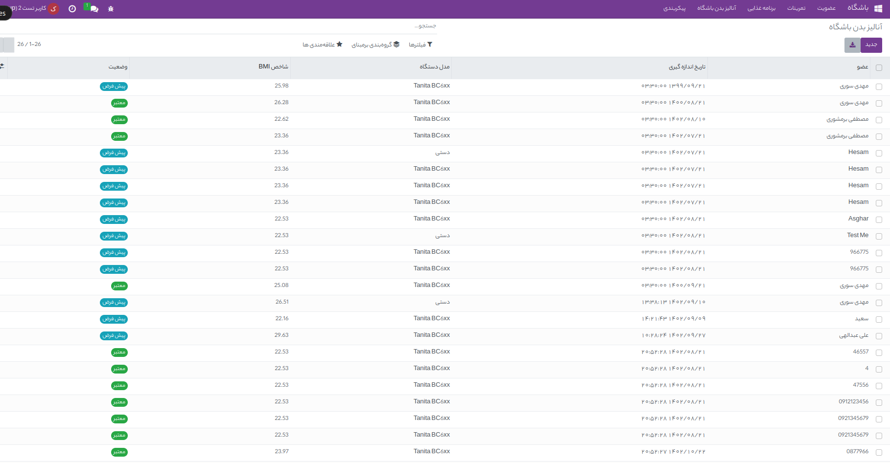

آنالیز بدن باشگاه   
=============

این نرم افزار علاوه بر اینکه امکانات نرم افزار برای باشگاه فراهم میکند توانایی وصل شدن به سخت افزار 
برای اندازه گیری شرایط بدن ورزشکار را نیز دارد . این سخت افزار همان دستگاههای آنالیز بدن که در باشگاه ها برای اندازگیری پارامترهای مختلف بدن مثل وزن قد میزان چربی و میزان ماهیچه و آب بدن و ... میباشند هستند و بسیار در باشگاه کاربردی میباشند . اگر وارد این منو شویم کل آنالیزهای بدن که توسط دستگاه اندازه گیری شده را نشان میدهد . که میتوان وارد هر کدام از آنها شویم و از آنها پرینت بگیریم و در این قسمت میتوان آنها را دسته بندی کرد و فیلتر کرد .علاوه بر این اعضا نیز با لاگین کردن روی سایت باشگاه نیز میتوانند تمام آنالیزهای خود را در پروفایل خود ببینند . از آنها پرینت بگیرند یا پی دی اف آنها را دانلود کنند . و حتی میتوانند نمودار هر کدام از پارامترهای بدن خود را در آنالیزهای خود ببینند و آنها را با هم بررسی کنند . 

