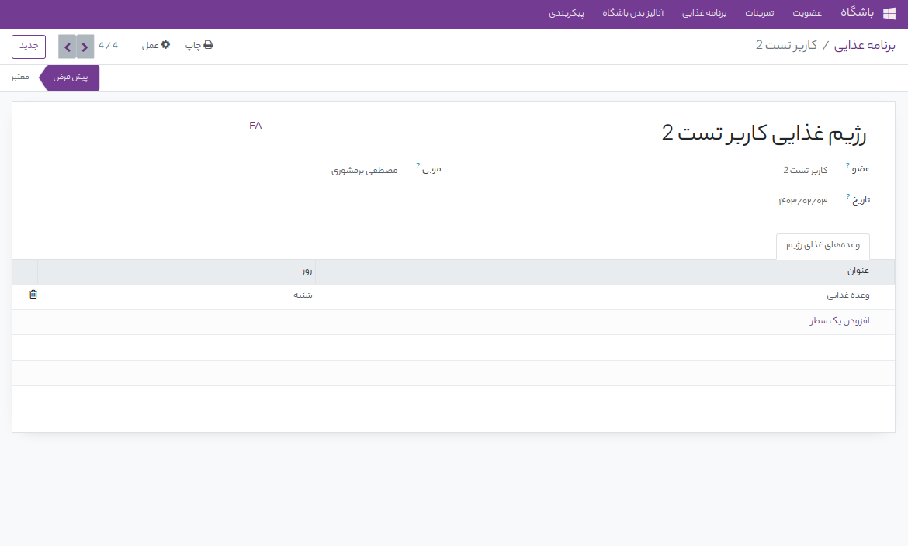
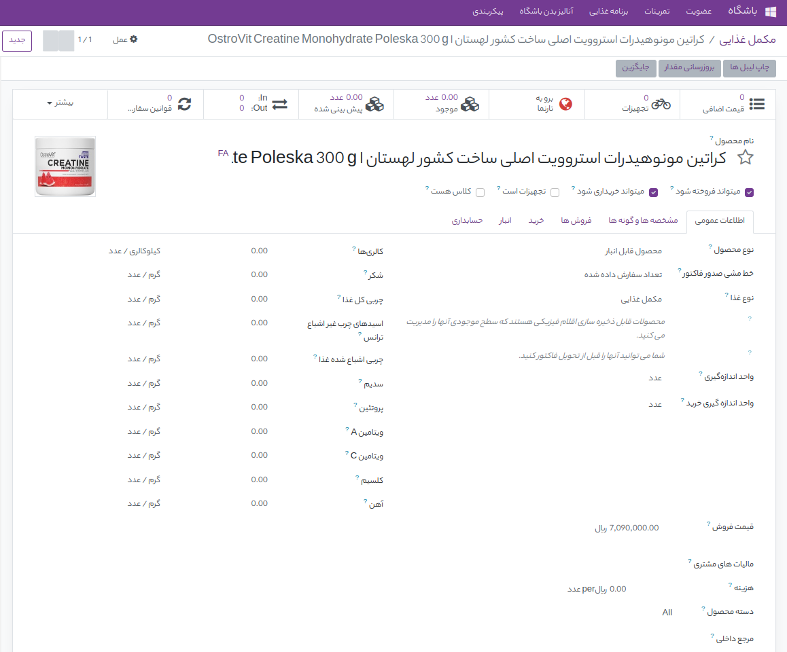
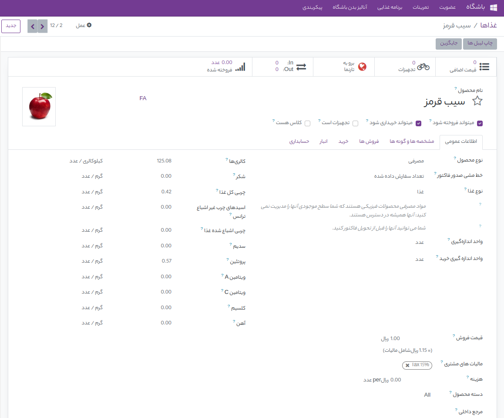

برنامه غذایی   
=============

اعضا باشگاه علاوه بر اینکه برای ورزش کردن نیاز به تمرینات منظم و با برنامه دارند نیاز به یک رژیم غذایی خاص برای تقویم بدن خود نیز دارند. این رژیم را مربی میتواند در منوی برنامه غذایی  در زیر منوی برنامه غذایی وارد کند . در این منو تمام برنامه های غذایی را میتوان دید و برنامه غذایی جدید ساخت . هر برنامه غذایی به یکی از اعضا داده میشود و برای هر برنامه غذایی میتوان یک مربی اختصاص داد . در برنامه غذایی میتوان وعده های غذایی برای هر روزی از هفته که نیاز باشد وارد کرد .  که با کلیک بر روی وعده های غذایی منویی برای تعریف وعده های غذایی باز میشود که در آن میتوان صبحانه و میان وعده صبح و ناهار و شام و مکمل های غذایی مورد نیاز ورزشکار را تعریف کرد . 

برای تعریف مکمل های غذایی مورد نیاز اعضا به منوی برنامه غذایی رفته و وارد زیر منوی مکمل غذایی شده و در این منو لیست همه مکمل های غذایی وجود دارد میتوان با زدن کلید جدید مکمل جدید را تعریف کرد که در تعریف مکمل جدید میتوان تمام مواد تشکیل دهنده و ویتامین هایی که این مکمل دارند وارد کنیم و از آنجا که برنامه فروش نیز روی این نرم افزار اجرا است و به کل سیستم وصل است میتوان برای این مکملی که تعریف کرده ایم قیمت مشخص کرد و در سایت باشگاه آن را برای فروش گذاشت . 

علاوه بر مکمل های غذایی ما در تعریف وعده های غذایی نیاز به تعریف غذاها نیز داریم که برای تعریف غذاها از منوی برنامه غذایی زیر منوی غذاها را انتخاب میکنیم و وارد این منوی میشویم . در این منو لیست همه غذاهایی که میتوان در برنامه غذایی اعضا از آنها استفاده کرد آمده علاوه بر آن میتوان غذای جدید نیز تعریف کرد که با زدن گزینه جدید این امکان فراهم میشود . در تعریف غذایی جدید میتوان میزان کالری غذا و ترکیبات و ویتامین های غذا را وارد کرد تا اطلاعات کاملی درمورد غذا داشته باشیم .  

با توجه به این ویژگی هایی که این نرم افزار دارد میتوان برنامه غذایی بسیار کامل و دقیقی برای هر روز هفته و در هر روز برای هر وعده و میان وعده غذایی اعضا برنامه ریزی کرد و تمام غذاهایی که اعضا میخورند را مدیریت کرد تا به صورت حرفه ای و نهایت استفاده را از رژیم غذایی برای پیشرفت ورزشکار کنیم .

