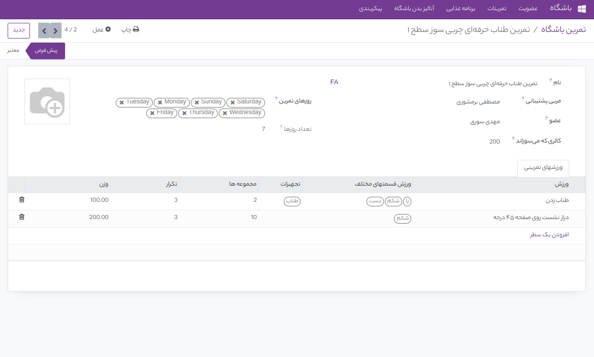

:show-content:
:show-content:

تمرینات   
=============

تمرینات در این ماژول از ورزشها تشکیل شده برای تعریف تمرینات که همان ست هایی که در باشگاه تعریف میشود هستند باید از ورزشهایی که قبل از آن تعریف کرده ایم استفاده کنیم . در تمرینات نوع ورزش مشخص میشود و اون قسمت از بدن که با این ورزش درگیر است مشخص میشود تعداد ست ورزش مشخص میشود و تعداد تکرار این ست ها مشخص میشود . علاوه بر این مقدار کالری که این تمرین میسوزاند نیز میتوان وارد کرد . و همچنین روزهایی که کاربر باید این تمرین را انجام دهد و عضوی که این تمرین را باید انجام دهد وارد میکنیم . و حتی میتوان یک عکس نیز برای این تمرین انتخاب کرد که باعث  میشود دید بهتری  به اعضا بدهد . بعد از تعریف یک تمرین و اختصاص آن به عضو مورد نظر  عضو با لاگین کردن روی سیستم میتواند لیست تمرینات را بببیند . 

    
قبل از تعریف تمرینات باید ورزشها تعریف شوند که بعد بتوان آنها را به تمرینات اضاف کرد برای تعریف ورزشها به منوی تمرینات میرویم و زیر منوی ورزشها را انتخاب میکنیم که بعد از آن لیست همه ورزشهایی که تعریف کردیم را برای ما می آورد . و میتوان با زدن گزینه جدید ورزش جدید تعریف کرد . 
در تعریف ورزش جدید قسمتهای از بدن که با این ورزش درگیر هستن را باید مشخص کنیم و تجهیزاتی که استفاده میشود را باید تعریف کنیم و دستورالعملهایی که مربی برای این ورزش دارد را وارد میکنیم همچنین فواید و مراحلی که در این ورزش باید انجام شود را وارد میکنیم و میزان کالری که میسوزاند را وارد میکنیم . زمان متوسط انجام این ورزش را وارد میکنیم و میتوان یک عکس نیز برای آن انتخاب کرد .

.. image:: ./src/img/exrcise2.png
    :alt: باشگاه ویراوب123 
    :align: center