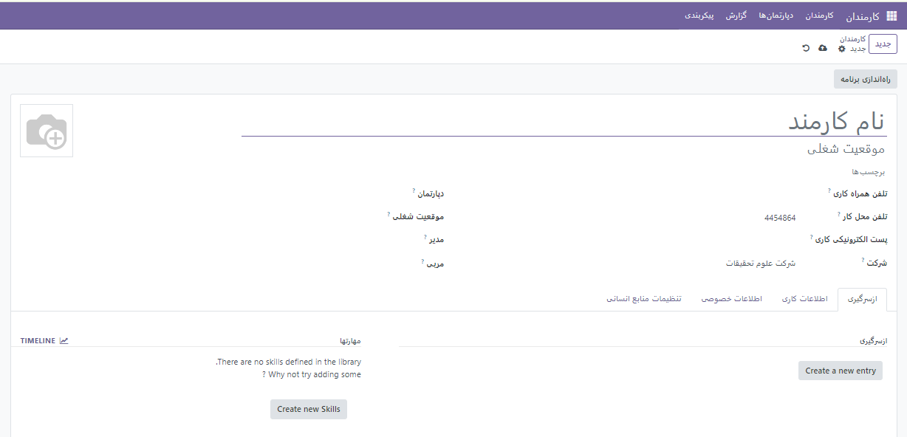

:nosearch:
:show-content:
:hide-page-toc:
:show-toc:

====================
کارمندان
====================

کارمندان  جدید
===================
زمانیکه یک کارمند جدید استخدام می شود لازم است اطلاعات کلی،اطلاعات فردی و سابقه شغلی و... آن فرد ذخیره شود. برای این کار بعد از نصب ماژول **کارمندان** از قسمت بالا سمت چپ گزینه *جدید* را می زنیم تا یک فرم خالی ایجاد شود.
 

می توانید فضاهای تعیین شده در صفحه ایجاد کارمند را با نام کارمند و نقش کاری پر کنید. پس از آن، می توانید نام بخش، شرکت، نام مدیر، مربی کارمند و تلفن کار و ایمیل آنها را اضافه کنید.

.. note:: 
    توجه:در فیلدهای تلفن محل کار و شرکت شماره تلفن و نام فعلی شرکت وارد می‌شوند.

.. toctree::
   :titlesonly:

   ./employees/howtostart
   ./employees/config
