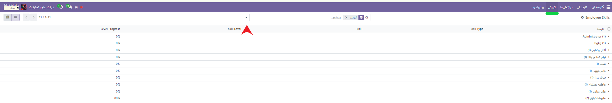
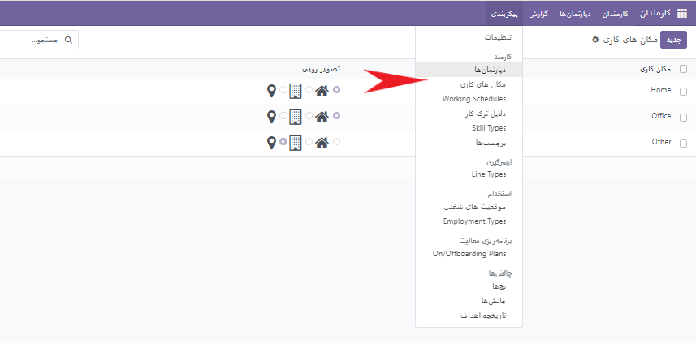
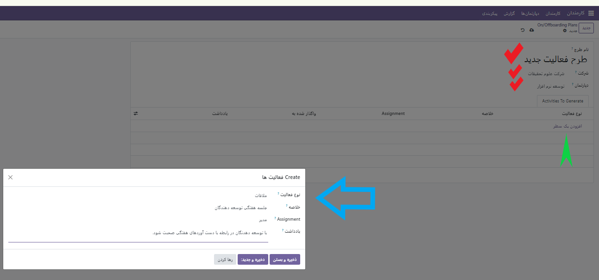
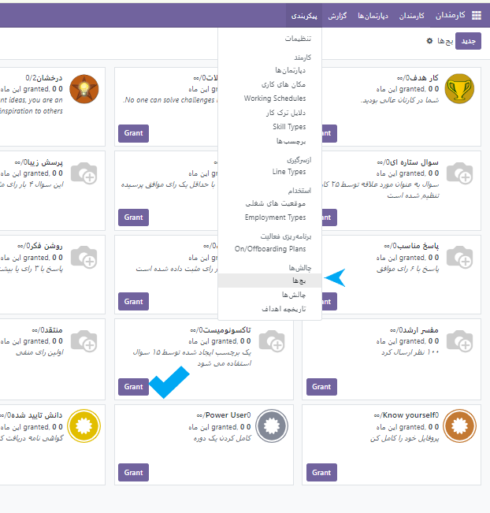

:nosearch:
:show-content:
:hide-page-toc:
:show-toc:

گزارش/پیکربندی
=========================

از این منو می توانید گزارش و عملکرد هر کارمند را بر اساس فیلترهای موجود و سفارشی بررسی کنید.

**مکان های کاری**

طبق عکس می توانید مکان هایی به جز شرکت را برای انجام فعالیت های کارمندان خود تعریف کنید و در هنگام اضافه کردن کارمند جدید ازآن استفاده کنید.

همچنین برای سایر گزینه ها مانند:
1. - دلایل ترک کار
2. - انواع مهارت ها
3. - برچسب ها
4. - ساعت بندی زمان های کاری(توضیح داده شده)
   
مانند عکس فوق عمل میکنیم.

**استخدام**

در این قسمت دو زیر منو وجود دارد که می توانیم موقعیت های شغلی  را تعریف کنیم. و همچنین از قسمت نوع استخدام، نوع استخدام یک فرد را (رسمی، قراردادی و ..) تعریف کنیم.

**برنامه ریزی فعالیت ها**

در این بخش می توانید طرح های جدیدی ثبت کنید و آن را بسته به نوع فعالیت به شخص یا گروه خاصی واگذار کنید.

چالش ها
---------------

در این قسمت می توانید نشان و چالش هایی نوشته و آن را به کارمند مورد نظر با زدن گزینه **اعطا کردن** واگذار کنید.

