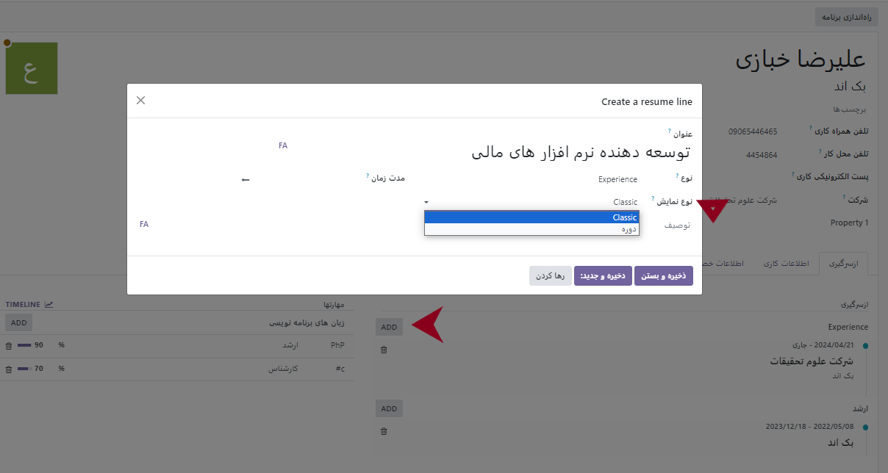
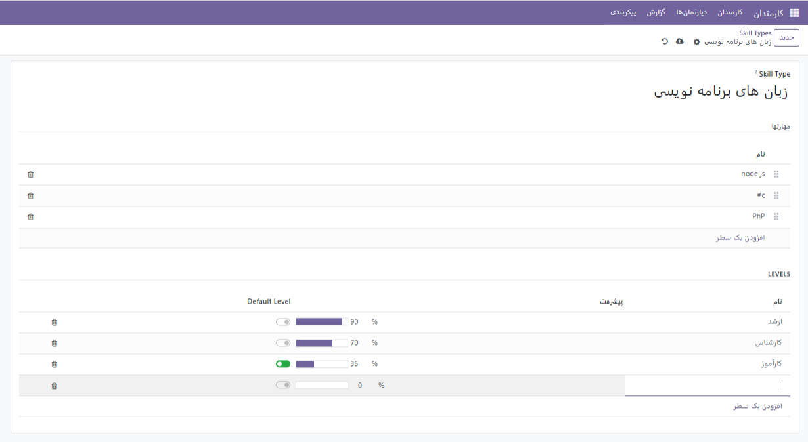
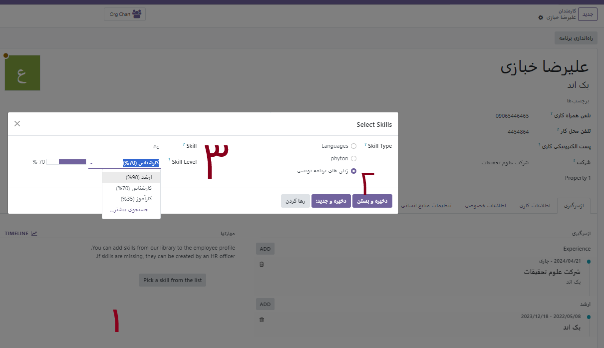
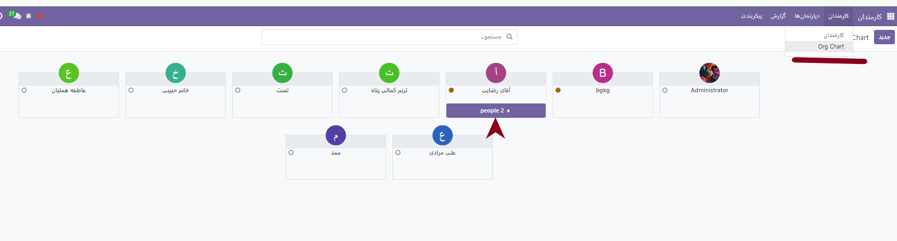
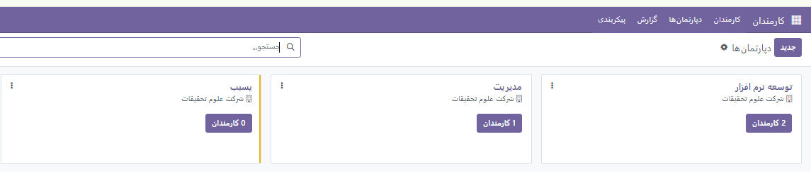
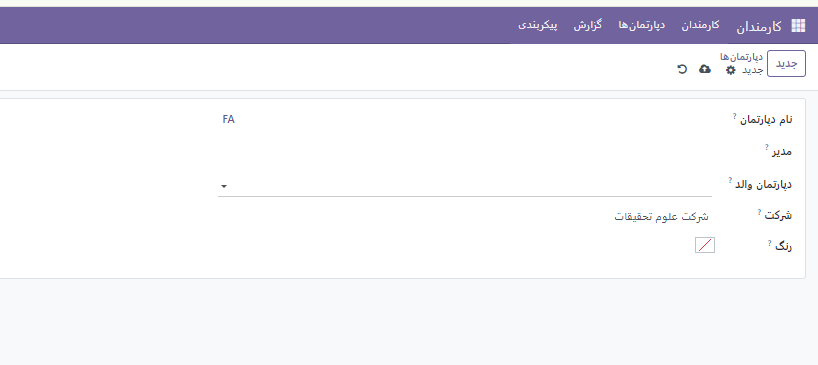
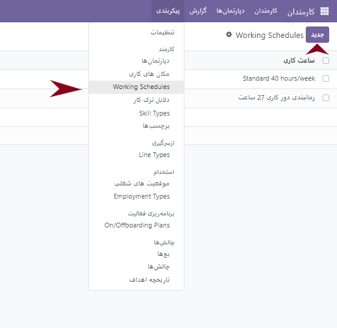
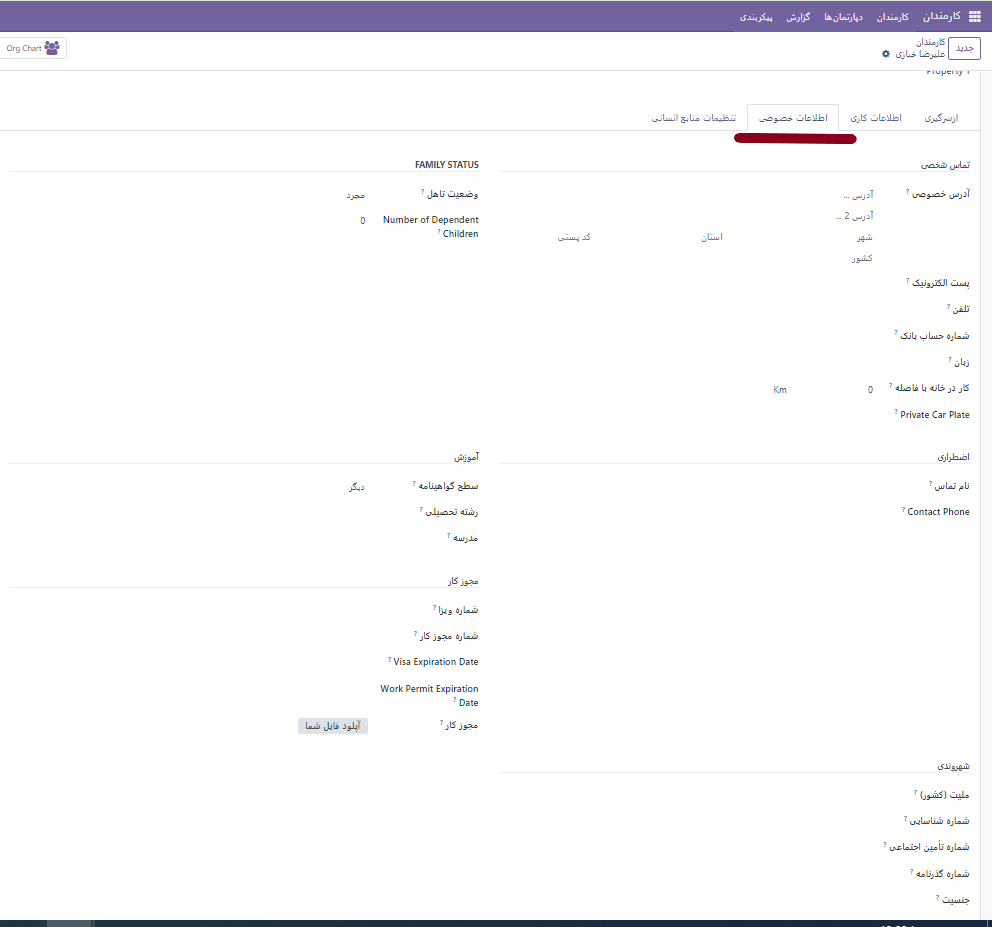

:nosearch:
:show-content:
:hide-page-toc:
:show-toc:

تب های کارمندان
=========================

در تب اول (از سرگیری) **رزومه**
می توانید سوابق شغلی افراد را با گزینه  **ایجاد یک ثبت جدید**  سوابق و مدت زمان سایقه کاری یک فرد را در چندین سطر اضافه کنید.
همچنین در بخش مهارت ها **ایجاد یک مهارت** مهارت های فردی یا شغلی کارمند را ثبت کرد.
در این قسمت شما می توانید به صورت از پیش تعریف شده مهارت هایی را تعریف کرده و با انتخاب مربع کنار آن مربع آن مهارت را به آن کارمند انتصاب داده.

در تصویر زیر با فشردن گزینه اضافه کردن یک سابقه به سوابق ایجاد خواهید کرد. در منوی کشویی نوع نمایش دو گزینه کلاسیک و دوره وجود دارد. 
در صورت انتخاب *دوره* شما می توانید تاریخ دوره های مرتبطی که آن فرد در یک بازه زمانی آموزش دیده است را در صورت وجود همان دوره در شرکت خود  و یا با تعریف جدید آن دوره مشخص کنید.

برای تعریف مهارت ها می توان به دو روش عمل کرد.

روش اول: از همین قسمت روی گزینه ایجاد **ایجاد یک مهارت جدید** کلیک کرده
روش دوم: از قسمت پیکربندی>> انواع مهارت وارد صفحه جدید می شویم.
 

از هر روش که بروید صفحه ایی مطابق شکل بالا نمایش خواهد داده شد.

*از بخش مهارت ها*

یک عنوان مطابق مثال بالا انتخاب میکنیم و می توانیم چندین مهارت را به صورت سطری به آن اضافه کنیم.

*در بخش سطح ها*
می توانیم سطح بندی های مختلفی را مطابق قوانین هر شرکت تعریف کرد. دقت داشته باشید که هنگان فزودن یک سطر جدید نان را پر کرده و برای دادن درصد عدد صفر را به صورتی دستی وارد نمایید.

>>**بعد از تعریف سطح های مختلف می توانیم با یک سطح پیشرفت را به صورت پیش فرض با فعال کردن آن گزینه (سبز) انتخاب نمایید.<<**
سپس وارد صفحه کارمند مورد نظر می شویم و به ترتیب مهارت ها را برای او انتخاب می کنیم.
 

چارت سازمانی
-------------------------
در هر سازمان کارمندانی زیر مجموعه یک گروه دیگر هستند. که هر گروه یک مدیر دارد. برای تعریف چارت سازمانی دو روش وجود دارد.
روش اول: کارمندان >> چارت سازمانی
روش دوم: دپارتمان>>جدید ( صفحه ایی باز می شود که باید فیلدهای مربوط به آن گروه را پر کنید. مطابق)

برای ایجاد یک دپارتمان جدید روی گزینه  **جدید** کلیک کرده.

.. error:: 
        دقت شود مدیر و دپارتمان والد باید طبق چارت مخصوص هر سازمان ایجاد شود.

.. example::
    مثال:یک نمونه کوچک از زیر شاخه سازمانی.

    .. image:: ./img/emp9.png
        :alt: کارمندان
        :align: center

اطلاعات کاربری
----------------------

 .. image:: ./img/emp10.png
    :alt: کارمندان
    :align: center

در تب اطلاعات کاری، مشخصات کاری کارمند وارد می‌شود. برنامه کاری، نقش‌های مختلف، شخصی که درخواست‌های او را تأیید می‌کند (مرخصی، برگه ساعات کارکرد و هزینه‌ها)، و جزئیات محل کار در این قسمت لیست شده است. برای دسترسی به این بخش بر روی تب اطلاعات کاری کلیک کرده و اطلاعات زیر را برای کارمند جدید وارد کنید.

•	مکان کاری: از منوی کشویی باز شده آدرس محل کار را وارد کنید. برای اصلاح این آدرس، ماوس را روی اولین سطر آدرس ببرید (اگر چند سطر باشد) تا فلش لینک داخلی     نمایان شود. برای باز شدن فرم شرکت لینک داخلی را کلیک کرده و ویرایش‌های لازم را انجام دهید. بعد از اتمام ویرایش از مسیر بالای صفحه استفاده کرده و دوباره به فرم کارمند برگردید. اگر آدرس محل کار جدیدی لازم است، آدرس را در فیلد تایپ کنید و برای افزودن آدرس ایجاد (آدرس جدید) را کلیک کنید، و یا برای اضافه شدن آدرس جدید و ویرایش فرم آدرس ایجاد و ویرایش را کلیک کنید.
•	تأییدکنندگان: برای مشاهده این بخش باید سطح دسترسی مدیر سیستم یا معاونت: مدیریت همه کارمندان را برای برنامه کارمندان داشته باشید. با استفاده از منوهای کشویی، کاربر مسئول تأیید هزینه‌ها، مرخصی و ساعات کارکرد کارمند را انتخاب کنید. برای مشاهده لینک داخلی می‌توانید روی هرکدام از فیلدها که خواستید هاور کنید. برای باز شدن فرم تأییدکننده با فیلدهای نام، آدرس ایمیل، شرکت، تلفن، موبایل و انبار پیش‌فرض روی فلش لینک داخلی کلیک کنید. در صورت نیاز می‌توان این اطلاعات را ویرایش کرد. بعد از اتمام ویرایش‌ها با استفاده از مسیر بالای صفحه دوباره به فرم کارمند برگردید.
•	کار در خانه: با استفاده از منوی مربوطه مکانی که کارمند در هر روز از هفته کار خواهد کرد را انتخاب کنید. گزینه‌های پیش‌فرض خانه، دفتر یا سایر هستند. در این فیلد می‌توان مکان جدیدی نیز تایپ کرده و آن را یا ایجاد (مکان جدید) یا ایجاد و ویرایش کرد. ذخیره و بستن را کلیک کنید؛ با این کار مکان جدید اضافه شده و اطلاعات فیلد تکمیل می‌شود. برای مثال، اگر کارمند روزهای پنج‌شنبه و جمعه کار نمی‌کند، فیلد را خالی بگذارید .

.. example::
        مثال برای ساعت کاری

    .. image:: ./img/emp11.png
        :alt: کارمندان
        :align: center

در عکس فوق یک تایم کاری 27 ساعته برای دور کاری برنامه ریزی شده تا زمانیکه کارمندی محل کارش خانه انتخاب شده باشد. این برنامه زمانی به آن فرد اختصاص داده شود.

روش دیگربرای ایجاد یک برنامه زمانی از منو پیکربندی>>گزینه زمانبدی ساعت های کاری می باشد.
 

اطلاعات خصوصی
-------------------------------

این بخش حاوی اطلاعات شخصی غیر مرتبط با کار است. جزئیاتی مانند اطلاعات تماس خصوصی (تلفن، ایمیل، آدرس، زبان، شماره حساب بانکی و فاصله خانه تا محل کار) ممکن است در اینجا گنجانده شود. هنگام بحث در مورد وضعیت خانوادگی خود، می توانید تعداد فرزندان وابسته و وضعیت تاهل خود را در نظر بگیرید. امکان قرار دادن نام تماس و شماره تلفن روی گزینه اضطراری وجود دارد.

تنظیمات منابع انسانی
---------------------------
