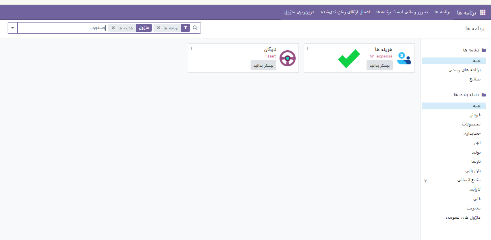

:nosearch:
:show-content:
:hide-page-toc:
:show-toc:

مدیریت هزینه ها
===============

یکی از دغدغه های در سازمان های بزرگ و شرکت ها پرداخت هزینه های مربوط به سازمان است که گاها از سمت کارمند و یا شرکت پرداخت می شود و باید مورد بررسی و حساب رسی قرار بگیریند. ماژول هزینه ها تمامی این مشکلات را به صورت جزئی مورد رصد و پیگیری قرار داده و منابع انسانی دیگر لازم نیست برای پرداخت هایی که در شرکت صورت میگیرند فاکتورهای کاغذی را نگه داری و بررسی کنند. 

برای حل این مشکل می توانید از ماژول هزینه ها استفاده کنید.

.. toctree::
   :titlesonly:

   ./startexpense
