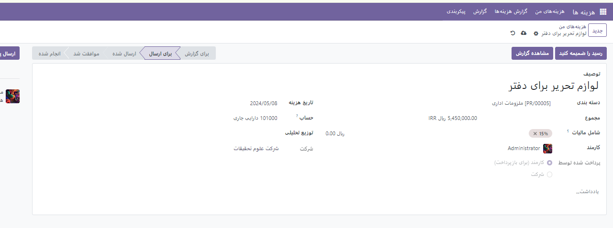
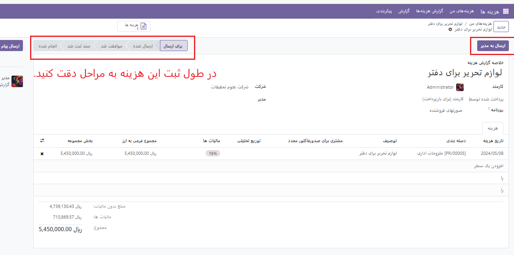
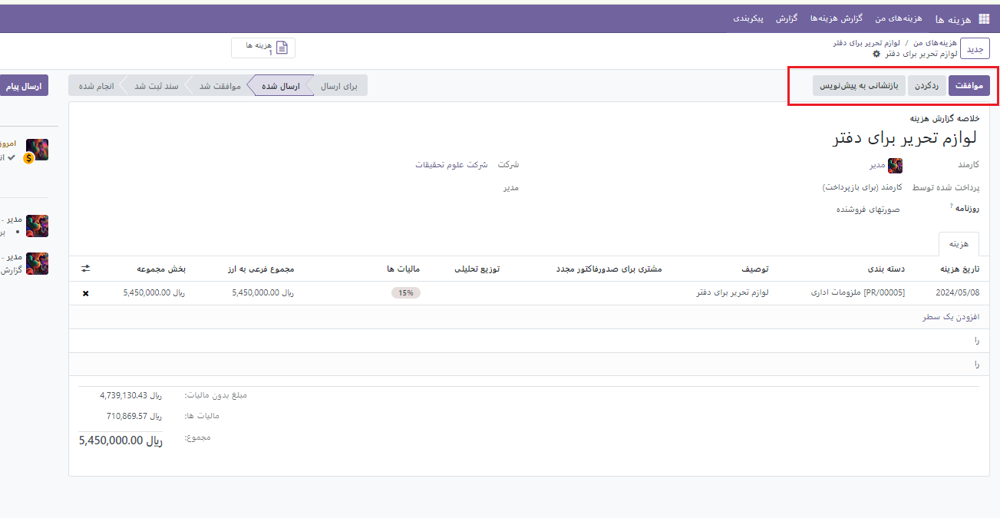
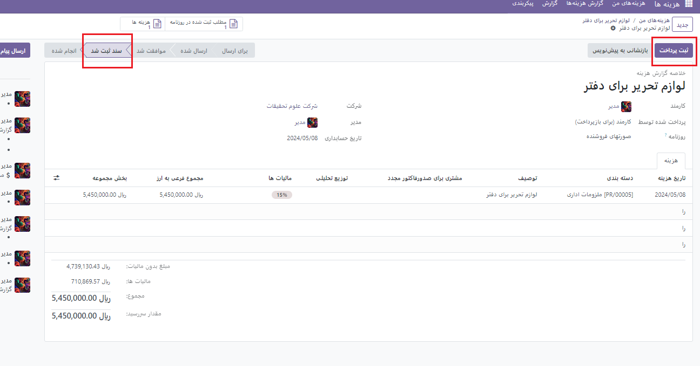
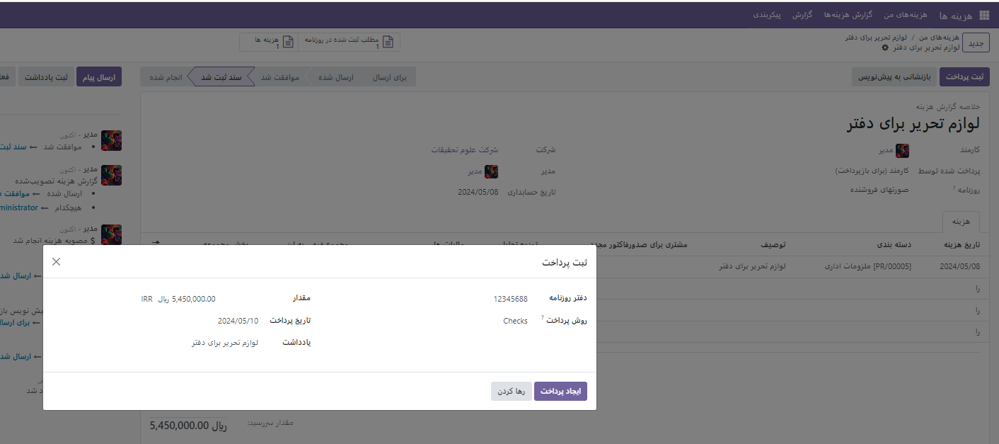
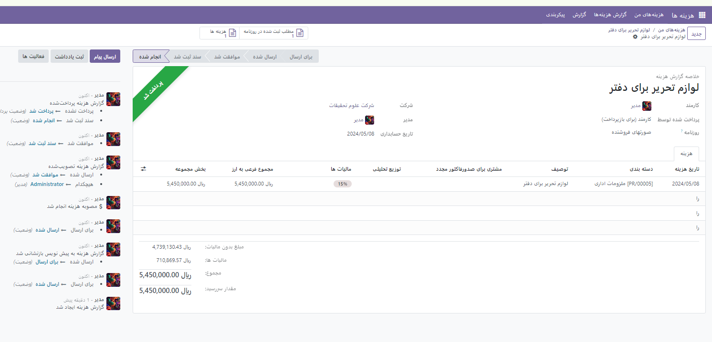
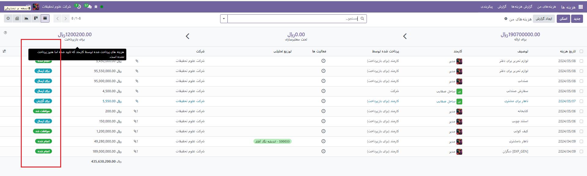
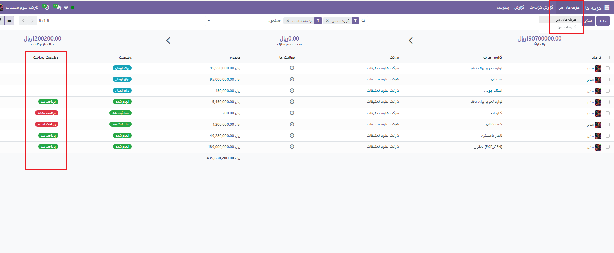
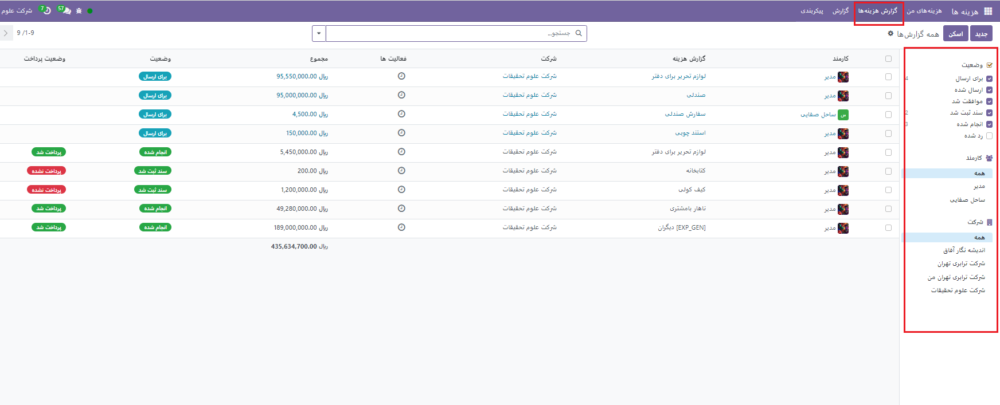
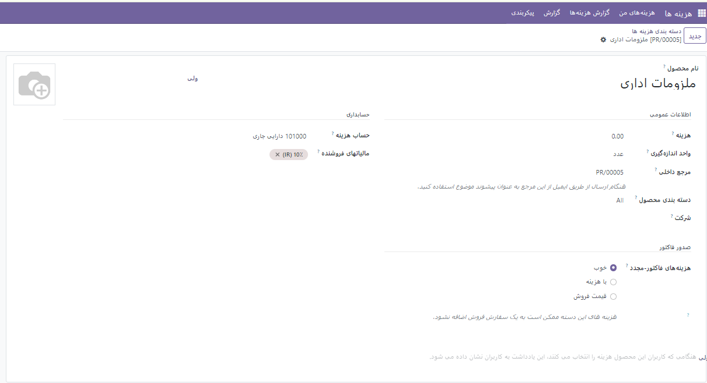

:nosearch:
:show-content:
:hide-page-toc:
:show-toc:

ایجاد هزینه جدید
-----------------------------
پس از نصب ماژول با کلیک بر روی گزینه **جدید** صفحه ایی مطابق شکل زیر باز می شود.که میتوانید محصول یا کالایی که برای آن هزینه کرده اید را ثبت کنید.

 همانطور که در عکس مشخص است شما توصیفی برای محصول نوشته و سپس از بین دسته بندی هایی که از قبل تعریف شده یکه دسته بندی انتخاب میکنید. و اگر محصول شامل مالیات شود از منوی کشویی مقدار مالیات پیش فرض را انتخاب کرده تا بر روی فاکتور اعمال شود.

- **تاریخ هزینه**: تاریخی که برای آن محصول را هزینه کرده اید انتخاب میکنید.
  
- **پرداخت شده توسط**: این پرداختی میتواند به دو نوع باشد توسط شرکت و یا خود کارمند که با انتخاب این گزینه این هزینه روی قیش حقوقی او اعمال می شود .
  
- **حساب**: در سازمان های بزرگ و یا حتی شرکت ها یک حساب مشخص برای ثبت و یا برداشت هزینه ها وجود دارد. که از قبل ثبت شده است.
  
- پس از ثبت این سند با زدن گزینه **مشاهده گزارش** فاکتور را مشاهده کرده و آن را به مدیر مربوطه ارسال کنید.(**ارسال به مدیر**)

.. note:: 
    نکته: اگر رسید یا فاکتوری برای این هزینه داشته باشید می توانید با گزینه **رسید ضمیمه** عکس آن را به صفحه الحاق کنید.

بعد از ارسال این سند به مدیر صفحه ایی مطابق شکل زیر باز شده که مدیر می تواند با آن موافقت کرده و یا در صورت صلاح دید رد کند. برای اصلاح این سند می توان از گزینه**اصلاح پیش نویس** استفاده کرد.

در صورت موافقت صفحات به ترتیب عکس های زیر ظاهر می شوند. 

داشبورد اصلی
------------
زمانیکه وارد ماژول هزینه می شوید در صفحه داشبورد اصلی می توانید تمام سندهای هزینه را که در مراحل مختلفی هستند مشاهده کنید.

 هزینه های من
--------------------
این منو شامل دو زیر منو هست که شما می توانید تمام هزینه ایی که انجام داده اید و گزارش های مربوط به هزینه ای پرداختی خود را ببینید.

گزارش هزینه ها
-----------------------

ذر این بخش شما می توانید با استفاده از نوار سمت راست صفحه وضعیت های دلخواه را بر اساس افراد دلخوا، اینکه هزینه ها د ر چه وضعیتی قرار دارد مشاهده کرد.

دسته بندی هزینه ها
-----------------------

انواع مختلفی از هزینه ها در شرکت وجود دارد که آنن ها را میتوان به صورت پیش فرض دسته بندی کرد. برای این کار به منوی پیکربندی◄دسته بندی ها  بروید.

بعد از زدن گزینه **جدید** صفحه ایی باز می شود که باید اطلاعات آن را به صورت زیر پر کنید.

