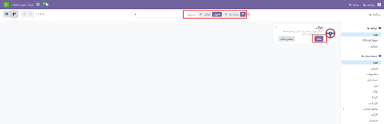

:nosearch:
:show-content:
:hide-page-toc:
:show-toc:

====================
ناوگان
====================

این مستند شامل دستورالعمل‌هایی برای ماژول ناوگان و زیر ماژول های آن است.

ابتدا برای استفاده از این ماژول، باید آن را از بخش "برنامه‌های داشبورد" در سمت راست نصب کنید. فقط کافیست روی گزینه "فعال" کلیک کنید تا نصب شود.
 

ماژول ناوگان اودو تمام وسایل نقلیه، قراردادها، و تعمیرات مربوط به وسایل نقلیه را به‌طور منظم سازماندهی می‌کند. با استفاده از این ماژول، مدیریت ناوگان بسیار ساده خواهد بود.
شما نیازی ندارید تا سیستم پیگیری خاصی را برای وسایل نقلیه‌ی خود تهیه کنید. با استفاده از اپلیکیشن هوشمند اودو، تنها با چند کلیک ساده، می‌توانید نظارت دقیقی بر ناوگان خود داشته باشید. این اپلیکیشن به شما امکان مدیریت همه‌چیز از ورود محموله‌های سوخت گرفته تا هزینه‌ها و بسیاری از قابلیت‌های دیگری که برای مدیریت وسایل نقلیه‌ی شرکت شما موردنیاز هستند، را می‌دهد.
این ماژول شامل سه بخش زیر است:

1.	منوی پیکربندی
2.	وسایل نقلیه جدید
3.	خدمات

.. toctree::
   :titlesonly:

   ./fleet/configuration
   ./fleet/new_vehicle
