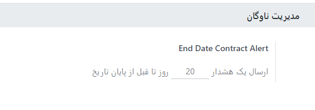
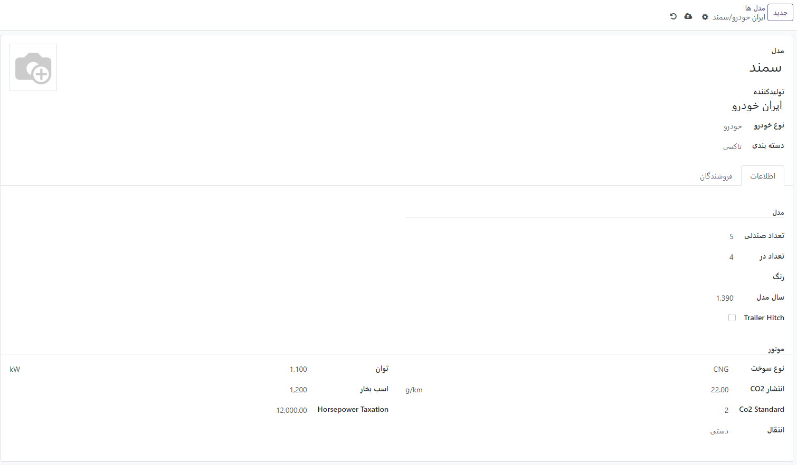
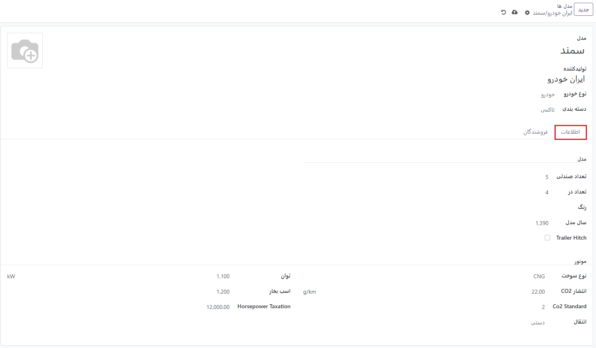
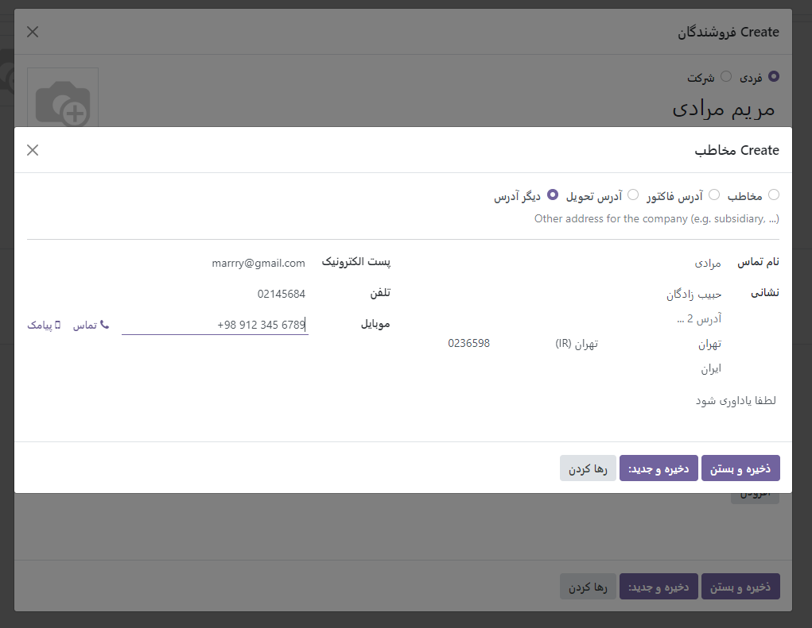

:nosearch:
:show-content:
:hide-page-toc:
:show-toc:

شروع کار با ماژول ناوگان
=========================

منوی پیکربندی
--------------
این بخش شامل تمام پیکربندی‌ها و تنظیمات برنامه ناوگان را فراهم می‌کند، از جمله تنظیمات، سازندگان، مدل‌های خودرو و دسته‌بندی مدل‌ها.

 تنظیمات
----------
برای دسترسی به منوی تنظیمات، ابتدا به برنامه ناوگان رفته و سپس از قسمت پیکربندی، وارد صفحه تنظیمات می‌شویم.
یکی از تنظیمات مهم که نیاز به پیکربندی دارد، هشدار تاریخ پایان قرارداد خودرو است. مانند شکل زیر، می‌توانید برای خود یک هشدار برای تاریخ پایان قرارداد خود تنظیم کنید. این فیلد، زمانی را مشخص می‌کند که یک هشدار برای افراد مسئول قراردادهای خودرو ارسال می‌شود. افراد مسئول ایمیلی دریافت می‌کنند که به آنها اطلاع می‌دهد که قرارداد خودرو در حال اتمام است. زمانی که ایمیل ارسال می‌شود نیز در این قسمت تعیین می‌شود، به عنوان مثال در تصویر زیر نشان داده شده است که ۲۰ روز قبل از تاریخ پایان، هشدار ارسال شود.
 

.. note::
  نکته: برای تعیین اینکه چه کسی مسئول یک قرارداد است، باید یک قرارداد فردی باز کنید. شخصی که در بخش اطلاعات قرارداد به عنوان مسئول ذکر شده است، کسی است که هشدار را دریافت می‌کند.
برای دسترسی به قراردادها، به برنامه ناوگان بروید و از قسمت "ناوگان قراردادها" را انتخاب کنید. سپس برای مشاهده قرارداد، روی آن کلیک کنید.

---------
مدل‌ها
---------

سازنده‌ها
------------
در ناوگان اودو، شصت و شش سازنده خودروهای رایج در پایگاه داده به همراه آرم‌های آنها از پیش پیکربندی شده است. برای مشاهده سازنده‌های پیش بارگذاری شده، به برنامه ناوگان رفته و سپس از قسمت "پیکربندی سازنده‌ها" را انتخاب می‌کنیم.
سازنده‌ها در یک لیست به ترتیب حروف الفبا ظاهر می‌شوند. کارت هر سازنده لیست می‌کند که چند مدل خاص برای هر سازنده خاص پیکربندی شده است. به عنوان مثال، در تصویر زیر، سازنده BMW دارای ۱۱ مدل است.
 

برای افزودن یک سازنده جدید به پایگاه داده، ابتدا روی دکمه "جدید" کلیک کنید تا یک فرم سازنده خالی باز شود.
سپس، نام سازنده را در قسمت "نام" وارد کنید. این تنها فیلد الزامی است.
در مرحله بعد، اگر عکسی در دسترس است، نشانگر را روی کادر تصویر نگه دارید و روی نماد مداد (✏️) که در گوشه پایین سمت راست ظاهر می‌شود کلیک کنید. این کار باز یک پنجره جستجوی فایل را فراهم می‌کند.

.. note::
  نکته: با وارد کردن داده‌ها، فرم سازنده به طور خودکار ذخیره می‌شود. با این حال، فرم را می‌توان به صورت دستی در هر زمان با کلیک بر روی گزینه "Save manually" ذخیره کرد که با نماد ابر با فلش رو به بالا نمایش داده می‌شود.

 مدل‌ها
--------------

بسیاری از تولید کنندگان مدل‌های متنوعی دارند که تولید می‌کنند. اودو با مدل‌های ماشین از پیش پیکربندی شده از چهار خودروساز بزرگ عرضه می‌شود: آئودی، بی ام و، مرسدس بنز و اوپل. اگر خودرویی غیر از مدل‌های از پیش پیکربندی شده این سازندگان بخشی از ناوگان باشد، مدل (و/یا سازنده) باید به پایگاه داده اضافه شود.

افزودن یک مدل جدید
-------
مدل‌های جدید خودرو را می‌توان به راحتی به پایگاه داده اضافه کرد. برای افزودن یک مدل جدید، به برنامه ناوگان رفته و سپس از قسمت "پیکربندی مدل‌ها" را انتخاب می‌کنیم. سپس روی دکمه "جدید" در گوشه سمت راست بالا کلیک می‌کنیم و فرم مدل خودروی خالی باز می‌شود.

.. note::
  نکته: برخی از فیلدها یا بخش ها بر اساس تنظیمات محلی سازی شرکت هستند، بنابراین ممکن است همه فیلدها یا بخش ها قابل مشاهده نباشند.

با توجه به تصویر زیر مانند راهنمای زیر عمل کنید

•	**مدل:** نام مدل خودرو را در فیلد مربوطه وارد کنید.
•	**سازنده:** از منوی کشویی، سازنده خودرو را انتخاب کنید. اگر لوگوی مربوط به سازنده پیکربندی شده باشد، آن به طور خودکار در کادر تصویر در گوشه سمت راست بالا بارگیری می‌شود. اگر سازنده قبلاً پیکربندی نشده باشد، نام آن را تایپ کرده و سپس روی "ایجاد" کلیک کنید تا سازنده را اضافه کنید.
•	**نوع خودرو:** از منوی کشویی، یکی از دو نوع خودرو از پیش پیکربندی شده، خودرو یا دوچرخه را انتخاب کنید. انواع خودروها در Odoo کدگذاری شده‌اند و با برنامه حقوق و دستمزد یکپارچه شده‌اند، زیرا وسایل نقلیه می‌توانند بخشی از مزایای کارمند باشند. افزودن انواع خودروهای اضافی ممکن نیست زیرا بر حقوق و دستمزد تأثیر می‌گذارد.
•	**دسته:** دسته‌ای را که خودرو تحت آن دسته‌بندی شده است را از منوی کشویی انتخاب کنید. برای ایجاد یک دسته‌بندی جدید، نام دسته را تایپ کرده و سپس روی "ایجاد دسته جدید" کلیک کنید.

حالا برای قسمت بعدی، به تصویر زیر توجه کرده و باقی اطلاعات را وارد کنید.

برگه اطلاعات
------------

مدل
------------------------
-	**شماره صندلی:** تعداد مسافرانی که خودرو قادر به جابجایی آن‌ها است را وارد کنید.
-	**شماره درب:** تعداد درهای خودرو را وارد کنید.
-	**رنگ:** رنگ خودرو را وارد کنید.
-	**سال مدل:** سال تولید خودرو را وارد کنید.
-	**اتصال تریلر:** اگر خودرو دارای اتصال تریلر است، این گزینه را علامت بزنید.
-	**ارزش کاتالوگ (با احتساب مالیات بر ارزش افزوده):** قیمت MSRP خودرو را در زمان خرید یا اجاره وارد کنید.

موتور
------------------------
-	**نوع سوخت:** نوع سوخت مورد استفاده خودرو را از منوی کشویی انتخاب کنید. مثال: دیزل، بنزین، فول هیبریدی، و غیره.
-	**انتشار CO2:** میزان میانگین انتشار دی اکسید کربنی که خودرو تولید می‌کند را بر حسب گرم در کیلومتر وارد کنید.
-	**استاندارد CO2:** مقدار استاندارد دی اکسید کربن را بر حسب گرم در هر کیلومتر برای یک خودرو با اندازه مشابه وارد کنید.
-	**گیربکس(انتقال):** نوع گیربکس را از منوی کشویی انتخاب کنید، دستی یا اتوماتیک.
-	**قدرت:** توان مورد استفاده خودرو را بر حسب کیلووات وارد کنید.
-	**اسب بخار:** اسب بخار خودرو را وارد کنید.
-	**مالیات بر اسب بخار:** مقدار مالیات بر اساس اندازه موتور خودرو را وارد کنید.
-	**کسر مالیات:** این فیلد به طور خودکار با توجه به مشخصات موتور پر می‌شود و قابل تغییر نیست.

برگه فروشندگان
------------------------
-	**فروشندگان:** فروشندگان خاص خودرو که می‌توانند مدل خاص خودرو را فروش کنند، در این بخش فهرست می‌شوند. برای افزودن فروشنده، روی دکمه "افزودن" کلیک کنید.

با کلیک بر روی کادر انتخاب در سمت راست نام فروشنده، یک پنجره پاپ آپ با لیستی از تمام فروشندگان موجود در پایگاه داده بارگذاری می‌شود. سپس، فروشنده مورد نظر خود را برای افزودن انتخاب کنید و روی "انتخاب" کلیک کنید. توجه داشته باشید که هیچ محدودیتی برای تعداد فروشندگانی که می‌توانید به این لیست اضافه کنید وجود ندارد، بنابراین شما می‌توانید تعداد دلخواهی از فروشندگان را انتخاب کنید.

اگر فروشنده ای در پایگاه داده نیست، با کلیک بر روی دکمه جدید در پایین پنجره پاپ آپ، یک فروشنده اضافه کنید.

.. image:: ./img/fleet10.png
    :alt: ناوگان
    :align: center

با پر کردن اطلاعات مربوط به تب‌های مختلف، روی دکمه "ذخیره و بستن" کلیک کنید تا فروشنده انتخاب شده اضافه شود و پنجره بسته شود. همچنین می‌توانید روی دکمه "ذخیره و جدید" کلیک کنید تا اطلاعات فروشنده فعلی ذخیره شود و یک فروشنده جدید ایجاد شود.
در تب "تماس‌ها و نشانی"، روی دکمه "افزودن" کلیک کنید تا فرمی مشابه تصویر زیر باز شود و اطلاعات تماس و نشانی را وارد کنید. سپس پس از پر کردن اطلاعات، روی دکمه "ذخیره" یا "ثبت" کلیک کنید.

در تب "خرید و فروش"، می‌توانید اطلاعات مربوط به فروش و خرید را وارد کنید، شامل جزئیات مانند مبلغ، تاریخ، وضعیت پرداخت و موارد مشابه. در تصویر زیر می‌توانید مثالی از این تب را مشاهده کنید.

در تب "صدور فاکتور"، می‌توانید اطلاعات مربوط به حساب‌های بانکی و فاکتور را وارد کنید، از جمله شماره فاکتور، تاریخ صدور، جزئیات پرداخت و موارد مشابه.

در تب "یادداشت‌ها"، می‌توانید یادداشت‌هایی را که قرار است به فروشنده مربوطه ارسال شود، وارد کنید.

دسته بندی ها
------------

برای بهترین سازماندهی ناوگان، توصیه می‌شود مدل‌های خودرو را در دسته‌های خاصی قرار دهید تا به راحتی ببینید که چه نوع وسایل نقلیه در ناوگان وجود دارد.
در Odoo، ما هیچ دسته‌ای از پیش تعیین شده نداریم. بنابراین، برای سازماندهی بهتر، باید همه دسته‌ها را اضافه کنید. برای مشاهده و اضافه کردن دسته‌ها، به برنامه ناوگان بروید و از بخش پیکربندی، دسته‌بندی را انتخاب کنید. در اینجا، تمام دسته‌های پیکربندی‌شده در یک نمای فهرست نمایش داده می‌شوند.
برای اضافه کردن دسته جدید، روی دکمه "جدید" در گوشه بالا سمت راست کلیک کنید. یک خط ورودی جدید در پایین لیست ظاهر می‌شود. نام دسته جدید را وارد کنید و سپس کلید Enter را فشار دهید یا روی هر نقطه‌ای از صفحه کلیک کنید تا ورودی ذخیره شود.
برای تغییر ترتیب ظاهر شدن دسته‌ها در لیست، روی شش کادر کوچک خاکستری در سمت راست دسته مورد نظر کلیک کنید و آن را به موقعیت دلخواه بکشید. ترتیب لیست تأثیری بر پایگاه داده ندارد، اما ممکن است بخواهید دسته‌ها را بر اساس معیارهای خاصی مثل اندازه یا تعداد مسافران مرتب کنید.

