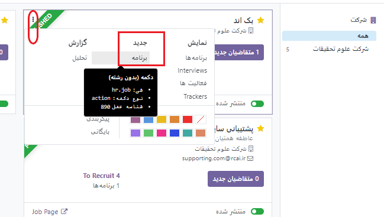
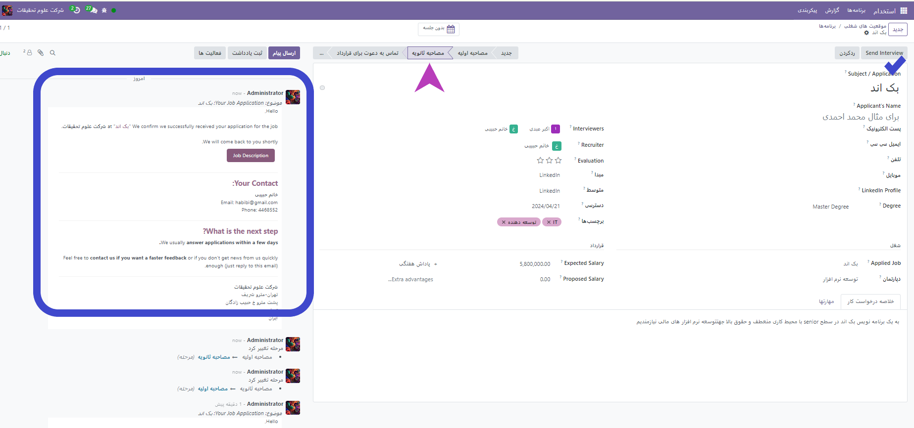

:nosearch:
:show-content:
:hide-page-toc:
:show-toc:

====================================
مراحل روند یک استخدام
===================================

همانطور که می دانید برای جذب یک نیرو باید روند استخدام طی شود. در ماژول استخدام می توانیم این فرایند را به مرحله های کوچک تر شکسته و پس از تایید هر مرحله رزومه کارجو به مرحله بعد تغییر کند.

به مراحل استخدام یک موقعیت شعی به عنوان **پشتیبان سایت** دقت بفرمایید:

می توانید با استفاده از چرخ دنده هر مرحله را ویراش کنید.

.. image:: ./img/rcm6-1.png
    :alt: ماژول استخدام
    :align: center

ویرایش فرم ستون

در فرم ویرایش ستون تنظیمات مربوطه پیکربندی می‌شوند. تنها فیلدهای الزامی نام مرحله و متون راهنما هستند.
فیلدهایی که لازم است تکمیل یا ویرایش شوند عبارتند از:
•	نام مرحله: در این فیلد نام مرحله را تایپ کنید.
•	قالب ایمیل: با استفاده از منوی کشویی باز شده، قالب ایمیلی را انتخاب کنید. اگر قالبی انتخاب شود، هرگاه کارت متقاضی به این مرحله برسد، ایمیل به صورت خودکار با استفاده از قالب انتخاب شده به متقاضی ارسال خواهد شد.
•	جمع شده در نمای کانبان: برای اینکه در نمای پیش‌فرض کانبان این مرحله همیشه در حالت جمع شده (پنهان) نمایش داده شود، این گزینه را فعال کنید.
•	مرحله استخدام شده: اگر این مرحله نشان می‌دهد که متقاضی استخدام شده است، این گزینه را فعال کنید. هرگاه کارت متقاضی به این مرحله برسد، بر روی کارت بنر استخدام شده نمایش داده می‌شود. با فعال شدن این گزینه، تاریخ استخدام متقاضی نیز مشخص می‌شود.
•	شغل مورد نظر: اگر این مرحله فقط به موقعیت‌های شغلی خاصی اعمال می‌شود، موقعیت(های) شغلی مربوطه را از منوی کشویی باز کنید. در این فیلد می‌توان چند موقعیت شغلی اضافه کرد.
•	نمایش در ارجاع: اگر این مرحله باید در برنامه ارجاع نمایش داده شود، و ارجاع‌دهنده با رسیدن متقاضی به این مرحله امتیاز دریافت کند، این گزینه را فعال کنید. اگر این گزینه فعال باشد، فیلد امتیاز نیز نمایش داده می‌شود. مقدار امتیازی که کارمند با وارد شدن متقاضی به این مرحله دریافت می‌کند مشخص کنید.
•	توضیحات: سه برچسب (دایره رنگی) برای هر کارت متقاضی نمایش داده می‌شود که نشانگر وضعیت آن‌هاست. این رنگ‌ها در بالای هر مرحله نمایش داده می‌شود که وضعیت متقاضیان در مرحله را مشخص می‌کند. نام برچسب‌ها را می‌توان تغییر داد، ولی خود برچسب (رنگ آن) قابل ویرایش نیست. نام پیش‌فرض برای این برچسب‌ها عبارتند از: در جریان (خاکستری)، مسدود شده (قرمز)، آماده برای مرحله بعدی (سبز).
•	پیش‌نیازها: یادداشت‌های داخلی لازم برای این مرحله را که پیش‌نیازهای این مرحله تلقی می‌شوند وارد کنید.

**حذف مرحله**
-------------------

اگر مرحله دیگر مورد نیاز نیست، می‌توان آن را حذف کرد. برای حذف مرحله بر روی نام مرحله هاور کنید و آیکون ⚙️ (چرخ دنده) را کلیک کنید. از منوی باز شده حذف را کلیک کنید. پنجره جدیدی با این پیام باز می‌شود: از حذف این ستون مطمئن هستید؟. برای حذف این ستون تأیید را کلیک کنید.

.. important::
    مهم
اگر در حال حاضر متقاضیانی در این مرحله وجود داشته باشد، پیام خطایی به هنگام حذف این ستون نمایش داده، و اشاره دارد که در این مرحله رکوردهایی وجود دارد که باید حذف یا بایگانی شوند، و یا به مرحله دیگری منتقل شوند.

قالب های ایمیل
--------------------------------
برای برقراری ارتباط با متقاضی، Odoo چندین قالب ایمیل از پیش تنظیم شده دارد که می توان از آنها استفاده کرد. قالب های ایمیل از پیش پیکربندی شده و زمان استفاده از آنها به شرح زیر است:

•	متقاضی: تصدیق : این الگو برای اطلاع دادن به متقاضی از دریافت درخواست خود استفاده می شود. هنگامی که متقاضی در مرحله مصاحبه اول قرار گرفت، این ایمیل به طور خودکار ارسال می شود .
•	متقاضی: علاقه : از این الگو استفاده می شود تا به متقاضی اطلاع دهد که مرحله صلاحیت اولیه را گذرانده است و با آنها تماس گرفته می شود تا مصاحبه ای با استخدام کننده ترتیب دهد.
•	متقاضی: دیگر علاقه مند نیستم : این الگو زمانی استفاده می شود که متقاضی اعلام کند که دیگر به این موقعیت علاقه مند نیست و از آنها برای وقت و توجهشان تشکر می کند.
•	متقاضی: امتناع : این الگو زمانی استفاده می شود که متقاضی دیگر برای این موقعیت در نظر گرفته نمی شود.
•	متقاضی: بسته حقوق و دستمزد شما : این الگو برای ارائه موقعیت به متقاضی استفاده می شود. این به متقاضی اطلاع می دهد که می تواند بسته حقوقی خود را پیکربندی کند.

**حال برای تعریف این مراحل باید به قسمت پیکربندی>> موقعیت های شغلی>> مراحل بروید.**

بعد از تعریف مراحل استخدام لازم است برای هر موقعیت شغلی نیازمندی های آن فرصت شغلی ثبت گردد و رزومه ها بر اساس آن بررسی کیفیت شده و به مرحله های بعد بروند. بدین منظور در موقعیت های شغلی روی هر موقعیت روس 3نقطه کلیک کرده و گزینه **جدید** را میزنیم.

در صفحه ی باز شده اطلاعات درخواستی و مهارت هایی که مستلزم آن شغل می باشد پر می شود.مطابق شکل زیر:

همچنین از قسمت چرخ دنده می توان ویژگی های جدیدی را به صفحه بر  حسب نیاز اضافه،ویرایش یا حذف کرد.بدین منظور روی گزینه **اضافه کردن ویژگی ها** کلیلک می کنیم.

سپس مطابق عکس زیر صفحه ایی باز شده که می توانید ویژگی هایی بیشتری که مربوط به قرارداد یا شغل است اضافه کنید.

در تب بعدی مهارت ها ، مارت هایی که از قبل تعریف شده را برای این موقعیت شغلی انتخاب میکنیم.

.. note::
    **نکته بسیار مهم**
    بعد از پر کردن هر صفحه یا تغییری در فیلد ها حتما این تغییرات را ذخیره کنید . 

.. note::
    اگر در مرحله ایی ایملی برای آن مرحله تعریف شده باد. هنگامی که صفحه به آن مرحله رسید(مرحله ثانویه) با انتخاب گزینه **ارسال مصاحبه** ایمل به صورت اتوماتیک به آن فرد ارسال می شود. و این فرآیند در قسمت چپ صفحه قابل دیدن است.
    

.. admonition::  توجه داشته باشید
    برای ارسال ایمیل به متقاضی باید یک آدرس ایمیل روی کارت متقاضی وجود داشته باشد. اگر آدرس ایمیل روی کارت متقاضی وارد نشده باشد، با کلیک بر روی Send Interview ، کارت متقاضی به جای پنجره پاپ آپ Survey ظاهر می شود. آدرس ایمیل را در قسمت ایمیل وارد کنید، سپس روی ذخیره کلیک کنید . هنگامی که کارت متقاضی ذخیره شد، کارت متقاضی بسته می شود و پنجره پاپ آپ Survey ظاهر می شود.

چگونه یک فرد را به موقعیت های استخدام اضافه کنیم؟
~~~~~~~~~~~~~~~~~~~~~~~~~~~~~~~~~~~~~~~~~~~~~~~~~~~~~~~~

روی کارت موقعیت شغلی مورد نظر رفته و گزینه **متقاضیان جدید** کلیک کنید.

واحد پیگیری
^^^^^^^^^^^^^^

از منو پیکربندی به قسمت واحد پیگیری که دارای دو زیر منوی **منبع** و **اراههای ارتباطی** می توانیم دسترسی داشته باشیم.
شما می توانید از این دو قسمت راه های ارتباطی با متقاضیان یا تبلیغات خود را تعریف کنید.

برنامه ها
^^^^^^^^^^^^^^

از این قسمت می توانید مدارک تحصیلی افراد و یا دلایل افراد متقاضی برای درخواست یک موقعیت شغلی را به صورت پیش فرض تعیین کنید.

ممکن است بنا به دلایلی لازم باشد بعضی از تعریف ها، مدرک ها و ... به حالت بایگانی درآورده یا از بایگانی خارج کنید.برای این منظور می توانید مطابق شکل زیر عمل کنید. 

    