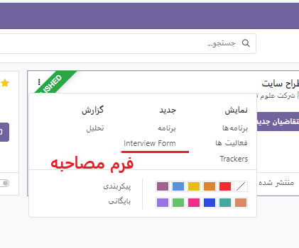
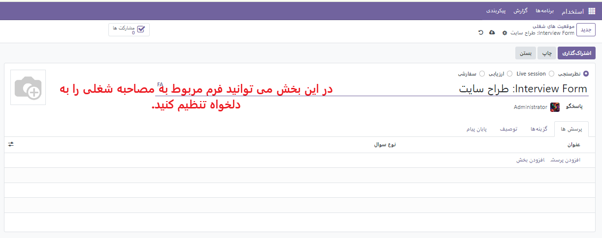
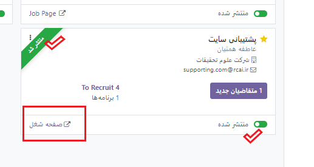
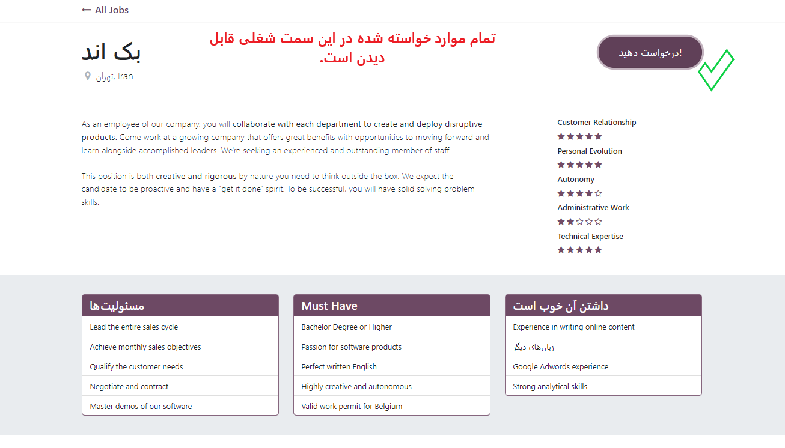
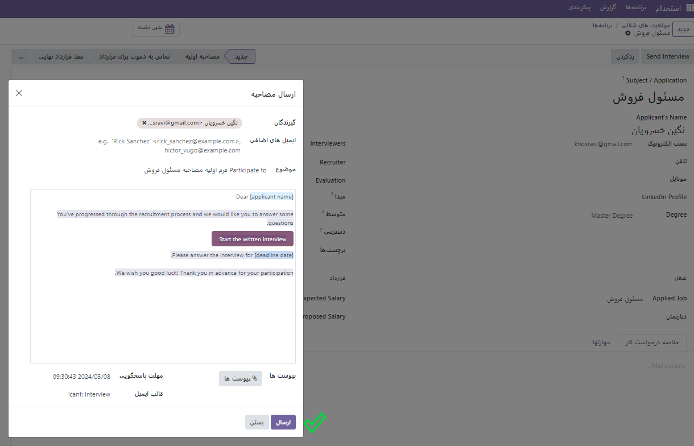

:nosearch:
:show-content:
:hide-page-toc:
:show-toc:

ارسال مصاحبه
===========================

در هر مرحله از فرآیند استخدام، برای کسب اطلاعات بیشتر می توان مصاحبه ای برای متقاضی ارسال کرد. این مصاحبه ها به صورت سفارشی ساخته می شوند و می توانند به روش های مختلفی قالب بندی شوند.

Odoo از اصطلاح مصاحبه استفاده می کند ، اما اینها را می توان به عنوان پرسشنامه، نظرسنجی، آزمون، گواهینامه و غیره در نظر گرفت. به عنوان مثال، یک موقعیت شغلی برای یک برنامه نویس کامپیوتر می تواند یک مصاحبه در قالب یک مسابقه برنامه نویسی برای تعیین سطح مهارت متقاضی داشته باشد. یک موقعیت شغلی برای سرور رستوران می‌تواند پرسشنامه‌ای در مورد در دسترس بودن متقاضی داشته باشد، اگر متقاضی مورد نظر باید در عصرهای آخر هفته در دسترس باشد. برای اطلاعات بیشتر در مورد ایجاد و ویرایش فرم های مصاحبه، به مستندات **موقعیت های شغلی** مراجعه کنید .

ساخت نظر سنجی
-----------------------------------
با انتخاب کارت شغلی مورد نظر مطابق شکل، صفحه ی نظر سنجی ایی باز می شود که مخصوص همان موقعیت شغلی است و به عنوان فرم مصاحبه می توان در اختیار متقاضیان قرار داد.

**آموش ماژول **نظر سنجی** را مطالعه بفرمایید.**چ

نمایش صفحه شغل
----------------------
 زمانیکه یک کارت برای فرصت شغلی می سازید، قادر خواهید بود آن را پس از انتشار روی سایت مشاهده کنید . برای این منظور مطابق عکس زیر می توان عمل کرد.

 در صفحه بعد می توانید نام متقاضی، آدرس ایمیل، شماره تلفن، پروفایل لینکدین، رزومه و معرفی مختصری را در فرم درخواست کار ارائه شده درج کنید.  کنون می توانید از گزینه ارسال برای ذخیره داده های وارد شده استفاده کنید. دکمه ارسال به عنوان من احساس خوش شانسی دارم. پس از انجام این کار، درخواست با موفقیت برای کار خاص ارسال می شود.

 .. image:: ./img/rcm20.png
    :alt: ماژول استخدام
    :align: center

    رد در خواست
~~~~~~~~~~~~~~~~~~~~~

شما می توانی فرد متقاضی در هر مرحله ایی که بود از ادامه مسیر آن در فرآیند استخدام امتناع کنید. تنها کافیست از صفحه مورد نظر گزینه **رد کردن** را انتخاب کرده تا پنجره ایی باز شود و یکی از دلایل مربوط به رد درخواست را انتخاب کنید.

 .. image:: ./img/rcm21.png
    :alt: ماژول استخدام
    :align: center

بعد از رد کردن یک نوار قرمز در بالای صفحه سمت چپ  با عنوان **رد شد** نمایش داده می شود.

.. example:: مثال: 
    می خواهیم برای خانم خسروی که در مرحله لدو استخدام است یک فرم مصاجبه ارسال کنیم.

    1- ابتدا نظر سنجی مربوط به آن موقعیت شغلی را طراحی میکنیم\

    2.از صفحه مورد نظر ارسال مصاحبه (بالا سمت راست) انتخاب میکنیم.

    برای ساخت نظر سنج ابتدا روی کارت موقعیت شغلی مورد نظر روی 3نقطه کلیک کرده و گزینه فرم مصاحبه را انتخا می کنیم تا فرم نظرسنجی(مصاحبه) باز شود.

    .. image:: ./img/rcm24.png
       :alt: ماژول استخدام
       :align: center

نکته نهایی:
^^^^^^^
زمانیکه یک موقعیت شغلی ایجاد می شود از این سه تب می توانید مسیری که این موقعیت ها را در این بخش ها ببینید.
^^^^^^^

