:nosearch:
:show-content:
:hide-page-toc:
:show-toc:

=============
مهارت کارمندان
=============

در این بخش آموزش افزودن مهارت کارمندان و صدور گواهینامه آشنا می شوید.

پس از نصب ماژول **کارمندان**

ابتدا از منوی پیکربندی وارد بخش مهارت ها می شویم و با زدن گزینه **جدید** یک مهارت جدید را ایجاد میکنیم که می تواند شامل زیر مجموعه ایی از مهارت ها باشد و برای استخدام طیف گسترده ایی از کارمندان در یک دسته گنجانده شود.

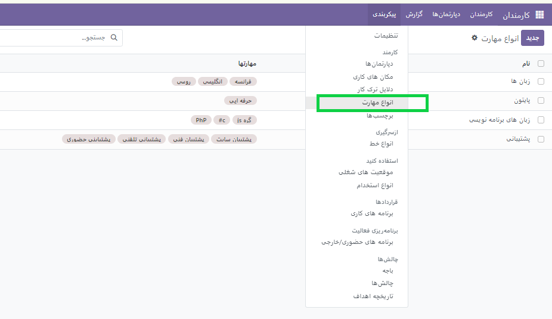

سپس پنجره جدیدی باز شده که می توان انواع مهارت ها با درصد در سطح های مختلف تعریف کرد.

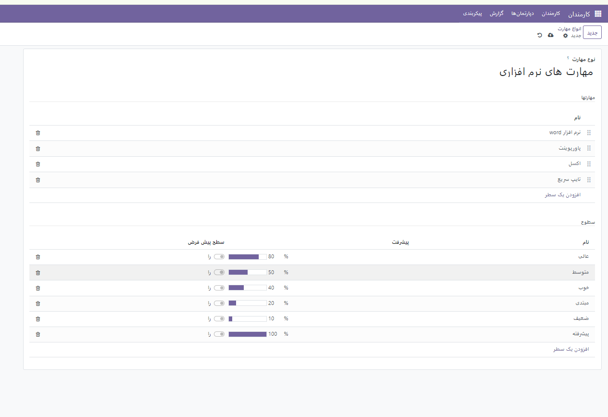

در مرحله بعد به بخش کارمندان رفته و با تعریف کارمند جدید می توانید مهارت های تعریف شده از قبل را با درصد  مهارت سطح دانش استخدام نمایید.

**حتما دقت شود بعد از تعریف مهارت ها آن را ذخیره کنید.**

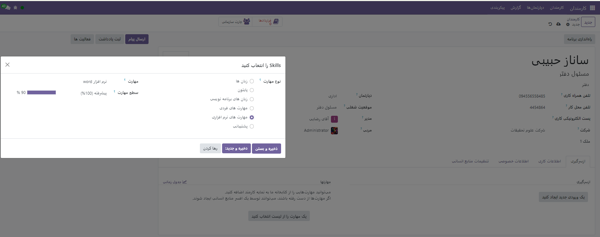

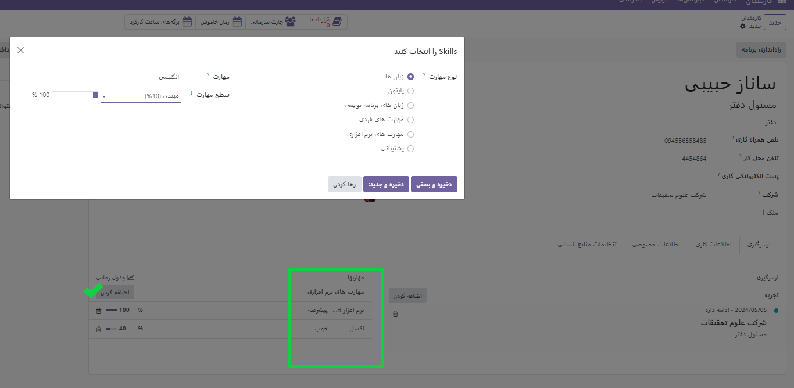

شما مهارت هایی که از قبل در سییستم تعریف شده بود و این موقعیت شغلی نیازمند آن بود را برای شخص مورد نظر تعریف کردید.

حال فرض کنید می خواهید برای کارمندان خود دوره آموزشی تعریف کنید که در پایان گواهینامه اعطا کنید. برای این منظور از منو **گزارش ها** مطابق عکس زیر عمل میکنیم.

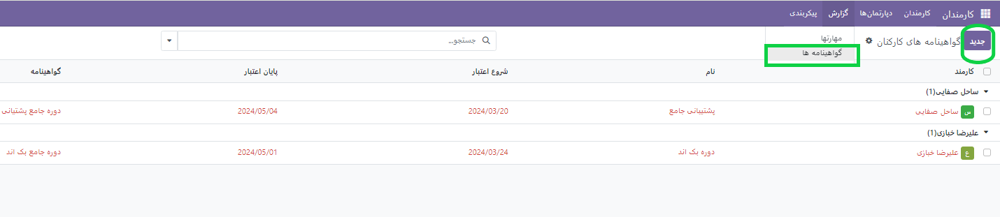

با فشردن گزینه *جدید* پنجره ایی باز می شود که اطلاعات دوره آموزشی مورد نظر را وارد میکنیم و به فرد مورد نظر منصوب میکنیم.

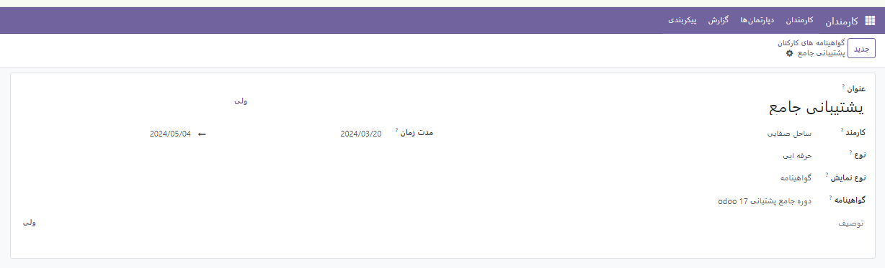

- **نوع**: می تواند شامل سطح آن دوره باشد.
- **نوع نمایش** : دارای سه حالت کلاسیک،گواهینامه و دوره است.
- **دوره** : می تواند شامل دوره های از قبل تعریف شده باشد و یا همان لحظه آن دوره را تغریف میکند.
- **گواهینامه**: از گواهینامه های از قبل تعریف شده و یا ایجاد یک گواهینامه با امتحان های مربوط بهخود ایجاد کرد.

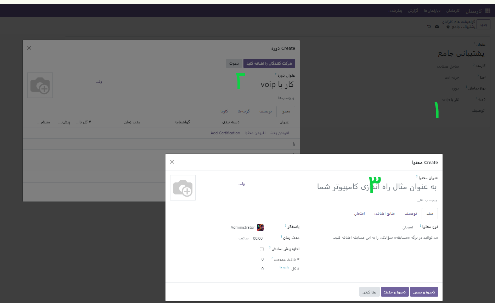

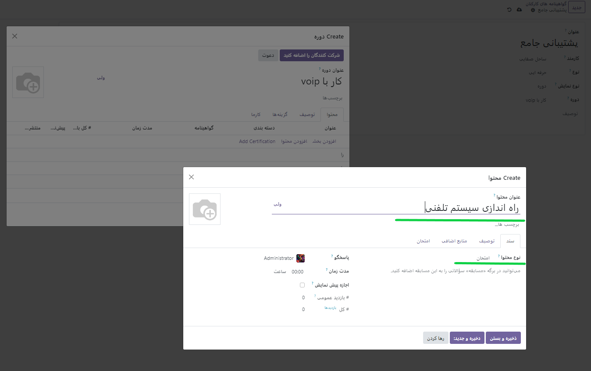

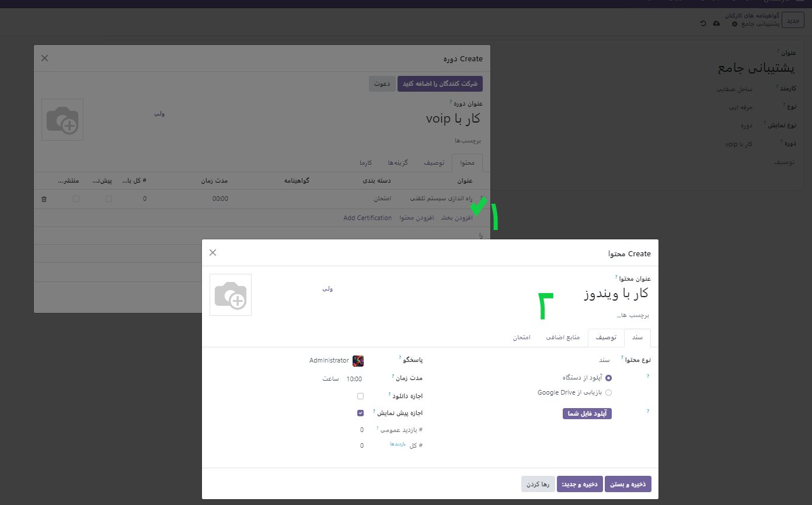

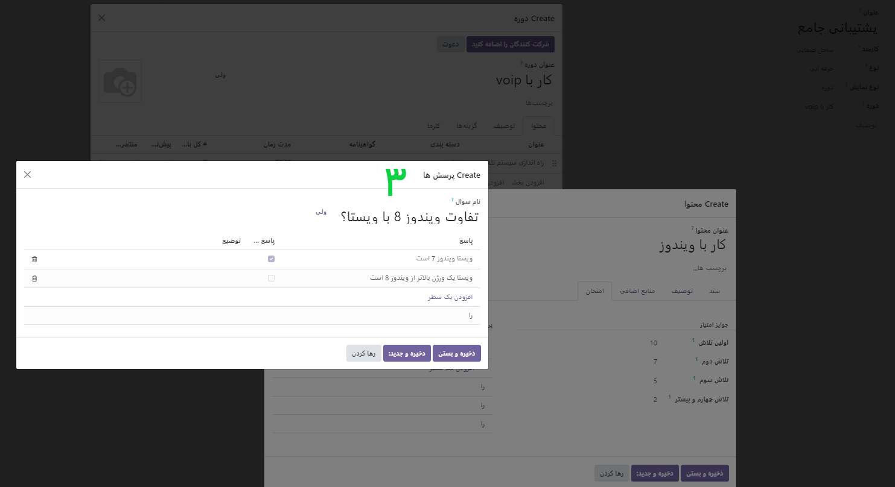

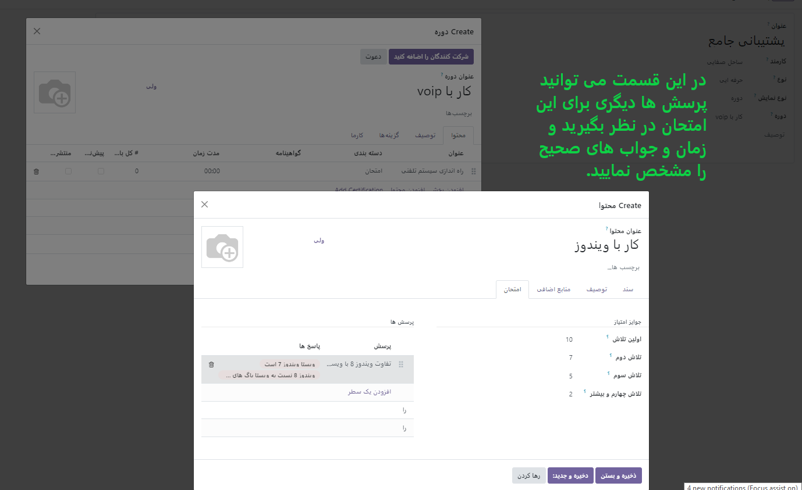

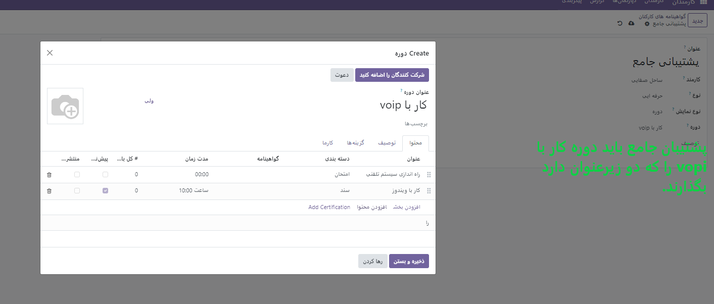

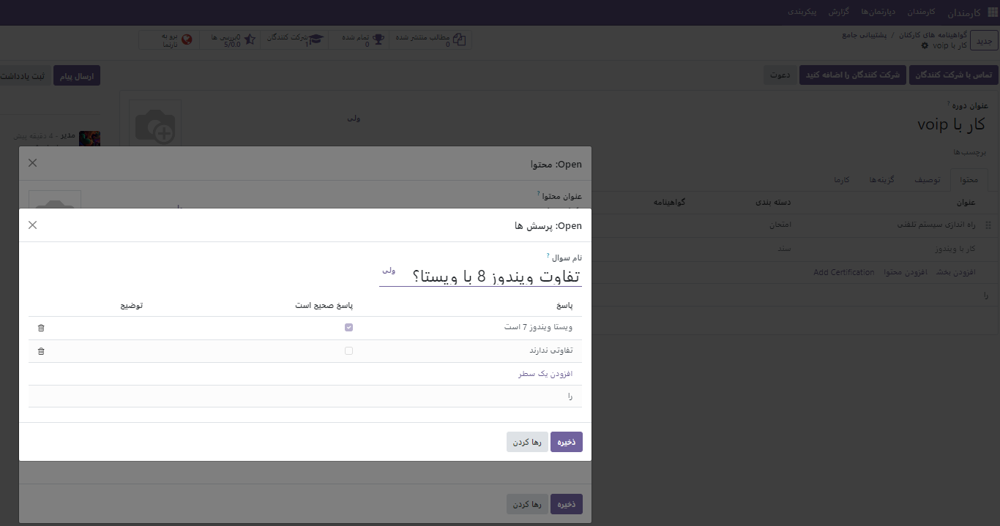

.. note:: 
    
    **نکته** دقت شود برای هر سوال باید دو پاسخ در نظر گرفته شود. یکی برای جواب درست یکی برای پاسخ غلط. با زدن تیک داخل مربع جواب صحیح مشخص می شود.

.. image:: ./img/skill114.png
    :alt: مهارت ها
    :align: center

زمانیکه یک دوره را تعریف کردید می توانید از گزینه **دعوت به شرکت کنندگان** افرادی که بایدایم مهارت را بگذارند دعوت کنید. و یا از گزینه **دعوت** لینک اشتراک را برای آنها ارسال کنید.

.. image:: ./img/skill115.png
    :alt: مهارت ها
    :align: center

برای انتشار دوره ایی باید از قسمت بالا روی گزینه **برو به سایت** استفاده کنیم و حالت این دوره را به حالت **انتشار** دربیاوریم.

.. image:: ./img/skill116.png
    :alt: مهارت ها
    :align: center

همانطور که مشاهده می کنید پس از انتشار دوره صفحه ی فوق در سایت شما قابل نمایش است.

در منوی **گزارش** قسمت **مهارت ها** می توانیم افرادی که مهارت های خاصی را از انها می دانیم مشاهده کنیم.

.. image:: ./img/skill117.png
    :alt: مهارت ها
    :align: center

.. toctree::
   :titlesonly:

   ./skill
