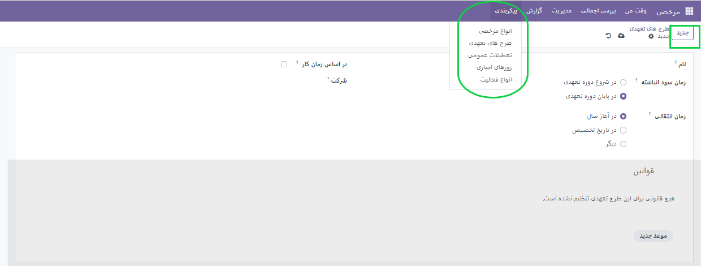
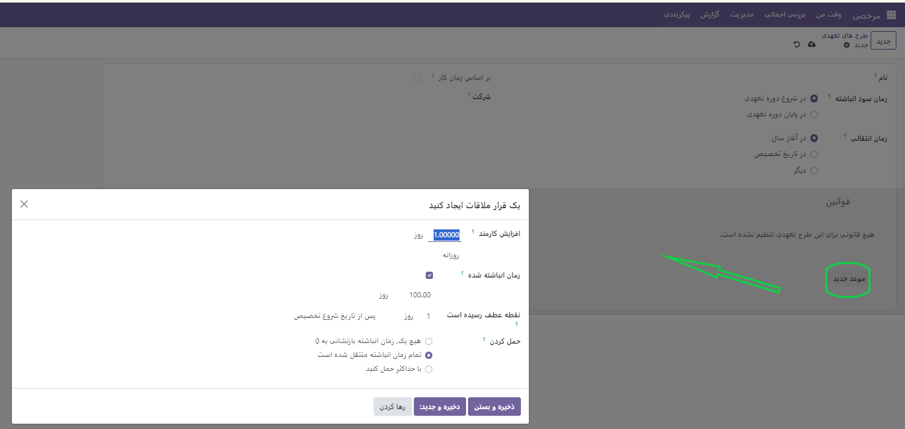
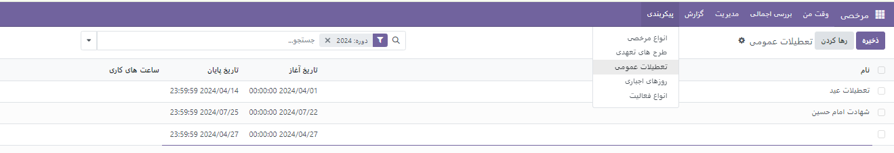
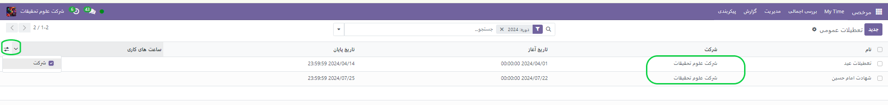
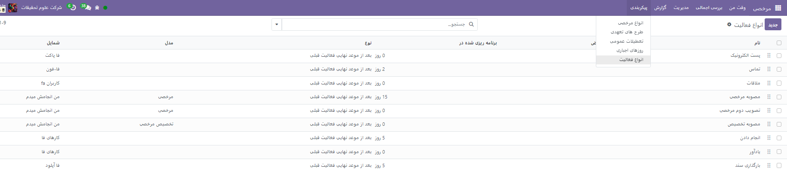
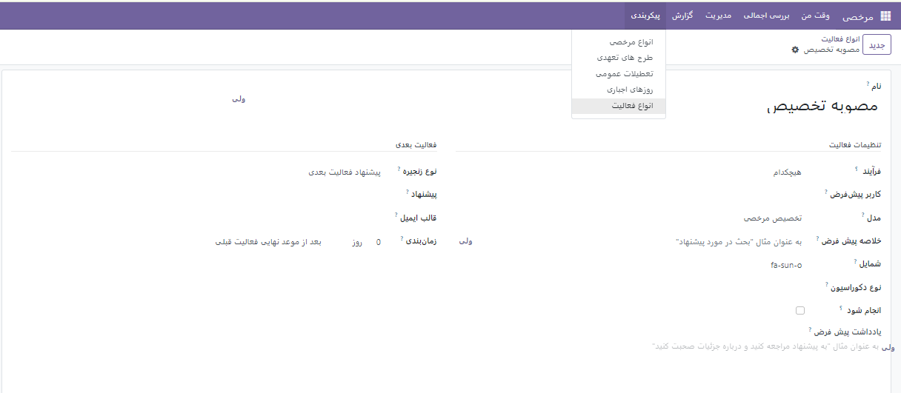
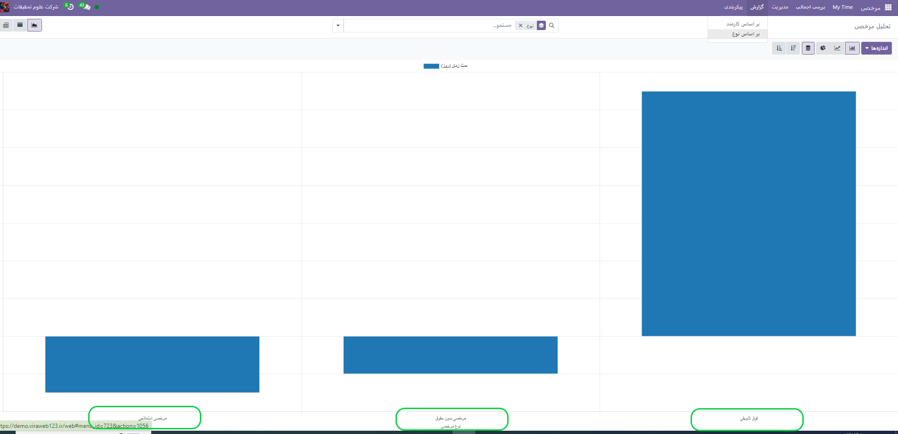

:nosearch:
:show-content:
:hide-page-toc:
:show-toc:

پیکربندی
================

در این منو انواع طرح های مرخصی وجود دارد که می توانید قوانین آن را بر اساس هر فرد برای هر شرکت تعیین کنید.

**طرح های تعهدی**

اطلاعات زیر را در فرم وارد کنید:

•	نام : نام طرح تعهدی را وارد کنید.
•	زمان سود تعهدی : زمانی را انتخاب کنید که کارمند شروع به جمع آوری مرخصی کند، چه در شروع دوره تعهدی یا در پایان دوره تعهدی .
•	زمان انتقال : زمانی را انتخاب کنید که کارمند زمان قبلی را دریافت کند. گزینه ها عبارتند از:
o	در ابتدای سال : اگر اقلام تعهدی در اول ژانویه سال آینده تغییر کند، این مورد را انتخاب کنید.

o	در تاریخ تخصیص : در صورتی که به محض اینکه زمان به کارمند اختصاص داده شد، اقلام تعهدی تغییر کند، این را انتخاب کنید.

o	سایر : اگر هیچ یک از دو گزینه دیگر قابل اجرا نیستند، این گزینه را انتخاب کنید. پس از انتخاب، یک قسمت تاریخ انتقال ظاهر می شود. با استفاده از دو منوی کشویی، یکی برای روز و دیگری برای ماه، تاریخ را انتخاب کنید.
•	بر اساس زمان کار : در صورتی که تعلق زمان مرخصی با ساعات کار کارمند تعیین شود، این گزینه را فعال کنید. روزهایی که به عنوان زمان کار در نظر گرفته نمی شوند ، به طرح تعهدی در Odoo کمک نمی کنند.
•	انتقال نقطه عطف : این انتخاب تعیین می کند که چه زمانی کارمندان به نقطه عطف جدید می روند. اگر آنها واجد شرایط تغییر نقاط عطف در وسط یک دوره پرداخت هستند، انتخاب کنید که آیا کارمند نقاط عطف را فوراً تغییر دهد یا بعد از این دوره تعهدی (پس از دوره پرداخت فعلی).

**تعطیلات عمومی**

در تقویم سال روزهای تعطیلات رسمی را باید در این بخش  تعریف کرد.

**فعالیت ها**

در این قسمت می توانید فعالیت هایی که طی اعطای مرخصی به کارمندان انجاممی شود را به صورت یک فعالیت جدید ثبت کنید و در ماژول مرخصی از آن استفاده کنید.

گزارش
-----------------------------

از این قسمت می توانیم گزارش های مرخصی هر کارمند و یا گزارش های عنوان های  مرخصی ها را به صور ت نموادار مشاهده کنیم.

بررسی اجمالی
--------------
این منو به شما یک نگاه کلی از مرخصی ها در تقویم نمایش میدهد.
