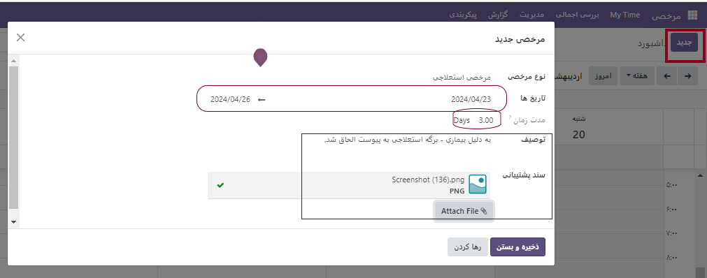
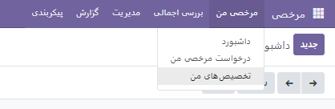
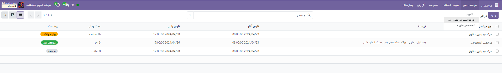
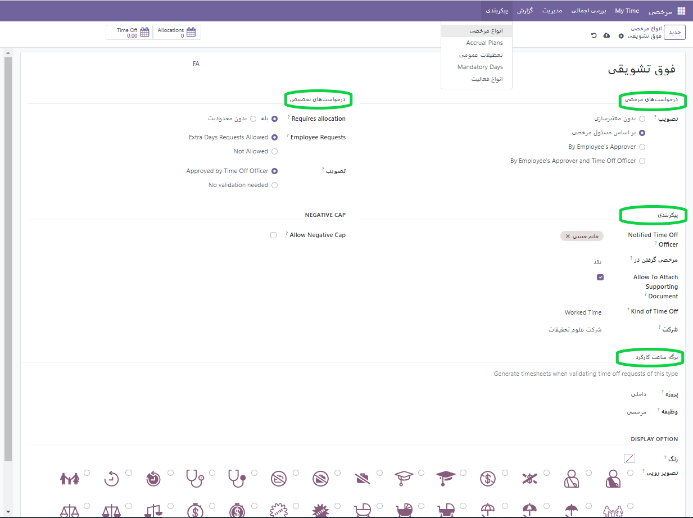
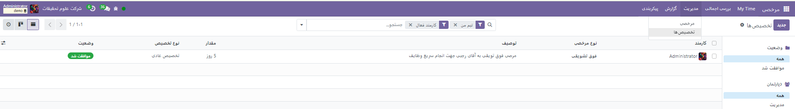
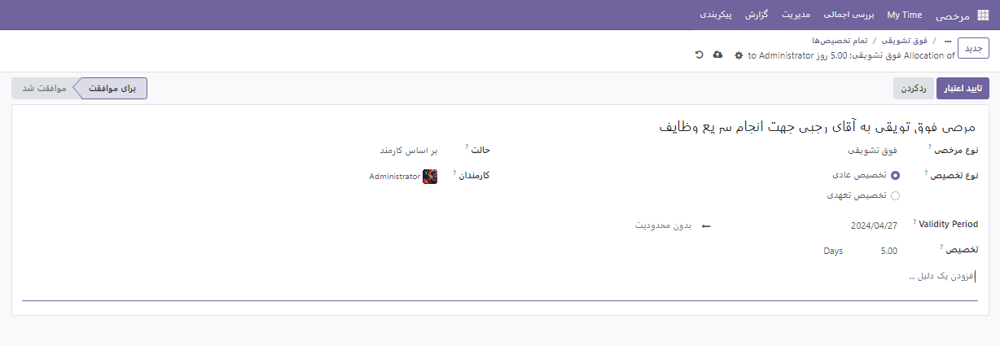
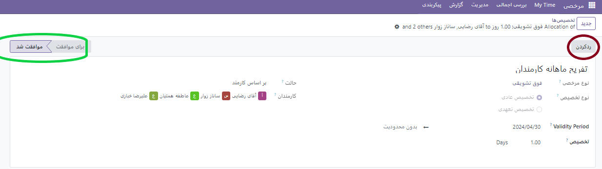

:nosearch:
:show-content:
:hide-page-toc:
:show-toc:

ثبت مرخصی جدید
================

در ماژول اصلی با زدن دکمه **جدید** صفحه ایی باز می شود که شما می توانید بر اساس نیاز خود نوع مرخصی و بازه آن و در صورت نیاز الحاق پیوستی به مرخصی خود آن را درج نمایید.

مرخصی من
-------------------------------
پس از ثبت مرخصی باید در این قسمت به منو **درخواست های مرخصی من** رفته تا مدیر فرم مرخصی را تایید و یا رد کند. 

انواع مرخصی‌ها
-------------------------------
برای مشاهده انواع مرخصی‌های پیکربندی‌شده فعلی، به مسیر برنامه مرخصی ◄ پیکربندی ◄ انواع مرخصی بروید. انواع مرخصی در یک نمای لیست ارائه می‌شوند. برنامه مرخصی با چهار نوع مرخصی پیش‌فرض پیکربندی شده است: مرخصی با حقوق (استحقاقی، مرخصی استعلاجی، مرخصی بدون حقوق، و روزهای جبرانی. هر یک از این موارد را می‌توان متناسب با نیازهای کسب‌وکارها تغییر داد یا به‌صورت پیش‌فرض استفاده کرد.

**ایجاد نوع مرخصی جدید**

برای ایجاد نوع جدیدی از مرخصی، به برنامه مرخصی ◄ پیکربندی ◄ انواع مرخصی بروید. روی دکمه جدید کلیک کنید تا فرم خالی نوع مرخصی را مشاهده کنید.

نام نوع خاص مرخصی را در خط خالی بالای فرم، مانند مرخصی استعلاجی یا تعطیلات وارد کنید. سپس، اطلاعات زیر را در فرم وارد کنید:

**بخش درخواست‌های مرخصی**

•	تأیید: نوع تأیید مورد نیاز برای نوع مرخصی را انتخاب کنید. گزینه‌ها عبارتند از:
o	بدون تأیید: هنگام درخواست این نوع مرخصی، نیازی به تأیید نیست. درخواست مرخصی بلافاصله پس از درخواست تأیید می‌شود.
o	توسط مسئول مرخصی: فقط مسئول مرخصی مشخص‌شده در این فرم در فیلد مسئول مرخصی، برای تأیید درخواست مرخصی لازم است. این گزینه به طور پیش فرض انتخاب شده است.
o	توسط تأیید کننده کارمند: فقط تأیید کننده مشخص شده کارمند برای مرخصی، که در تب اطلاعات کاری در فرم کارمند تنظیم شده است، برای تأیید درخواست مرخصی لازم است.
o	توسط تأیید کننده کارمند و مسئول مرخصی: هم تأیید کننده مرخصی مشخص شده کارمند و هم مسئول مرخصی برای تأیید درخواست مرخصی لازم هستند.
•	مسئول مرخصی: فردی را که مسئول تأیید درخواست‌ها و تخصیص‌ها برای این نوع خاص مرخصی است انتخاب کنید.
•	مرخصی در: فرمت درخواست مرخصی را از منوی کشویی انتخاب کنید. گزینه‌ها عبارتند از:

o	روز: اگر مرخصی فقط به صورت روز کامل (8 ساعت) قابل درخواست است.

o	نیم روز: اگر مرخصی فقط به صورت نیم روز (4 ساعت) قابل درخواست است.

o	ساعت: اگر مرخصی به صورت ساعتی قابل درخواست است.

•	کسر ساعات اضافی: اگر درخواست مرخصی باید ساعات اضافی انباشته شده توسط کارمند را نیز شامل شود، این کادر را علامت بزنید.
•	اجازه پیوست سند پشتیبان: اگر می‌خواهید به کارمند اجازه دهید تا اسناد را به درخواست مرخصی خود پیوست کند، این کادر را علامت بزنید. این کار در مواردی که به مستندات نیاز است، مانند مرخصی استعلاجی طولانی مدت، مفید است.
•	نوع مرخصی: از منوی کشویی نوع مرخصی را انتخاب کنید، مرخصی یا سایر.
•	شرکت: اگر چندین شرکت در پایگاه داده ایجاد شده باشد و این نوع مرخصی فقط برای یک شرکت اعمال شود، شرکت را از منوی کشویی انتخاب کنید. اگر این فیلد خالی بماند، نوع مرخصی برای همه شرکت‌های موجود در پایگاه داده اعمال می‌شود.

**بخش درخواست‌های تخصیص**

•	نیاز به تخصیص: اگر مرخصی باید به کارمندان تخصیص داده شود، بله را انتخاب کنید. اگر مرخصی بدون تخصیص قبلی قابل درخواست است، بدون محدودیت را انتخاب کنید. اگر بدون محدودیت انتخاب شود، گزینه‌های زیر در فرم ظاهر نمی‌شوند.
•	درخواست‌های کارمند: اگر کارمند می‌تواند بیش از حد تخصیص داده شده درخواست مرخصی کند، درخواست روزهای اضافی مجاز را انتخاب کنید.

•	اگر کارمندان نباید بتوانند بیش از حد تخصیص داده شده درخواست مرخصی کنند، گزینه مجاز نیست را انتخاب کنید.
•	تأیید: نوع تأیید(های) مورد نیاز برای تخصیص این نوع خاص مرخصی را انتخاب کنید.

o	نیازی به تأیید نیست نشان می‌دهد که هیچ تأییدی لازم نیست.

o	تأیید شده توسط مسئول مرخصی نشان می‌دهد که مسئول مرخصی تنظیم شده در این فرم باید تخصیص را تأیید کند.

o	تعیین شده توسط مسئول مرخصی نشان می‌دهد که مسئول مرخصی تنظیم شده در این فرم باید مرخصی را تخصیص دهد.

.. note::
    نکته»»
    **برگه ساعت کارکرد** طبق تعریف هر سازمان بر اساس محاسبه حقوق برای مرخصی ها تعیین می شود. لذا این قسمت برای هر سازمان متفاوت خواهد بود.

تخصیص مرخصی
------------------------

گاها مدیر یک مجموعه تمایل دارد به کارمندان خود مرخصی های دیگری اعطا کند. مثلا یک کارمند از 2 روز مرخصی خود استفاده کرده و نیاز دارد یک روز دیگر درخواست مرخصی بدهد. در این صورت باید از قسمت تخصیص های من در خواست یک مرخصی جدید بدهد. همین گزینه از سمت مدیریت قابل انجام است  بدین منظور از بخش **مدیریت** >> **تخصیص مرخصی**  یک نوع مرخص جدید برای کارمند یا برخی از کارمندان در نظر بگیرد. بدین منظور در این قسمت مطابق عکس های زیر فرم ها را پر می کند. بعد از اتمام تخصیص باید به این مرخصی اعتبار داد تا به حالت موافقت شده در بیاید . و در صورت عدم تمایل می توان این تخصیص را رد کرد.

