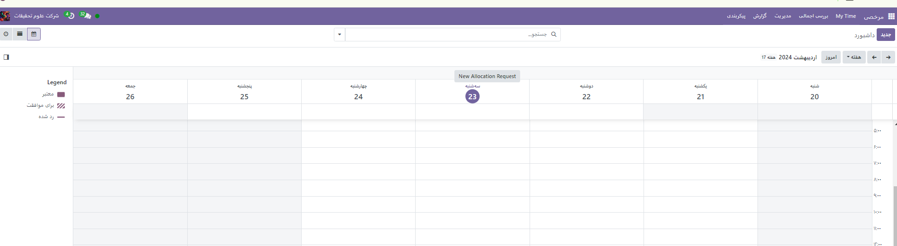

:nosearch:
:show-content:
:hide-page-toc:
:show-toc:

==========================
مدیریت مرخصی
==========================

یکی از وظایف اصلی مدیریت منابع انسانی، مدیریت مرخصی است. حصول اطمینان از اینکه برگ ها به درستی ثبت شده اند، جنبه حیاتی هر سازمانی است. همچنین اگر به مدیریت مرخصی خود فکر نکنید، برای سازمان مضر خواهد بود. غیبت کلیه کارگران درگیر در پروژه باید مستند باشد. اگر برگ‌ها برداشته می‌شوند، باید به‌طور منظم برداشته شوند و به‌درستی استفاده شوند تا از عملکرد روان و کارآمد کسب‌وکار اطمینان حاصل شود. برای این کار باید ماژول Time Off را در Odoo ERP فعال کنید. این ماژول خاص برای کنترل مرخصی در بخش های منابع انسانی استفاده خواهد شد. شما تأییدیه درخواست مرخصی خود را از افسران کنترل مربوطه در همان بستر دریافت خواهید کرد. حقوق و دستمزد، مرخصی های با حقوق، بازده، و بسیاری از انتخاب های مرتبط با مرخصی، همه توسط ماژول ارائه می شوند. اکنون بیایید نحوه مدیریت و کنترل ماژول را بررسی کنیم تا اطمینان حاصل شود که مرخصی کارکنان به آرامی انجام می شود.

با نصب ماژول مرخصی وارد محیط زیر می شود.

..............................

.. toctree::
   :titlesonly:

   ./newtimesoff

