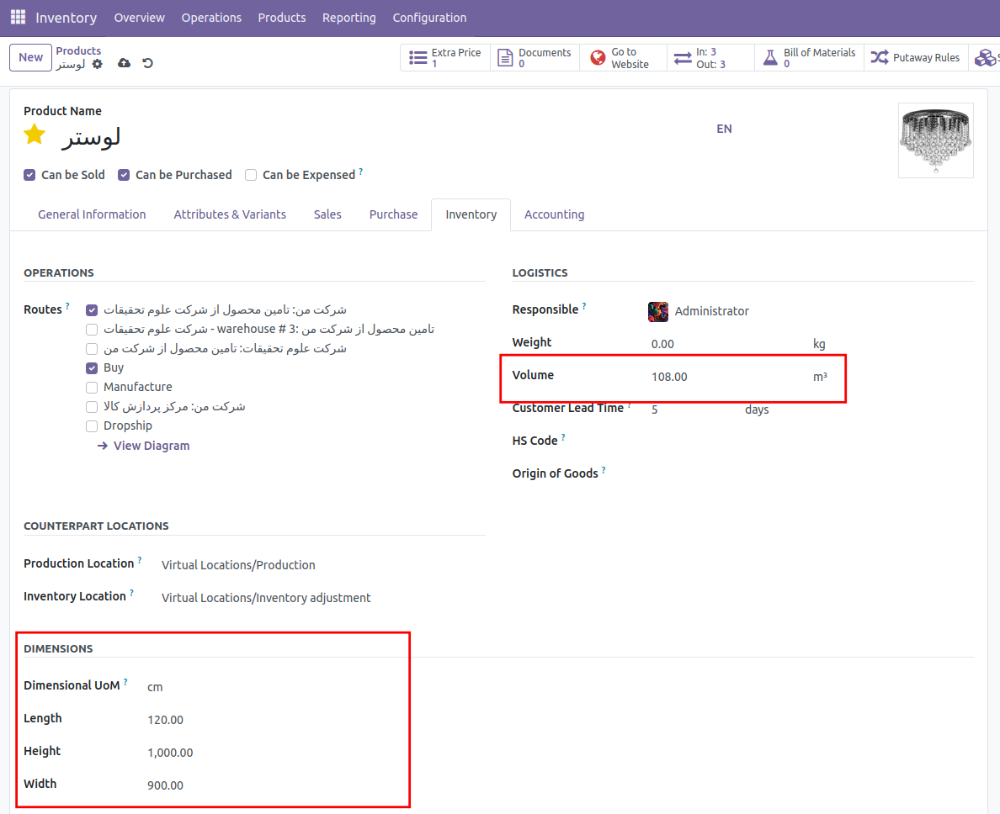

:nosearch:
:show-content:
:hide-page-toc:
:show-toc:

===========================================
ابعاد محصول
===========================================

این ماژول در واقع برای محاسبه اندازه محصول ما در انبار استفاده میشود زیرا در انبار اندازه و سایز محصول در نگهداری محصول در انبار بسیار مهم مییاشد . و همچنین اندازه یک محصول برای ارسال آن نیز بسیار هم است . همان طور که در تصویر زیر میبینید بعد از نصب ماژول  چند فیلد به تب inventory  اضاف میشود .یکی Dimensional UoM که واحد اندازه گیری طول و عرض و ارتفاع میباشد  و سه فیلد دیگر که مقادیر این سه پارامتر است و یک فیلد دیگر به نام volume که به صورت اتوماتیک حساب میشود و حجم این محصول بر اساس طول و عرض و ارتفاع میباشد . که در تصویر دو آنها خط قرمز کشیده شده است .

این ماژول از ماژول های oca است و میتوان آن را در repository git  oca  پیدا کرد .