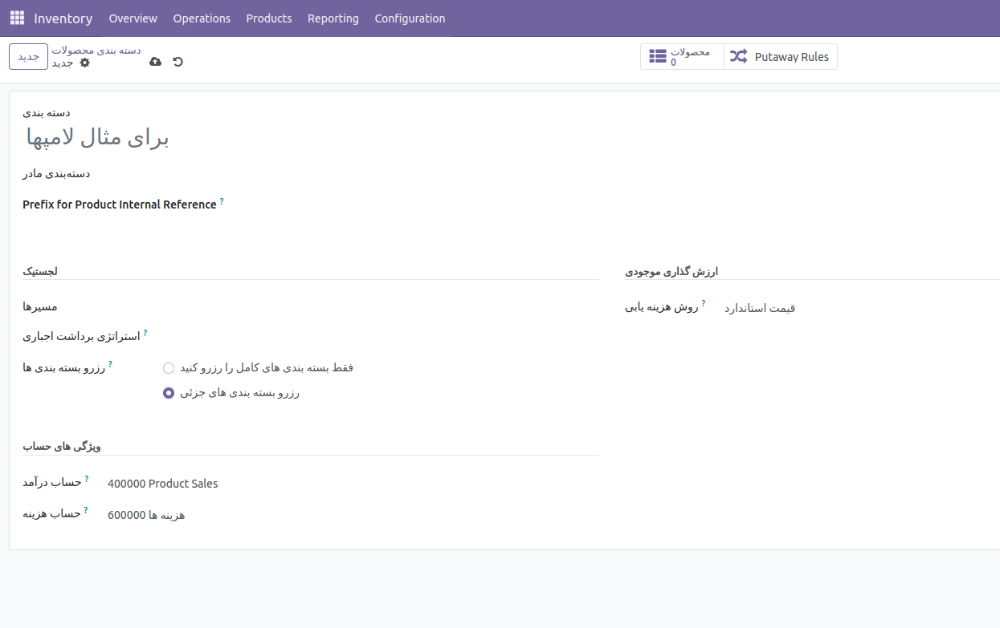

:nosearch:
:show-content:
:hide-page-toc:
:show-toc:

===========================================
 افزودن sequence code  به دسته بندی
===========================================

این ماژول در واقع برای اضاف کردن یک sequences (اعداد ترتیبی) به reference id محصول بر اساس دسته بندی محصول میباشد یعنی ما یک  sequences را برای یک category اختصاص میدهیم تا بتوانیم از روی reference کد آن بتوانیم تشخیص دهیم این محصول مربوط به کدام دسته می باشد . برای اضاف کردن آن میتوان وارد  Inventory > Configuration > Products > Products Categories شد و در تعریف یک دسته بندی فیلد Prefix for Product Internal Reference همین sequences مورد نظر میباشد که باید کد پیشوند را در آن تعریف کرد . علاوه بر این یک تنظیمات نیز در General Settings  وجود دارد که با فعلا کردن آن میتوان این امکان را فراهم کرد که این sequences به
 کد  reference اضاف شود . که در مسیر زیر است Settings -> General Settings -> Product Sequences 

این ماژول از ماژول های oca است و میتوان آن را در repository git  oca  پیدا کرد .