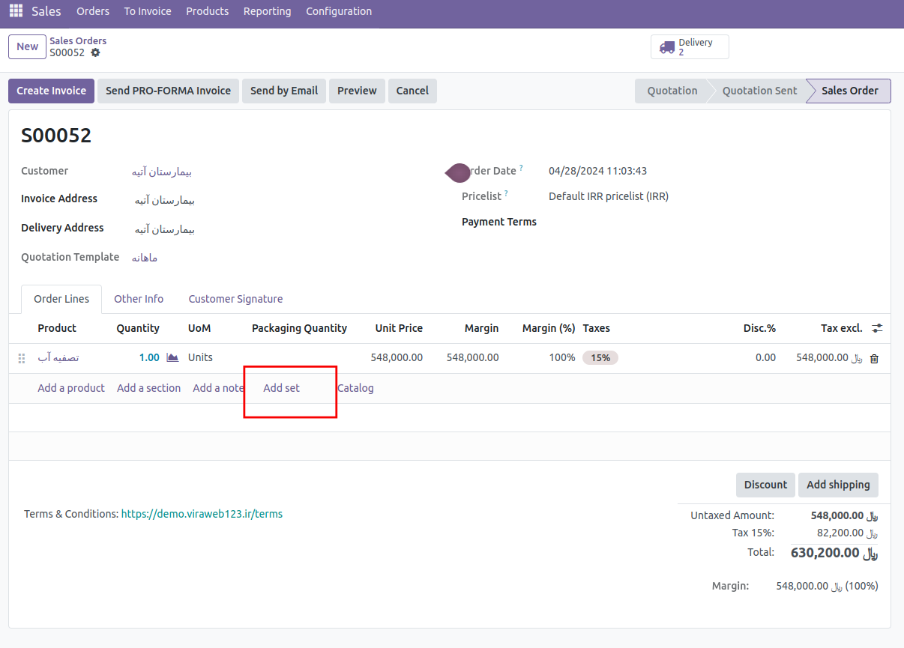

:nosearch:
:show-content:
:hide-page-toc:
:show-toc:

===========================================
مجموعه محصولات
===========================================

 این ماژول برای مجموعه کردن چند محصول مورد استفاده قرار میگیرد . زیرا در بسیار از حالتها محصولات به صورت یک مجموعه بوده و خریدار تمام اون مجموعه را خریداری میکند مثلا در خرید قطعات خودرو بسیار از قطعات یک  مجموعه هستند مثلا کاربری که چرخ ماشین خود را میخواد تعویض کند چرخ ماشین یک مجموعه از قطعات است مثلا شامل لاستیک و تیوپ و رینگ و قالپاق میشود . برای اینکه فروشنده راحت باشد این قطعات را میتواند به صورت یک مجموعه تعریف کند و در زمان فاکتور کردن آنها کافیست اسم مجموعه را وارد کند کل آن قطعات به فاکتور اضاف میشود و بعد از آن اگر نیاز بود آنها را میتواند ادیت کند و کم و زیاد کند . 
 
 برای تعریف یک product set  باید وارد  Sales  > Products > Product set  شده و از آنجا میتوان یک مجموعه جدید تعریف کرد و اعضای این مجموعه را نیز از آنجا انتخاب کرد و در فاکتور ها هر زمان نیاز شد این مجموعه را اضاف کرد .     

این ماژول از ماژول های oca است و میتوان آن را در repository git  oca  پیدا کرد .