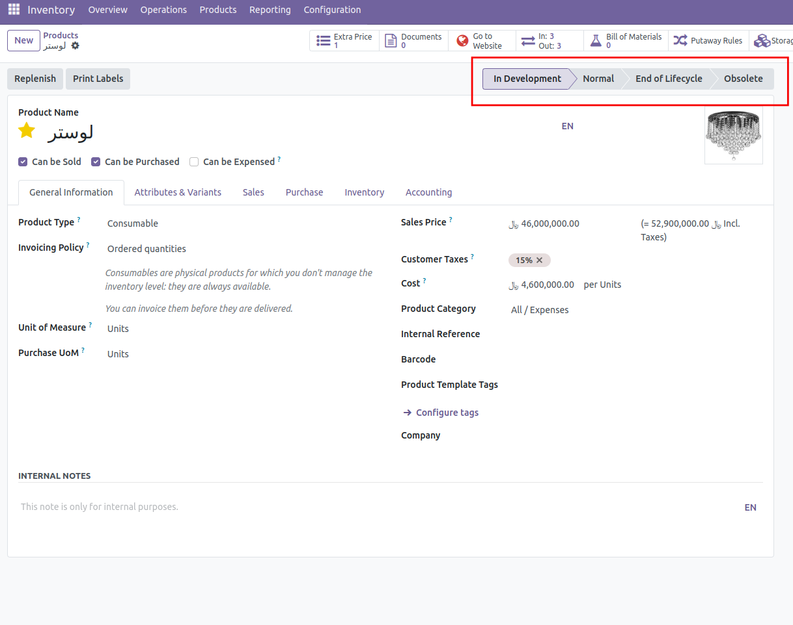

:nosearch:
:show-content:
:hide-page-toc:
:show-toc:

===========================================
حالتهای محصول
===========================================

این ماژول یک حالت را به محصول اضاف میکند که این حالت وضعیت محصول را مشخص میکند وضعیت محصول در طول نگهداری در انبار میتواند تغییر کند . به صورت پیش فرض چند حالت به محصول اضاف میکند که شامل In Development که منظور این است که محصول در حال توسعه است و آماده فروش نیست حال دیگر Normal است که به معنی این است که محصول در آماده فروش است حال دیگر End of Lifecycle است که به معنی این است که چرخه حیات محصول به پایان رسیده و حالت دیگر obsolete است که به معنی منسوخ شدن محصول میباشد . هر محصول ممکن است در زمانی که در انبار است در هر کدام از این حالتها باشد . که با نصب این ماژول از repository git  oca  میتوان این موضوع را مدیریت کرد . این حالتهای که در بالا گفته شد به صورت پیش فرض میباشد که میتوان انها را تغییر نیز داد و حالتهایی که مدنظر کاربر میباشد را ساخت برای تغییر این حالتها میتوان از منوی  Sales > Configuration > Products > Product States. این کار را انجام داد .

این ماژول از ماژول های oca است و میتوان آن را در repository git  oca  پیدا کرد .