:nosearch:
:show-content:
:hide-page-toc:
:show-toc:

==============
نگهداری
==============

یک تجارت تولیدی معمولاً از ابزارها و ماشین‌آلات مختلفی استفاده می‌کند. در صورت خرابی هر یک از این ماشین‌آلات یا قطعات تجهیزات، فرآیند تولید به تعویق می‌افتد و بهره‌وری از بین می‌رود. برای افزایش عمر ماشین‌آلات و تجهیزات و جلوگیری از این مسائل، تعمیر و نگهداری مناسب مورد نیاز است. اگر می‌خواهید محصولی کاملاً تمام شده داشته باشید، تضمین کیفیت ماشین‌هایی که برای فرآیند تولید استفاده می‌کنید بسیار مهم است. اگر ماژول خاصی برای مدیریت درخواست‌های تعمیر و نگهداری شرکت وجود داشته باشد، حجم کاری شما کاهش می‌یابد. هر نوع سفارش تعمیر و نگهداری در یک شرکت را می‌توان با کمک ماژول نگهداری نظارت کرد.

تیم تعمیر و نگهداری
--------------------

شما می‌توانید یک تیم تعمیر و نگهداری را در ماژول نگهداری برای مدیریت و نظارت بر سفارشات تعمیر و نگهداری تعیین کنید. هنگام ایجاد درخواست تعمیر و نگهداری، از شما خواسته می‌شود که تیم تعمیر و نگهداری را ذکر کنید. شما می‌توانید یک تیم برای رسیدگی به تعمیر و نگهداری تعیین کنید. این تیم مسئول تمام فعالیت‌های مربوط به تعمیر و نگهداری خواهد بود. همانطور که در زیر نشان داده شده است، می‌توانید تیم‌های مختلف تعمیر و نگهداری یک شرکت را در داشبوردی که هنگام راه‌اندازی ماژول نگهداری  ظاهر می‌شود، بیابید.

در هر تیم تعمیر و نگهداری، می توانید بررسی کنید که چند درخواست برای تکمیل وجود دارد. برای دسترسی به ابزارهای عملیاتی اضافی، می‌توانید روی سه نقطه عمودی کوچکی که در گوشه سمت راست بالای هر برگه قرار دارند، کلیک کنید.

درخواست‌های تعمیر و نگهداری را می‌توانید با استفاده از نوار منو به ترتیب زیر مشاهده کنید:

1.	همه
2.	برای انجام
3.	در حال انجام
4.	انجام شده

شما می‌توانید گزارش درخواست‌های تعمیر و نگهداری را با کمک ابزار گزارش‌گیری دریافت کنید. از گزینه Configuration برای ایجاد هر گونه تغییری که می‌خواهید در تیم تعمیر و نگهداری استفاده کنید.
برای ایجاد یک تیم تعمیر و نگهداری جدید، می‌توانید از منوی پیکربندی ماژول گزینه Maintenance Teams را انتخاب کنید. با این کار، یک پنجره جدید با لیستی از تیم‌هایی که قبلاً برای تعمیر و نگهداری راه‌اندازی شده‌اند، راه‌اندازی می‌شود.

.. Note::
    نام تیم، اعضای تیم و شرکت ممکن است در اینجا ذکر شود. هنگامی که این فیلدها پر شدند، خدمه تعمیر و نگهداری جدید شما برای شروع کار آماده می شوند.
    .. image:: ./img/maintenance4.png
       :alt:  نگهداری
       :align: center
    
تشکیل یک تیم جدید ساده است. همانطور که در زیر نشان داده شده است، با کلیک بر روی دکمه جدید، یک خط جدید به لیست موجود اضافه می شود.

تجهیزات
----------------

تجهیزات برای فعالیت های تعمیر و نگهداری مورد نیاز است و سوابق تجهیزات نیز باید نگهداری شود. با استفاده از این گزینه، می توانید فهرستی از تمام تجهیزات تعمیر و نگهداری مورد استفاده توسط کسب و کار خود را تهیه کنید. 

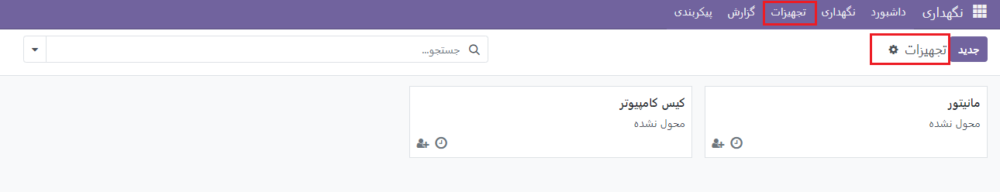

شما می توانید هر قطعه از تجهیزات پیکربندی شده در شرکت خود را در نمای کانبان پلت فرم مشاهده کنید. دکمه های ویرایش و حذف برای عملیات مربوطه توسط نمادهای کوچک سه نقطه در هر تب تجهیزات ارائه می شوند.

فیلترهای پیش فرض مانند My Equipment، Assigned، Unassigned، Under Maintenance، Messages خوانده نشده و Archived در دسترس هستند. با استفاده از گزینه Used By موجود در نمای فرم، تجهیزات را می توان برای استفاده توسط کارکنان یا بخش های خاص تعیین کرد. این را می توان در هنگام ساخت تجهیزات در فرم مشخص کرد.
تجهیزات را می توان بر اساس تکنسین ها، دسته ها، مالکان، فروشندگان، کارمندان و بخش ها با استفاده از ابزار Group By گروه بندی کرد. می توانید با استفاده از نماد ساعت کوچک چندین فعالیت را برای تجهیزات تنظیم کنید.
پس از کلیک بر روی دکمه New، همانطور که در زیر مشاهده می کنید به پنجره تنظیمات جدید فرستاده می شوید. شما می توانید نام دستگاه را در فضای تعیین شده مشخص کنید.

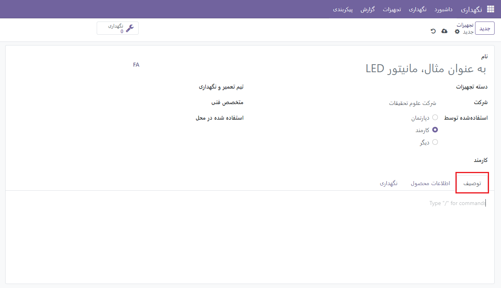

از منو، دسته تجهیزات مناسب را انتخاب کنید. فیلد مناسب به طور خودکار حاوی نام شرکت خواهد بود. در ستون Used By می توانید تشخیص دهید که این تجهیزات متعلق به چه کسانی است. بخش، کارمند یا سایر گزینه ها هستند. به شما یک فضای اضافی داده می شود تا بر اساس انتخابی که انتخاب می کنید، کارمند یا بخش را تعریف کنید. با ذکر آنها در فضای ارائه شده، اکنون می توانید این تجهیزات را به یک تیم تعمیر و نگهداری خاص اختصاص دهید. تکنسین مسئول این تجهیزات، تاریخ تعیین شده، تاریخ ضایعات، محل استفاده شده در محل و مرکز کار را در فیلدهای مناسب ذکر کنید. می توانید در تب توضیحات توضیحاتی در مورد تجهیزات ارائه دهید.
اکنون به تب اطلاعات محصول بروید تا مشخصات تجهیزات را وارد کنید. اگر کسب و کار دیگری تجهیزات را فراهم کند، ممکن است نام فروشنده و مراجع فروشنده ذکر شود.

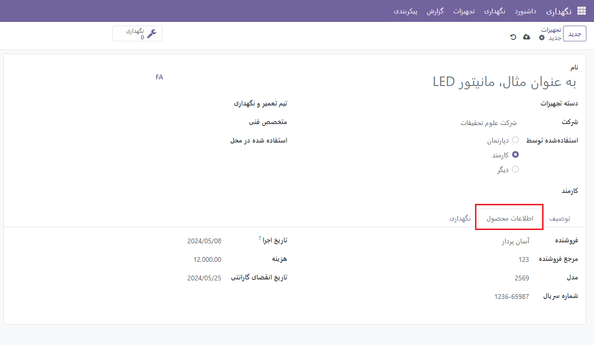

می توانید مدل و شماره سریال دستگاه را در قسمت های مربوطه قرار دهید. تاریخ موثر بودن تجهیزات با عبارت Effective Date نشان داده می شود. از این روز می توان برای محاسبه میانگین فاصله بین خرابی ها استفاده کرد. در قسمت های مربوطه هزینه و تاریخ انقضای گارانتی را وارد نمایید.

قسمت Next Preventive Maintenance تاریخ اقدام بعدی تجهیزات را ارائه می دهد. بر اساس فرکانس نگهداری پیشگیرانه که در ناحیه مربوطه وارد می‌کنید، این مورد در دسترس خواهد بود. مدت زمان نگهداری این تجهیزات را می توان بر حسب ساعت تعریف کرد. روزها را می توان به میانگین زمان مورد انتظار بین شکست اضافه کرد. میانگین زمان بین خرابی ها به طور خودکار بر اساس تاریخ اجرایی که انتخاب کرده اید محاسبه می شود. با در نظر گرفتن آخرین تاریخ خرابی و میانگین مدت زمان بین خرابی ها، تخمین خرابی بعدی نمایش داده می شود. فیلد ارائه شده آخرین تاریخ خرابی را نشان می دهد. قسمت Mean Time to Repair مقدار معمول زمان مورد نیاز برای تعمیر تجهیزات را نشان می دهد. پیکربندی تجهیزات پس از مشخص شدن تمام اطلاعات مورد نیاز به پایان می رسد.

دسته بندی تجهیزات
-----------------

می توانید از منوی Configuration گزینه Equipment Categories را انتخاب کنید تا چندین دسته برای تجهیزات تعیین کنید. این پنجره حاوی لیستی از دسته های تجهیزاتی است که قبلاً پیکربندی شده اند.

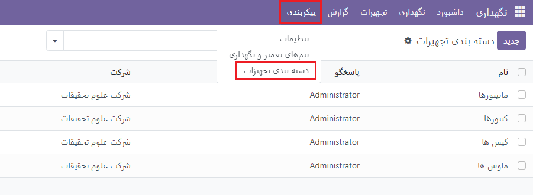

نام، مسئول و شرکت رده تجهیزات در لیست ذکر خواهد شد. "جدید" را از منو انتخاب کنید. با این کار پنجره جدیدی که در زیر می بینید ظاهر می شود. در فضای ارائه شده می توانید نام دسته را وارد کنید.

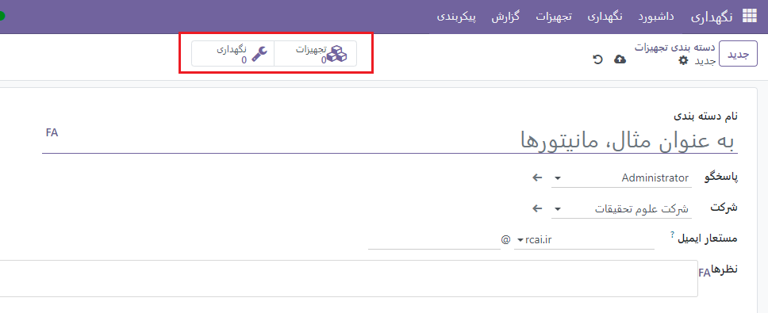

نام کارمند مسئول این دسته از تجهیزات را در قسمت Responsible قرار دهید. فیلد ارائه شده شامل نام شرکت خواهد بود. از قسمت نظرات می توان برای افزودن هر گونه اطلاعات مربوط به این دسته تجهیزات استفاده کرد. دکمه هوشمند Equipment می تواند برای به دست آوردن اطلاعات در مورد تجهیزات اختصاص داده شده به این دسته پس از پیکربندی دسته تجهیزات استفاده شود. لیست درخواست های تعمیر و نگهداری ایجاد شده برای تجهیزات متعلق به این دسته با دکمه هوشمند Maintenance نمایش داده می شود.

درخواست های تعمیر و نگهداری
----------------------------------

هنگامی که تجهیزات با خرابی مواجه شد، می توانید از گزینه درخواست تعمیر و نگهداری برای آن درخواست تعمیر و نگهداری ایجاد کنید. در زیر تصویری از نمای کانبان این پلتفرم را مشاهده می کنید.

درخواست های تعمیر و نگهداری اختصاص داده شده به فازهای مختلف در اینجا مشاهده می شود.

با استفاده از گزینه های نشان داده شده در منوی کوچک سه نقطه می توانید هر درخواست تعمیر و نگهداری را ویرایش و حذف کنید.
نماد پلاس در سمت راست عنوان هر مرحله قرار دارد و با کلیک بر روی آن می توانید درخواست جدیدی به آن مرحله اضافه کنید. به شما فضایی داده می شود تا عنوان درخواست را درج کنید. روی دکمه افزودن کلیک می‌کنید تا درخواست جدیدی در آن مرحله اضافه شود و برای تغییر مشخصات درخواست، روی دکمه ویرایش کلیک می‌کنید.
عنوان هر مرحله دارای یک نماد تنظیمات است که امکان تا کردن، ویرایش و حذف مرحله خاص را ارائه می دهد.

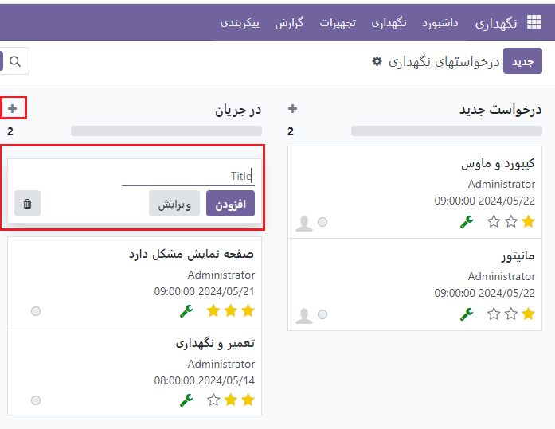

برای افزودن مرحله جدید به نمای کانبان می توانید از گزینه +Stage استفاده کنید. این شما را قادر به انجام این کار می کند.
با توجه به شرایط اضطراری با استفاده از ستاره می توان به درخواست اولویت بیشتری داد. می توانید با استفاده از نشانگر ساعت کوچک، وظایف مربوط به درخواست تعمیر و نگهداری را برنامه ریزی کنید. در درخواست تعمیر و نگهداری، می توانید کارمند اختصاص داده شده را مشاهده کنید که در تصویر مشخص شده است. هنگامی که روی آن کلیک می کنید، یک پنجره چت ظاهر می شود که در آن می توانید با کارمند مربوطه مکالمه را شروع کنید.
اکنون با استفاده از دکمه New یک درخواست نگهداری جدید ایجاد کنید.

فضای ارائه شده به شما امکان می دهد عنوان درخواست نگهداری را ارائه دهید. فیلد Created By حاوی نام کارمندی است که درخواست را ایجاد می کند. شناسه تجهیزاتی را که باید در قسمت مربوطه نگهداری شود ذکر کنید. روز درخواست، روزی است که شما درخواست را ارسال می کنید. به طور کلی، Odoo17 دو نوع درخواست تعمیر و نگهداری ارائه می دهد: اصلاحی و پیشگیرانه. برای محافظت در برابر هر گونه خرابی پیش بینی نشده تجهیزات، تعمیر و نگهداری پیشگیرانه به طور منظم انجام می شود. هنگامی که یک مورد از تجهیزات خراب می شود، تعمیر و نگهداری اصلاحی برای رفع آن انجام می شود.
Recurrent فیلد جدیدی است که در صورت انتخاب Preventive Maintenance نوع به فرم اضافه می شود. سپس می توان فرکانس Repeat را در آنجا اضافه کرد.

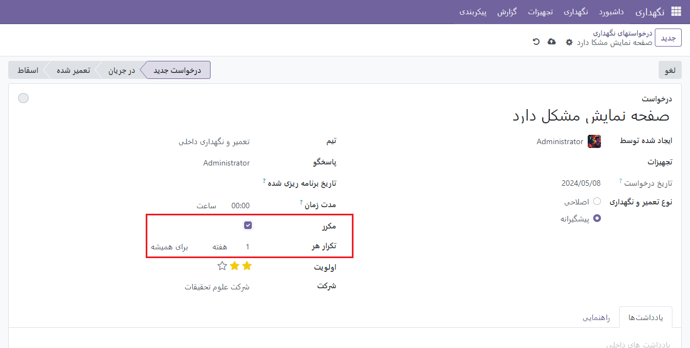

اگر این تجهیزات را دارید، می‌توانید در درخواست سفارش ساخت آن را ذکر کنید. به منظور کسب اطلاعات بیشتر در مورد درخواست، یک توضیحات اضافه کنید.
شما می توانید تیمی را برای مراقبت از نگهداری تجهیزات در قسمت Team تعیین کنید. مسئول این درخواست نگهداری باید ذکر شود. قسمت Scheduled Date به شما امکان می دهد روزی را که تیم برای تعمیر و نگهداری برنامه ریزی کرده است را مشخص کنید. از ساعت ها می توان برای توصیف طول کار تعمیر و نگهداری استفاده کرد. از ستاره ها برای نشان دادن اولویت درخواست استفاده کنید. درخواست تعمیر و نگهداری پس از افزودن Email cc و Company به فیلدهای مربوطه آماده پردازش است.

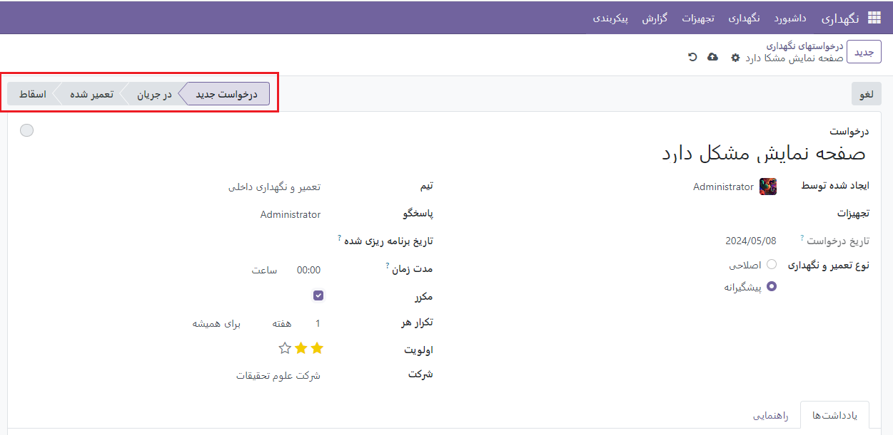

می توانید مراحل درخواست را بر اساس نحوه انجام مراحل تغییر دهید. فازهایی که به طور پیش فرض استفاده می شوند عبارتند از New Request، In Progress، Repaired و Scrap.

مراحل نگهداری
----------------

با استفاده از منوی پیکربندی ماژول می توانید مراحل جدیدی را برای درخواست های تعمیر و نگهداری اضافه کنید. این کار سازماندهی درخواست ها را بر اساس وضعیت آنها آسان تر می کند. پلتفرم مراحلی را که قبلاً ساخته شده‌اند، همانطور که در زیر نشان داده شده است، نمایش می‌دهد.

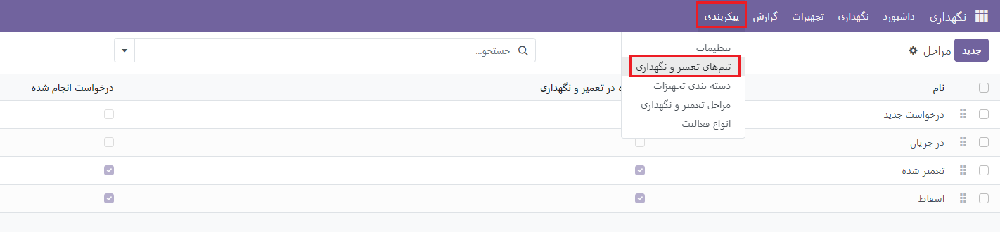

با انتخاب گزینه New می توانید یک خط جدید اضافه کنید که می توانید نام مرحله را به آن اضافه کنید.

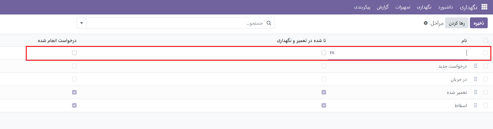

در اینجا می توانید نام صحنه را وارد کنید. می توانید فیلد Folded in Maintenance Pipe را روشن کنید تا این مرحله در نمای Kanban درخواست های تعمیر و نگهداری تا شود. می توانید قسمت Request Done را فعال کنید تا درخواست های این مرحله به عنوان تکمیل شده علامت گذاری شوند.

تقویم تعمیر و نگهداری
------------

تمام درخواست های ایجاد شده در ماژول شما در قالب تقویم از طریق گزینه Maintenance Calendar موجود در منوی Maintenance نمایش داده می شود. درخواست ها را می توان بر اساس روز، هفته، ماه و سال مشاهده کرد. نمای تقویم مناسب برای نیازهای خود را انتخاب کنید. در تقویم، که در زیر نمایش داده می شود، درخواست های تعمیر و نگهداری برنامه ریزی شده است.

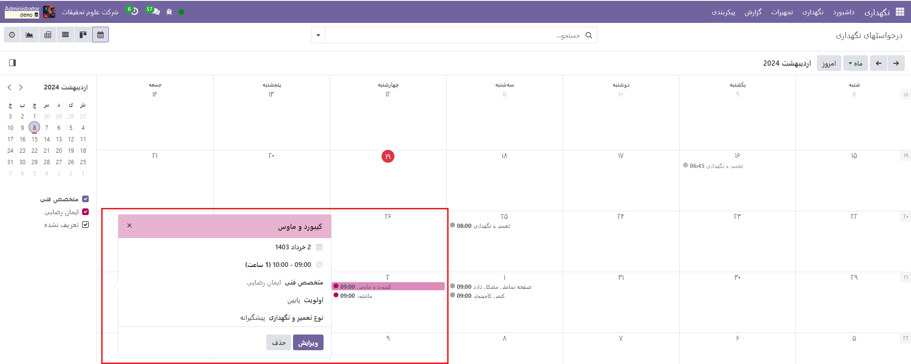

تاریخ برنامه ریزی شده، زمان، تکنسین، اولویت و نوع تعمیر و نگهداری همگی در پیش نمایش نمایش داده می شوند. درخواست تعمیر و نگهداری نیز می تواند از طریق نمای تقویم انجام شود. می توانید این کار را با انتخاب تاریخ تعمیر و نگهداری که می خواهید برنامه ریزی کنید انجام دهید. پنجره پاپ آپی مشابه تصویر زیر خواهید دید.

پس از افزودن موضوع در اینجا، روی دکمه ایجاد کلیک کنید. در صورت نیاز به افزودن جزئیات بیشتر به درخواست، از دکمه ویرایش برای دسترسی به نمای فرم پنجره ایجاد درخواست تعمیر و نگهداری استفاده کنید.

