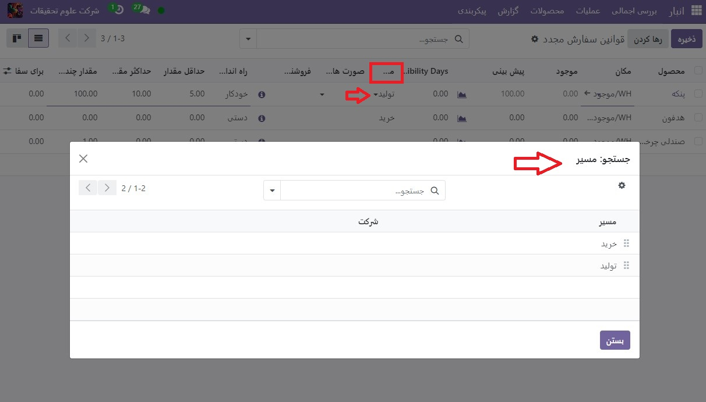

:nosearch:
:show-content:
:hide-page-toc:
:show-toc:

===========================================
قوانین سفارش مجدد
===========================================

قوانین سفارش مجدد برای نگه داشتن سطوح سهام پیش بینی شده بالاتر از یک آستانه خاص بدون تجاوز از حد بالایی مشخص شده استفاده می شود. این با تعیین حداقل مقداری که موجودی آن نباید کمتر شود و حداکثر مقداری که موجودی نباید از آن تجاوز کند انجام می شود.

قوانین سفارش مجدد را می توان برای هر محصول بر اساس مسیری که برای دوباره شارژ کردن آن استفاده می شود پیکربندی کرد. اگر محصولی از مسیر خرید استفاده می‌کند، پس از اجرای قانون سفارش مجدد، یک درخواست قیمت (RFQ) ایجاد می‌شود. اگر محصولی از مسیر تولیداستفاده کند، به جای آن یک سفارش ساخت (MO) ایجاد می‌شود. این مورد بدون توجه به مسیر شارژ کردن مجدد انتخاب شده است.

.. seealso::
    - :doc:`https://www.youtube.com/watch?v=XEJZrCjoXaU`
    - :doc:`https://www.youtube.com/watch?v=XEJZrCjoXaU`

محصولات را برای قوانین سفارش مجدد پیکربندی کنید
------------------------------------------------------------------
برای استفاده از قوانین سفارش مجدد برای یک محصول، ابتدا باید به درستی پیکربندی شود. با رفتن به برنامه  :menuselection:`انبار --> محصولات --> محصولات`شروع کنید، سپس یک محصول موجود را انتخاب کنید، یا با کلیک کردن روی جدید، یک محصول جدید ایجاد کنید.

در فرم محصول، در برگه اطلاعات عمومی، مطمئن شوید که نوع محصول روی محصول قابل ذخیره سازی تنظیم شده است. این امر ضروری است زیرا Odoo فقط مقادیر موجودی محصولات قابل ذخیره‌سازی را ردیابی می‌کند و این عدد برای اجرای قوانین سفارش مجدد استفاده می‌شود.

سپس روی تب انبار کلیک کرده و از قسمت مسیرها یک یا چند مسیر را انتخاب کنید. انجام این کار به Odoo می گوید که از کدام مسیر برای شارژ کردن محصول استفاده کند.

.. image:: img/product replenishment/s20.jpg
    :align: center
    :alt: انبار.

اگر محصول با استفاده از مسیر خرید مجدداً سفارش داده شد، تأیید کنید که چک باکس قابل خرید در زیر نام محصول فعال باشد. این باعث می شود که برگه خرید ظاهر شود. روی تب خرید کلیک کنید و حداقل یک فروشنده و قیمتی که محصول را به آن می فروشند را مشخص کنید تا Odoo بداند محصول را از کدام شرکت باید خریداری کند.

.. image:: img/product replenishment/s21.jpg
    :align: center
    :alt: انبار.

اگر محصول با استفاده از مسیر تولید دوباره شارژ شود، باید حداقل یک فهرست اقلام (BoM) مرتبط با آن باشد. این امر ضروری است زیرا Odoo فقط برای محصولات با BoM سفارشات تولید ایجاد می کند.

اگر BoM از قبل برای محصول وجود ندارد، دکمه هوشمند فهرست اقلام را در بالای فرم محصول انتخاب کنید، سپس روی جدید کلیک کنید تا BoM جدیدی را پیکربندی کنید.

قوانین جدید برای سفارش مجدد ایجاد کنید
----------------------------------------------------------------

برای ایجاد یک قانون شارژ  مجدد، به برنامه  :menuselection:`انبار --> پیکربندی --> قوانین سفارش مجدد`بروید، سپس روی جدید کلیک کنید و خط جدید را به صورت زیر پر کنید:

    - محصول: محصولی که طبق قانون دوباره شارژ شود می شود.

    - مکان: مکانی که محصول در آن نگهداری می شود.

    - حداقل مقدار: حداقل مقداری که می توان بدون اعمال قانون پیش بینی کرد. وقتی موجودی پیش‌بینی‌شده به زیر این عدد می‌رسد، یک سفارش شارژ برای محصول ایجاد می‌شود.

    - حداکثر مقدار: حداکثر مقداری که موجودی تا سقف آن شارژ می شود.

    - مقدار چندگانه: مشخص کنید که آیا محصول باید در دسته‌هایی با مقدار معینی شارژ شود (به عنوان مثال، یک محصول می‌تواند در دسته‌های 20 تایی دوباره شارژ شود).

    - واحداندازه گیری: واحد اندازه گیری مورد استفاده برای سفارش مجدد محصول. این مقدار می تواند به سادگی واحد یا یک واحد اندازه گیری خاص برای وزن، طول و غیره باشد

.. tip::
    قوانین سفارش مجدد نیز می تواند از هر فرم محصول ایجاد شود. برای انجام این کار، به برنامه  :menuselection:`انبار --> محصولات --> محصولات` بروید و یک محصول را انتخاب کنید. سپس، روی دکمه هوشمند قوانین سفارش مجدد کلیک کنید و روی جدید کلیک کنید تا خط جدید را پر کنید، همانطور که در بالا توضیح داده شد.

برای استفاده پیشرفته از قوانین سفارش مجدد، با فیلدهای قانون سفارش مجدد زیر آشنا شوید:

    - راه اندازی  

    - تعداد روزهای که محصول موجود است

    - مسیر

راه اندازی
------------------------------------

هنگامی که سهام کمتر از حداقل قانون سفارش مجدد است، راه اندازی قانون سفارش مجدد را روی خودکار تنظیم کنید تا به طور خودکار سفارش های خرید یا تولید برای شارژ موجودی ایجاد شود.

از طرف دیگر، تنظیم دکمه راه اندازی قانون سفارش مجدد به صورت دستی، محصول و موجودی پیش‌بینی‌شده را در داشبورد تکمیل نشان می‌دهد، جایی که مدیر تدارکات می‌تواند سطوح موجودی، زمان تحویل و تاریخ‌های پیش‌ بینی‌شده ورود را بررسی کند.

.. seealso::
    - :doc:`selecting a replenishment strategy`

.. tip::
    داشبورد شارژمجدد با رفتن به برنامه انبار ‣ عملیات ‣ شارژمجدد قابل دسترسی است

برای فعال کردن فیلد راه اندازی، به برنامه  :menuselection:`انبار --> پیکربندی --> قوانین سفارش مجدد` بروید. سپس، روی نماد (لغزنده) که در سمت چپ  عناوین ستون ها قرار دارد، کلیک کنید و گزینه راه اندازی را از منوی کشویی گزینه های اضافی که ظاهر می شود، فعال کنید.

خودکار
----------------------------------------

قوانین سفارش‌دهی مجدد خودکار، که با تنظیم فیلد راه اندازی قانون سفارش مجدد روی خودکار پیکربندی شده‌اند، سفارش‌های خرید یا تولید را ایجاد می‌کنند زمانی که:

    #. زمانبندی اجرا می شود و مقدار موجود کمتر از حداقل است

    #. یک سفارش فروش تایید می‌شود و مقدار پیش‌بینی‌شده محصول را کمتر از حداقل می‌کند

.. tip::
    زمانبندی به طور پیش فرض تنظیم شده است که یک بار در روز اجرا شود.

    برای راه‌اندازی دستی یک قانون سفارش مجدد قبل از اجرای زمان‌بندی، مطمئن شوید که حالت برنامه‌نویس فعال است و برنامه انبار‣ عملیات ‣ اجرای برنامه ریزرا انتخاب کنید. سپس روی دکمه اجرای برنامه ریزدر پنجره پاپ آپی که ظاهر می شود کلیک کنید.

    توجه داشته باشید که این کار هر گونه اقدام برنامه ریزی شده دیگری را نیز آغاز می کند.

    .. image:: img/product replenishment/s26.jpg
        :align: center
        :alt: انبار.

.. example::
    محصول پنکه، دارای یک قانون سفارش مجدد خودکار است که وقتی مقدار پیش‌بینی‌شده کمتر از حداقل 5.00 باشد، فعال می‌شود. از آنجایی که پیش‌بینی فعلی 100.00است، قانون ترتیب‌بندی مجدد اعمال نمی‌شود.

    .. image:: img/product replenishment/s27.jpg
        :align: center
        :alt: انبار.

اگر مسیر خرید انتخاب شده باشد، یک  :abbr:`RFQ (Request for Quotation)`  ایجاد می شود. برای مشاهده و مدیریت  :abbr:`RFQ (Request for Quotation)`  ها، به برنامه  :menuselection:`خرید --> سفارشات --> درخواست برای پیش فاکتور` بروید.

اگر مسیر تولید انتخاب شود، یک  :abbr:`MO (Manufacturing Order)`  ایجاد می شود. برای مشاهده و مدیریت MO ها، به برنامه تولید ‣ عملیات ‣ سفارشات تولید بروید.

هنگامی که هیچ مسیری انتخاب نمی شود، Odoo مسیر مشخص شده در برگه انبار فرم محصول را انتخاب می کند.

قوانین سفارش مجدد دستی، که با تنظیم فیلد راه اندازی قانون سفارش مجدد روی دستی پیکربندی شده اند، زمانی که مقدار پیش بینی شده کمتر از حداقل مشخص شده باشد، یک محصول را در داشبورد تکمیل فهرست می کند

داشبورد تکمیل، که با رفتن به برنامه انبار‣ عملیات ‣ شارژمجدد قابل دسترسی است، مهلت‌های سفارش فروش، سطوح پیش‌بینی‌شده انبار، و زمان عرضه فروشنده را در نظر می‌گیرد. فقط زمانی نیازها را نمایش می دهد که زمان سفارش مجدد اقلام فرا رسیده باشد.

.. note::
    اگر پنجره یک روزه برای سفارش محصولات خیلی کوتاه است، به بخش روزهای مشاهده(Visibility Days) بروید تا نیاز از چند روز قبل در داشبورد تکمیل نمایان شود.

Visibility days(روزهایی که محصول قابل مشاهده است)
-----------------------------------------------------------------

وقتی قوانین سفارش مجدد دستی به یک محصول اختصاص می‌یابد، روزهای قابل مشاهده باعث می‌شود که محصول چند روز قبل روی داشبورد تکمیل **(برنامه انبار ‣ عملیات ‣ شارژ مجدد)** ظاهر شود.

مسیر
-----------------------------

Odoo اجازه می دهد تا مسیرهای متعددی در زیر برگه موجودی در هر فرم محصول انتخاب شود. به عنوان مثال، می توان خرید و تولید هر دو را انتخاب کرد، بنابراین عملکرد هر دو مسیر را فعال می کند.
Odoo همچنین به کاربران امکان می دهد یک مسیر ترجیحی را برای قانون سفارش مجدد محصول تعیین کنند. این مسیری است که در صورت انتخاب چندگانه، قانون پیش‌فرض آن را تعیین می‌کند. برای انتخاب مسیر ترجیحی، با رفتن به برنامه  :menuselection:`انبار --> پیکربندی --> قوانین سفارش مجدد` شروع کنید.

به طور پیش فرض، ستون مسیر در صفحه قوانین سفارش مجدد پنهان است.

ستون مسیر را با انتخاب نماد (لغزنده) در سمت چپ عناوین ستون ها و علامت زدن گزینه مسیر از منوی کشویی که ظاهر می شود، آشکار کنید.
داخل ستون روی ردیف یک قانون سفارش مجدد کلیک کنید، و یک منوی کشویی همه مسیرهای موجود برای آن قانون را نشان می دهد. یکی را انتخاب کنید تا آن را به عنوان مسیر ترجیحی تنظیم کنید

.. important::
    اگر چندین مسیر برای یک محصول فعال باشد اما هیچ مسیر ترجیحی برای قانون سفارش مجدد آن تنظیم نشده باشد، محصول با استفاده از مسیر انتخابی که ابتدا در برگه موجودی فرم محصول فهرست شده است، مجدداً سفارش داده می‌شود.