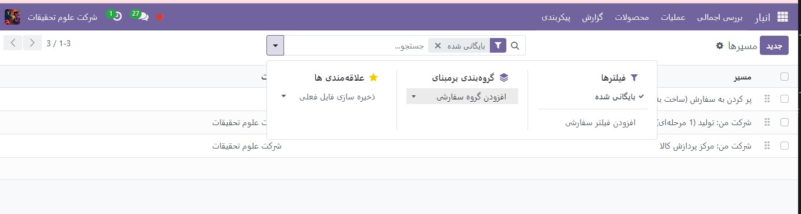
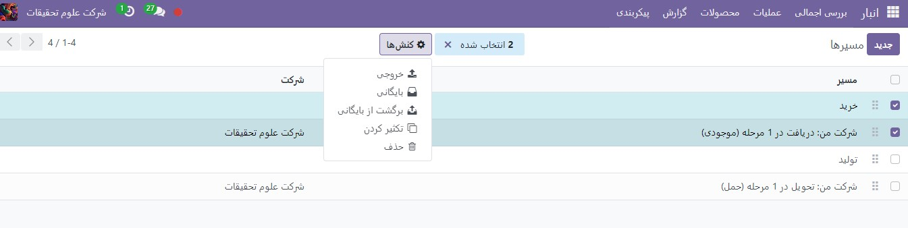
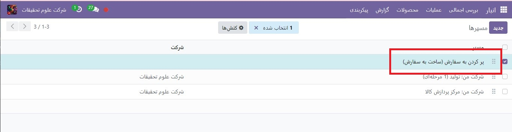
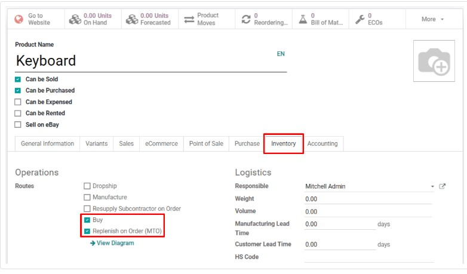
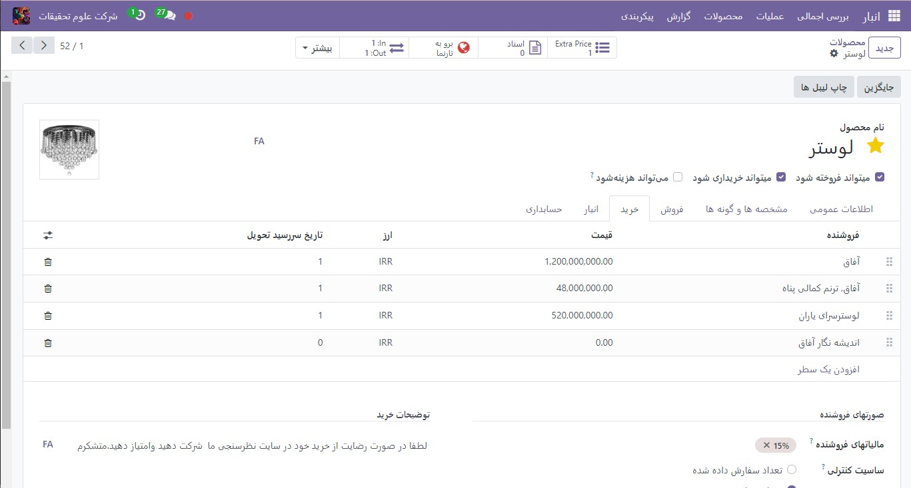

:nosearch:
:show-content:
:hide-page-toc:
:show-toc:

===========================================
شارژمجدد طبق سفارش(MTO)
===========================================

شارژ کردن  بر اساس سفارش، همچنین به عنوان MTO (ساخت به سفارش) شناخته می شود، یک استراتژی تکمیل است که هر بار که یک سفارش فروش برای یک محصول ایجاد می شود، یک پیش سفارش برای آن ایجاد می کند. برای محصولاتی که از یک فروشنده خریداری می‌شوند، یک درخواست برای قیمت‌گذاری (RFQ) ایجاد می‌شود، در حالی که یک سفارش فروش برای یک محصول تولید شده در داخل، باعث ایجاد یک سفارش تولید می‌شود. ایجاد یک  :abbr:`RFQ (Request for Quotation)` RFQ یا سفارش ساخت هر بار که سفارش فروش ایجاد می شود، صرف نظر از سطح موجودی فعلی محصول سفارش داده شده، رخ می دهد.

مسیر  (MTO) را از حالت آرشیو خارج کنید
----------------------------------------------
به طور پیش فرض، Odoo مسیر MTO را به عنوان بایگانی شده تنظیم می کند. این به این دلیل است که MTO یک گردش کار تا حدی خاص است که فقط توسط شرکت های خاصی استفاده می شود. با این حال، حذف آرشیو مسیر تنها در چند مرحله ساده آسان است.

برای انجام این کار، با پیمایش به  :menuselection:`انبار --> پیکربندی --> مسیرها` شروع کنید. در صفحه **مسیرها**روی دکمه **فیلترها** کلیک کرده و گزینه **بایگانی شده** را انتخاب کنید. این همه مسیرهایی را که در حال حاضر بایگانی شده اند نشان می دهد.

کادر انتخاب کنار شارژمجدد طبق سفارش (MTO) را فعال کنید، سپس روی دکمه کنش(چرخ دنده) کلیک کنید تا منوی کشویی نمایان شود. از منوی کشویی، برگشت از بایگانی را انتخاب کنید.

در نهایت، فیلتر بایگانی شده را از نوارجستجو… حذف کنید. صفحه مسیرها اکنون همه مسیرهای موجود، از جمله تکمیل سفارش (MTO) را نشان می دهد، که اکنون در برگه موجودی هر صفحه محصول قابل انتخاب است.

یک محصول را برای استفاده از مسیر MTO پیکربندی کنید
------------------------------------------------------------

با خارج شدن از آرشیو مسیر MTO، محصولات اکنون می توانند به درستی پیکربندی شوند تا از شارژمجدد در صورت سفارش استفاده کنند. برای انجام این کار، با رفتن به **انبار ‣ محصولات ‣ محصولات** شروع کنید، سپس یک محصول موجود را انتخاب کنید، یا برای پیکربندی یک محصول جدید، روی **ایجاد** کلیک کنید.

در صفحه محصول، تب **انبار** را انتخاب کنید و مسیر شارژ مجدد طبق سفارش (MTO) را در قسمت مسیرها به همراه یک مسیر دیگر فعال کنید.

.. important::
    مسیر شارژمجدد طبق سفارش (MTO) کار نمی کند مگر اینکه مسیر دیگری نیز انتخاب شود. این به این دلیل است که Odoo باید بداند که چگونه محصول را هنگامی که سفارشی برای آن ارسال می شود (خرید، تولید و غیره) دوباره پر کند.

اگر محصول برای انجام سفارشات فروش از یک فروشنده خریداری شده است، کادر بررسی قابل خرید را در زیر نام محصول فعال کنید. با انجام این کار، برگه خرید در کنار سایر برگه های تنظیمات در زیر ظاهر می شود.

تب خرید را انتخاب کنید و فروشنده و قیمتی را که محصول را با آن می فروشند مشخص کنید

