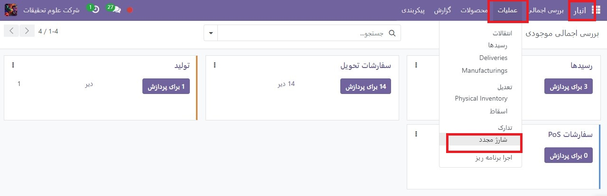
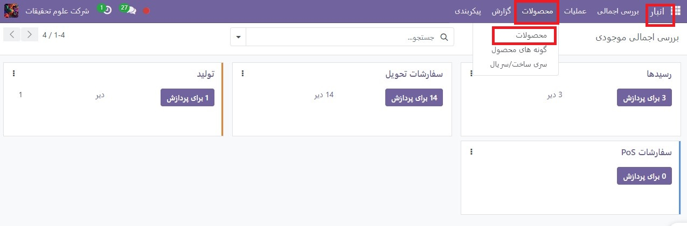

:nosearch:
:show-content:
:hide-page-toc:
:show-toc:

===========================================
انتخاب استراتژی شارژمجدد
===========================================

در Odoo، دو استراتژی برای تکمیل خودکار موجودی وجود دارد: قوانین سفارش مجدد و مسیر تولید سفارشی (MTO) . اگرچه این استراتژی‌ها کمی متفاوت هستند، اما هر دو پیامدهای مشابهی دارند: ایجاد خودکار یک  :abbr:`PO (Purchase Order)` یا  :abbr:`MO (Manufacturing Order)`  . انتخاب استراتژی برای استفاده به فرآیندهای تولید و تحویل کسب و کار بستگی دارد.

**اصلاحات**
---------------------------------------------------

**گزارش شارژمجدد و قوانین سفارش مجدد**

گزارش شارژمجدد لیستی از تمام محصولاتی است که دارای مقدار پیش بینی منفی هستند.
قوانین سفارش مجدد برای اطمینان از وجود حداقل مقدار کالا در انبار، به منظور تولید محصولات و/یا انجام سفارشات فروش استفاده می شود. هنگامی که سطح موجودی یک محصول به حداقل خود می رسد، Odoo به طور خودکار یک سفارش خرید با مقدار مورد نیاز برای رسیدن به حداکثر سطح موجودی تولید می کند.
قوانین سفارش مجدد را می توان در گزارش تکمیل یا از فرم محصول ایجاد و مدیریت کرد.

ساخت طبق سفارش
----------------------------------------------

ساخت طبق سفارش (MTO) یک مسیر تدارکاتی است که هر بار که سفارش فروش تأیید می‌شود، بدون توجه به سطح موجودی فعلی ، یک پیش‌ سفارش خرید (یا سفارش ساخت) ایجاد می‌کند .
برخلاف محصولاتی که با استفاده از قوانین سفارش مجدد شارژ می شوند، Odoo به طور خودکار سفارش فروش را به  :abbr:`PO (Purchase Order)`  یا MO ایجاد شده توسط مسیر MTO مرتبط می کند .
تفاوت دیگر بین قوانین سفارش مجدد و MTO این است که با MTO ، Odoo یک پیش سفارشPO یا MO بلافاصله پس از تأیید  :abbr:`SO (Sales Order)`  ایجاد می کند. با قوانین سفارش مجدد، Odoo یک پیش سفارش PO یا  :abbr:`MO (Manufacturing Order)`  تولید می کند که موجودی پیش بینی شده محصول کمتر از مقدار حداقل تعیین شده باشد.
علاوه بر این، Odoo به طور خودکار مقادیری را به PO یا MO اضافه می کند ، زیرا پیش بینی تغییر می کند، تا زمانی که PO یا MO تایید نشده باشد.
مسیر MTO بهترین استراتژی تکمیل مجدد برای محصولاتی است که سفارشی شده اند و/یا برای محصولاتی که هیچ انباری در دسترس ندارند .

پیکربندی
------------------------------------------

**گزارش شارژمجدد و قوانین سفارش مجدد**

برای دسترسی به گزارش تکمیل، به برنامه  :menuselection:`Sales --> Reporting --> Dashboard` بروید.
به‌طور پیش‌فرض، داشبورد گزارش تکمیل، هر محصولی را که نیاز به سفارش‌دهی مجدد دستی دارد، نشان می‌دهد. اگر قانون خاصی برای یک محصول وجود نداشته باشد، Odoo فرض می کند حداقل مقدار و حداکثر مقدار موجودی هر دو 0هستند.

.. note::
    برای محصولاتی که قوانین سفارش مجدد ندارند، Odoo پیش‌بینی را بر اساس سفارش‌های فروش، تحویل، و رسیدهای تأیید شده محاسبه می‌کند. برای محصولاتی که دارای یک قانون تنظیم مجدد سفارش هستند، Odoo پیش بینی را به طور معمول محاسبه می کند، اما زمان خرید/تولید و زمان تحویل امنیتی را نیز در نظر می گیرد.

.. important::
    قبل از ایجاد یک قانون سفارش مجدد جدید، مطمئن شوید که محصول دارای فروشنده یا صورتحساب مواد است که در فرم محصول پیکربندی شده است. برای بررسی این موضوع، به برنامه  :menuselection:`انبار --> محصولات --> محصولات`بروید و محصول را انتخاب کنید تا فرم محصول آن باز شود. فروشنده، اگر پیکربندی شده باشد، در برگه خرید فهرست شده است، و صورتحساب مواد، در صورت پیکربندی، در دکمه هوشمند صورتحساب مواد در بالای فرم یافت می شود.

نوع محصول که در برگه اطلاعات عمومی در فرم محصول قرار دارد، باید روی محصول قابل ذخیره سازی تنظیم شود. طبق تعریف، یک محصول مصرفی سطح موجودی آن را ردیابی نمی کند، بنابراین Odoo نمی تواند یک محصول مصرفی را در گزارش تکمیل مجدد حساب کند.

