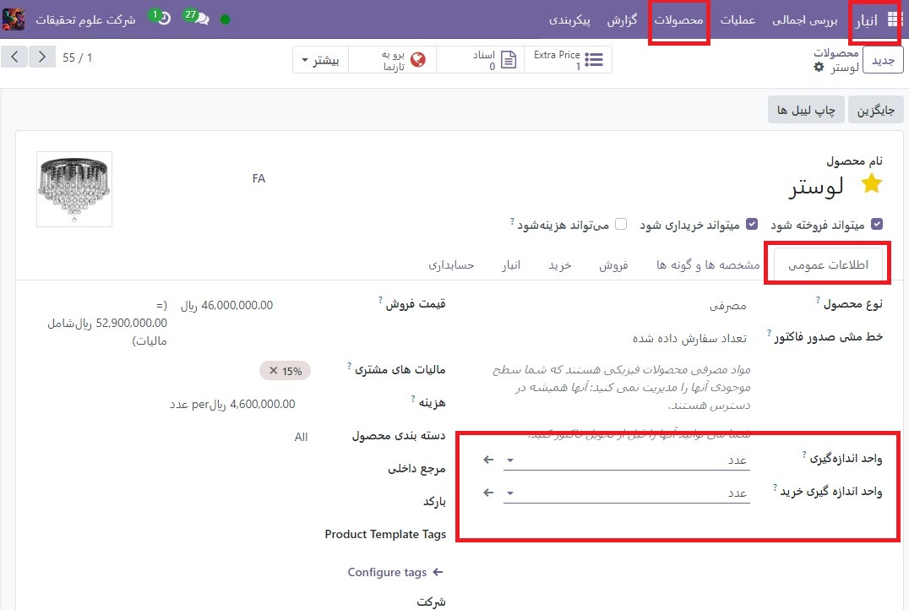

:nosearch:
:show-content:
:hide-page-toc:
:show-toc:

===========================================
واحدهای اندازه گیری
===========================================

در برخی موارد، جابجایی محصولات در واحدهای اندازه گیری مختلف ضروری است. به عنوان مثال، یک تاجرمی تواند محصولاتی را از کشوری بخرد که از سیستم متریک استفاده می کند و سپس آن محصولات را در کشوری که از سیستم امپراتوری استفاده می کند بفروشد. در این صورت، کسب و کار باید واحدها را تبدیل کند.

مورد دیگر برای تبدیل واحد زمانی است که یک کسب و کار محصولات را در یک بسته بزرگ از یک تامین کننده خریداری می کند و سپس آن محصولات را در واحدهای جداگانه به فروش می رساند.

Odoo را می توان برای استفاده از واحدهای اندازه گیری مختلف (UoM) برای یک محصول تنظیم کرد.

پیکربندی
------------------------------------------
برای استفاده از واحدهای اندازه گیری مختلف در Odoo، ابتدا به برنامه  :menuselection:`انبار --> پیکربندی --> تنظیمات` رفته و در قسمت محصولات، تنظیمات واحدهای انازه گیریرا فعال کنید. سپس، روی ذخیره کلیک کنید.

دسته بندی واحدهای اندازه گیری
---------------------------------------------
پس از فعال کردن تنظیمات واحدهای اندازه‌گیری، واحدهای پیش‌فرض دسته‌های اندازه‌گیری را در برنامه  :menuselection:`انبار -->پیکربندی --> دسته بندی واحدهای اندازه گیری` مشاهده کنید. دسته برای تبدیل واحد مهم است. Odoo می تواند واحدهای یک محصول را از یک واحد به واحد دیگر تبدیل کند تنها در صورتی که هر دو واحد متعلق به یک دسته باشند.

.. image:: img/product replenishment/s30.jpg
    :align: center
    :alt: انبار.

هر دسته از واحدهای اندازه گیری یک واحد مرجع دارد. واحد مرجع با رنگ آبی در ستون واحد اندازه گیری صفحه واحدهای اندازه گیری دسته بندی هایلایت شده است. Odoo از واحد مرجع به عنوان پایه ای برای هر واحد جدید استفاده می کند.

برای ایجاد یک واحد جدید، ابتدا دسته صحیح را از صفحه دسته بندی واحدهای اندازه گیری انتخاب کنید.

تبدیل واحد
---------------------------------------------------

- هنگامی که محصولات دارای  واحداندازه گیری های مختلف هستند و واحداندازه گیری خریداری می کنند، Odoo به طور خودکار واحد اندازه گیری را تبدیل می کند.

این در حالات مختلف رخ می دهد، از جمله:

#. سفارشات فروشنده: خرید واحد داندازه گیری در سفارشات خرید (POs) تبدیل به واحد اندازه گیری در اسناد انبار داخلی

#. تکمیل خودکار: زمانی که سطح موجودی یک محصول (که بر حسب واحداندازه گیری پیگیری می شود) به زیر سطح معینی می رسد، PO ایجاد می کند. اما، PO ها با استفاده از واحدهای اندازه گیری خرید ایجاد می شوند

#. فروش محصولات: اگر از یک واحد اندازه گیری  متفاوت در سفارش فروش (SO) استفاده شود، این مقدار در سفارش تحویل به واحداندازه گیری ترجیحی انبار تبدیل می شود.

