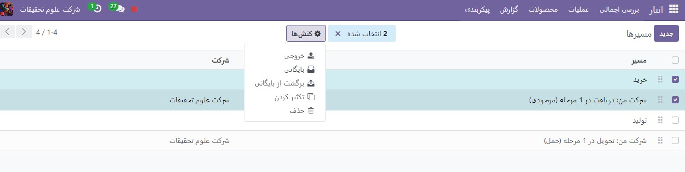
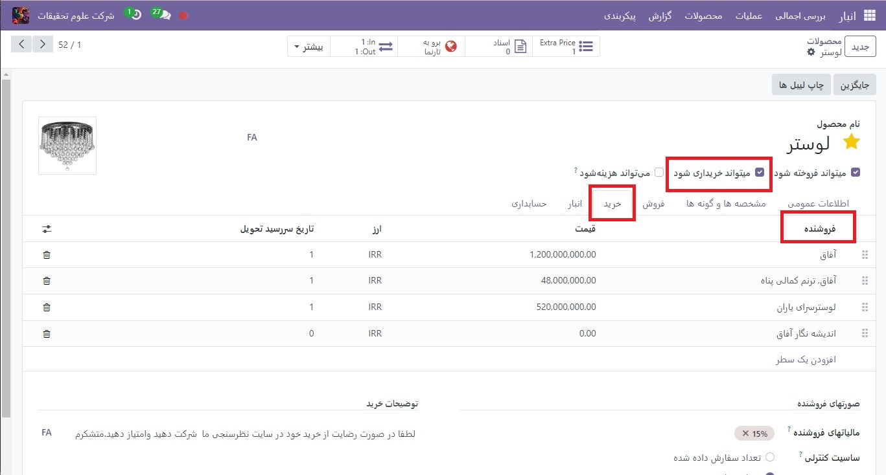
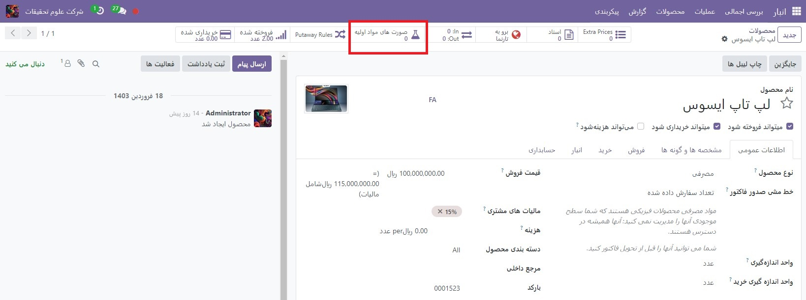
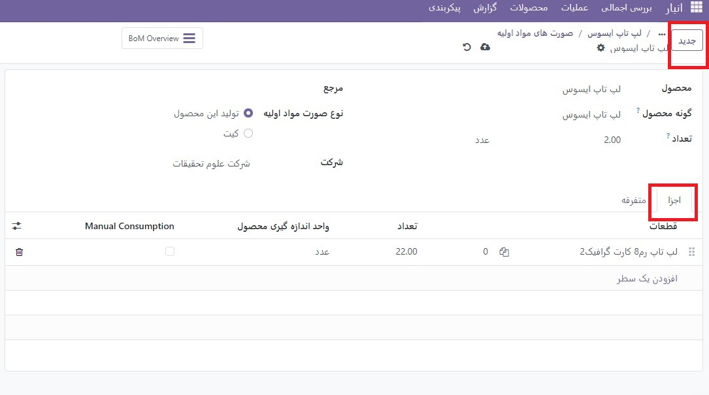

:nosearch:
:show-content:
:hide-page-toc:
:show-toc:

===========================================
شارژمجدد طبق سفارش(MTO)
===========================================

شارژ کردن  بر اساس سفارش، همچنین به عنوان MTO (ساخت به سفارش) شناخته می شود، یک استراتژی تکمیل است که هر بار که یک سفارش فروش برای یک محصول ایجاد می شود، یک پیش سفارش برای آن ایجاد می کند. برای محصولاتی که از یک فروشنده خریداری می‌شوند، یک درخواست برای قیمت‌گذاری (RFQ) ایجاد می‌شود، در حالی که یک سفارش فروش برای یک محصول تولید شده در داخل، باعث ایجاد یک سفارش تولید می‌شود. ایجاد یک  :abbr:`RFQ (Request for Quotation)` RFQ یا سفارش ساخت هر بار که سفارش فروش ایجاد می شود، صرف نظر از سطح موجودی فعلی محصول سفارش داده شده، رخ می دهد.

مسیر  (MTO) را از حالت آرشیو خارج کنید
----------------------------------------------
به طور پیش فرض، Odoo مسیر MTO را به عنوان بایگانی شده تنظیم می کند. این به این دلیل است که MTO یک گردش کار تا حدی خاص است که فقط توسط شرکت های خاصی استفاده می شود. با این حال، حذف آرشیو مسیر تنها در چند مرحله ساده آسان است.

برای انجام این کار، با پیمایش به  :menuselection:`انبار --> پیکربندی --> مسیرها` شروع کنید. در صفحه **مسیرها**روی دکمه **فیلترها** کلیک کرده و گزینه **بایگانی شده** را انتخاب کنید. این همه مسیرهایی را که در حال حاضر بایگانی شده اند نشان می دهد.

.. image:: ./img/productreplenishment/s11.jpg
    :align: center
    :alt: انبار

کادر انتخاب کنار شارژمجدد طبق سفارش (MTO) را فعال کنید، سپس روی دکمه کنش(چرخ دنده) کلیک کنید تا منوی کشویی نمایان شود. از منوی کشویی، برگشت از بایگانی را انتخاب کنید.

در نهایت، فیلتر بایگانی شده را از نوارجستجو… حذف کنید. صفحه مسیرها اکنون همه مسیرهای موجود، از جمله تکمیل سفارش (MTO) را نشان می دهد، که اکنون در برگه موجودی هر صفحه محصول قابل انتخاب است.

.. image:: ./img/productreplenishment/s13.jpg
    :align: center
    :alt: انبار

یک محصول را برای استفاده از مسیر MTO پیکربندی کنید
------------------------------------------------------------

با خارج شدن از آرشیو مسیر MTO، محصولات اکنون می توانند به درستی پیکربندی شوند تا از شارژمجدد در صورت سفارش استفاده کنند. برای انجام این کار، با رفتن به **انبار ‣ محصولات ‣ محصولات** شروع کنید، سپس یک محصول موجود را انتخاب کنید، یا برای پیکربندی یک محصول جدید، روی **ایجاد** کلیک کنید.

در صفحه محصول، تب **انبار** را انتخاب کنید و مسیر شارژ مجدد طبق سفارش (MTO) را در قسمت مسیرها به همراه یک مسیر دیگر فعال کنید.

.. important::
   مسیر شارژمجدد طبق سفارش (MTO) کار نمی کند مگر اینکه مسیر دیگری نیز انتخاب شود. این به این دلیل است که Odoo باید بداند که چگونه محصول را هنگامی که سفارشی برای آن ارسال می شود (خرید، تولید و غیره) دوباره پر کند.

.. image:: ./img/productreplenishment/s14.jpg
    :align: center
    :alt: انبار

اگر محصول برای انجام سفارشات فروش از یک فروشنده خریداری شده است، کادر بررسی قابل خرید را در زیر نام محصول فعال کنید. با انجام این کار، برگه خرید در کنار سایر برگه های تنظیمات در زیر ظاهر می شود.

تب خرید را انتخاب کنید و فروشنده و قیمتی را که محصول را با آن می فروشند مشخص کنید

.. image:: ./img/productreplenishment/s15.jpg
    :align: center
    :alt: انبار

اگر محصول تولید شده است، مطمئن شوید که یک فهرست اقلام (BOM) برای آن پیکربندی شده است. برای انجام این کار، روی دکمه هوشمند فهرست اقلام در بالای صفحه کلیک کنید، سپس روی جدید در صفحه کلیک کنید تا یک BOM(فهرست اقلام) جدید برای محصول پیکربندی شود.

در فرم خالی BOM، اجزای مورد استفاده برای تولید محصول را در برگه اجزا به همراه عملیات مورد نیاز برای گردش کار تولید در برگه عملیات اضافه کنید.

در نهایت روی ذخیره کلیک کنید تا BOM ذخیره شود..

.. important::
   سفارش فروش را با استفاده از مسیر MTO انجام دهید
پس از پیکربندی یک محصول برای استفاده از مسیر MTO، هر بار که سفارش فروش محصول تأیید می شود، یک سفارش تکمیل برای آن ایجاد می شود. نوع سفارش ایجاد شده به مسیر دوم انتخاب شده علاوه بر MTO بستگی دارد.

به عنوان مثال، اگر خرید دومین مسیر انتخاب شده بود، پس از تایید سفارش فروش، سفارش خرید ایجاد می شود.

در حالی که مسیر MTO را می توان همزمان با انواع مسیرهای دیگر استفاده کرد، مسیر خرید به عنوان مثال برای این گردش کار استفاده می شود. با رفتن به برنامه فروش شروع کنید، سپس روی جدید کلیک کنید، که یک فرم پیش فاکتور خالی باز می شود.

در فرم خالی پیش فاکتور، یک مشتری اضافه کنید، سپس روی افزودن یک محصول در زیر برگه سطرهای سفارش کلیک کنید و محصولی را وارد کنید که برای استفاده از مسیرهای MTO و Buy پیکربندی شده است. روی تایید کلیک کنید و قیمت به سفارش فروش تبدیل می شود.

اکنون یک دکمه هوشمند خرید در گوشه سمت چپ بالای سفارش فروش ظاهر می شود. با کلیک بر روی آن  :abbr:`RFQ (Request for Quotation)` مربوط به سفارش فروش باز می شود.

برای تأیید RFQ روی تأیید سفارش کلیک کنید و آن را به سفارش خرید تبدیل کنید. اکنون دکمه سبز رنگ دریافت محصولات در بالای سفارش خرید ظاهر می شود. پس از دریافت محصولات، روی دریافت محصولات کلیک کنید تا آنها را در فهرست موجودی ثبت کنید.

با رفتن به قسمت  :menuselection:`فروش --> سفارشات --> سفارشات`و انتخاب سفارش فروش به سفارش فروش بازگردید.

در نهایت روی دکمه هوشمند تحویل در سمت چپ بالای سفارش کلیک کنید تا به سفارش تحویل داده شود. پس از ارسال محصولات به مشتری، برای تأیید تحویل، روی تأیید اعتبار کلیک کنید.
