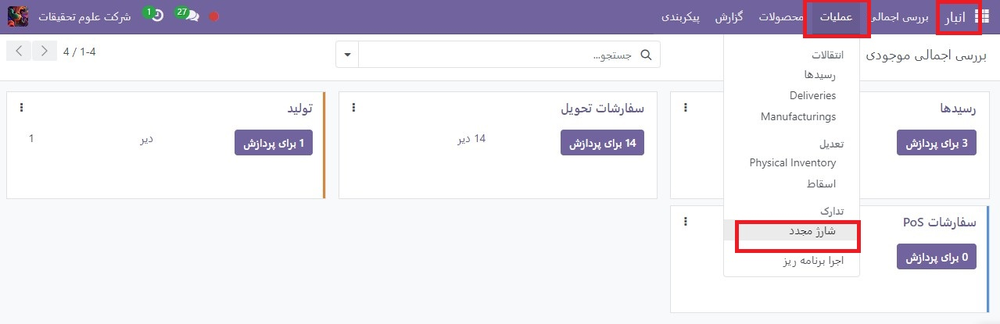
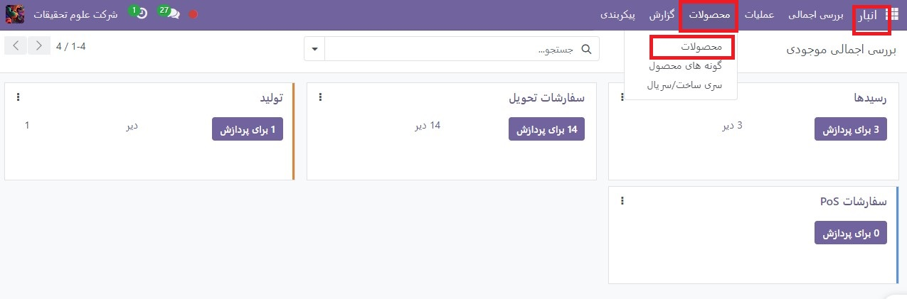
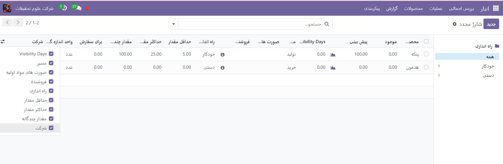
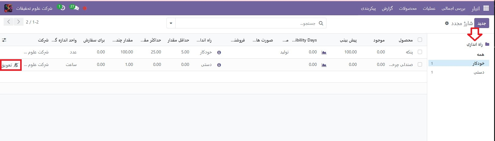
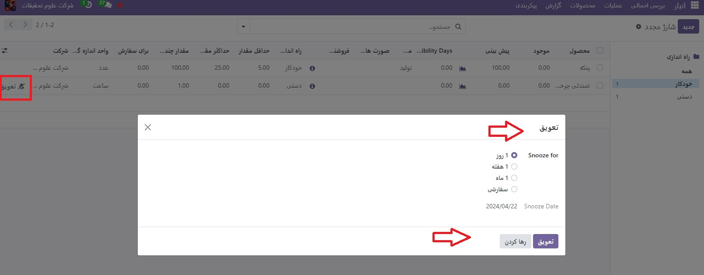
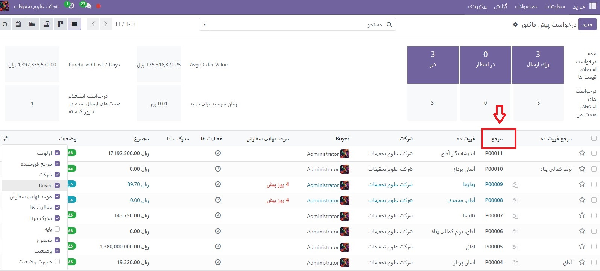
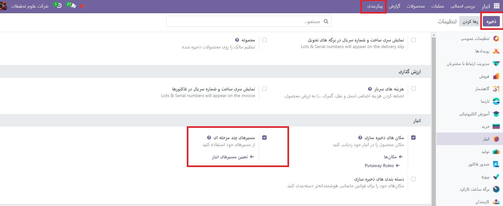
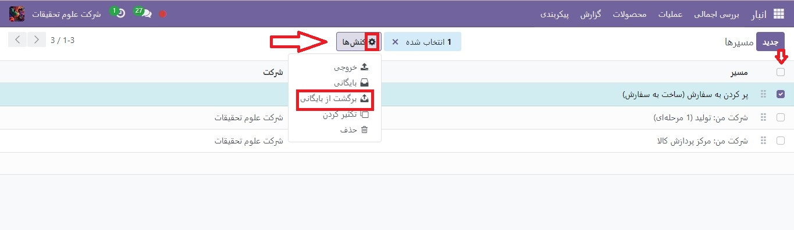
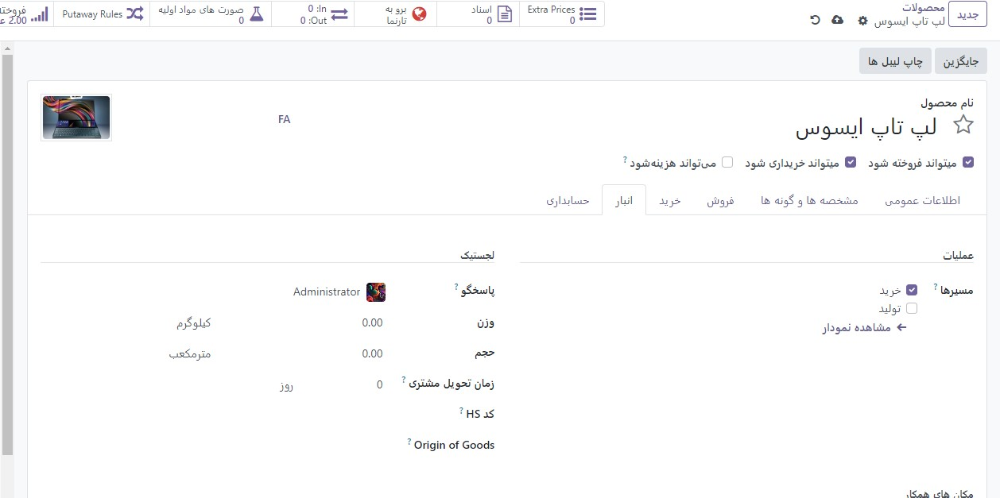

:nosearch:
:show-content:
:hide-page-toc:
:show-toc:

===========================================
انتخاب استراتژی شارژمجدد
===========================================

در Odoo، دو استراتژی برای تکمیل خودکار موجودی وجود دارد: قوانین سفارش مجدد و مسیر تولید سفارشی (MTO) . اگرچه این استراتژی‌ها کمی متفاوت هستند، اما هر دو پیامدهای مشابهی دارند: ایجاد خودکار یک  :abbr:`PO (Purchase Order)` یا  :abbr:`MO (Manufacturing Order)`  . انتخاب استراتژی برای استفاده به فرآیندهای تولید و تحویل کسب و کار بستگی دارد.

**اصلاحات**
---------------------------------------------------

**گزارش شارژمجدد و قوانین سفارش مجدد**

گزارش شارژمجدد لیستی از تمام محصولاتی است که دارای مقدار پیش بینی منفی هستند.
قوانین سفارش مجدد برای اطمینان از وجود حداقل مقدار کالا در انبار، به منظور تولید محصولات و/یا انجام سفارشات فروش استفاده می شود. هنگامی که سطح موجودی یک محصول به حداقل خود می رسد، Odoo به طور خودکار یک سفارش خرید با مقدار مورد نیاز برای رسیدن به حداکثر سطح موجودی تولید می کند.
قوانین سفارش مجدد را می توان در گزارش تکمیل یا از فرم محصول ایجاد و مدیریت کرد.

ساخت طبق سفارش
----------------------------------------------

ساخت طبق سفارش (MTO) یک مسیر تدارکاتی است که هر بار که سفارش فروش تأیید می‌شود، بدون توجه به سطح موجودی فعلی ، یک پیش‌ سفارش خرید (یا سفارش ساخت) ایجاد می‌کند .
برخلاف محصولاتی که با استفاده از قوانین سفارش مجدد شارژ می شوند، Odoo به طور خودکار سفارش فروش را به  :abbr:`PO (Purchase Order)`  یا MO ایجاد شده توسط مسیر MTO مرتبط می کند .
تفاوت دیگر بین قوانین سفارش مجدد و MTO این است که با MTO ، Odoo یک پیش سفارشPO یا MO بلافاصله پس از تأیید  :abbr:`SO (Sales Order)`  ایجاد می کند. با قوانین سفارش مجدد، Odoo یک پیش سفارش PO یا  :abbr:`MO (Manufacturing Order)`  تولید می کند که موجودی پیش بینی شده محصول کمتر از مقدار حداقل تعیین شده باشد.
علاوه بر این، Odoo به طور خودکار مقادیری را به PO یا MO اضافه می کند ، زیرا پیش بینی تغییر می کند، تا زمانی که PO یا MO تایید نشده باشد.
مسیر MTO بهترین استراتژی تکمیل مجدد برای محصولاتی است که سفارشی شده اند و/یا برای محصولاتی که هیچ انباری در دسترس ندارند .

پیکربندی
------------------------------------------

**گزارش شارژمجدد و قوانین سفارش مجدد**

برای دسترسی به گزارش تکمیل، به برنامه  :menuselection:`Sales --> Reporting --> Dashboard` بروید.
به‌طور پیش‌فرض، داشبورد گزارش تکمیل، هر محصولی را که نیاز به سفارش‌دهی مجدد دستی دارد، نشان می‌دهد. اگر قانون خاصی برای یک محصول وجود نداشته باشد، Odoo فرض می کند حداقل مقدار و حداکثر مقدار موجودی هر دو 0هستند.

.. note::
   برای محصولاتی که قوانین سفارش مجدد ندارند، Odoo پیش‌بینی را بر اساس سفارش‌های فروش، تحویل، و رسیدهای تأیید شده محاسبه می‌کند. برای محصولاتی که دارای یک قانون تنظیم مجدد سفارش هستند، Odoo پیش بینی را به طور معمول محاسبه می کند، اما زمان خرید/تولید و زمان تحویل امنیتی را نیز در نظر می گیرد.

.. important::
   قبل از ایجاد یک قانون سفارش مجدد جدید، مطمئن شوید که محصول دارای فروشنده یا صورتحساب مواد است که در فرم محصول پیکربندی شده است. برای بررسی این موضوع، به برنامه  :menuselection:`انبار --> محصولات --> محصولات`بروید و محصول را انتخاب کنید تا فرم محصول آن باز شود. فروشنده، اگر پیکربندی شده باشد، در برگه خرید فهرست شده است، و صورتحساب مواد، در صورت پیکربندی، در دکمه هوشمند صورتحساب مواد در بالای فرم یافت می شود.

نوع محصول که در برگه اطلاعات عمومی در فرم محصول قرار دارد، باید روی **محصول قابل ذخیره سازی** تنظیم شود. طبق تعریف، یک محصول مصرفی سطح موجودی آن را ردیابی نمی کند، بنابراین Odoo نمی تواند یک محصول مصرفی را در گزارش تکمیل مجدد حساب کند.

برای ایجاد یک قانون ترتیب مجدد جدید از گزارش شارژمجدد، به برنامه انبار ‣ عملیات ‣ شارژمجدد بروید ،روی ایجاد کلیک کنید و محصول مورد نظر را از منوی کشویی در ستون محصول انتخاب کنید . در صورت لزوم، یک مقدار حداقل و یک مقدار حداکثر را می توان در ستون های مربوطه در صفحه گزارش شارژمجدد نیز پیکربندی کرد.
برای ایجاد یک قانون سفارش مجدد جدید از فرم محصول، به برنامه انبار ‣ محصولات ‣ محصولات بروید و یک محصول را انتخاب کنید تا فرم محصول آن باز شود. روی دکمه **هوشمند قوانین سفارش مجدد** کلیک کنید ، روی ایجادکلیک کنید و فیلدها را پر کنید.

فیلدهای گزارش شارژمجدد
----------------------------------------------

فیلدهای زیر در گزارش شارژمجدد هستند . اگر هر یک از این فیلدها قابل مشاهده نیست، روی نماد ⋮ (گزینه های اضافی) در سمت چپ انتهای گزارش کلیک کنید، سپس روی کادر کنار یک فیلد کلیک کنید تا قابل مشاهده باشد.

•	محصول : محصولی که نیاز به شارژ کردن دارد.
•	مکان : مکان خاصی که محصول در آن نگهداری می شود.
•	انبار : انباری که محصول در آن نگهداری می شود.
•	در دست : مقدار محصول موجود در حال حاضر.
•	پیش بینی : مقدار محصول موجود پس از تمام سفارشات فعلی (فروش، ساخت، خرید و غیره) در نظر گرفته می شود.
•	مسیر ترجیحی : نحوه تهیه محصول، خرید ، ساخت  و غیره.
•	فروشنده : شرکتی که محصول از آن خریداری شده است.
•	صورتحساب مواد : صورتحساب مواد برای محصول (در صورت پیکربندی).
•	گروه تدارکات : شماره مرجع برای نحوه تهیه محصول، مانند سفارش فروش، سفارش خرید یا سفارش ساخت.
•	حداقل مقدار : حداقل مقدار محصولی که باید در دسترس باشد. زمانی که سطح موجودی از این عدد کمتر شود، دوباره پر کردن آغاز می شود.
•	حداکثر مقدار : مقدار محصولی که باید پس از پر کردن محصول در دسترس باشد.
•	تعداد چندگانه : اگر محصول باید در مقادیر مشخص سفارش داده شود، شماره ای را که باید سفارش دهید وارد کنید. برای مثال، اگر مقدار Multiple روی تنظیم شود 5و فقط 3 مورد نیاز باشد، 5 محصول دوباره شارژ می شود.
•	برای سفارش : مقدار محصولی که در حال حاضر مورد نیاز است و در صورت کلیک روی دکمه سفارش دستی یا سفارش خودکار کلیک می شود، محصول مورد نیاز است و سفارش داده می شود.
•	واحداندازه گیری: واحد اندازه گیری مورد استفاده برای به دست آوردن محصول.
•	شرکت : شرکتی که محصول برای آن خریداری شده است.

به‌طور پیش‌فرض، مقدار موجود در سفارش‌ها، مقداری است که برای رسیدن به مقادیر تعیین‌شده لازم است. با این حال، مقدار سفارش را می توان با کلیک بر روی فیلد و تغییر مقدار تنظیم کرد. برای شارژ مجدد یک محصول به صورت دستی، روی یک بار سفارش کلیک کنید .

برای خودکار کردن شارژ مجدد از صفحه شارژمجدد، روی سفارشات خودکار در سمت راست خط کلیک کنید، که با نماد 🔄 (پیکان دیره‌های) نشان داده شده است.

زمانی که این دکمه را فشار دهید، Odoo به طور خودکار یک پیش نویس PO / MO ایجاد می کند هر بار که سطح سهام پیش بینی شده به زیر مقدار کمتر تنظیم شده قانون ترتیب مجدد می رسد.

در صفحه شارژمجدد ، با کلیک کردن روی نماد 🔕 (تعویق) در سمت چپ خط، می توان یک قانون سفارش مجدد یا تکمیل دستی را به طور موقت برای یک دوره معین غیرفعال کرد.

- یک PO یا MO ایجاد شده توسط یک دوباره شارژکردن دستی یک گزارش شارژ کردن به عنوان سند منبع دارد. یک PO یا MO ایجاد شده توسط یک قانون مرتب سازی مجدد خودکار دارای شماره(های) مرجع SO است که قانون را به عنوان سند منبع فعال کرده است.

تولیدسفارشی
--------------------------------------------------

از آنجایی که مسیر MTO برای محصولات سفارشی توصیه می شود، مسیر به طور پیش فرض پنهان است.
برای فعال کردن مسیر MTO در Odoo:
1.	به برنامه  :menuselection:`انبار --> پیکربندی --> تنظیمات` بروید .
2.	تنظیم **مسیرهای چند مرحله‌ای** را که در زیر بخش انبار قرار دارد، فعال کنید و روی **ذخیره** کلیک کنید .
3.	سپس به برنامه  :menuselection:`انبار --> پیکربندی --> مسیرها` بروید .
4.	برای نمایش مسیرهای بایگانی شده روی فیلترها‣ بایگانی شده کلیک کنید.
5.	کادر کنار تولید(MTO) را انتخاب کنید و روی کنش(چرخ دنده) ‣ برگشت از بایگانی کلیک کنید .

.. image:: ./img/productreplenishment/s8.jpg
    :align: center
    :alt: انبار

.. note::
   فعال کردن تنظیمات مسیرهای چند مرحله‌ای، مکان‌های ذخیره‌سازی را نیز فعال می‌کند. اگر این ویژگی‌ها برای انبار قابل اجرا نیستند، پس از حذف مسیر MTO، این تنظیمات را غیرفعال کنید.

برای تنظیم مسیر خرید یک محصول به MTO، به برنامه  :menuselection:`انبار --> محصولات --> محصولات`بروید و روی محصول مورد نظر کلیک کنید تا فرم محصول آن باز شود.

سپس، روی تب انبار کلیک کنید و در قسمت مسیرها گزینه ها، Replenish on Order (MTO) را انتخاب کنید.

برای محصولاتی که مستقیماً از یک فروشنده خریداری می‌شوند، مطمئن شوید که مسیر خرید، علاوه بر مسیر تکمیل سفارش (MTO) انتخاب شده است. همچنین، مطمئن شوید که یک فروشنده در برگه خرید فرم محصول پیکربندی شده است.

برای محصولاتی که در داخل تولید می شوند، مطمئن شوید که مسیر ساخت، علاوه بر مسیر تکمیل سفارش (MTO) انتخاب شده است. همچنین مطمئن شوید که صورتحساب مواد برای محصول پیکربندی شده است که از طریق دکمه هوشمند صورتحساب مواد در فرم محصول قابل دسترسی است.

