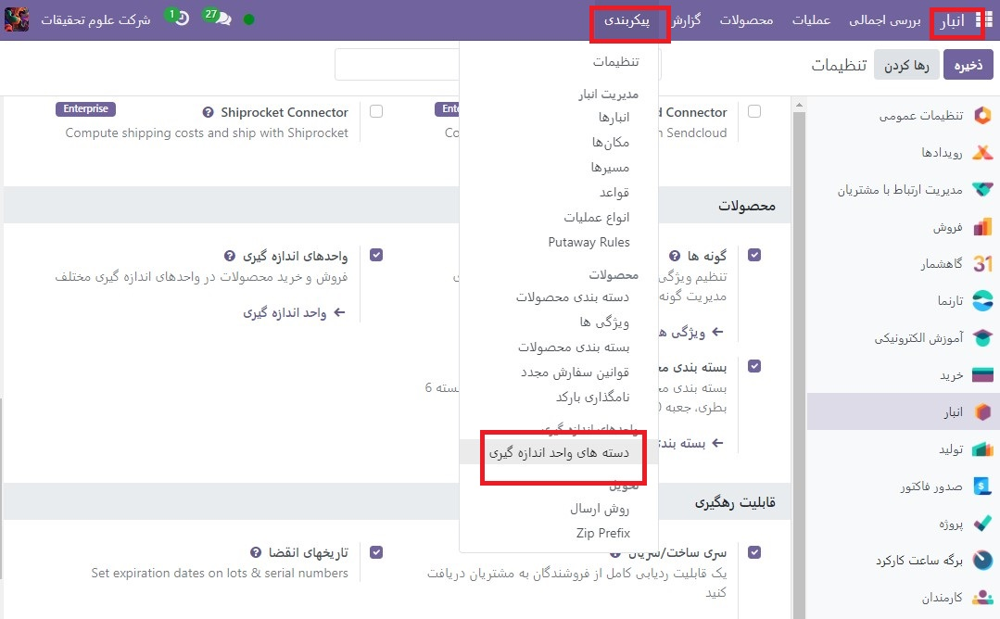
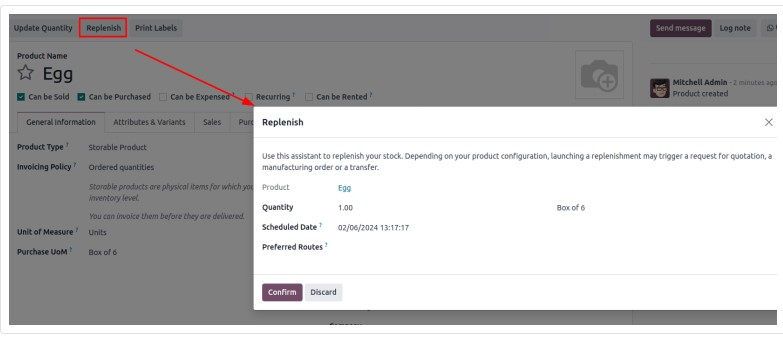

:nosearch:
:show-content:
:hide-page-toc:
:show-toc:

===========================================
واحدهای اندازه گیری
===========================================

در برخی موارد، جابجایی محصولات در واحدهای اندازه گیری مختلف ضروری است. به عنوان مثال، یک تاجرمی تواند محصولاتی را از کشوری بخرد که از سیستم متریک استفاده می کند و سپس آن محصولات را در کشوری که از سیستم امپراتوری استفاده می کند بفروشد. در این صورت، کسب و کار باید واحدها را تبدیل کند.

مورد دیگر برای تبدیل واحد زمانی است که یک کسب و کار محصولات را در یک بسته بزرگ از یک تامین کننده خریداری می کند و سپس آن محصولات را در واحدهای جداگانه به فروش می رساند.

Odoo را می توان برای استفاده از واحدهای اندازه گیری مختلف (UoM) برای یک محصول تنظیم کرد.

پیکربندی
------------------------------------------
برای استفاده از واحدهای اندازه گیری مختلف در Odoo، ابتدا به برنامه  :menuselection:`انبار --> پیکربندی --> تنظیمات` رفته و در قسمت محصولات، تنظیمات واحدهای انازه گیریرا فعال کنید. سپس، روی ذخیره کلیک کنید.

.. image:: ./img/productreplenishment/s29.jpg
    :align: center
    :alt: انبار

دسته بندی واحدهای اندازه گیری
---------------------------------------------
پس از فعال کردن تنظیمات واحدهای اندازه‌گیری، واحدهای پیش‌فرض دسته‌های اندازه‌گیری را در برنامه  :menuselection:`انبار -->پیکربندی --> دسته بندی واحدهای اندازه گیری` مشاهده کنید. دسته برای تبدیل واحد مهم است. Odoo می تواند واحدهای یک محصول را از یک واحد به واحد دیگر تبدیل کند تنها در صورتی که هر دو واحد متعلق به یک دسته باشند.

.. image:: ./img/productreplenishment/s31.jpg
    :align: center
    :alt: انبار

هر دسته از واحدهای اندازه گیری یک واحد مرجع دارد. واحد مرجع با رنگ آبی در ستون واحد اندازه گیری صفحه واحدهای اندازه گیری دسته بندی هایلایت شده است. Odoo از واحد مرجع به عنوان پایه ای برای هر واحد جدید استفاده می کند.

برای ایجاد یک واحد جدید، ابتدا دسته صحیح را از صفحه دسته بندی واحدهای اندازه گیری انتخاب کنید.

.. image:: ./img/productreplenishment/s32.jpg
    :align: center
    :alt: انبار

تبدیل واحد
---------------------------------------------------

- هنگامی که محصولات دارای  واحداندازه گیری های مختلف هستند و واحداندازه گیری خریداری می کنند، Odoo به طور خودکار واحد اندازه گیری را تبدیل می کند.

این در حالات مختلف رخ می دهد، از جمله:

#. سفارشات فروشنده: خرید واحد داندازه گیری در سفارشات خرید (POs) تبدیل به واحد اندازه گیری در اسناد انبار داخلی

#. تکمیل خودکار: زمانی که سطح موجودی یک محصول (که بر حسب واحداندازه گیری پیگیری می شود) به زیر سطح معینی می رسد، PO ایجاد می کند. اما، PO ها با استفاده از واحدهای اندازه گیری خرید ایجاد می شوند

#. فروش محصولات: اگر از یک واحد اندازه گیری  متفاوت در سفارش فروش (SO) استفاده شود، این مقدار در سفارش تحویل به واحداندازه گیری ترجیحی انبار تبدیل می شود.

خرید محصولات در خرید  واحدهای اندازه گیری
----------------------------------------------------------------------------
هنگام ایجاد یک درخواست جدید برای پیش فاکتور (RFQ) در برنامه خرید، Odoo به طور خودکار از واحد اندازه گیری خرید مشخص شده محصول استفاده می کند. در صورت نیاز، مقدارواحد واحد اندازه گیری را در RFQ به صورت دستی ویرایش کنید.
پس از تأیید RFQ در یک PO، روی دکمه هوشمند Receipt در بالای PO کلیک کنید.
Odoo به طور خودکار واحد اندازه گیری خرید را به واحد اندازه گیری فروش/موجودی محصول تبدیل می کند، بنابراین ستون تقاضای رسید تحویل، مقدار تبدیل شده را نشان می دهد.

شارژمجدد
-----------------------------------------
درخواست قیمت برای یک محصول نیز می تواند مستقیماً از فرم محصول با استفاده از دکمه شارژ مجدد ایجاد شود.

پس از کلیک بر روی شارژمجدد، یک کادر دستیار شارژ کردن باز می شود. واحد اندازه گیری خرید را می توان در صورت نیاز به صورت دستی در قسمت کمیت ویرایش کرد. سپس روی تایید  کلیک کنید تا RFQ ایجاد شود.

.. important::
    یک  :abbr:`PO (Purchase Order)` تنها زمانی می تواند به صورت خودکار ایجاد شود که حداقل یک فروشنده در برگه خرید فرم محصول فهرست شده باشد.

با کلیک بر روی دکمه هوشمند پیش بینی شده در فرم محصول، به PO ایجاد شده بروید. به قسمت موجودی پیش بینی شده بروید و در خط  درخواست پیش فاکتور، روی شماره مرجع RFQ کلیک کنید تا پیش نویس RFQ باز شود. در صورت لزوم، واحداندازه گیری خرید را می توان مستقیماً در PO ویرایش کرد.

فروش در واحدهای اندازه گیری متفاوت
------------------------------------------------------------

هنگام ایجاد یک پیش فاکتور جدید در برنامه فروش، Odoo به طور خودکار از واحد اندازه گیری مشخص شده محصول استفاده می کند. در صورت نیاز، واحدهای اندازه گیری را می توان به صورت دستی در پیش فاکتور ویرایش کرد.

پس از ارسال پیشنهاد برای مشتری و تایید آن در یک سفارش فروش (SO)، روی دکمه هوشمند تحویل در بالای SO کلیک کنید. Odoo به طور خودکار واحد اندازه گیری را به واحد اندازه گیری موجودی محصول تبدیل می کند، بنابراین ستون تقاضای تحویل، مقدار تبدیل شده را نشان می دهد.

به عنوان مثال، اگر واحدهای اندازه گیری محصول در SO به جعبه 6 تغییر کرده باشد، اما واحد اندازه گیری موجودی آن واحد باشد، SO مقدار را در جعبه های 6 نشان می دهد، و تحویل مقدار را به واحد نشان می دهد.
