:nosearch:
:show-content:
:hide-page-toc:
:show-toc:

===========================================
شماره سریال را تعیین کنید
===========================================

تخصیص شماره سریال به تک تک محصولات امکان پیگیری دیتاها، تاریخ انقضا و مکان را در سراسر زنجیره تامین فراهم می کند، که به ویژه برای تولیدکنندگانی که خدمات پس از فروش ارائه می دهند سودمند است.

.. seealso::
   - :doc:`use serial numbers to track products`

در Odoo، شماره سریال به محصولات اختصاص داده می شود:

  - در صفحه عملیات تفصیلی در یک رسید
  - با کلیک بر روی دکمه اختصاص شماره سریال روی رسید
  - در پنجره باز: انتقال سهام روی رسید
  - هنگام بستن یک سفارش تولید
  - هنگام انجام تعدیل موجودی

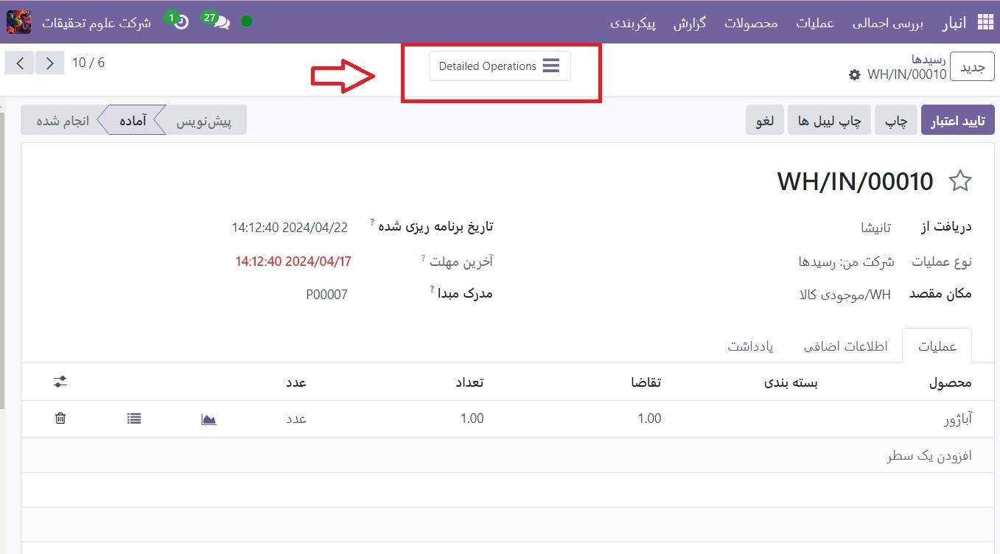

پیکربندی
--------------------------------------------------

برای اختصاص شماره سریال به محصولات، ویژگی Lots and Serial Numbers را در برنامه **انبار --> پیکربندی --> تنظیمات**فعال کنید.

سپس، در برگه انبار فرم محصول یک کالا، قسمت پیگیری را روی By Unique Serial Number تنظیم کنید.

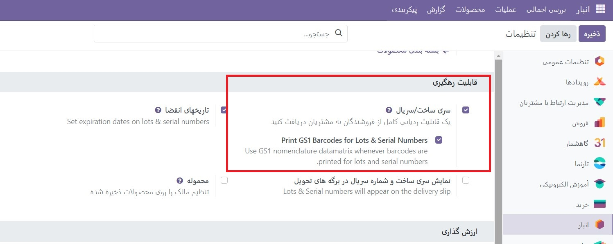

.. seealso::
   - :doc:`use serial numbers to track products`

در مرحله بعد، با رفتن به برنامه انبار --> پیکربندی --> انواع عملیات، ایجاد شماره سریال جدید را فعال کنید.

از صفحه انواع عملیات، نوع عملیات مورد نظر (به عنوان مثال رسید، سفارشات تحویل، یا ساخت) را انتخاب کنید و گزینه ایجاد جدید را در بخش سری ساخت/سریال صفحه پیکربندی نوع عملیات انتخاب کنید.

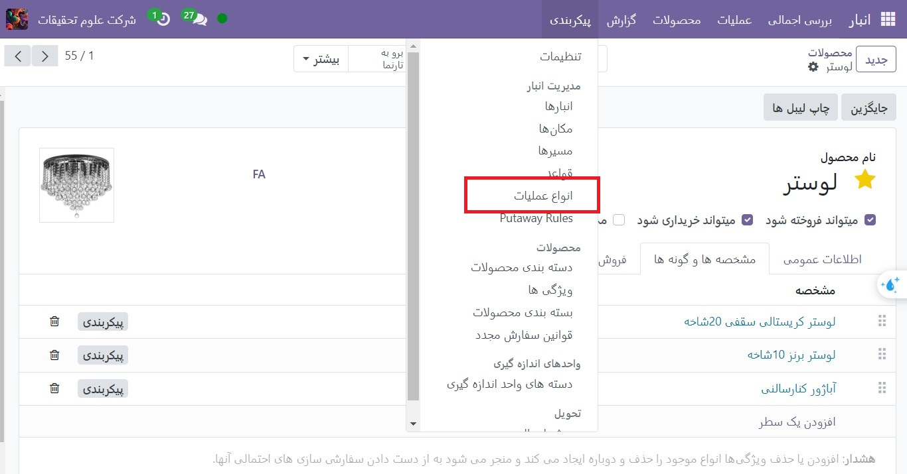

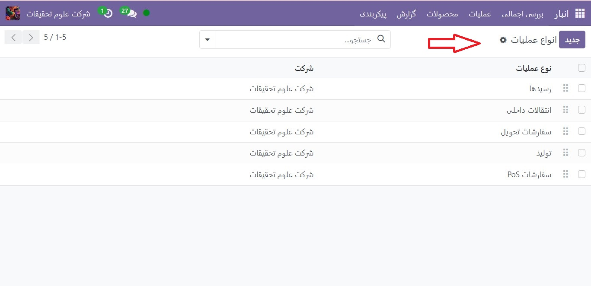

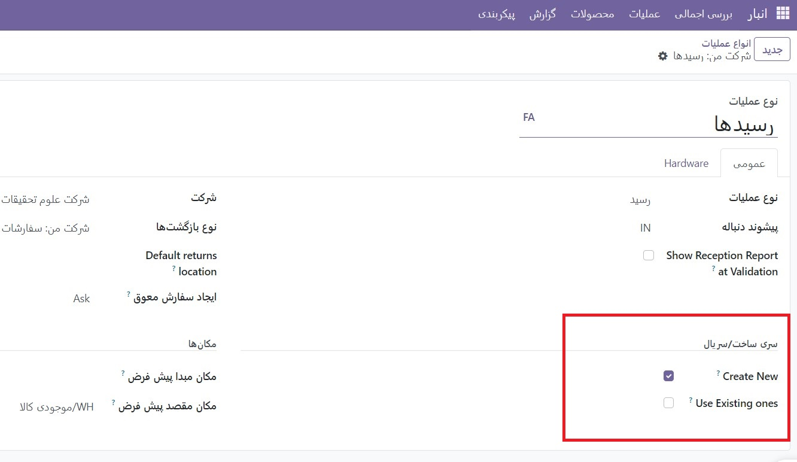

عملیات تفصیلی
---------------------------------------
شماره سریال را می توان در هنگام وارد کردن انبار برای اولین بار، از صفحه عملیات تفصیلی در رسید، به محصولات اختصاص داد. با رفتن به برنامه **انبار --> عملیات  --> رسیدها** می توان به رسیدها دسترسی داشت.

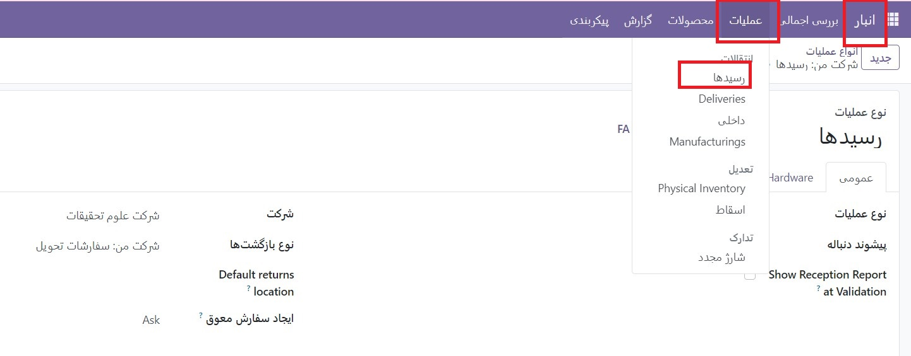

.. important::
  شماره سریال را نمی توان در صورت درخواست پیش فاکتور (RfQ) یا سفارش خرید (PO) به محصولات اختصاص داد - فقط با رسید.

  .. image:: ./img/producttracking/t7.jpg
      :align: center
      :alt: انبار

  برای ثبت شماره سریال یک کالا قبل از دریافت کالا، مراحل بخش های بعدی را برای اختصاص شماره سریال دنبال کنید، اما تا زمانی که محصولات از فروشنده دریافت نشده اند، روی دکمه اعتبارسنجی رسید کلیک نکنید.

با کلیک کردن روی دکمه هوشمند عملیات تفصیلی روی رسید، یک شماره سریال واحد را به یک محصول اختصاص دهید.

در ستون سری و سریال ساخت، شماره سریال یک محصول را به صورت دستی تایپ کنید.

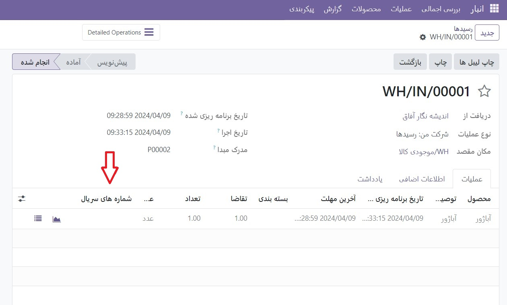

پس از اتمام، روی  رسید کلیک کنید و شماره سریال های اختصاص داده شده به طور خودکار ذخیره می شوند.

شماره سریال را تعیین کنید
--------------------------------------------
برای ایجاد شماره های سریال جدید به صورت متوالی، روی نماد + (plus) در خط محصول کلیک کنید.

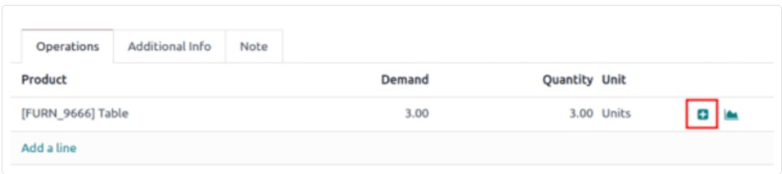

.. important::
    اگر نماد قابل مشاهده نیست، مطمئن شوید که گزینه Create New در صفحه پیکربندی رسید انتخاب شده است.

با انجام این کار، پنجره پاپ آپ Assign Serial Numbers باز می شود. فیلد Number of SN بر اساس مقدار محصول که به شماره سریال نیاز دارد به صورت خودکار پر می شود. اولین شماره سریال را به صورت دستی در قسمت First SN وارد کنید و روی Assign Serial Numbers کلیک کنید تا دنباله ای از شماره های سریال بر اساس اولین شماره سریال وارد شده ایجاد شود.

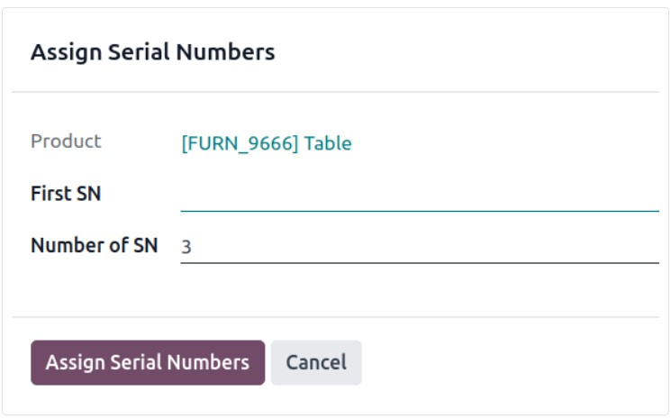

پنجره پاپ آپ حرکت سهام
--------------------------------------------------------
برای روش‌های مختلف تخصیص شماره سریال به صورت انبوه، روی نماد ⦙≣ (فهرست گلوله‌ای) در خط تولید رسید کلیک کنید.

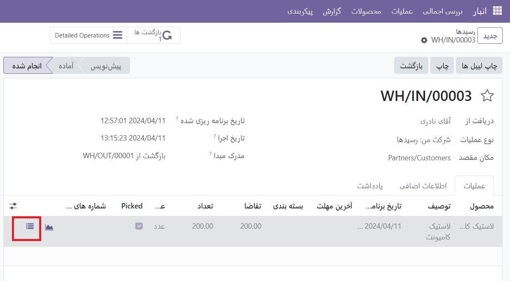

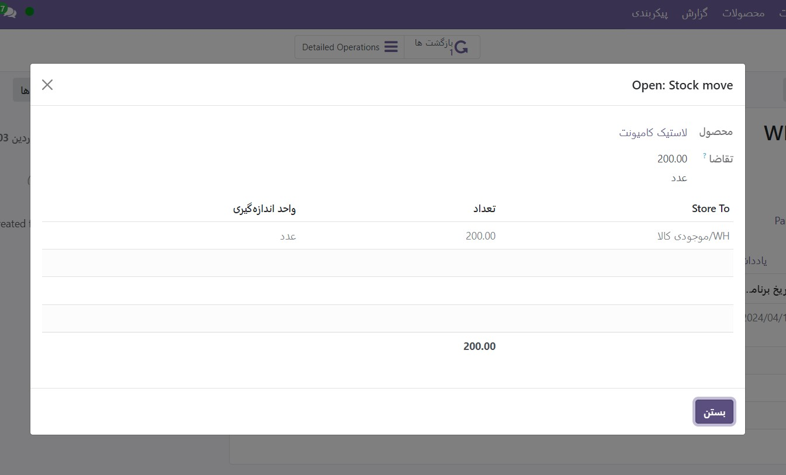

واردات سریال
-------------------------
با کلیک روی دکمه Import Serials/Lots در پنجره بازشو Open: Stock move به طور همزمان چندین شماره سریال اختصاص دهید.

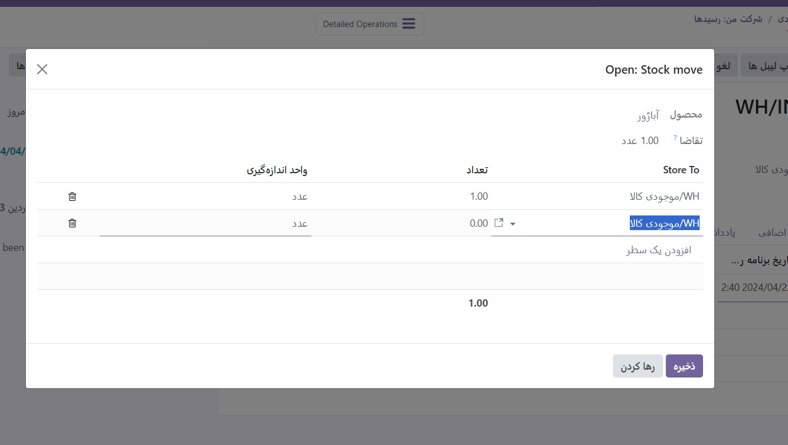

.. important::
    اگر دکمه قابل مشاهده نیست، مطمئن شوید که گزینه Create New در صفحه پیکربندی رسید انتخاب شده است.

.. tip::
    شماره های سریال را از یک صفحه گسترده اکسل موجود کپی/پیست کنید و آنها را به قسمت متنی سری و سریال ساخت اضافه کنید.

    .. image:: ./img/producttracking/t13.jpg
        :align: center
        :alt: انبار

