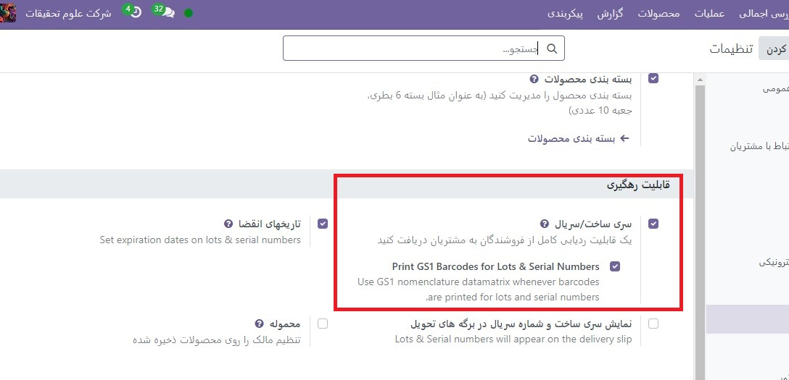
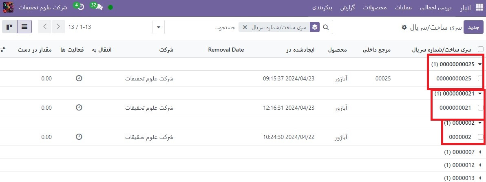

:nosearch:
:show-content:
:hide-page-toc:
:show-toc:

=================================================
تفاوت بین شناسه محصول(سری) و شماره سریال
=================================================

شناسه محصول و شماره سریال دو راه برای شناسایی و پیگیری محصولات در Odoo هستند. در حالی که شباهت هایی بین دو روش پیگیری وجود دارد، تفاوت های قابل توجهی نیز وجود دارد که بر دریافت ها، تحویل ها و گزارش های موجودی اثر می گذارد.

شناسه محصول معمولاً نشان دهنده یک دسته خاص از یک کالا است که دریافت شده، در حال حاضر ذخیره شده است یا از یک انبار حمل شده است. با این حال، می تواند به دسته ای از محصولات تولید شده در داخل نیز مربوط باشد.

شماره سریال یک شناسه منحصر به فرد است که به صورت تدریجی (یا متوالی) به یک کالا یا محصول اختصاص می یابد و برای متمایز کردن آن از سایر کالاها یا محصولات استفاده می شود.

.. seealso::
   - :doc:`use lots to manage groups of products`
   - :doc:`use serial numbers to track products`

شناسه (سری) و شماره سریال را فعال کنید
---------------------------------------------------------
برای پیگیری محصولات با استفاده از تعداد زیادی و شماره سریال، ویژگی سری و سریال ساخت باید فعال باشد.

برای انجام این کار، به برنامه  :menuselection:`انبار --> پیکربندی --> تنظیمات` بروید، به بخش قابلیت رهگیری بروید و روی کادر کنار سری و سریال ساخت کلیک کنید. سپس روی دکمه ذخیره کلیک کنید تا تغییرات ذخیره شوند

چه زمانی باید از شناسه محصول استفاده کرد
------------------------------------------------------------
شناسه محصول برای محصولاتی که در مقادیر زیاد تولید یا دریافت می شوند، مانند لباس یا غذا مفید هستند. شناسه(سری) می تواند برای پیگیری یک محصول به یک گروه استفاده شود، که به ویژه هنگام مدیریت فراخوان محصول یا تاریخ انقضا مفید است.

.. example::
    .. image:: ./img/producttracking/t57.jpg
        :align: center
        :alt: انبار 

تولید کنندگان شماره های شناسه(سری) را به گروه هایی از محصولاتی که دارای ویژگی های مشترک هستند اختصاص می دهند. این می تواند منجر به اشتراک چند کالا در یک شماره شناسه شود. این به شناسایی تعدادی از محصولات در یک گروه کمک می کند و امکان پیگیری سرتاسری این محصولات را در هر مرحله از چرخه عمر آنها فراهم می کند.

زمان استفاده از شماره سریال
---------------------------------------------------------
هدف از تخصیص شماره سریال به تک تک محصولات این است که اطمینان حاصل شود که تاریخچه هر کالا هنگام عبور از زنجیره تامین قابل شناسایی است. این می تواند به ویژه برای تولیدکنندگانی که خدمات پس از فروش مربوط به محصولاتی را که می فروشند و ارائه می دهند، مفید باشد.

.. example::
    .. image:: ./img/producttracking/t58.jpg
        :align: center
        :alt: انبار 

شماره های سریال می توانند انواع مختلفی از کاراکترها را شامل شوند: اعداد، حروف، علائم تایپی یا ترکیبی از هر سه نوع.

قابلیت پیگیری
-----------------------------------------
تولیدکنندگان و شرکت ها می توانند برای مشاهده کل چرخه عمر یک محصول به گزارش های پیگیری مراجعه کنند. این گزارش‌ها شامل اطلاعات حیاتی است، مانند اینکه از کجا آمده (و چه زمانی)، کجا ذخیره شده است، و برای چه کسی ارسال شده است.

برای مشاهده قابلیت پیگیری کامل یک محصول، یا گروه بندی محصولات بر اساس سری و/یا شماره سریال، به برنامه **انبار ‣ محصولات ‣ تعداد/شماره سریال** بروید. با انجام این کار داشبورد سری و سریال ساخت آشکار می شود.

از اینجا، محصولات با شناسه یا شماره سریال اختصاص داده شده به آنها به طور پیش فرض لیست می شوند. همچنین می‌توان آن‌ها را گسترش داد تا نشان دهد چه تعداد یا شماره سریالی به طور خاص به آنها اختصاص داده شده است.

برای گروه بندی بر اساس شناسه یا شماره سریال، ابتدا فیلترهای پیش فرض را از نوار جستجو در گوشه سمت راست بالا حذف کنید. سپس روی گروه بندی  کلیک کنید و افزودن گروه سفارشی را انتخاب کنید، که یک منوی کشویی کوچک را نشان می دهد. از این منوی کشویی کوچک، سری و سریال ساخت را انتخاب کرده و روی اعمال کلیک کنید.

با انجام این کار، تمام شناسه ها و شماره سریال های موجود نشان داده می شود، و هر کدام را می توان برای نمایش تمام مقادیر محصول با آن شماره اختصاص داده شده، گسترش داد. برای شماره‌های سریال منحصربه‌فردی که دوباره استفاده نمی‌شوند، باید فقط یک محصول در هر شماره سریال وجود داشته باشد

.. tip::
    برای اطلاعات بیشتر در مورد یک شماره شناسه یا شماره سریال، روی مورد خط شناسه یا شماره سریال کلیک کنید تا فرم شناسه یا شماره سریال آن شماره مشخص شود. از این فرم، روی دکمه‌های هوشمند مکان و قابلیت پیگیری کلیک کنید تا همه موجودی‌ها را با استفاده از آن شماره سریال ببینید. هر گونه عملیات انجام شده با استفاده از آن شناسه یا شماره سریال را می توان در اینجا نیز یافت.