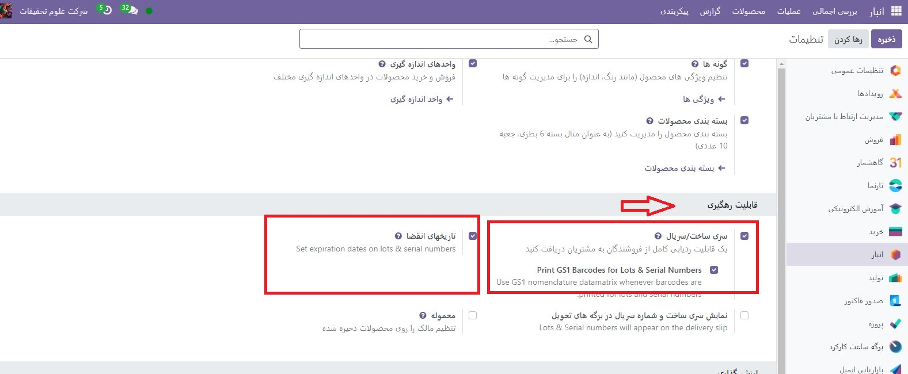
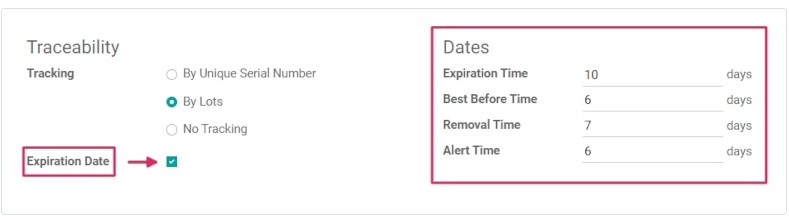
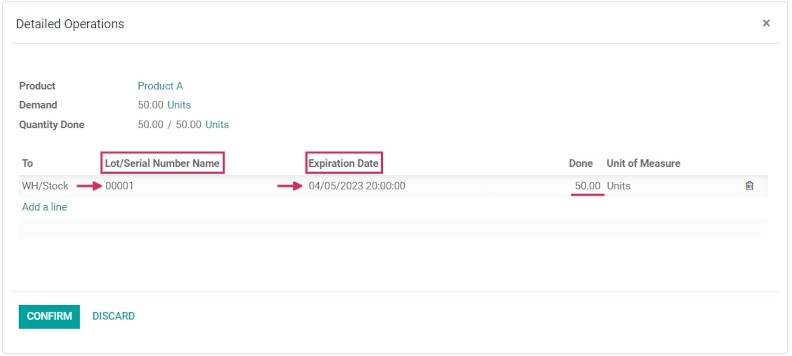

:nosearch:
:show-content:
:hide-page-toc:
:show-toc:

===============================================
تاریخ انقضا
===============================================

در Odoo می توان از تاریخ انقضا برای مدیریت و پیگیری چرخه عمر محصولات فاسد شدنی از خرید تا فروش استفاده کرد. استفاده از تاریخ انقضا باعث کاهش از بین رفتن محصول به دلیل انقضای غیرمنتظره می شود و به جلوگیری از ارسال محصولات منقضی شده به مشتریان کمک می کند.

در Odoo، فقط محصولاتی که با استفاده از شناسه و شماره سریال پیگیری می شوند، می توانند اطلاعات انقضا را به آنها اختصاص دهند. هنگامی که یک شناسه یا شماره سریال اختصاص داده شد، می توان تاریخ انقضا را تعیین کرد. این امر به ویژه برای شرکت هایی (مانند تولیدکنندگان مواد غذایی) که به طور مداوم یا منحصراً محصولات فاسد شدنی را خریداری و می فروشند مفید است

.. seealso::
   - :doc:`use lots to manage groups of products`
   - :doc:`use serial numbers to track products`

فعال کردن تاریخ انقضا
---------------------------------
برای فعال کردن استفاده از تاریخ انقضا، به برنامه  :menuselection:`انبار --> پیکربندی --> تنظیمات`بروید و به قسمت قابیلت رهگیری بروید. سپس، روی کادر انتخاب کلیک کنید تا ویژگی Lots & Serial Numbers فعال شود.
پس از فعال شدن این ویژگی، گزینه جدیدی برای فعال کردن تاریخ انقضا ظاهر می شود. برای فعال کردن این ویژگی، روی آن چک باکس کلیک کنید و مطمئن شوید که تغییرات را ذخیره کنید..

.. tip::
    هنگامی که ویژگی سری و سریال ساخت فعال شد، ویژگی‌های اضافی برای نمایش تعداد و شماره سریال در برگه‌های تحویل ظاهر می‌شود. برای نمایش سری و شماره سریال در فاکتورها. و برای نمایش تاریخ انقضا در برگه های تحویل. فعال کردن این ویژگی‌ها به قابلیت پیگری سرتاسر کمک می‌کند، مدیریت فراخوان‌های محصول، شناسایی دسته‌های «بد» محصولات و موارد دیگر را آسان‌تر می‌کند.

تاریخ انقضا را روی محصولات پیکربندی کنید
----------------------------------------------------------------------
هنگامی که ویژگی‌های Lots & Serial Numbers و تاریخ انقضا در تنظیمات برنامه انبارفعال شدند، اطلاعات انقضا را می‌توان روی محصولات جداگانه پیکربندی کرد.

برای انجام این کار، به برنامه :menuselection:`انبار --> محصولات --> محصولات` بروید و محصولی را برای ویرایش انتخاب کنید. انتخاب یک محصول، فرم محصول را برای آن کالای خاص نشان می دهد. پس از وارد شدن به فرم محصول، روی ویرایش در گوشه سمت چپ بالا کلیک کنید تا تغییرات ایجاد شود.

.. important::
    برای پیگیری با استفاده از شناسه یا شماره سریال، یا پیکربندی اطلاعات انقضا، محصولات باید نوع محصول خود را به عنوان محصول ذخیره‌سازی در برگه اطلاعات عمومی تنظیم کنند.

سپس، روی تب انبار کلیک کنید و به قسمت قابلیت رهگیری بروید. از اینجا مطمئن شوید که یا By Unique Serial Number یا By Lots تیک خورده باشد.

پس از آن، یک چک باکس جدید تاریخ انقضا ظاهر می شود که باید روی آن نیز کلیک کنید. هنگامی که هر دو فعال هستند، یک فیلد تاریخ جدید در سمت راست ظاهر می شود.

.. note::
    اگر یک محصول قبل از فعال کردن پیگیری توسط شناسه یا شماره سریال موجودی داشته باشد، ممکن است نیاز به تعدیل موجودی برای تخصیص شماره شناسه(سری) به موجودی موجود باشد.

.. tip::
    برای پردازش شناسه محصول از محصولات در رسید یا تحویل، توصیه می شود با استفاده از شناسه پیگیری شود، بنابراین در صورت بروز هر گونه مشکلی، می توان چندین محصول را به همان شماره شناسه پیگیری کرد.

در قسمتDates(داده ها)، چهار دسته از اطلاعات انقضا برای پیکربندی برای محصول وجود دارد:

   - زمان انقضا: تعداد روزهای پس از دریافت محصولات (چه از فروشنده یا در انبار پس از تولید) که در آن کالا ممکن است خطرناک شود و نباید استفاده یا مصرف شود.
   - بهترین قبل از زمان: تعداد روزهای قبل از تاریخ انقضا که در آن کالا شروع به خراب شدن می کند، بدون اینکه لزوماً هنوز خطرناک باشد.
   - زمان حذف: تعداد روزهای قبل از تاریخ انقضا که در آن کالا باید از انبار خارج شود.
   - زمان هشدار: تعداد روزهای قبل از تاریخ انقضا که در آن باید هشداری برای کالاهایی در یک لات خاص یا حاوی یک شماره سریال خاص اعلام شود

.. note::
    مقادیر وارد شده در این فیلدها به طور خودکار تاریخ انقضای کالاهای وارد شده در انبار را محاسبه می کند، چه از یک فروشنده خریداری شده باشد و چه در داخل تولید شده باشد..

هنگامی که تمام اطلاعات انقضا پیکربندی شد، روی **ذخیره** کلیک کنید تا همه تغییرات ذخیره شوند.

.. tip::
    اگر فیلد Dates با هیچ مقداری برای اطلاعات انقضا پر نشده باشد، تاریخ ها (و شناسه ها) را می توان به صورت دستی پس از دریافت و تحویل در داخل و خارج از انبار اختصاص داد. حتی در صورت تخصیص، باز هم می توان آنها را بازنویسی کرد و در صورت نیاز به صورت دستی تغییر داد.

تاریخ انقضا را روی رسیدها با شماره سریال و شناسه تنظیم کنید
-----------------------------------------------------------------------------------------
ایجاد تاریخ انقضا برای کالاهای ورودی مستقیماً از طریق سفارش خرید انجام می شود. برای ایجاد یک سفارش خرید، به برنامه خرید بروید و روی ایجاد کلیک کنید تا یک درخواست جدید برای پیش فاکتور  :abbr:`RFQ (Requstion for Quotation)` ایجاد کنید.
سپس با افزودن فروشنده، اطلاعات را پر کنید و با کلیک روی افزودن محصول، محصولات را به خطوط تولید اضافه کنید.
با تغییر شماره در ستون تعداد ، مقدار مورد نظر را برای سفارش انتخاب کنید و روی سفارش را تایید کنید کلیک کنید. این RFQ را به سفارش خرید تبدیل می کند.
روی دکمه هوشمند رسید در بالای سفارش خرید کلیک کنید تا به فرم رسید انبار منتقل شوید.

.. note::
    با کلیک بر روی تاییداعتبار قبل از تخصیص شماره سریال به مقادیر محصول سفارش داده شده، یک پنجره Error کاربر ظاهر می شود. پنجره بازشو نیاز به وارد کردن شماره شناسه یا شماره سریال برای محصولات سفارش داده شده دارد. RFQ را نمی توان بدون شناسه یا شماره سریال اختصاص داده شده تأیید کرد.
    .. image:: ./img/producttracking/t68.jpg
        :alt: انبار
        :align: center

از اینجا، روی نماد منوی گزینه های اضافی که در سمت چپ خط محصول قرار دارد، کلیک کنید. پس از کلیک کردن، یک پاپ آپ Detailed Operations ظاهر می شود.

در این پاپ آپ، روی افزودن یک سطر کلیک کنید و در قسمت Lot/Serial Number Name شماره شناسه یا شماره سریال اختصاص دهید.

تاریخ انقضا بر اساس پیکربندی در فرم محصول (اگر قبلاً پیکربندی شده باشد) به طور خودکار پر می شود.

.. tip::
    اگر قسمت Dates در فرم محصول پیکربندی نشده باشد، این تاریخ را می توان به صورت دستی وارد کرد.

پس از مشخص شدن تاریخ انقضا، مقادیر انجام شده را علامت بزنید و روی تایید کلیک کنید تا پاپ آپ بسته شود. در نهایت بر روی تاییداعتبار کلیک کنید.

پس از تأیید رسید، یک دکمه هوشمند پیگیری ظاهر می شود. روی دکمه هوشمند پیگیری کلیک کنید تا گزارش پیگیری به روز شده را ببینید که شامل: یک سند مرجع. محصول در حال پیگیری؛ شناسه/سریال .

