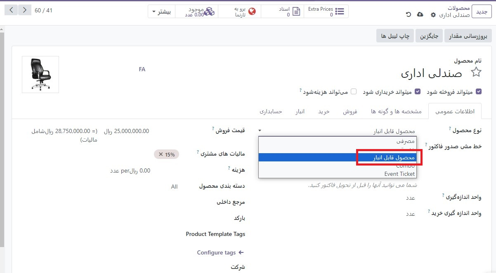

:nosearch:
:show-content:
:hide-page-toc:
:show-toc:

===========================================
نوع محصول
===========================================

برای پیگیری محصولات در سطوح مختلف جزئیات، انواع محصول را در Odoo تعریف کنید.
طبقه‌بندی محصولات به‌عنوان قابل ذخیره‌سازی برای پیگیری تعداد سهام، به کاربران اجازه می‌دهد قوانین سفارش مجدد را برای ایجاد سفارش‌های خرید فعال کنند. فرض بر این است که محصولات مصرفی همیشه در انبار هستند و محصولات خدماتی توسط کسب و کار انجام و ارائه می شوند.

.. seealso::
    0. https://www.youtube.com/watch?v=l6j0ZkP5mLM

تنظیم نوع محصول
-------------------------------------------------
برای تعیین نوع محصول، به برنامه :menuselection:`انبار --> محصولات --> محصولات` رفته و محصول مورد نظر را از لیست انتخاب کنید.

در فرم محصول، در قسمت نوع محصول، انتخاب کنید:

محصول قابل ذخیره سازی برای محصولات پیگیری شده با تعداد موجودی. فقط محصولات قابل ذخیره سازی می توانند قوانین سفارش مجدد را برای ایجاد خرید فعال کنند.

.. tip::
    اگر برای پیگیری موجودی محصول در مکان‌های مختلف، ارزیابی موجودی، یا اگر محصول دارای سری/یا شماره سریال است، محصول قابل ذخیره‌سازی را انتخاب کنید.

- قابل مصرف برای محصولاتی که همیشه فرض می شود در انبار موجود هستند و مقدار آن برای پیگیری یا پیش بینی لازم نیست (مانند میخ، دستمال توالت، قهوه و غیره). مواد مصرفی قابل تعویض و ضروری هستند، اما شمارش دقیق غیرضروری است. یا

- خدمات برای محصولات خدمات قابل فروش که انجام می شوند و با تعداد موجودی پیگیری نمی شوند (مانند خدمات نگهداری، نصب یا تعمیر).

- ترکیبی: محصولات با تخفیف را ایجاد کنید که در یک بسته نرم افزاری فروخته می شوند. به نصب برنامه PoS نیاز دارد.

- بلیط رویداد: به شرکت کنندگانی که می خواهند به یک رویداد بروند فروخته می شود. به نصب برنامه رویدادها نیاز دارد

انواع را مقایسه کنید
-------------------------------------------------
در زیر خلاصه ای از نحوه تأثیر هر نوع محصول بر عملیات موجودی مشترک، مانند نقل و انتقالات، قوانین سفارش مجدد، و گزارش پیش بینی شده، آمده است. 

.. list-table::
    :header-rows: 1
    :stub-columns: 1

  * - Name
    - Country
    - Favorite colour
  * - Raúl
    - Montenegro
    - Purple
  * - Mélanie
    - France
    - Turquoise