:nosearch:
:show-content:
:hide-page-toc:
:show-toc:

=============================================================
از شناسه محصول برای مدیریت گروه های محصولات استفاده کنید
=============================================================

شناسه (سری) محصول یکی از دو روش شناسایی و پیگیری محصولات در Odoo است. مقدار زیادی معمولاً نشان دهنده یک دسته خاص از کالایی است که دریافت شده، در حال حاضر ذخیره شده است یا از یک انبار حمل شده است، اما همچنین می تواند مربوط به دسته ای از محصولات تولید شده در داخل باشد.

تولید کنندگان شماره های شناسه محصول را به گروه هایی از محصولاتی که دارای ویژگی های مشترک هستند اختصاص می دهند. این می تواند منجر به اشتراک چند کالا در یک شماره شناسه شود. این به شناسایی تعدادی از محصولات در یک گروه کمک می کند و امکان ردیابی سرتاسری این محصولات را در هر مرحله از چرخه عمر آنها فراهم می کند.

شناسه محصول برای محصولاتی که در مقادیر زیاد تولید یا دریافت می شوند (مانند لباس یا غذا) مفید هستند و می توانند برای ردیابی یک محصول به یک گروه استفاده شوند. این به ویژه هنگام مدیریت فراخوان یا تاریخ انقضای محصول مفید است.

.. seealso::
   - :doc:`use serial numbers to track productss`

شناسه(سری) و شماره سریال را فعال کنید
----------------------------------------------------------------------
برای پیگیری محصولات با استفاده از لات، ویژگی سری و سریال ساخت باید فعال باشد. به برنامه :menuselection:`انبار --> پیکربندی --> تنظیمات`بروید، به بخش قابلیت رهگیری بروید و روی کادر کنار سری و سریال ساخت کلیک کنید. سپس روی دکمه ذخیره کلیک کنید تا تغییرات ذخیره شوند.

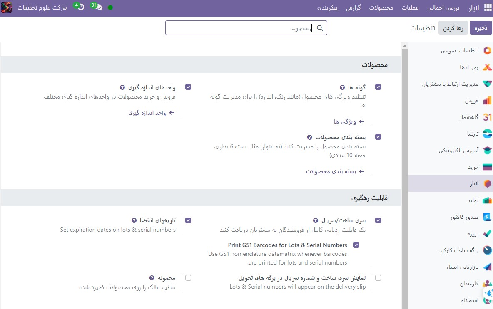

پیگیری محصولات بر اساس شناسه سریال
-----------------------------------------------------------------------
هنگامی که تنظیم سری ساخت و سریال فعال شد، اکنون می توان محصولات جداگانه را برای پیگیری با استفاده از شناسه محصول پیکربندی کرد. برای این کار به برنامه :menuselection:`انبار --> محصولات --> محصولات` رفته و محصولی را انتخاب کنید.

پس از وارد شدن به فرم محصول، روی ویرایش کلیک کنید تا تغییراتی در فرم ایجاد شود. سپس، روی تب انبار کلیک کنید. در قسمت قابلیت پیگیری روی(شناسه محصول) By Lots کلیک کنید. سپس برای ذخیره تغییرات روی ذخیره کلیک کنید. اکنون می توان شماره های موجود یا جدید را به دسته های تازه دریافت یا تولید شده این محصول اختصاص داد.

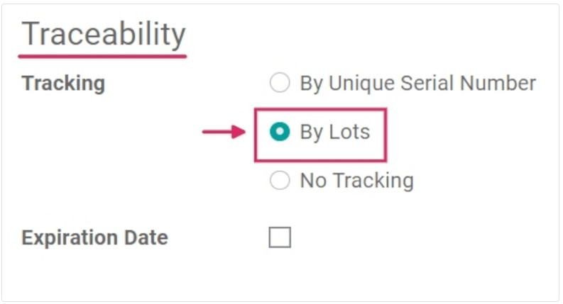

شناسه سریال برای محصولاتی که از قبل در انبار هستند ایجاد کنید
-------------------------------------------------------------------------------------
شناسه های جدید را می توان برای محصولاتی که از قبل در انبار هستند بدون شماره شناسه اختصاص داده شده ایجاد کرد. برای انجام این کار، به برنامه  :menuselection:`انبار --> محصولات --> سری و سریال ساخت` بروید و روی **جدید** کلیک کنید. با انجام این کار یک صفحه جداگانه نشان می دهد که در آن یک سری و سریال ساخت به طور خودکار تولید می شود.

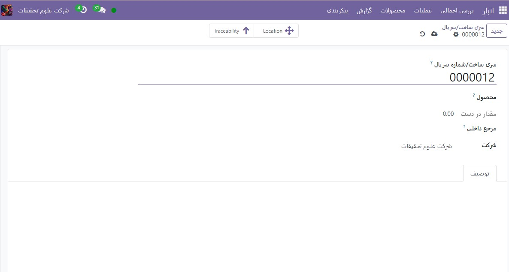

.. tip::
    در حالی که Odoo به طور خودکار یک سری و سریال ساخت برای دنبال کردن آخرین شماره ایجاد می کند، می توان آن را ویرایش کرد و با کلیک روی خط زیر قسمت(سری و سریال ساخت) Lot/Serial Number و تغییر شماره تولید شده، آن را ویرایش کرد و به هر شماره دلخواه تغییر داد.

هنگامی که  **شناسه و سریال ساخت** جدید تولید شد، روی فیلد خالی کنار محصول کلیک کنید تا منوی کشویی نمایان شود. از این منو، محصولی را که این شماره جدید به آن اختصاص داده می شود، انتخاب کنید.
این فرم همچنین گزینه ای برای تنظیم مقدار، اختصاص یک شماره مرجع داخلی منحصر به فرد (برای اهداف پیگیری)، و تخصیص این مجموعه یا پیکربندی شماره سریال خاص به یک وب سایت خاص در فیلد وب سایت (اگر در یک محیط چند وب سایت کار می کند) ارائه می دهد. .
شرح مفصلی از این شناسه یا شماره سریال خاص را نیز می توان در تب توضیحات زیر اضافه کرد.
هنگامی که تمام تنظیمات مورد نظر کامل شد، روی دکمه **ذخیره** کلیک کنید تا همه تغییرات ذخیره شوند.

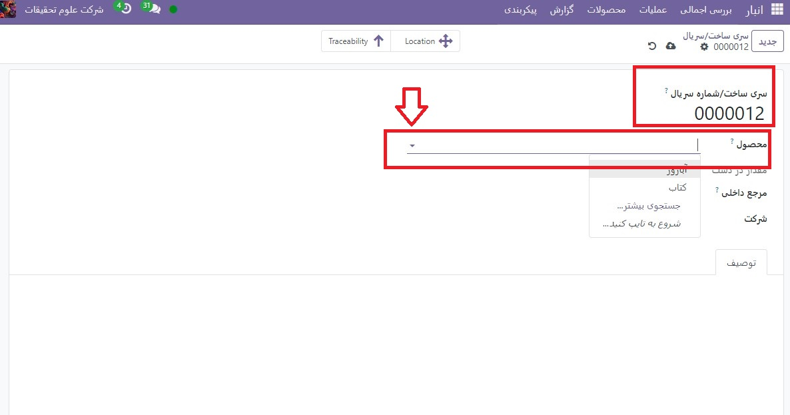

پس از ایجاد، ذخیره و تخصیص شماره شناسه جدید به محصول مورد نظر، با رفتن به محصولات ‣ محصولات، به فرم محصول در برنامه موجودی بازگردید و محصولی را انتخاب کنید که این شماره شناسه جدید ایجاد شده به آن مربوط شده است. اختصاص داده.

در فرم جزئیات آن محصول، روی دکمه هوشمند سری و سریال ساخت کلیک کنید تا شماره شناسه جدید را مشاهده کنید. هنگامی که مقدار اضافی از این محصول دریافت یا تولید شد، می توان این شماره شناسه جدید را انتخاب و به آن اختصاص داد

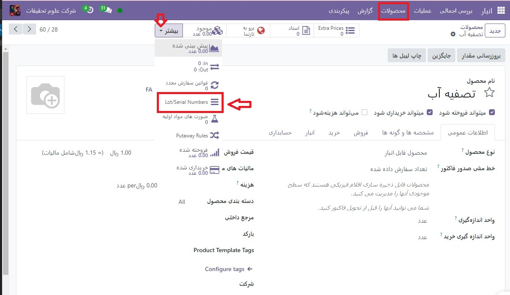

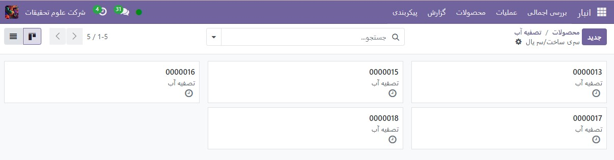

شناسه محصول را برای حمل و نقل و دریافت مدیریت کنید
------------------------------------------------------------------------
شماره شناسه محصول را می توان برای کالاهای ورودی و خروجی اختصاص داد. برای کالاهای ورودی، شماره شناسه مستقیماً در فرم سفارش خرید اختصاص داده می شود. برای کالاهای خروجی، شماره شناسه مستقیماً در فرم سفارش فروش تخصیص داده می شود.

شناسه محصول در رسیدها را مدیریت کنید
--------------------------------------------------------
اختصاص شماره شناسه به کالاهای ورودی مستقیماً از طریق سفارش خرید  :abbr:`PO (Purchase order)`  انجام می شود.
برای ایجاد یک  :abbr:`PO (Purchase order)` ، به خرید برنامه ‣ ایجاد بروید. انجام این کار یک فرم جدید و خالی درخواست برای پیش فاکتور  :abbr:`RFQ (Requisition for Quotation)`  را نشان می دهد.
در این RFQ، با افزودن فروشنده، و افزودن محصولات مورد نظر به خطوط تولید، با کلیک بر روی افزودن محصول (در زیر برگه محصولات) اطلاعات لازم را پر کنید.

با تغییر شماره در ستون تعداد، مقدار مورد نظر محصول را برای سفارش انتخاب کنید.
پس از پر شدن  :abbr:`RFQ (Requisition for Quotation)` ، روی تأیید سفارش کلیک کنید. هنگامی که RFQ تأیید شد، به یک سفارش خرید تبدیل می شود و دکمه هوشمند رسید ظاهر می شود. روی دکمه هوشمند رسید کلیک کنید تا به فرم رسید انبار منتقل شوید.

.. note::
    با کلیک بر روی تایید اعتبارقبل از اختصاص شناسه محصول به مقادیر محصول سفارش داده شده، یک صفحه نمایش خطای کاربر ایجاد می شود. پاپ آپ نیاز به وارد کردن تعداد زیادی یا شماره سریال برای محصولات سفارش داده شده دارد. RFQ بدون اختصاص تعداد زیادی قابل تایید نیست.

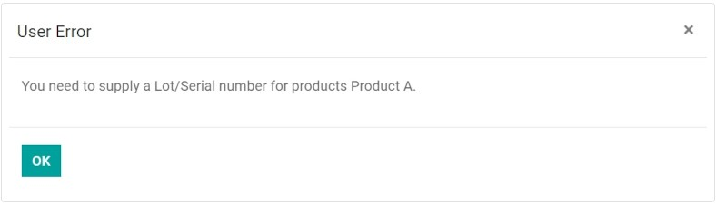

از اینجا، روی منوی گزینه‌های اضافی، که(چهار خط افقی) در سمت چپ ستون واحد اندازه‌گیری در برگه عملیات قرار دارد، کلیک کنید. با کلیک بر روی آن نماد، یک پاپ آپ Detailed Operations ظاهر می شود.

در این پاپ آپ، تعدادی فیلد مختلف از جمله تخصیص شناسه محصول را در زیر ستون سری و سریال ساخت که در پایین پنجره بازشو قرار دارد، پیکربندی کنید.

-  دو راه برای تخصیص شماره های شناسه محصول وجود دارد: دستی و کپی/پیست.

#. تخصیص دستی شماره شناسه محصول: روی افزودن یک خط کلیک کنید و مکانی را که محصولات در آن ذخیره می شوند را در ستون To انتخاب کنید. سپس یک (نام شماره محصول)Lot Number Name جدید تایپ کنید و مقدار Done را تنظیم کنید.

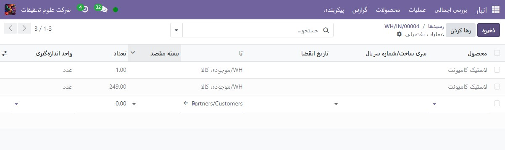

.. note::
    اگر مقادیر باید در مکان‌ها و  شناسه ‌های متعدد پردازش شوند، روی افزودن یک خط کلیک کنید و نام شماره شناسه جدید را برای مقادیر اضافی تایپ کنید. تکرار کنید تا مقدار انجام شده با تقاضا مطابقت داشته باشد.

#. کپی/پیست کردن اعداد شناسه محصول از یک صفحه گسترده: یک صفحه گسترده را با تمام شماره های شناسه های دریافتی از تامین کننده پر کنید (یا به صورت دستی انتخاب شده است تا پس از دریافت آن تخصیص داده شود). سپس، آنها را در ستون  نام و شماره سری/ سریال کپی و جایگذاری کنید. Odoo به طور خودکار تعداد خطوط لازم را بر اساس تعداد اعداد چسبانده شده در ستون ایجاد می کند. از اینجا، مقادیر به مکان و انجام شده را می توان به صورت دستی در هر یک از خطوط شماره  شناسه وارد کرد.

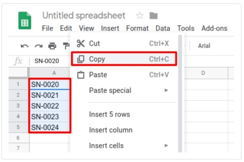

هنگامی که به همه مقادیر محصول شناسه اختصاص داده شد، روی تأیید کلیک کنید تا پنجره بازشو بسته شود. سپس روی تایید اعتبارکلیک کنید.
پس از تأیید رسید، یک دکمه هوشمند پیگیری ظاهر می شود. روی دکمه هوشمند پیگیری کلیک کنید تا گزارش پیگیری به روز شده را ببینید، که شامل: یک سند مرجع، محصول در حال ردیابی، سری/سریال اختصاص داده شده و موارد دیگر است.

شناسه محصول را در سفارشات تحویل مدیریت کنید
-------------------------------------------------------------------------

تخصیص شماره شناسه به کالاهای خروجی می تواند مستقیماً از طریق سفارش فروش  :abbr:` SO (Sales order)` انجام شود.
برای ایجاد یک SO، به برنامه فروش ‣ ایجاد کنید. انجام این کار یک فرم پیش فاکتور جدید و خالی را نشان می دهد.
در این فرم خالی پیش فاکتور، اطلاعات لازم را با افزودن یک مشتری، و افزودن محصولات به خطوط محصول (در برگه خطوط سفارش) با کلیک روی افزودن یک محصول، پر کنید.
سپس با تغییر شماره در ستون مقدار، مقدار مورد نظر را برای فروش انتخاب کنید.

پس از تکمیل پیش فاکتور، روی دکمه تایید کلیک کنید تا پیش فاکتور تایید شود. هنگامی که پیش فاکتور تأیید شد، به یک  :abbr:`SO (Sales order)` تبدیل می شود و یک دکمه هوشمند تحویل ظاهر می شود.
برای مشاهده فرم رسید انبار برای آن SO خاص، روی دکمه هوشمند تحویل کلیک کنید.

از اینجا، روی منوی گزینه‌های اضافی، کلیک کنید (چهار خط افقی، واقع در سمت چپ ستون واحد اندازه‌گیری در تب عملیات). با کلیک بر روی آن نماد، یک پاپ آپ Detailed Operations ظاهر می شود.

در پنجره بازشو، یک سری و سریال ساخت به طور پیش‌فرض انتخاب می‌شود که مقدار کامل رزرو شده از آن شناسه خاص گرفته می‌شود (اگر موجودی کافی در آن شناسه خاص وجود داشته باشد).

اگر موجودی کافی در آن شناسه وجود ندارد، یا اگر مقادیر جزئی تقاضا باید از چندین شماره شناسه گرفته شود، مقدار را در ستون انجام شد به گونه ای تغییر دهید که فقط آن بخش خاص از مقدار کل را شامل شود.

.. note::
    بسته به استراتژی حذف انتخابی (FIFO، LIFO، یا FEFO)، مقدار انتخابی خودکار برای سفارشات تحویل متفاوت است. این نیز به مقدار سفارش داده شده بستگی دارد، و اگر مقدار کافی در یک شناسسه محصول برای انجام سفارش وجود داشته باشد.

.. seealso::
   - :doc:`Removal strategies`

سپس روی **افزودن یک خط** کلیک کنید، یک سری/ شماره سریال اضافی (متفاوت) را انتخاب کنید، بقیه مقادیر انجام شده را اعمال کنید و روی تایید کلیک کنید تا پنجره بازشو بسته شود. در آخر برای تحویل محصولات روی دکمه تاییداعتبار کلیک کنید.

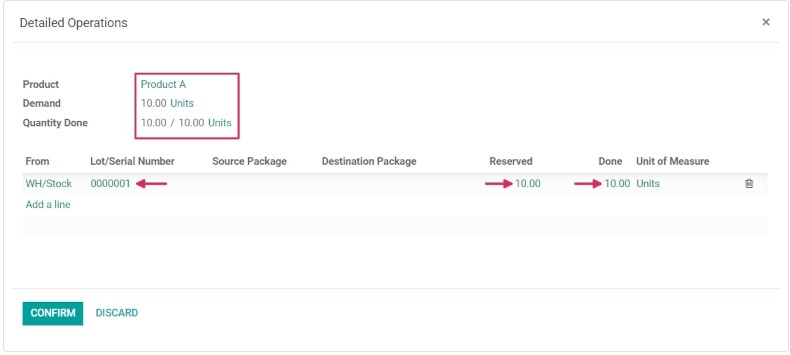

پس از تأیید سفارش تحویل، یک دکمه هوشمند پیگیری ظاهر می شود. روی دکمه هوشمند پیگیری کلیک کنید تا گزارش پیگیری به روز شده را مشاهده کنید، که شامل یک سند مرجع، محصول در حال ردیابی، تاریخ، و سری/سریال  اختصاص داده شده است.

گزارش پیگیری همچنین می‌تواند شامل یک رسید مرجع از سفارش خرید قبلی باشد، در صورتی که مقادیر محصول با شماره شناسه محصول مشترک یکسان باشد.

شناسه محصول را برای انواع عملیات مختلف مدیریت کنید
----------------------------------------------------------------------------------------
در Odoo، ایجاد شناسه های جدید به صورت پیش فرض تنها پس از دریافت محصولات از یک سفارش خرید مجاز است. نمی توان از شماره های موجود استفاده کرد.
برای سفارش‌های فروش، برعکس است: نمی‌توان شماره‌های جدید را در سفارش تحویل ایجاد کرد، فقط می‌توان از شماره‌های موجود استفاده کرد.
برای تغییر قابلیت استفاده از اعداد شناسه جدید (یا موجود) در هر نوع عملیات، به برنامه :menuselection:`انبار --> پیکربندی --> انواع عملیات` بروید و نوع عملیات مورد نظر را انتخاب کنید.
برای رسیدها، که در صفحه انواع عملیات یافت می‌شود، می‌توان با کلیک بر روی ویرایش، گزینه Use Existing Lots/Serial Numbers را فعال کرد و سپس بر روی کادر انتخاب کنار گزینه Use Existing Lots/Serial Numbers (در بخش قابلیت پیگیری) کلیک کرد. در آخر روی دکمه ذخیره کلیک کنید تا تغییرات ذخیره شوند.
برای سفارشات تحویل، گزینه Create New Lots/Serial Numbers را می توان با کلیک بر روی **ویرایش** و کلیک کردن بر روی کادر کنار گزینه Create New Lots/Serial Numbers فعال کرد. حتما روی دکمه **ذخیره** کلیک کنید تا همه تغییرات ذخیره شوند.

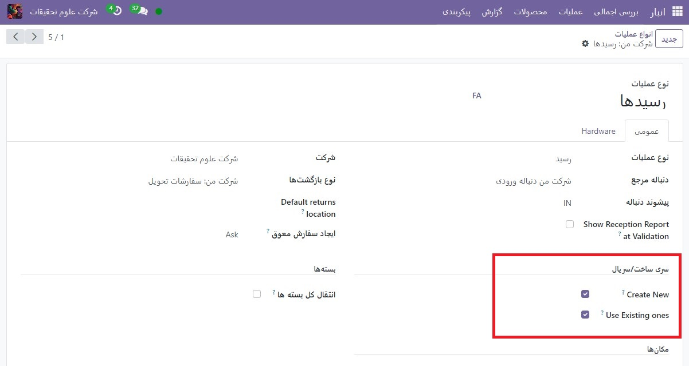

.. tip::
    برای نقل و انتقالات بین انباری که شامل محصولات ردیابی شده توسط لات ها می شود، فعال کردن گزینه Use Existing Lots/Serial Numbers برای رسیدهای انبار می تواند مفید باشد.

قابلیت پیگیری شناسه
-----------------------------------------------------
تولیدکنندگان و شرکت‌ها می‌توانند برای مشاهده کل چرخه عمر یک محصول به گزارش‌های پیگیری مراجعه کنند: از کجا (و چه زمانی) آمده، کجا ذخیره شده است، و به چه کسی (و چه زمانی) رفته است.

برای مشاهده قابلیت پیگیری کامل یک محصول یا گروه بر اساس شناسه، به برنامه :menuselection:`انبار --> محصولات --> سری و سریال ساخت` بروید. با انجام این کار داشبورد Lots/Serial Numbers آشکار می شود

از اینجا، محصولات با شماره شناسه اختصاص داده شده به آنها به طور پیش‌فرض فهرست می‌شوند و می‌توان آن‌ها را برای نمایش شماره‌های شناسه ی که آن محصولات به آن‌ها اختصاص داده‌اند، گسترش داد.

برای گروه بندی بر اساس تعداد زیادی (یا شماره سریال)، با حذف فیلترهای موجود در نوار جستجو شروع کنید. سپس روی منوی کشویی گروه بندی کلیک کنید، افزودن گروه سفارشی را انتخاب کنید و سری و سریال ساخت را از منوی کشویی انتخاب کنید. سپس روی ان کلیک کنید.

با انجام این کار، تمام شناسه ها و شماره سریال های موجود نمایش داده می شود، و می توان آن را برای نمایش تمام مقادیر محصولات با آن شماره اختصاص داده شده گسترش داد.

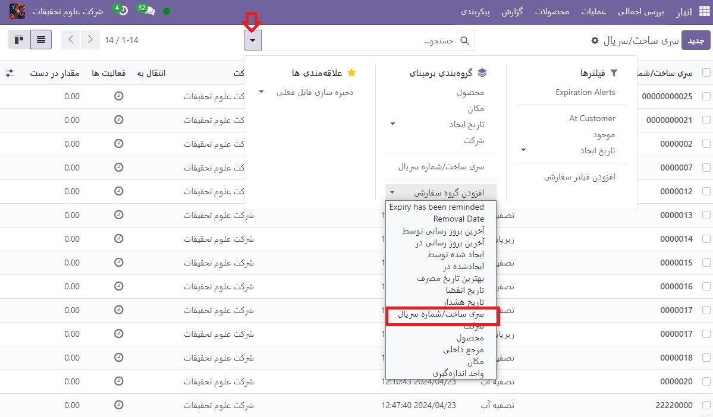

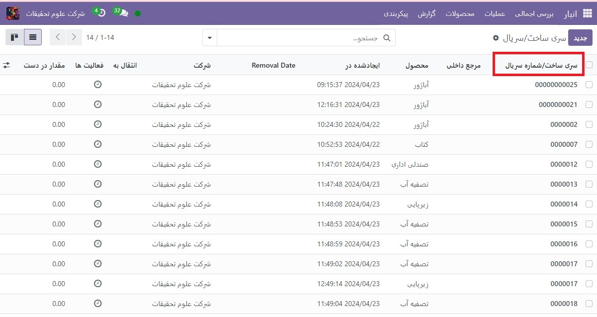