:nosearch:
:show-content:
:hide-page-toc:
:show-toc:

======================================================
از شماره سریال برای پیگیری محصولات استفاده کنید
======================================================

شماره سریال یکی از دو روش شناسایی و پیگیری محصولات در Odoo است. شماره سریال یک شناسه منحصر به فرد است که به صورت تدریجی (یا متوالی) به یک کالا یا محصول اختصاص می یابد و برای متمایز کردن آن از سایر اقلام و محصولات استفاده می شود.

شماره های سریال می توانند از انواع مختلفی از کاراکترها تشکیل شوند: آنها می توانند کاملاً عددی باشند، می توانند حاوی حروف و سایر علائم چاپی باشند یا می توانند ترکیبی از همه موارد فوق باشند.

هدف از تخصیص شماره سریال به محصولات جداگانه این است که اطمینان حاصل شود که تاریخچه هر کالا هنگام عبور از زنجیره تامین قابل شناسایی است. این امر به ویژه برای تولیدکنندگانی که خدمات پس از فروش را به محصولاتی که می فروشند و تحویل می دهند ارائه می کنند مفید باشد.

.. seealso::
   - :doc:`Use lots to manage groups of products`

سری ساخت/ سریال را فعال کنید
-----------------------------------------------

برای ردیابی محصولات با استفاده از شماره سریال، ویژگی سری ساخت /سریال باید فعال باشد. برای فعال کردن این کار، به برنامه  :menuselection:`انبار --> پیکربندی --> تنظیمات` بروید، به بخش قابلیت پیگیری بروید و روی کادر کنار سری ساخت/سریال کلیک کنید. به خاطر داشته باشید که برای **ذخیره** تغییرات روی دکمه ذخیره کلیک کنید.

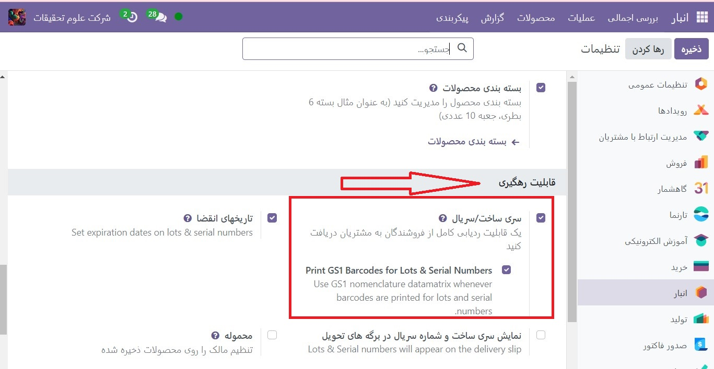

پیگیری شماره سریال روی محصولات را پیکربندی کنید
-----------------------------------------------------------------

پس از فعال شدن تنظیمات سری وسریال ساخت، اکنون می توان محصولات جداگانه را با استفاده از شماره سریال پیگیری کرد. برای پیکربندی این، به برنامه  :menuselection:`انبار --> محصولات --> محصولات` بروید و محصول مورد نظر را برای پیگیری انتخاب کنید.

پس از وارد شدن به فرم محصول، روی ویرایش کلیک کنید، به برگه انباربروید و به بخش قابلیت پیگیری بروید. سپس گزینه By Unique Serial Number را انتخاب کرده و روی ذخیره کلیک کنید تا تغییرات ذخیره شوند. اکنون می توان شماره سریال موجود یا جدید را انتخاب کرد و به دسته های تازه دریافت یا تولید شده این محصول اختصاص داد.

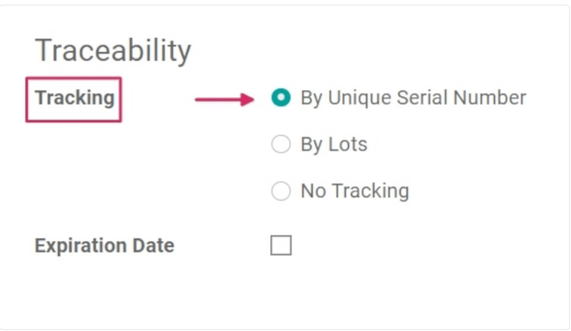

.. warning::
    اگر محصولی شماره سریال به آن اختصاص داده نشده باشد، یک پنجره پاپ آپ خطای کاربر ظاهر می شود. پیام خطا بیان می کند که محصول(های) موجود در انبار شماره سری/سریال ندارد. با این حال، با انجام یک تنظیم انبار، می توان تعداد زیادی / سریال را به محصول اختصاص داد.

شماره سریال جدیدی برای محصولاتی که از قبل در انبار هستند ایجاد کنید
---------------------------------------------------------------------------------
شماره سریال جدیدی را می توان برای محصولاتی که از قبل در انبار موجود هستند و بدون شماره سریال اختصاص داده شده ایجاد کرد. برای این کار به  :menuselection:`انبار --> محصولات --> سری و سریال ساخت` رفته و روی جدید کلیک کنید. با انجام این کار، یک فرم خالی / شماره سریال نشان می دهد. در این فرم، یک سری وسریال ساخت به صورت خودکار تولید می شود.

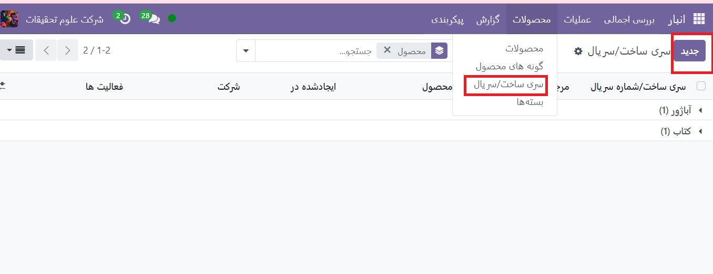

.. tip::
    در حالی که Odoo به طور خودکار یک شماره سری/سریال جدید را برای دنبال کردن آخرین شماره ایجاد می کند، می توان آن را ویرایش کرد و با کلیک بر روی خط زیر قسمت سری و سریال ساخت و تغییر شماره تولید شده، آن را به هر شماره دلخواه تغییر داد.

هنگامی که سری و سریال ساخت تولید شد، روی قسمت خالی کنار محصول کلیک کنید تا منوی کشویی نمایان شود. از این منو، محصولی را که این شماره جدید به آن اختصاص داده می شود، انتخاب کنید.

این فرم همچنین گزینه ای برای تنظیم کمیت، اختصاص یک شماره مرجع داخلی منحصر به فرد (برای اهداف ردیابی)، و اختصاص این پیکربندی سری/شماره سریال خاص به یک وب سایت خاص در قسمت وب سایت (اگر در یک وب سایت چندگانه کار می کند) ارائه می دهد. 

شرح مفصلی از این شماره سریال/سری خاص را نیز می توان در تب توضیحات زیر اضافه کرد.

هنگامی که تمام تنظیمات مورد نظر کامل شد، روی دکمه **ذخیره** کلیک کنید تا همه تغییرات ذخیره شوند.

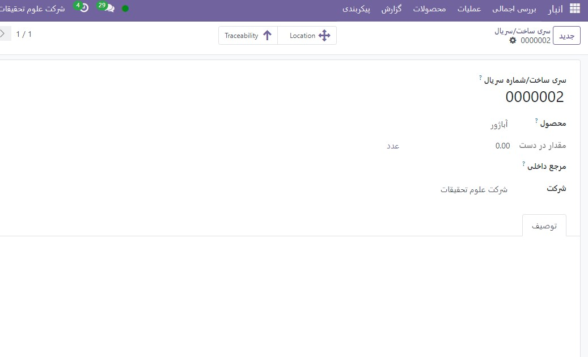

پس از ایجاد شماره سریال جدید، تخصیص به محصول مورد نظر و ذخیره، با رفتن به **محصولات ‣ محصولات** و انتخاب محصولی که این شماره سریال تازه ایجاد شده به تازگی به آن اختصاص داده شده است، به فرم محصول برگردید.

در فرم جزئیات آن محصول، روی دکمه هوشمند **سری ساخت/ شماره سریال** کلیک کنید تا شماره سریال جدید را مشاهده کنید.

مدیریت شماره سریال برای ارسال و دریافت
------------------------------------------------------
شماره سریال را می توان برای کالاهای ورودی و خروجی اختصاص داد. برای کالاهای ورودی، شماره سریال مستقیماً در فرم سفارش خرید اختصاص داده می شود. برای کالاهای خروجی، شماره سریال مستقیماً در فرم سفارش فروش تخصیص داده می شود.

اختصاص شماره سریال به محصولات تازه دریافت شده
------------------------------------------------------------
تخصیص شماره سریال به کالاهای دریافتی را می توان در رسید، با کلیک بر روی دکمه هوشمند عملیات تفصیلی یا با کلیک بر روی نماد ⦙≣ (فهرست گلوله‌ای) در خط محصول انجام داد.

.. seealso::
   - :doc:`assign serial numbers`

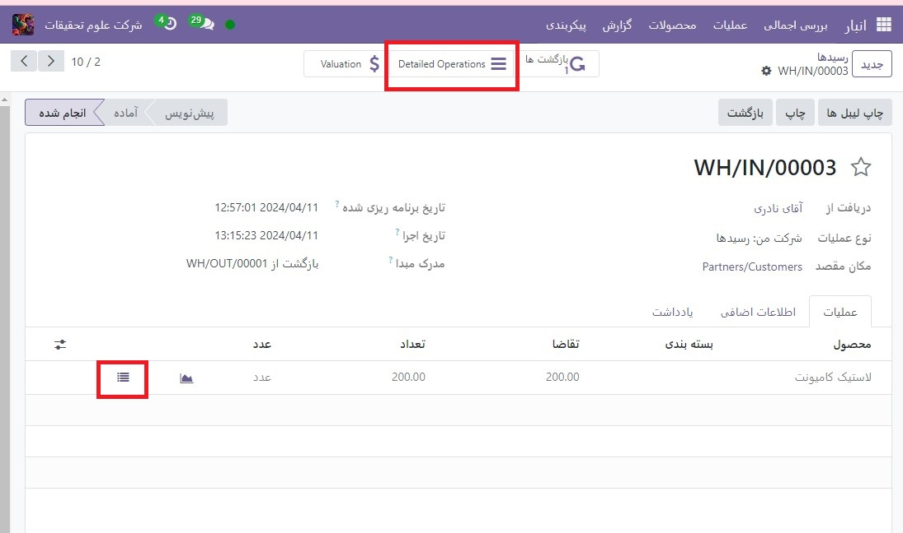

.. warning::
    با کلیک بر روی تاییداعتبار قبل از اختصاص شماره سریال به مقادیر دریافتی، یک پاپ آپ خطای کاربر ظاهر می شود. پاپ آپ نیاز به وارد کردن تعداد زیادی یا شماره سریال برای محصولات سفارش داده شده دارد.  :abbr:`RFQ (Requisition for Quotation)` بدون اختصاص شماره سریال قابل تایید نیست.
    
    .. image:: ./img/producttracking/t34.jpg
        :align: center
        :alt: انبار

راه‌های مختلفی برای انجام این کار وجود دارد: تخصیص دستی شماره سریال، اختصاص خودکار شماره سریال، و کپی/پیست کردن شماره سریال از صفحه گسترده.

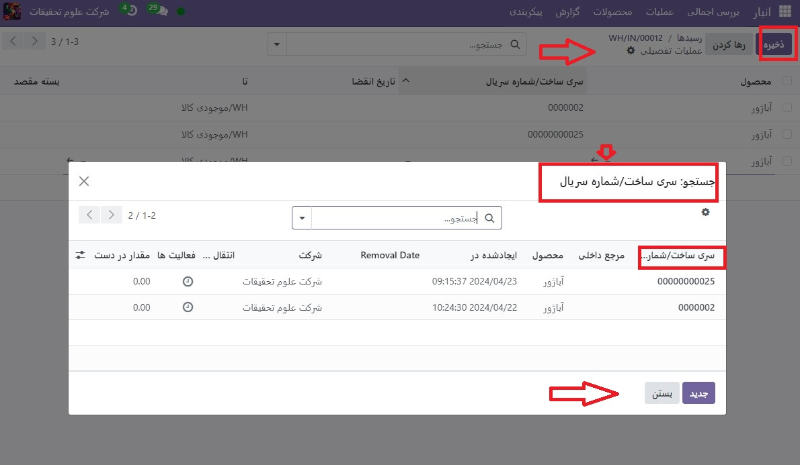

شماره سریال را به طور خودکار اختصاص دهید
-------------------------------------------------------------------
اگر تعداد زیادی از محصولات به شماره سریال اختصاص داده شده به آنها نیاز داشته باشند، Odoo می تواند به طور خودکار شماره سریال را برای هر یک از محصولات جداگانه تولید و اختصاص دهد.

برای انجام این کار، با فیلد اولین شماره سریال در پنجره پاپ آپ **عملیات تفصیلی** شروع کنید و اولین شماره سریال را به ترتیب دلخواه تایپ کنید.

سپس، در قسمت شماره سریال، تعداد کل مواردی را که نیاز به شماره سریال منحصر به فرد تازه تولید شده اختصاص داده شده به آنها دارند، تایپ کنید.

در نهایت، روی اضافه کردن شماره سریال کلیک کنید، و لیستی با شماره سریال های جدید مطابق با مقدار سفارش داده شده محصولات پر می شود.

.. tip::

    شماره های سریال را از صفحه گسترده کپی/پیست کنید
    برای کپی و جای‌گذاری شماره‌های سریال از صفحه‌گسترده موجود، ابتدا یک صفحه‌گسترده را با تمام شماره‌های سریال دریافت‌شده از تأمین‌کننده (یا به‌صورت دستی پس از دریافت انتخاب شده) پر کنید. سپس، آنها را در ستون سری و سریال ساخت کپی و جایگذاری کنید. Odoo به طور خودکار تعداد خطوط لازم را بر اساس تعداد اعداد چسبانده شده در ستون ایجاد می کند.

    .. image:: ./img/producttracking/t36.jpg
        :align: center
        :alt: انبار

    از اینجا، مقادیر مکان و انجام شده را می توان به صورت دستی در هر یک از خطوط شماره سریال وارد کرد.

.. note::
    برای سفارش‌های خریدی که شامل مقادیر زیادی از محصولات برای دریافت هستند، بهترین روش تخصیص شماره سریال این است که به‌طور خودکار شماره سریال‌ها را با استفاده از دکمه اضافه کردن شماره سریال واقع در  :abbr:`PO (Purchase order)` اختصاص دهید. این از استفاده مجدد یا تکراری هر شماره سریال جلوگیری می کند و گزارش پیگیری را بهبود می بخشد.

هنگامی که به تمام مقادیر محصول یک شماره سریال اختصاص داده شد، روی دکمه تأیید کلیک کنید تا پنجره بازشو بسته شود. سپس روی تاییداعتبار کلیک کنید.
پس از تأیید رسید، یک دکمه هوشمند پیگیری ظاهر می شود. روی دکمه هوشمند پیگیری  کلیک کنید تا گزارش پیگیری به روز شده را ببینید، که شامل: یک سند مرجع، محصول در حال پیگیری، سری/ سریال و موارد دیگر است.

مدیریت شماره سریال در سفارشات تحویل
-------------------------------------------------------
تخصیص شماره سریال به کالاهای خروجی می تواند مستقیماً از طریق سفارش فروش (SO) انجام شود.
برای ایجاد یک SO، به برنامه فروش بروید و روی دکمه **ایجاد** کلیک کنید. انجام این کار یک فرم پیش فاکتور جدید و خالی را نشان می دهد. در این فرم خالی پیش فاکتور، با افزودن یک مشتری، و افزودن محصولات به خطوط محصول (در برگه خطوط سفارش)، با کلیک روی افزودن محصول، اطلاعات لازم را پر کنید.

سپس با تغییر شماره در ستون مقدار، مقدار مورد نظر را برای فروش انتخاب کنید.

پس از تکمیل پیش فاکتور، روی دکمه تایید کلیک کنید تا پیش فاکتور تایید شود. هنگامی که پیش فاکتور تایید شد، پیش فاکتور به یک SO تبدیل می شود و یک دکمه هوشمند تحویل ظاهر می شود.

برای مشاهده فرم رسید انبار برای آن SO خاص، روی دکمه هوشمند تحویل کلیک کنید.

از اینجا، روی منوی گزینه‌های اضافی، نمایش داده می‌شود، کلیک کنید (چهار خط افقی، واقع در سمت چپ ستون واحد اندازه‌گیری در تب عملیات). با کلیک بر روی آن نماد، یک پاپ آپ عملیات تفصیلی ظاهر می شود.

در پنجره بازشو، یک سری و شماره سریال به طور پیش‌فرض انتخاب می‌شود که هر محصول از کل مقدار رزرو شده با شماره سریال منحصربه‌فرد آنها فهرست شده است (به احتمال زیاد به ترتیب ترتیب فهرست شده است).

برای تغییر دستی شماره سریال محصول، روی منوی کشویی زیر سری و شماره سریال کلیک کنید و شماره سریال مورد نظر را انتخاب کنید (یا تایپ کنید). سپس مقادیر انجام شده را علامت بزنید و روی تایید کلیک کنید تا پاپ آپ بسته شود.

در نهایت برای تحویل محصولات روی دکمه تایید اعتبار کلیک کنید.

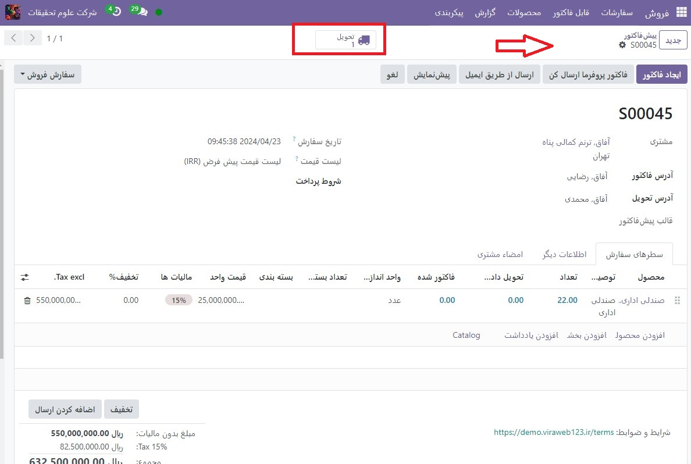

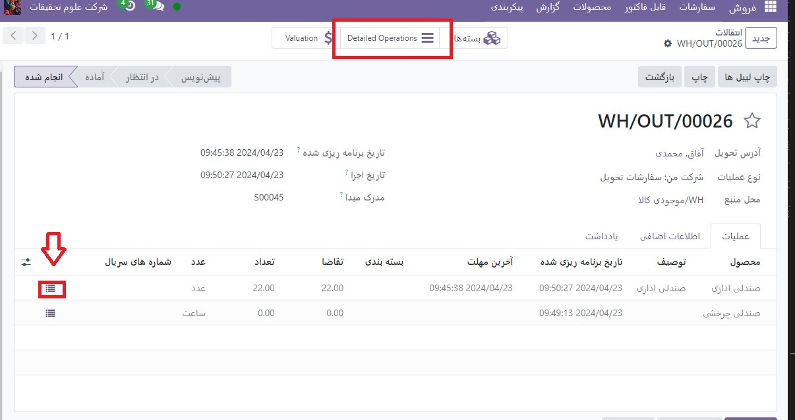

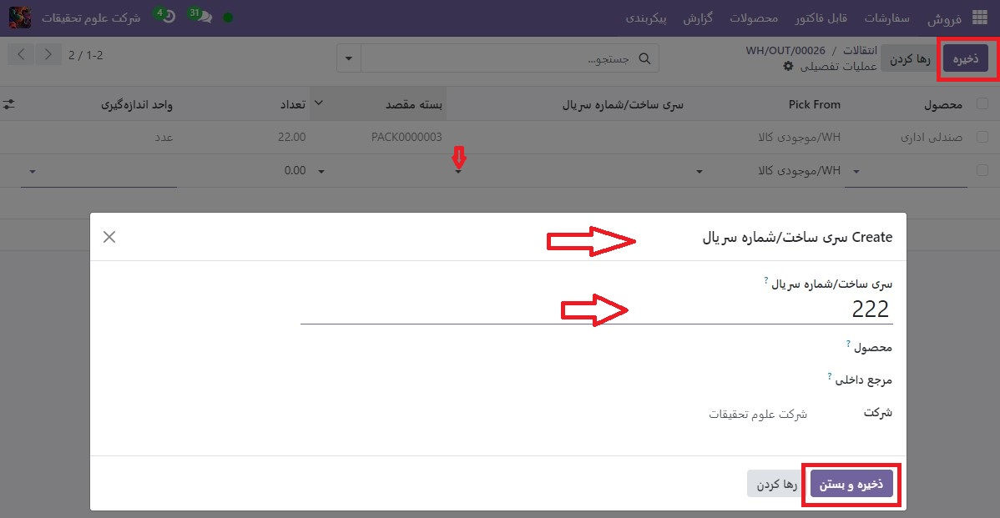

پس از تایید سفارش تحویل، یک دکمه هوشمند پیگیری ظاهر می شود. روی دکمه هوشمند پیگیری کلیک کنید تا گزارش پیگیری به روز شده را مشاهده کنید، که شامل: یک سند مرجع، محصول در حال ردیابی، تاریخ، و تعداد/سریال  اختصاص داده شده است.

گزارش پیگیری همچنین می‌تواند شامل رسید مرجع از سفارش خرید قبلی  :abbr:`PO (Purchase order)`باشد، اگر هر یک از مقادیر محصول شماره سریال اختصاص داده شده در هنگام دریافت آن PO خاص را به اشتراک گذاشته باشد.

شماره سریال را برای انواع عملیات مختلف مدیریت کنید
-------------------------------------------------------------------------
به‌طور پیش‌فرض در Odoo، ایجاد شماره‌های سریال جدید تنها پس از دریافت محصولات از یک سفارش خرید مجاز است. شماره سریال موجود قابل استفاده نیست. برای سفارشات فروش، برعکس است: شماره سریال جدید را نمی توان در سفارش تحویل ایجاد کرد، فقط می توان از شماره سریال های موجود استفاده کرد.

برای تغییر قابلیت استفاده از شماره های سریال جدید (یا موجود) در هر نوع عملیات، به برنامه :menuselection:`انبار --> پیکربندی --> انواع عملیات` بروید و نوع عملیات مورد نظر را انتخاب کنید.

برای نوع عملیات رسیدها، که در صفحه انواع عملیات یافت می‌شود، می‌توان با انتخاب رسیدها از صفحه انواع عملیات، روی ویرایش کلیک کرد و سپس بر روی کادر کنار گزینه Use Existing Lots/Serial Numbers کلیک کرد. گزینه (در قسمت قابلیت پیگیری). در آخر روی دکمه ذخیره کلیک کنید تا تغییرات ذخیره شوند.

برای نوع عملیات سفارشات تحویل، واقع در صفحه انواع عملیات، با انتخاب سفارشات تحویل از صفحه انواع عملیات، کلیک بر روی ویرایش، و کلیک کردن بر روی کادر کنار ایجاد سری/سریال جدید، گزینه ایجاد لات/شماره های سریال جدید را می توان فعال کرد. گزینه شماره ها (در قسمت قابیلت پیگیری). برای ذخیره تغییرات حتما روی ذخیره کلیک کنید.

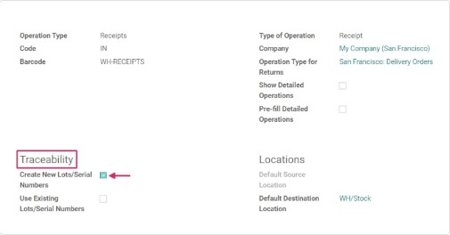

قابلیت پیگیری شماره سریال
-----------------------------------------------------
تولیدکنندگان و شرکت‌ها می‌توانند برای مشاهده کل چرخه عمر یک محصول به گزارش‌های پیگیری مراجعه کنند: از کجا آمده (و چه زمانی)، کجا ذخیره شده است، و به چه کسی رفته است.

برای مشاهده قابلیت پیگیری کامل یک محصول یا گروه بندی بر اساس شماره سریال، به برنامه :menuselection:`انبار --> محصولات --> سری و سریال ساخت` بروید. با انجام این کار داشبورد سری و سریال ساخت آشکار می شود.

از اینجا، محصولات با شماره سریال اختصاص داده شده به آنها به طور پیش‌فرض فهرست می‌شوند و می‌توان آن‌ها را گسترش داد تا نشان دهد چه شماره‌های سریالی به‌طور خاص به آن‌ها اختصاص داده شده است.

برای گروه بندی بر اساس شماره سریال (یا تعداد زیادی)، ابتدا فیلترهای پیش فرض را از نوار جستجو در گوشه سمت راست بالا حذف کنید. سپس روی گروه بندی کلیک کنید و افزودن گروه سفارشی را انتخاب کنید، که یک منوی کشویی کوچک را نشان می دهد. از این منوی کشویی کوچک،سری و سریال ساخت را انتخاب کرده و روی اعمال کردن کلیک کنید.

با انجام این کار، تمام شماره‌های سریال و تعداد زیادی موجود نشان داده می‌شود، و می‌توان آن‌ها را برای نمایش تمام مقادیر محصولات با آن شماره اختصاص‌یافته، گسترش داد. برای شماره‌های سریال منحصربه‌فردی که دوباره استفاده نمی‌شوند، باید فقط یک محصول در هر شماره سریال وجود داشته باشد.

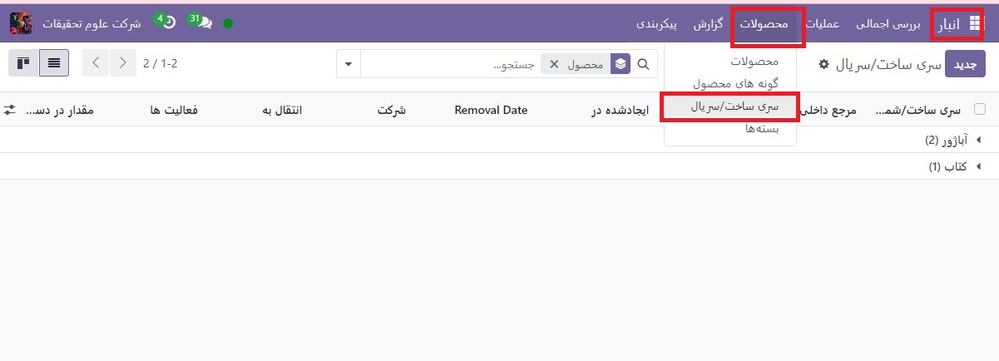

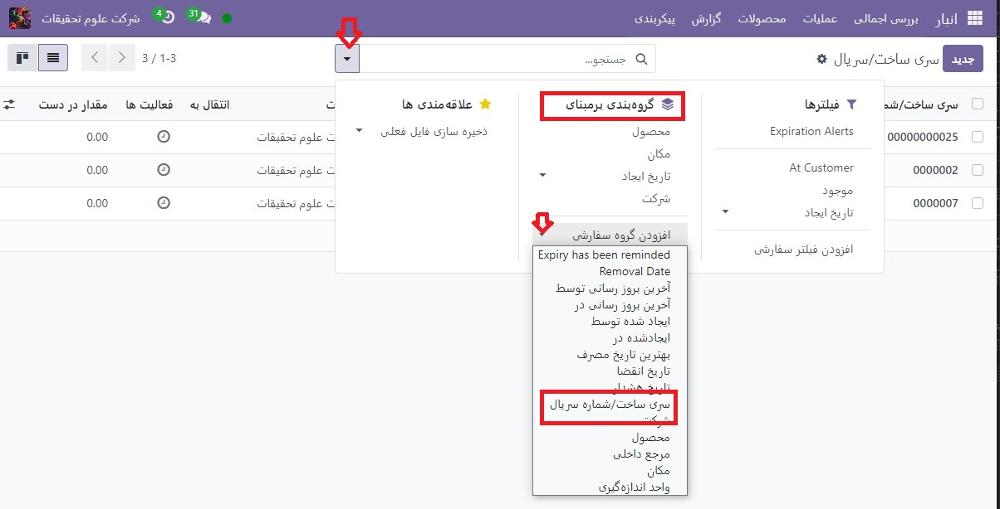

.. tip::
    برای اطلاعات بیشتر در مورد یک شماره سریال (یا شماره سری)، روی مورد خط شماره سریال کلیک کنید تا فرم شماره سریال آن شماره سریال مشخص شود. از این فرم، روی دکمه‌های هوشمند مکان و قابلیت پیگیری کلیک کنید تا همه موجودی‌های موجود با استفاده از آن شماره سریال و هرگونه عملیات انجام شده با استفاده از آن شماره سریال را مشاهده کنید.

.. seealso::
   - :doc:` difference between lots and serial numbers`

