:nosearch:
:show-content:
:hide-page-toc:
:show-toc:

==============
تعمیرات
==============

گاهی اوقات، ممکن است محصولات تحویل داده شده به مشتریان در حین حمل و نقل شکسته یا آسیب ببینند و برای بازپرداخت، تحویل کالای جایگزین یا تعمیر نیاز به بازگرداندن داشته باشند.
در Odoo، تعمیرات محصولات بازگردانده شده توسط مشتریان را می‌توان در برنامه‌ی "تعمیرات" ردیابی کرد. پس از تعمیر، محصولات را می‌توان دوباره به مشتری تحویل داد.

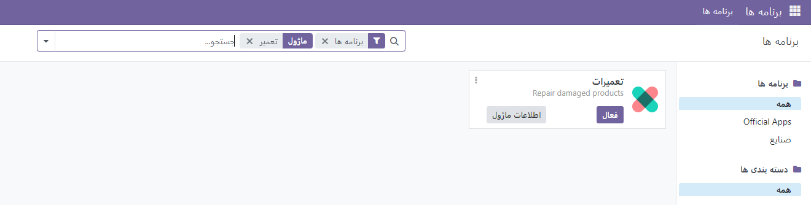

پردازش سفارشات تعمیر
-----------------------

ماژول تعمیر در Odoo 17 به کاربران کمک می‌کند تا دستگاه‌ها و تجهیزات آسیب دیده را بازیابی کنند. برای استفاده بهینه از این ماژول، اتصال آن به ماژول‌های تولید و موجودی ساده است. زیرا طولانی مدت ذخیره‌سازی محصولات در انبارها احتمال آسیب دیدن آنها را افزایش می‌دهد.
با استفاده از ماژول تعمیر در Odoo 17 ERP، می‌توانید اقدامات مختلف را در مراحل مختلف نظارت کنید. این به شما امکان می‌دهد کالاهایی که در طول تولید به طور جزئی یا کامل آسیب دیده‌اند، تعویض کنید.

با استفاده از سفارشات تعمیر، می‌توانید برای تعویض و تعمیر کالاهای فرسوده اقدام کنید و این کار را می‌توانید در مدت گارانتی حفظ کنید. همچنین، برای رفع سریع آسیب‌ها، می‌توانید از دستورات تعمیر استفاده کرده و اقدامات لازم را انجام دهید.
در ماژول تعمیر، ثبت سفارش تعمیر برای یک محصول خاص که به طور کامل یا جزئی آسیب دیده است، ساده است. هنگامی که به ماژول تعمیر می‌روید، یک پنجره بازشو با لیست سفارشات تعمیر نمایش داده می‌شود.

لیست سفارشات تعمیر در اسکرین‌شات به ترتیب در نمای Kanban، List، Pivot و Graphical نمایش داده می‌شود. در این لیست، جزئیاتی مانند مرجع تعمیر، تاریخ برنامه، محصولی که باید ثابت شود، مشتری، آدرس تحویل، انقضای گارانتی، سفارش فروش، شرکت، و وضعیت سفارش تعمیر همگی در پنجره قابل مشاهده هستند. همچنین، می‌توانید دکمه ستاره واقع در گوشه سمت چپ را انتخاب کنید تا هر سفارش را به موارد دلخواه خود اضافه کنید. علاوه بر این، فیلترها و گروه‌بندی به گزینه‌های شما داده می‌شود تا سفارش تعمیر خاص را دریافت کنید.

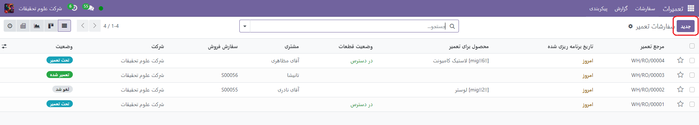

شما می توانید نماد جدید را برای ایجاد یک سفارش تعمیر جدید انتخاب کنید. اکنون با پنجره ای روبرو می شوید که در آن اطلاعاتی را می خواهید.

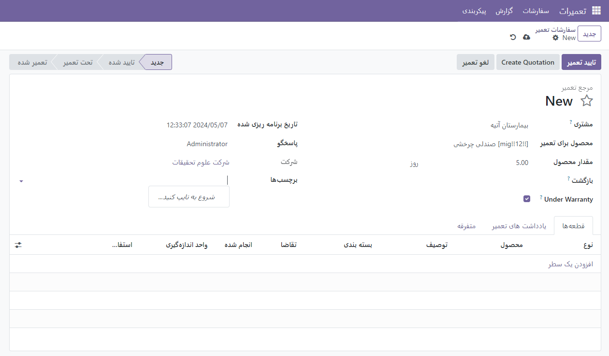

شما می‌توانید کالای نیاز به تعمیر را به همراه مقدار آن در گزینه "Product to Repair" وارد کنید. در قسمت مشتری، مشخص کنید که سفارش به او تحویل داده شده است و فاکتور در قسمت مشتری ارسال می‌شود. مسئول پاسخگو در منطقه تعیین شده و در روز مقرر حضور دارد. شرکت در محل تعیین شده خود، همراه با انقضای گارانتی، انجام می‌شود. اگر محصول دارای گارانتی باشد که می‌توان آن را فعال کرد، هزینه تعمیر در فاکتور اضافه نمی‌شود. علاوه بر این، می‌توانید با استفاده از گزینه "Tags" یک برچسب مناسب را اضافه کنید.

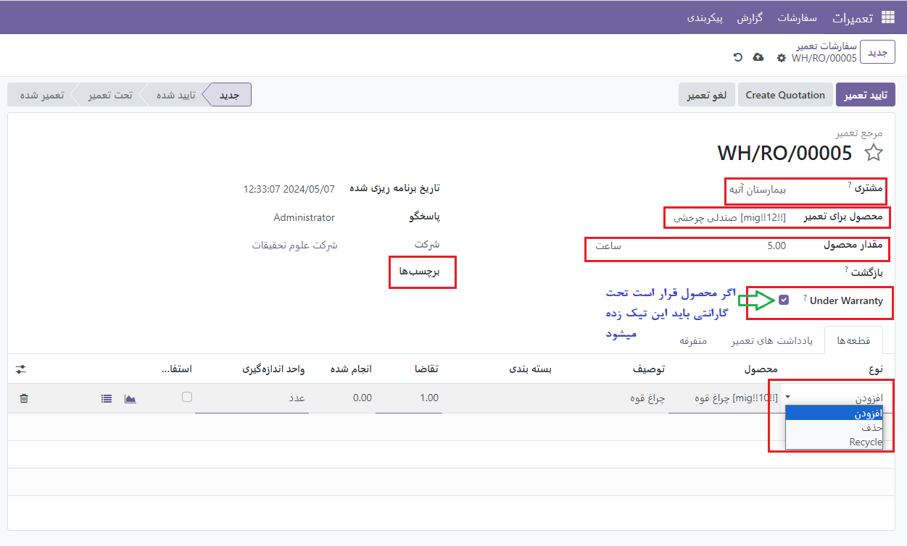

همانطور که در زیر مشاهده می‌کنید، می‌توانید قسمت‌های محصول را که باید افزوده، حذف یا بازیافت شوند، فهرست کنید تا مشکل را در برگه قطعات برطرف کنید. آنها می‌توانند با استفاده از ویژگی افزودن خط، محصول، نوع، توضیحات، مقدار، واحد اندازه‌گیری، قیمت واحد و مالیات را به ترتیب نامگذاری کنند.

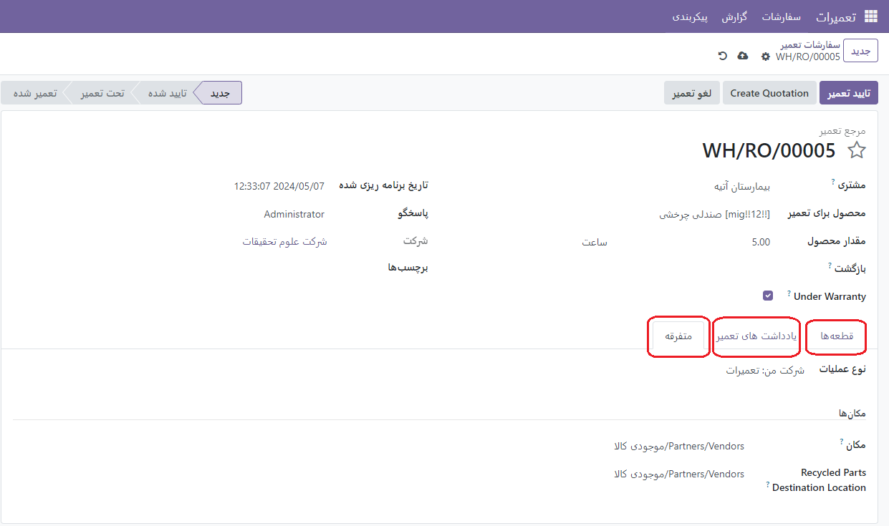

اکنون می‌توانید توضیحات و دستورالعمل‌های اضافی را برای تعمیر کالای خاص در زیر برگه یادداشت‌های تعمیر ارائه دهید.
هزینه تعمیر ممکن است بسته به میزان آسیب محصول متفاوت باشد. در موارد خاص، شما ممکن است مجبور شوید اجزای کالا را تامین کنید و هنگام تهیه فاکتور، مشتری را از هزینه اضافی آگاه کنید.
با کلیک بر روی دکمه "Confirm Repair" که در گوشه سمت چپ بالای پنجره قرار دارد، سفارش را تأیید کنید.

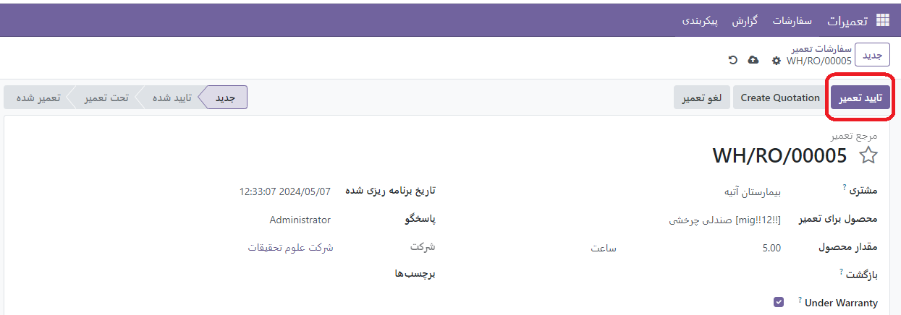

وقتی این گزینه Confirm Repair را انتخاب می کنید، وضعیت نقل قول به تایید شده تغییر می کند و سفارش تایید می شود.

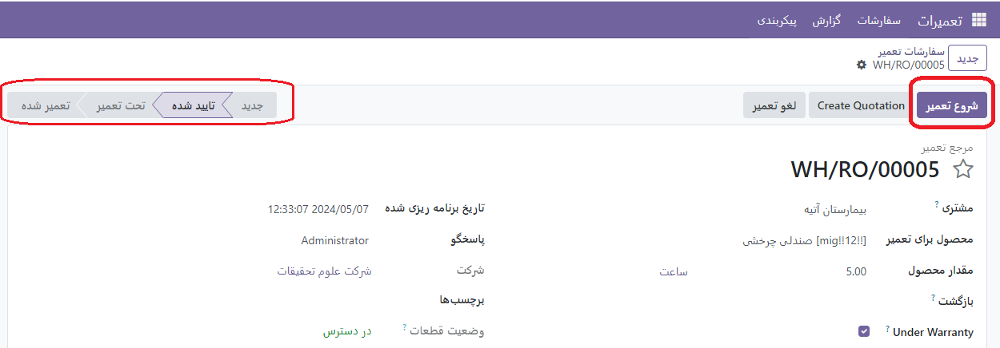

برای شروع تعمیر، گزینه "شروع تعمیر" را انتخاب کنید. با انتخاب گزینه Cancel Repair، تعمیر محصول لغو می شود. اگر گزینه "شروع تعمیر" را انتخاب کرده باشید، وضعیت به عنوان "در حال تعمیر" خوانده می شود.

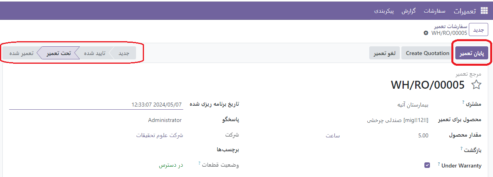

پس از اتمام گزارش، وضعیت به صورت Repaired نشان داده می شود، بنابراین گزینه End Repair را برای پایان دادن به این روش انتخاب کنید.

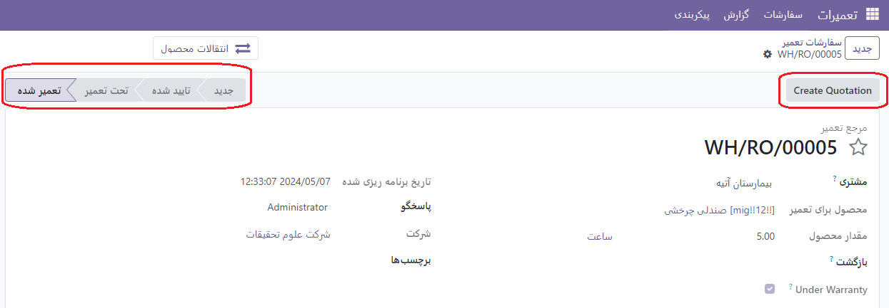

پس از اتمام تعمیر، وضعیت به Repaired تغییر کرد. سپس یک دکمه Create Quotation در آنجا ظاهر می شود و یک نقل قول برای سفارش تعمیر ایجاد می کند.

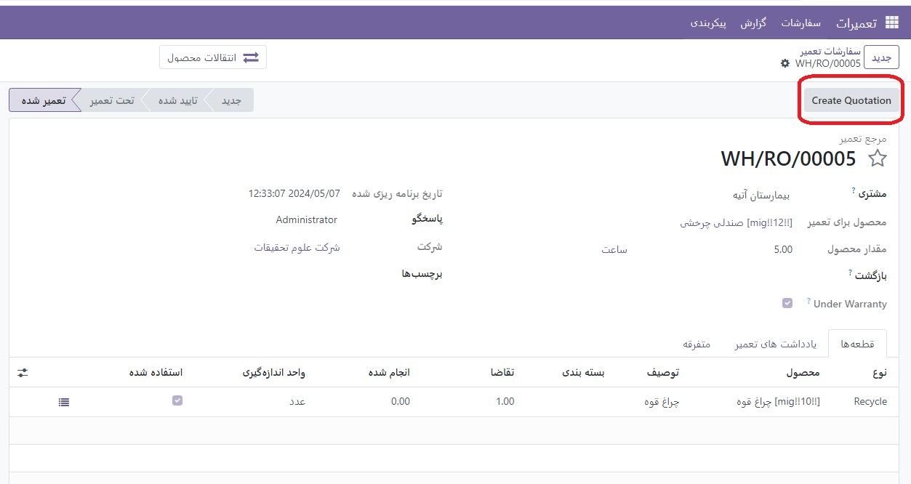

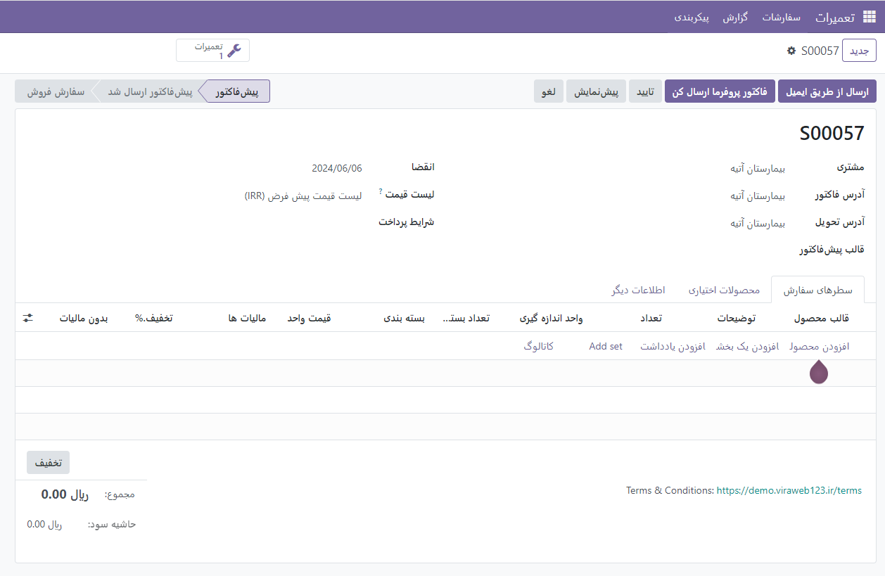

سفارش تعمیر از نقل قول
-----------------------

امکان ایجاد سفارش تعمیر مستقیماً از یک نقل قول وجود دارد. زمینه جدیدی در بخش محصولات معرفی شد. پس بیایید محصول را باز کنیم.

اگر چک باکس Create Repair فعال باشد، به ایجاد یک سفارش تعمیر پیوندی در تأیید سفارش فروش این محصول کمک می کند.

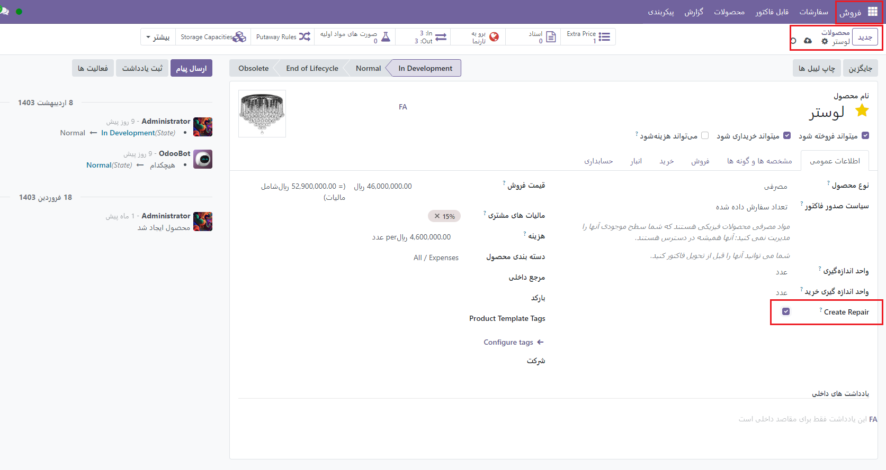

