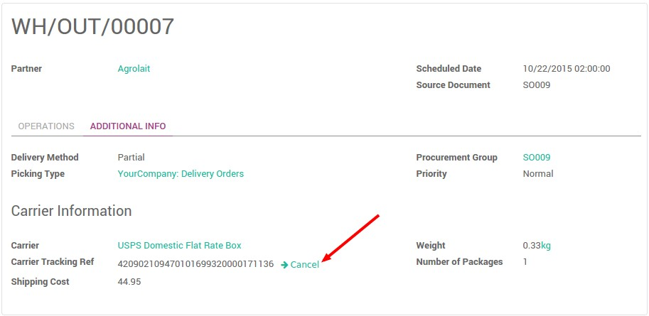
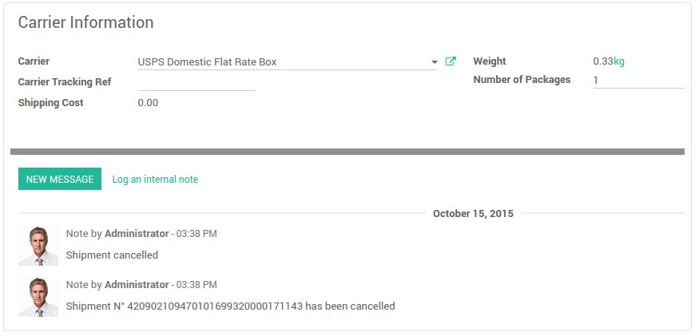
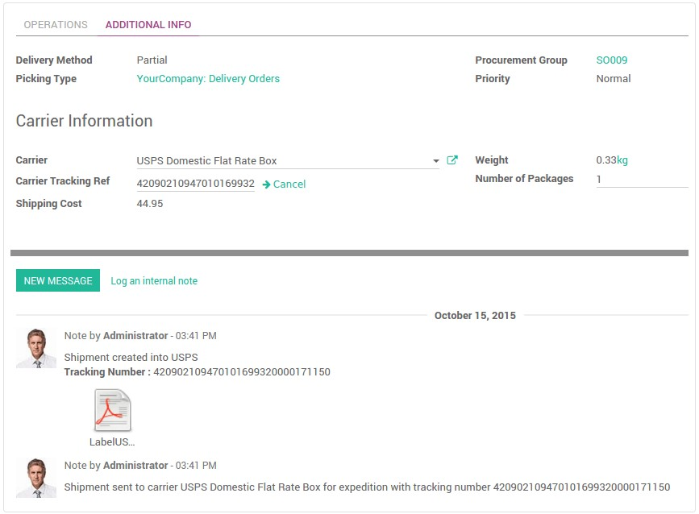

:nosearch:
:show-content:
:hide-page-toc:
:show-toc:

====================================================
چگونه درخواست حمل و نقل به فرستنده را لغو کنیم؟
====================================================

بررسی اجمالی
---------------------------------
Odoo می تواند روش های مختلف تحویل، از جمله ارسال کنندگان شخص ثالث را انجام دهد. Odoo با سیستم پیگیری شرکت حمل و نقل مرتبط خواهد شد.
به شما امکان می دهد شرکت حمل و نقل، قیمت واقعی و مقصد را مدیریت کنید.
شما به راحتی می توانید درخواست ارائه شده به سیستم حامل را لغو کنید.

چگونه درخواست حمل و نقل را لغو کنیم؟
--------------------------------------------------------------------
   - اگر سفارش تحویل تایید نشده باشد، درخواست انجام نشده است. می توانید انتخاب کنید که تحویل را لغو کنید یا شرکت حامل را تغییر دهید.

   - اگر روی تایید اعتبار کلیک کرده باشید، درخواست انجام شده است و باید شماره پیگیری و برچسب را دریافت کرده باشید. همچنان می توانید درخواست را لغو کنید. به سادگی روی دکمه لغودر کنار Ref Tracking Carrier کلیک کنید:

اکنون می بینید که حمل و نقل لغو شده است.

اکنون در صورت تمایل می توانید حامل را تغییر دهید.

چگونه پس از لغو درخواست ارسال، درخواست ارسال کنیم؟
------------------------------------------------------------------------------
پس از لغو درخواست حمل و نقل، می توانید حامل مورد نظر خود را تغییر دهید. آن را با کلیک بر روی دکمه ارسال به فرستنده تایید کنید. شما یک شماره پیگیری جدید و یک برچسب جدید دریافت خواهید کرد.

