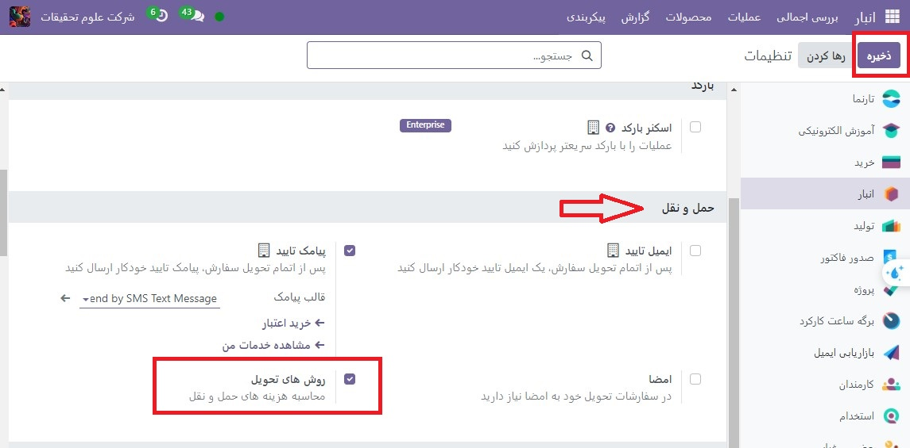
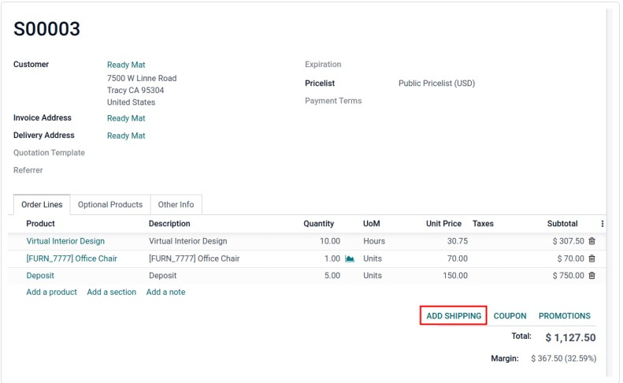
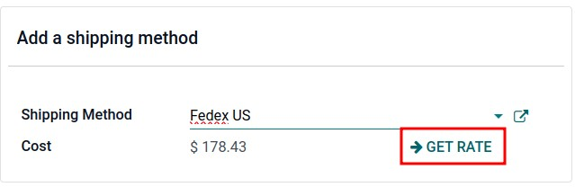
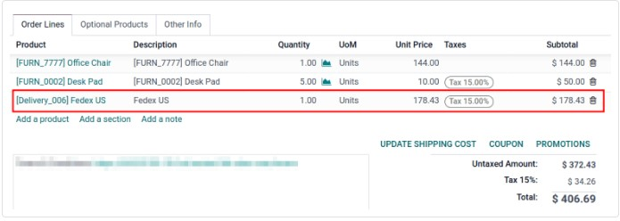
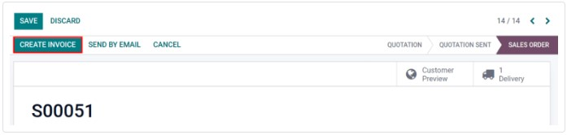
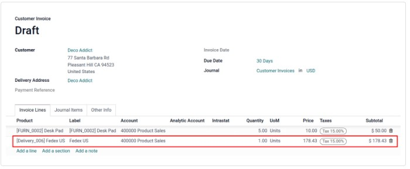
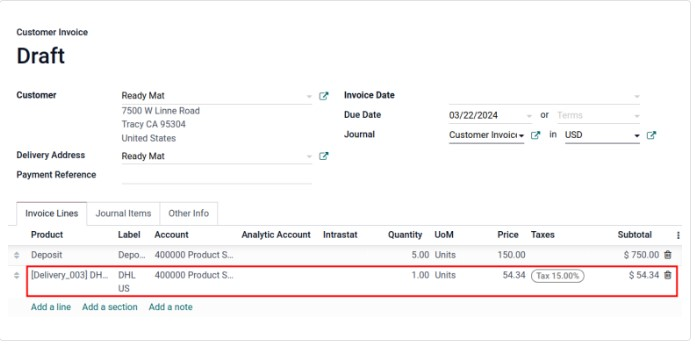

:nosearch:
:show-content:
:hide-page-toc:
:show-toc:

====================================================
صورتحساب هزینه حمل و نقل
====================================================

صدور صورت‌حساب مشتریان برای حمل و نقل پس از تحویل، هزینه‌های دقیق را بر اساس فاکتورهای حمل و نقل بلادرنگ مانند مسافت، وزن و روش تضمین می‌کند.
در Odoo، هزینه های حمل و نقل را می توان به دو صورت صورتحساب کرد:

  #. با مشتری بر سر یک هزینه ثابت توافق کنید و آن را در سفارش فروش لحاظ کنید.
  #. هزینه‌های ارسال فاکتور برای مشتری پس از تحویل، منعکس کننده هزینه‌های واقعی متحمل شده توسط کسب‌وکار است.

پیکربندی
---------------------------------
برای تنظیم قیمت ها بر اساس روش های تحویل، به برنامه **انبار ‣ پیکربندی ‣ تنظیمات** بروید. در بخش حمل و نقل، ویژگی روش های تحویل را فعال کنید. سپس، روی **ذخیره** کلیک کنید.

روش ارسال را اضافه کنید
------------------------------------------------------
سپس، با رفتن به برنامه  :menuselection:`انبار --> پیکربندی --> روش های حمل ونقل` ، قیمت هر روش تحویل را پیکربندی کنید و روی دکمه جدید کلیک کنید. با انجام این کار، فرمی برای ارائه جزئیات در مورد ارائه دهنده حمل و نقل باز می شود، از جمله:

   - روش حمل و نقل (الزامی) نام روش تحویل (به عنوان مثال حمل و نقل با نرخ ثابت، تحویل در همان روز و غیره).

   - ارائه دهنده (الزامی): در صورت استفاده از حامل شخص ثالث، سرویس تحویل را انتخاب کنید، مانند FedEx، مطمئن شوید که ادغام با شرکت حمل و نقل به درستی نصب شده است و ارائه دهنده را از منوی کشویی انتخاب کنید.

   - شرکت: اگر روش ارسال باید برای یک شرکت خاص اعمال شود، آن را از منوی کشویی انتخاب کنید. فیلد را خالی بگذارید تا روش برای همه شرکت ها اعمال شود.

   - وب سایت: روش های حمل و نقل را برای صفحه تجارت الکترونیکی پیکربندی کنید. وب سایت قابل اجرا را از منوی کشویی انتخاب کنید، یا آن را خالی بگذارید تا این روش در تمام صفحات وب اعمال شود.

   - محصول تحویل (الزامی): محصولی که در خط سفارش فروش به عنوان هزینه ارسال درج شده است.

   - اگر مبلغ سفارش بالاتر باشد رایگان: علامت زدن این کادر، ارسال رایگان را در صورتی که مشتری بیش از مقدار مشخص شده هزینه کند، امکان پذیر می کند.

هزینه فاکتور در سفارش فروش
-----------------------------------------------------------
برای فاکتور هزینه ارسال در سفارش فروش، قبل از تحویل کالا، به اپلیکیشن فروش رفته و سفارش فروش مورد نظر را انتخاب کنید.

در سفارش فروش، روی دکمه **افزودن حمل و نقل** در گوشه سمت راست پایین کلیک کنید.

در پنجره بازشو افزودن روش حمل و نقل، حامل مورد نظر را در قسمت روش حمل و نقل انتخاب کنید.

سپس، روی دکمه دریافت نرخ کلیک کنید تا قیمت حمل و نقل را بر اساس داده های حمل و نقل در زمان واقعی ادغام شرکت حمل و نقل Odoo محاسبه کنید.

هزینه به طور خودکار با استفاده از وزن اقلام در سفارش محاسبه می شود. در نهایت روی دکمه **افزودن** کلیک کنید تا پنجره بسته شود.

در سفارش فروش، محصول تحویل در برگه خطوط سفارش ظاهر می‌شود و قیمت واحد به عنوان هزینه حمل و نقل در پنجره بازشو افزودن روش ارسال محاسبه می‌شود.

در نهایت پس از تحویل محصول بر روی دکمه **ایجاد فاکتور** کلیک کنید و فاکتوری ایجاد می شود که شامل هزینه ارسال است که قبلا اضافه شده است.

سپس، روی دکمه **جدید** و مشاهده فاکتور کلیک کنید و یک پیش نویس فاکتور تولید می شود که هزینه حمل و نقل در تب خطوط فاکتور گنجانده شده است.

فاکتور هزینه های حمل و نقل واقعی
--------------------------------------------------
برای تغییر فاکتور برای منعکس کردن هزینه واقعی حمل و نقل، مراحل بالا را دنبال کنید تا یک فاکتور با محصول تحویل با قیمت واحد صفر ایجاد کنید.

سپس، در پیش نویس فاکتور، قیمت واحد را تغییر دهید تا هزینه حمل و نقل واقعی را منعکس کند. در نهایت، با کلیک بر روی **تایید**، هزینه حمل و نقل تنظیم شده را برای مشتری فاکتور کنید.

